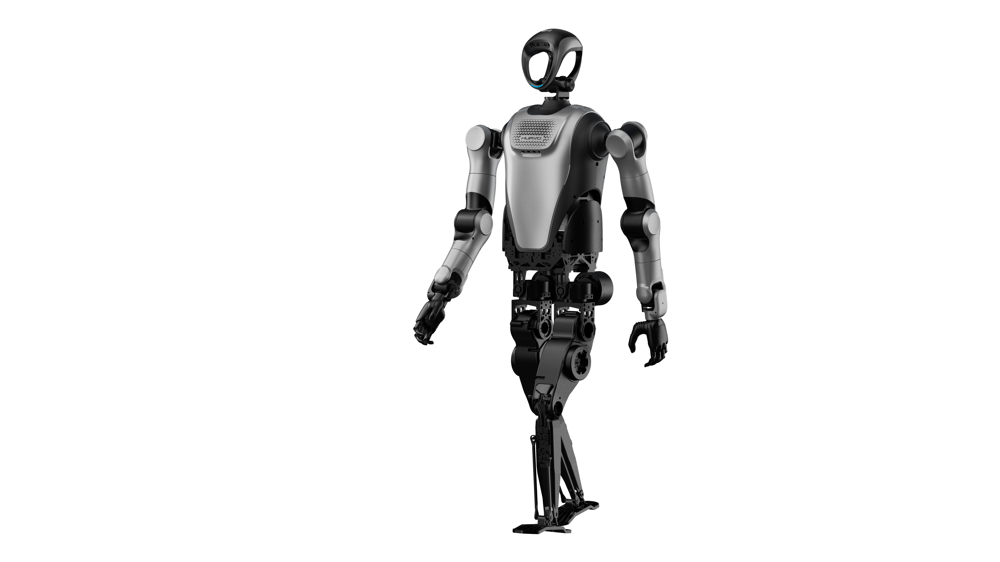
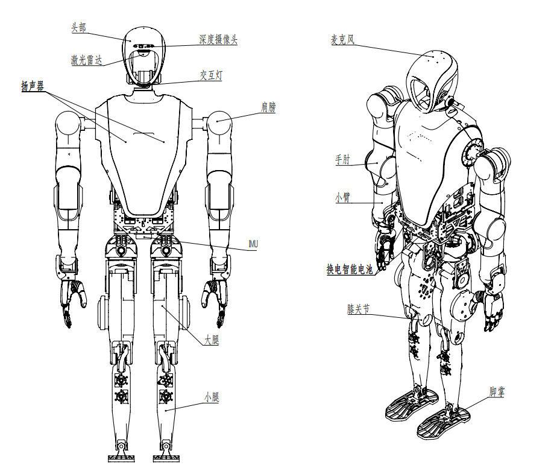
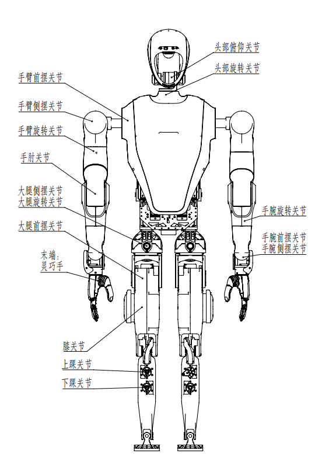
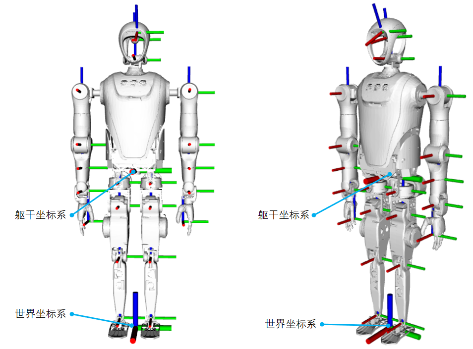
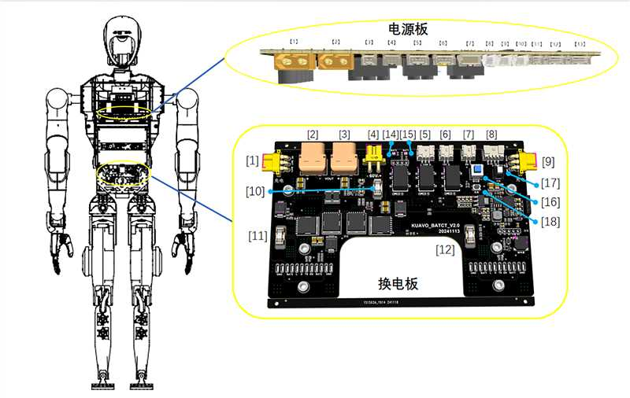
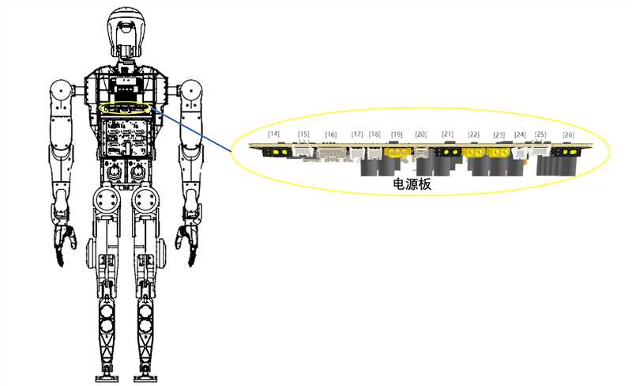
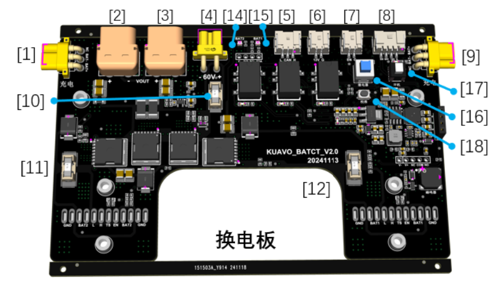
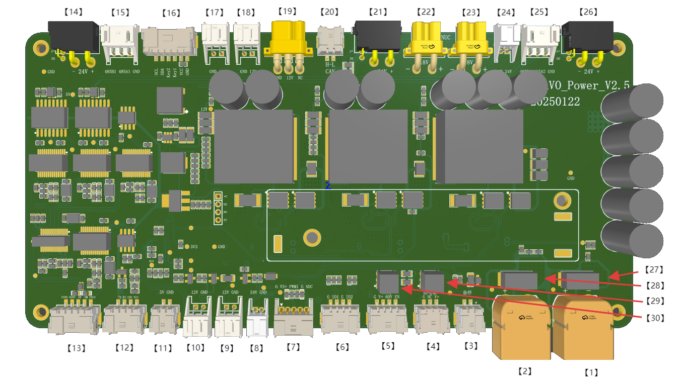

# 产品介绍

- [产品介绍](#产品介绍)
  - [产品组成](#产品组成)
  - [产品规格](#产品规格)
  - [KUAVO\_4pro展厅版自由度范围、速度扭矩限制关节位置及运动控制坐标系图示](#kuavo_4pro展厅版自由度范围速度扭矩限制关节位置及运动控制坐标系图示)
  - [KUAVO\_4pro展厅版电气接口](#kuavo_4pro展厅版电气接口)
    - [换电板接口说明：](#换电板接口说明)
    - [电源板接口说明:](#电源板接口说明)
  - [传感器参数](#传感器参数)
    - [IMU](#imu)
    - [深度摄像头：Gemini-335L](#深度摄像头gemini-335l)
    - [激光雷达：mid-360](#激光雷达mid-360)
    - [下位机：摩方i9-13900](#下位机摩方i9-13900)
    - [上位机：](#上位机)
      - [SWNUC12WSKI70000](#swnuc12wski70000)
  - [灵巧手](#灵巧手)

## 产品组成

KUAVO机器人4pro 展厅版包含头、躯干、手臂、腿部，全身总共28个自由度（不含末端），使得机器人能够实现灵活的运动和姿态控制。

- 头部拥有2个自由度，包含头部旋转关节和头部俯仰关节。深度相机、激光雷达、麦克风阵列、交互灯等位于头部。

- 躯干内包含：运动控制板、电源板及换电电池。

- 单手臂拥有7个自由度，包含手臂前摆关节、手臂侧摆关节、手臂旋转关节、手肘关节、手腕旋转关节、手腕前摆关节和手腕侧摆关节。手臂标配灵巧手。

- 单腿拥有6个自由度，包含大腿侧摆关节、大腿旋转关节、大腿前摆关节、膝关节、上踝关节和下踝关节。

## 产品规格

| 类型   | 规格参数                                                                    | 指标说明                                                        |
|:----:|:-----------------------------------------------------------------------:|:-----------------------------------------------------------:|
| 基本参数 | 高 重量 单臂长度                                          | 1.66m 55kg 0.79m                          |
| 自由度  | 全身自由度（不含末端） 头部自由度 单臂自由度 单腿自由度 灵巧手自由度 | 28 2 7 6 6                            |
| 运行参数 | 行走速度 跑步速度                                                                    | 0.4m/s 5km/h                                                      |
| 电池参数 | 工作电压 行走续航 电池容量 循环寿命 充电时长                                | 60V 1h 6Ah ≥500次 ≤1.5h                      |
| 传感器  | 摄像头 麦克风 激光雷达 扬声器 关节温度传感器 IMU                        | Gemini-335L 6MIC  360度定位 mid-360 立体音响 LB01  /  |
| 算力平台 | 下位机 上位机                                                             | 摩方i913900 x 1 SWNUC12WSKI70000 x 1 |
| 安全功能 | 本体急停 声音提醒                                                           | 1 低电量提醒                                                 |

## KUAVO_4pro展厅版自由度范围、速度扭矩限制关节位置及运动控制坐标系图示

| 关节序号 | 关节名称 | 关节代号         | 位置下限（°） | 位置上限（°） | 额定力矩（Nm） | 额定速度（rpm） |
| ---- | ---- | ------------ | ------- | ------- | -------- | --------- |
| 0    | 头部俯仰 | head_pitch   | -30     | 30      | 6        | 50        |
| 1    | 头部旋转 | head_yaw     | -90     | 90      | 0.5      | 50        |
| 2    | 左肩前摆 | l_arm_pitch  | -180    | 90      | 20       | 120       |
| 3    | 左肩侧摆 | l_arm_roll   | -20     | 120     | 22       | 30        |
| 4    | 左臂旋转 | l_arm_yaw    | -90     | 90      | 12       | 50        |
| 5    | 左肘   | l_forearm    | -150    | 0       | 22       | 30        |
| 6    | 左腕旋转 | l_hand_yaw   | -90     | 90      | 6        | 50        |
| 7    | 左腕前摆 | l_hand_pitch | -40     | 40      | 6        | 50        |
| 8    | 左腕侧摆 | l_hand_roll  | -75     | 40      | 6        | 50        |
| 9    | 右肩前摆 | r_arm_pitch  | -180    | 90      | 20       | 120       |
| 10   | 右肩侧摆 | r_arm_roll   | -120    | 20      | 22       | 30        |
| 11   | 右臂旋转 | r_arm_yaw    | -90     | 90      | 12       | 50        |
| 12   | 右肘   | r_forearm    | -150    | 0       | 22       | 30        |
| 13   | 右腕旋转 | r_hand_yaw   | -90     | 90      | 6        | 50        |
| 14   | 右腕前摆 | r_hand_pitch | -40     | 40      | 6        | 50        |
| 15   | 右腕侧摆 | r_hand_roll  | -40     | 75      | 6        | 50        |
| 16   | 左髋侧摆 | l_leg_roll   | -18     | 38      | 40       | 120       |
| 17   | 左髋旋转 | l_leg_yaw    | -50     | 45      | 20       | 120       |
| 18   | 左髋前摆 | l_leg_pitch  | -115    | 90      | 20       | 120       |
| 19   | 左膝   | l_knee       | 0       | 145     | 40       | 120       |
| 20   | 左踝上  | l_foot_pitch | -45     | 20      | 12       | 77        |
| 21   | 左踝下  | l_foot_roll  | -15     | 15      | 12       | 77        |
| 22   | 右髋侧摆 | r_leg_roll   | -38     | 18      | 40       | 120       |
| 23   | 右髋旋转 | r_leg_yaw    | -45     | 50      | 20       | 120       |
| 24   | 右髋前摆 | r_leg_pitch  | -115    | 90      | 20       | 120       |
| 25   | 右膝   | r_knee       | 0       | 145     | 40       | 120       |
| 26   | 右踝上  | r_foot_pitch | -45     | 20      | 12       | 77        |
| 27   | 右踝下  | r_foot_roll  | -15     | 15      | 12       | 77        |

当各个关节均为零度时，各坐标系如上图。红色为x轴，绿色为y轴，蓝色为z轴。

## KUAVO_4pro展厅版电气接口

### 换电板接口说明：

| **序号** | **接口型号**                  | **接口名称**  | **说明**                                                                                 |
| ------ | ------------------------- | --------- | -------------------------------------------------------------------------------------- |
| 1      | MR30PW-F                  | 左充电接口     | 外接67.2V/5A锂电池专用充电器给左侧电池充电                                                              |
| 2      | XT60PW-F                  | 60V放电接口   | 输出电压48V~67.2V，输出电流40A                                                                  |
| 3      | XT60PW-F                  | 60V放电接口   | 输出电压48V~67.2V，输出电流40A                                                                  |
| 4      | XT30PW-F                  | 电源板接口     | 输出电压48V~67.2V，输出电流15A                                                                  |
| 5      | 3PIN，2mm连接器 PAP-03V-S | CAN通信     | 电池CAN通信接口                                                                              |
| 6      | 2PIN，2mm连接器 PAP-02V-S | 12V接口     | 输出电压12V，0.5A                                                                           |
| 7      | 2PIN，2mm连接器 PAP-02V-S | 外接驱动器电源开关 | 控制驱动器60V放电接口输出开关                                                                       |
| 8      | 4PIN，2mm连接器 PAP-04V-S | 外接开机开关    | 外接开机按钮接口，开机后电源板和NUC供电打开，蜂鸣器响一声；                                                        |
| 9      | MR30PW-F                  | 右充电接口     | 外接67.2V/5A锂电池专用充电器给右侧电池充电                                                              |
| 10     | 6125保险丝30A                | 保险丝       | 左/右侧电池输出保险丝，型号：6125，125V,30A                                                           |
| 11     | 6125保险丝30A                | 保险丝       | 左/右侧电池输出保险丝，型号：6125，125V,30A                                                           |
| 12     | 6125保险丝15A                | 保险丝       | 电源板输出保险丝，型号：6125，125V,15A                                                              |
| 14     | 红绿双色LED灯                  | 左电池指示灯    | 左/右侧电池状态指示灯，正常：绿灯闪烁；电量低或电池拔出：红灯闪烁，蜂鸣器间断响；过温保护：红灯和蜂鸣器同步间隔1秒闪烁/响起；过流保护：红灯常亮，蜂鸣器长鸣；       |
| 15     | 红绿双色LED灯                  | 右电池指示灯    | 左/右侧电池状态指示灯，正常：绿灯闪烁；电量低或电池拔出：红灯闪烁，蜂鸣器间断响；过温保护：红灯和蜂鸣器同步间隔1秒闪烁/响起；过流保护：红灯常亮，蜂鸣器长鸣；       |
| 16     | 蓝色自锁开关                    | 板载驱动器电源开关 | 板载控制驱动器60V放电接口输出开关                                                                     |
| 17     | 白色自锁开关                    | 板载开机开关    | 板载开机开关，开机后电源板和NUC供电打开，蜂鸣器响一声；                                                          |
| 18     | 轻触开关                      | 校准开关      | 该开关有两种工作状态： 校准电压采集：机器接入一个电池，按住校准开关，按下开机开关，等待2秒，校准PCB电压采样； 短路保护复位：过流保护状态下，长按2秒复位过流保护状态； |

### 电源板接口说明:

| **序号** | **接口型号**                     | **接口名称** | **说明**                        |
| ------ | ---------------------------- | -------- | ----------------------------- |
| 1      | XT60PW-M                     | 电源输入     | 输入电压范围36V~80V DC              |
| 2      | XT60PW-M                     | 电源输入     | 输入电压范围36V~80V DC                              |
| 3      | 2PIN，2.0MM连接器 PAP-02V-S  | NG       |                               |
| 4      | 3PIN，2.0MM连接器 PAP-03V-S  | 驱动器电源反馈  | 驱动器电源信号反馈                     |
| 5      | 4PIN，2.0MM连接器 PAP-04V-S  | NG       |                               |
| 6      | 4PIN，2.0MM连接器 PAP-04V-S  | 预留输入     |                               |
| 7      | 5PIN，2.0MM连接器 PAP-05V-S  | 散热风扇     | 驱动器散热风扇接口，24V/1A输出            |
| 8      | 2PIN，2.0MM连接器 RAP-02V-1 | 24V输出    | 24V/1A电源输出                    |
| 9      | 2PIN，2.54MM连接器 XAP-02V-1 | 12V输出    | 12V/1A电源输出                    |
| 10      | 2PIN，2.54MM连接器 XAP-02V-1 | 12V输出    | 12V/1A电源输出                    |
| 11     | 2PIN，2.54MM连接器 XAP-02V-1 | 5V输出     | 5V/1A电源输出                     |
| 12     | 4PIN，2.0MM连接器 PAP-04V-S  | SBUS通信   | 无线遥控接收模块通信接口                  |
| 13     | 5PIN，2.0MM连接器 PAP-05V-S  | USB通信输入  | 电源板UBS接口，接到运动控制NUC            |
| 14     | XT30(2+2)PW-M                | 左手臂接口    | 左手电机24V电源与CAN通信               |
| 15     | 3PIN，2.54MM连接器 XAP-03V-1 | 灵巧手RS485 | 左手为灵巧手时，485通讯线接口              |
| 16     | 6PIN，2.0MM连接器 PAP-06V-S  | 电量指示     | 电池电量指示板接口                     |
| 17      | 2PIN，2.54MM连接器 XAP-02V-1 | 12V输出    | 12V/1A电源输出                    |
| 18      | 2PIN，2.54MM连接器 XAP-02V-1 | 12V输出    | 12V/1A电源输出                    |
| 19     | MR30PW-F                     | 12V输出    | 12V/10A电源输出与LIN通信             |
| 20     | 2PIN，2.0MM连接器 PAP-02V-S  | CAN通信输入  | 外接USB转CAN模块                   |
| 21     | XT30(2+2)PW-M                | 脖子电机接口   | 脖子电机24V电源与CAN通信               |
| 22     | XT30PW-F                     | NUC电源输出  | 18V/6A电源输出                    |
| 23     | XT30PW-F                     | NUC电源输出  | 18V/6A电源输出                    |
| 24      | 2PIN，2.0MM连接器 RAP-02V-1 | 24V输出    | 24V/1A电源输出                    |
| 25     | 3PIN，2.54MM连接器 XAP-03V-1 | 灵巧手RS485 | 右手为灵巧手时，485通讯线接口              |
| 26     | XT30(2+2)PW-M                | 右手臂接口    | 右手电机24V电源与CAN通信               |
| 27     | 6125保险丝15A                   | 左侧电源保险丝  | 电源板左侧电池输入保险丝，型号：6125，125V/15A |
| 28     | 6125保险丝15A                   | 右侧电源保险丝  | 电源板右侧电池输入保险丝，型号：6125，125V/15A |
| 29     | 自锁开关                         | NG       |                               |
| 30     | 自锁开关                         | 开机开关     | 板载开机开关，开机后电源板和NUC供电打开,按钮默认按下； |

## 传感器参数

### IMU

- 纵倾横滚精度：0.2度；

- 方位角精度：0.2度；

**陀螺仪:**

- 满量程：2000度/秒；

- 零偏稳定性：2.5°/h；

**加速度传感器：**

- 满量程：12g；

- 零偏稳定性：30 μg；

**机械性能：**

- 工作温度 -40 到 85 摄氏度；

**接口 / IO：**

- 加速度输出频率 1000 HZ。

### 深度摄像头：Gemini-335L

- 深度技术：双目视觉；

- 图像传感器技术：全局快门；

- 深度基线：95mm；

- 最大工作范围：0.17~20m+；

- 理想范围：0.25~6m；

- 深度空间相对精度：≤0.8%(1280x800 @ 2m & 90%x90% ROI)   &emsp;&emsp;&emsp;&emsp;&emsp;&emsp;&emsp;&emsp;≤1.6%(1280 x800 @ 4m & 80% x 80% ROI)； 

- 深度FOV：90° × 65° @ 2m（1280 × 800）；

- 深度分辨率@帧率：1280 × 800 @ 30fps；

- RGB帧速率和分辨率：60fps下1280 × 800；

- RGB传感器FOV：94° × 68°；

- RGB图像格式：YUYV & MJPEG;

- 连接器：USB 3.0 & USB 2.0 Type-C；

- 工作温度：-10~50℃；

- IP等级：IP65;

- 使用环境：室外；

- 支持物体识别、定位和追踪；

### 激光雷达：mid-360

- 扫描模式：非重复扫描；

- 量程（@100klx）：40m@10%反射率，70m@80%反射率；

- 近处盲区：0.1m；

- 视场角（H X V）：360° X 59°；

- 测距随机误差（@1δ）：≤2cm（@10m），≤3cm（@0.2m）；

- 角度随机误差（@1δ）：＜0.15°；

- 光束发散度：典型值：0.1° x 1°；

- 点云输出：~200，000点/秒；

- 点云帧率：10Hz；

- 数据网口：100BASE-TX以太网；

- 供电电压范围：9~27V DC；

- 功率：额定功率≤6.5W，启动功率≤18W；

- 工作温度：-20℃~55℃；

- 防护级别：IP67；

- IMU：ICM40609；

### 下位机：摩方i9-13900

- CPU：英特尔 酷睿 i9-13900H；

- GPU：Iris Xe Graphics；

- 内存：64G DDR5内存；

- 硬盘容量：500G固态；

- 主频：14核20线程 睿频5.4GHz；

- 网络：双频WiFi6E/蓝牙5.2（AX211）+双2.5G网口（intel i255）；

### 上位机：

#### SWNUC12WSKI70000

- CPU：Intel Core i7-12700K

- GPU：Intel Iris Xe Graphics

- 内存：32G

- 硬盘容量：256G

- 主频：12核20线程 睿频5.0GHz

- 网络：Wi-Fi 6E和蓝牙 5.2+2.5G网口

## 灵巧手

灵巧手产品说明手册：[app.brainco.cn/universal/stark-serialport-prebuild/docs/BC4-0100114095_20240521.pdf](https://app.brainco.cn/universal/stark-serialport-prebuild/docs/BC4-0100114095_20240521.pdf)

灵巧手官方文档网站：[灵巧手官方文档网站](https://www.brainco-hz.com/docs/revolimb-hand/revo1/parameters.html)
