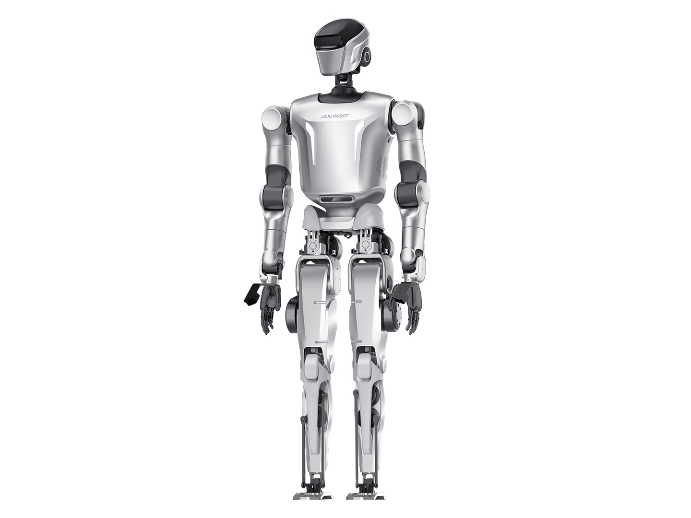
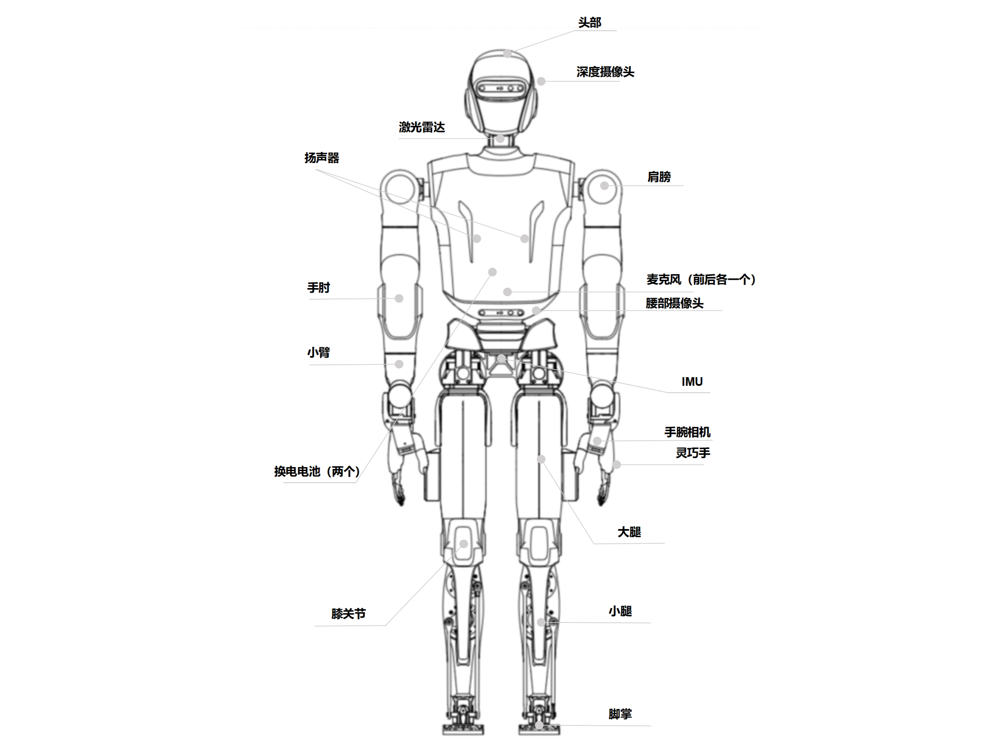
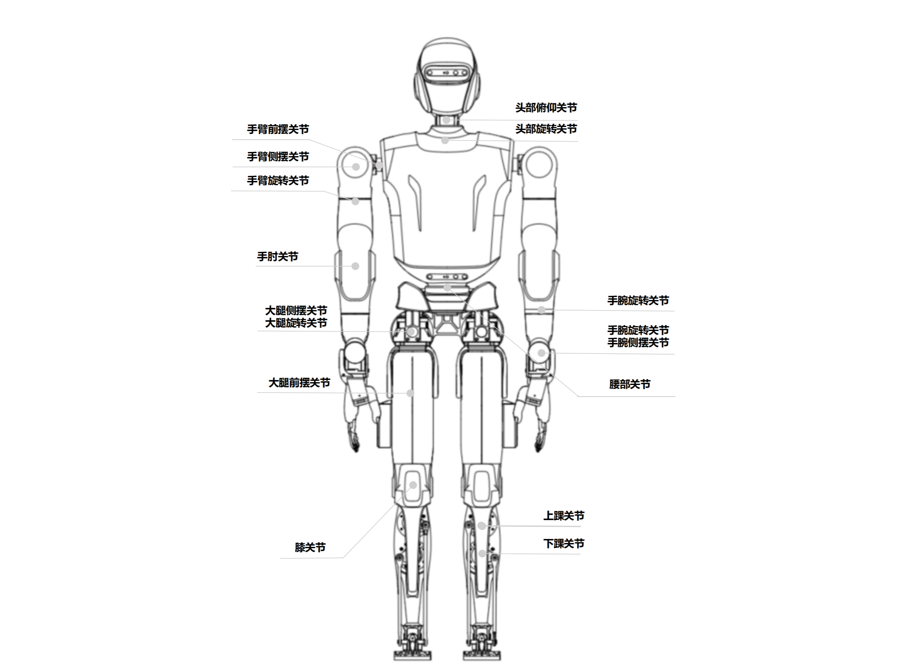
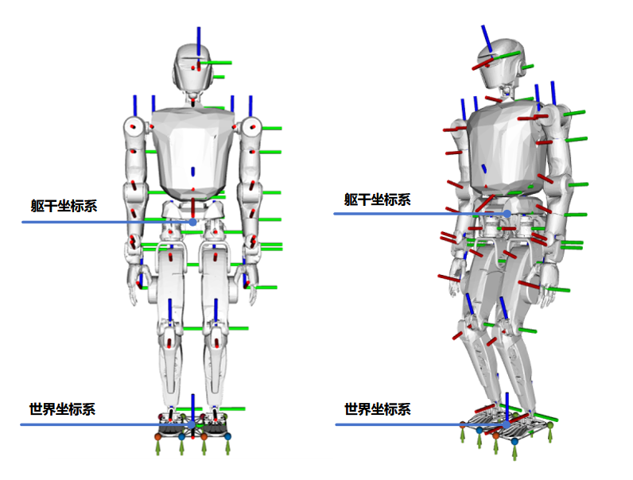

# 产品介绍

- [产品介绍](#产品介绍)
  - [产品组成](#产品组成)
  - [产品规格](#产品规格)
  - [KUAVO5MaxA自由度范围、速度扭矩限制关节位置及运动控制坐标系图示](#kuavo5maxa自由度范围速度扭矩限制关节位置及运动控制坐标系图示)
  - [KUAVO5MaxA电气接口](#kuavo5maxa电气接口)
    - [二合一板接口说明：](#二合一板接口说明)
    - [IMU](#imu)
    - [深度摄像头（头部）：Gemini-335L](#深度摄像头头部gemini-335l)
    - [深度摄像头（手腕）：D405](#深度摄像头手腕d405)
    - [激光雷达：mid-360](#激光雷达mid-360)
    - [下位机：](#下位机)
      - [GENE-MTH6](#gene-mth6)
      - [5G模组](#5g模组)
    - [上位机：](#上位机)
      - [AGX-Orin](#agx-orin)
  - [灵巧手](#灵巧手)

## 产品组成

KUAVO机器人5MaxA版包含头、躯干、手臂、腿部，全身总共29个自由度（不含末端），使得机器人能够实现灵活的运动和姿态控制。

- 头部拥有2个自由度，包含头部旋转关节和头部俯仰关节。深度相机、激光雷达、麦克风阵列、交互灯等位于头部。

- 躯干内包含：运动控制板、电源板及换电电池。

- 单手臂拥有7个自由度，包含手臂前摆关节、手臂侧摆关节、手臂旋转关节、手肘关节、手腕旋转关节、手腕前摆关节和手腕侧摆关节。手臂标配灵巧手。

- 单腿拥有6个自由度，包含大腿侧摆关节、大腿旋转关节、大腿前摆关节、膝关节、上踝关节和下踝关节。

- 腰部拥有1个自由度

## 产品规格

| 类型   | 规格参数                                                                    | 指标说明                                                        |
|:----:|:-----------------------------------------------------------------------:|:-----------------------------------------------------------:|
| 基本参数 | 高 重量 单臂长度                                          | 1.73m 63.5kg 0.79m                          |
| 自由度  | 全身自由度（不含末端） 头部自由度 单臂自由度 单腿自由度 灵巧手自由度 | 29 2 7 6 6                            |
| 运行参数 | 行走速度 跑步速度                                                                    | 0.4m/s 5km/h                                                      |
| 电池参数 | 工作电压 行走续航 电池容量 循环寿命 充电时长                                | 60V 1h 6Ah ≥500次 ≤1.5h                      |
| 传感器  | 摄像头（头部） 摄像头（手腕） 麦克风 激光雷达 扬声器 关节温度传感器 IMU                        | Gemini-335L D405 x 2 6MIC  360度定位 mid-360 立体音响 LB01  /  |
| 算力平台 | 下位机 上位机                                                             | GENE-MTH6 x 1 AGX Orin x 1 |
| 安全功能 | 本体急停 声音提醒                                                           | 1 低电量提醒                                                 |

## KUAVO5MaxA自由度范围、速度扭矩限制关节位置及运动控制坐标系图示

| 关节序号 | 关节名称 | 关节代号         | 位置下限（°） | 位置上限（°） | 额定扭矩（N*m） | 额定速度（rpm） |
| ---- | ---- | ------------ | ------- | ------- | -------- | --------- |
| 0    | 头部俯仰 | head_pitch   | -20     | 45      | 12       | 50        |
| 1    | 头部旋转 | head_yaw     | -90     | 90      | 1.5      | 50        |
| 2    | 腰部旋转 | waist_yaw    | -180    | 180     | 33      | 71       |
| 3    | 左肩前摆 | l_arm_pitch  | -180    | 90      | 36      | 159       |
| 4    | 左肩侧摆 | l_arm_roll   | -20     | 120     | 33       | 30        |
| 5    | 左臂旋转 | l_arm_yaw    | -90     | 90      | 21       | 50        |
| 6    | 左肘   | l_forearm    | -150    | 0       | 33       | 30        |
| 7    | 左腕旋转 | l_hand_yaw   | -90     | 90      | 8       | 50        |
| 8    | 左腕前摆 | l_hand_pitch | -40     | 40      | 8       | 50        |
| 9    | 左腕侧摆 | l_hand_roll  | -75     | 40      | 8       | 50        |
| 10   | 右肩前摆 | r_arm_pitch  | -180    | 90      | 36      | 159       |
| 11   | 右肩侧摆 | r_arm_roll   | -120    | 20      | 33       | 30        |
| 12   | 右臂旋转 | r_arm_yaw    | -90     | 90      | 21       | 50        |
| 13   | 右肘   | r_forearm    | -150    | 0       | 33       | 30        |
| 14   | 右腕旋转 | r_hand_yaw   | -90     | 90      | 8       | 50        |
| 15   | 右腕前摆 | r_hand_pitch | -40     | 40      | 8       | 50        |
| 16   | 右腕侧摆 | r_hand_roll  | -40     | 75      | 8       | 50        |
| 17   | 左髋侧摆 | l_leg_roll   | -18     | 38      | 60      | 88       |
| 18   | 左髋旋转 | l_leg_yaw    | -50     | 45      | 33      | 71       |
| 19   | 左髋前摆 | l_leg_pitch  | -115    | 90      | 60      | 99       |
| 20   | 左膝   | l_knee       | 0       | 145     | 90      | 79       |
| 21   | 左踝上  | l_foot_pitch | -45     | 20      | 27       | 152       |
| 22   | 左踝下  | l_foot_roll  | -15     | 15      | 27       | 152       |
| 23   | 右髋侧摆 | r_leg_roll   | -38     | 18      | 60      | 88       |
| 24   | 右髋旋转 | r_leg_yaw    | -45     | 50      | 33      | 71       |
| 25   | 右髋前摆 | r_leg_pitch  | -115    | 90      | 60      | 99       |
| 26   | 右膝   | r_knee       | 0       | 145     | 90      | 79       |
| 27   | 右踝上  | r_foot_pitch | -45     | 20      | 27       | 152       |
| 28   | 右踝下  | r_foot_roll  | -15     | 15      | 27       | 152       |

当机器人为初始站立姿态时，各坐标系如上图。红色为x轴，绿色为y轴，蓝色为z轴。

## KUAVO5MaxA电气接口

敬请期待

### 二合一板接口说明：

敬请期待

### IMU

- 纵倾横滚精度：0.2度；

- 方位角精度：0.2度；

**陀螺仪:**

- 满量程：2000度/秒；

- 零偏稳定性：2.5°/h；

**加速度传感器：**

- 满量程：12g；

- 零偏稳定性：30 μg；

**机械性能：**

- 工作温度 -40 到 85 摄氏度；

**接口 / IO：**

- 加速度输出频率 1000 HZ；

### 深度摄像头（头部）：Gemini-335L

- 深度技术：双目视觉；

- 图像传感器技术：全局快门；

- 深度基线：95mm；

- 最大工作范围：0.17~20m+；

- 理想范围：0.25~6m；

- 深度空间相对精度：≤0.8%(1280x800 @ 2m & 90%x90% ROI)   &emsp;&emsp;&emsp;&emsp;&emsp;&emsp;&emsp;&emsp;≤1.6%(1280 x800 @ 4m & 80% x 80% ROI)； 

- 深度FOV：90° × 65° @ 2m（1280 × 800）；

- 深度分辨率@帧率：1280 × 800 @ 30fps；

- RGB帧速率和分辨率：60fps下1280 × 800；

- RGB传感器FOV：94° × 68°；

- RGB图像格式：YUYV & MJPEG;

- 连接器：USB 3.0 & USB 2.0 Type-C；

- 工作温度：-10~50℃；

- IP等级：IP65;

- 使用环境：室外；

- 支持物体识别、定位和追踪；

### 深度摄像头（手腕）：D405

- 深度技术：双目立体；

- 图像传感器技术：全局快门；

- 深度视场角（水平 X 垂直）：87° X 58°；

- 深度分辨率：1280 X 720；

- 深度精度：50cm内±2%；

- 景深速率：90fps；

- RGB传感器技术：左成像器RGB与ISP；

- RGB帧速率和分辨率：30fps下1280 × 720；

- RGB传感器FOV（H × V）：87° × 58°；

- 惯性测量单位：无；

- 高分辨率时的min深度距离：0.07m；

- 理想范围：0.07~0.5m；

- 连接器：USB 2 & USB 3.1；

- 使用环境：室内/室外；

- 支持物体识别、定位和追踪；

### 激光雷达：mid-360

- 扫描模式：非重复扫描；

- 量程（@100klx）：40m@10%反射率，70m@80%反射率；

- 近处盲区：0.1m；

- 视场角（H X V）：360° X 59°；

- 测距随机误差（@1δ）：≤2cm（@10m），≤3cm（@0.2m）；

- 角度随机误差（@1δ）：＜0.15°；

- 光束发散度：典型值：0.1° x 1°；

- 点云输出：~200，000点/秒；

- 点云帧率：10Hz；

- 数据网口：100BASE-TX以太网；

- 供电电压范围：9~27V DC；

- 功率：额定功率≤6.5W，启动功率≤18W；

- 工作温度：-20℃~55℃；

- 防护级别：IP67；

- IMU：ICM40609；

### 下位机：

#### GENE-MTH6

- CPU：Intel® Core™ Ultra 7 Processor 255H；

- GPU：Intel® Arc™ 140T GPU

- 内存：64G DDR5内存；

- 硬盘容量：512G固态；

- 主频：16核16线程 睿频频率：5.1 GHz

- 网络：集成Wi-Fi 6E+Wi-Fi 7 

#### 5G模组

- 5G标准：3GPP R16；

- 5G芯片方案：高通；

- 5G：Sub-6 GHz & mmWave；

- 工作温度：-30℃ ~ +75℃；

- 扩展温度：-40℃ ~ +85℃；

- GNSS：GPS/GLONASS/BeiDou（Compass）/Galileo/QZSS；

- 5G mmWave:下行 4.0Gbps ，上行 1.4Gbps；

- 5G SA Sub-6:下行 2.4Gbps ，上行 900Mbps；

- 5G NSA Sub-6:下行 3.4Gbps ， 上行 550Mbps；

- LTE:下行 1.6Gbps ， 上行 200Mbps；

- UMTS:下行 42Mbps ，上行 5.76Mbps；

### 上位机：

#### AGX-Orin

- CPU:
  - 架构: Arm® Cortex®-A78AE
  - 核心数: 12 核（64GB 版本），8 核（32GB 版本）
  - 缓存: 3MB L2 + 6MB L3（64GB 版本），2MB L2 + 4MB L3（32GB 版本）
  - 最大频率: 可达 2.2 GHz
- GPU:
  - 架构: NVIDIA Ampere
  - 核心数: 2048 CUDA 核心（64GB 版本），1792 CUDA 核心（32GB 版本）
  - Tensor 核心: 64 个（64GB 版本），56 个（32GB 版本）
  - 最大频率: 最高可达 1.3 GHz
- 内存:
  - 类型: LPDDR5
  - 容量: 可选 32GB 或 64GB
  - 带宽: 204.8 GB/s
- 硬盘容量:
  - 类型: eMMC 5.1
  - 容量: 64GB
- 主频:
  - CPU 最大频率为可达 2.2 GHz
- 网络:
  - 支持多种网络连接，包括1个千兆以太网口和1个10GbE接口。
- AI性能:
  - 性能指标: 可达275 TOPS（每秒万亿次操作） 
    Jetson AGX Orin 提供了显著的性能提升，特别是在 AI 推理和深度学习任务中，相较于其前代产品 Jetson AGX Xavier，性能提升可达8倍。该平台非常适合需要实时处理和高计算能力的应用，如自动驾驶、智能城市和医疗保健等领域

## 灵巧手

灵巧手产品说明手册：[app.brainco.cn/universal/stark-serialport-prebuild/docs/BC4-0100114095_20240521.pdf](https://app.brainco.cn/universal/stark-serialport-prebuild/docs/BC4-0100114095_20240521.pdf)

灵巧手官方文档网站：[灵巧手官方文档网站](https://www.brainco-hz.com/docs/revolimb-hand/revo1/parameters.html)
