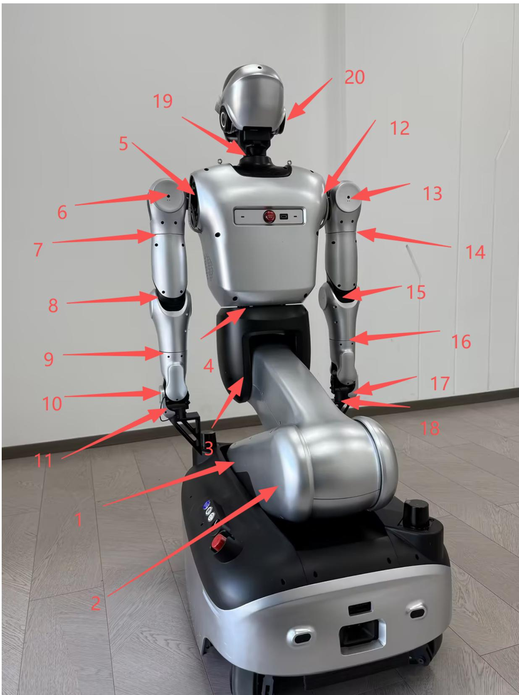
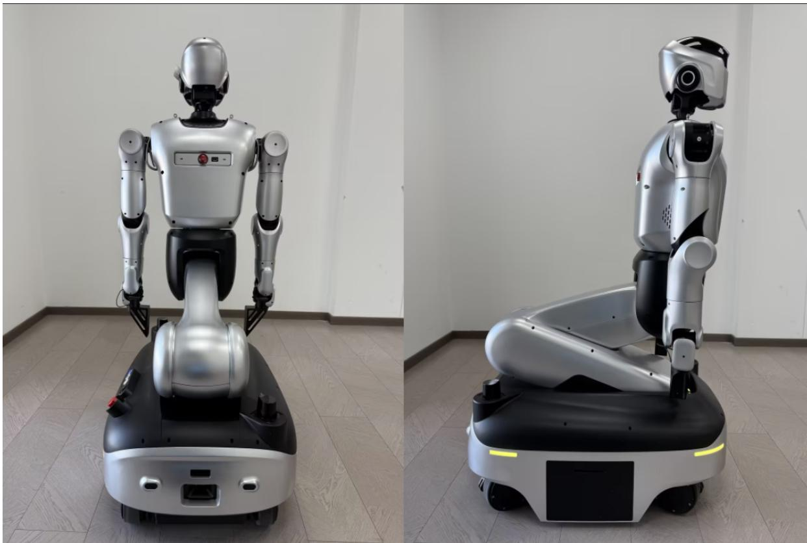
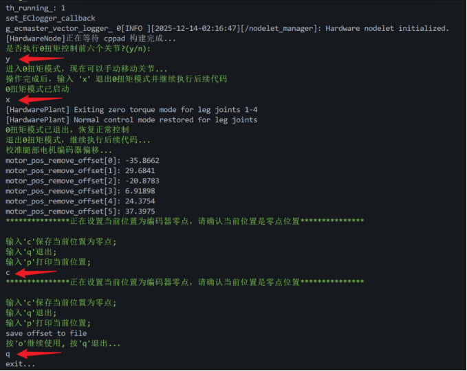

# Kuavo 5-W 标定全身零点

## 1、轮臂电机编号



新建终端，将手臂与头部调整到**零点姿态**后，启动标定程序：

```txt
cd kuavo-ros-opensource  
sudo su  
source devel/setup.bash  
roslaunch humanoid_controllers load_kuavo_real_wheel.launch cali:=true cali_leg:=true cali_arm:=true ##标定腿部和手臂、头部
```

## 2、按提示进入 0 扭矩并调整到零点

当日志提示“是否执行 0 扭矩控制前六个关节”时：

1. 用吊机吊起上半身，避免下坠。
2. 在终端输入 `y` 确认后，腿部电机将进入“软”状态。
3. 由于重力影响，下半身部分关节会下压；此时手动将 **3、4 号电机**摆正到位。

完成后，该姿态即为机器人零点位置，如下图所示：



## 3、保存零点并退出

零点姿态调整完成后，按以下顺序操作：

- 按 `x`：退出当前控制/调整流程  
- 按 `c`：保存零点  
- 按 `q`：退出程序  

如下图所示：



至此，零点标定完成。
