# Kuavo 5-W 启动前准备
## 硬件检查清单

1.NUC镜像烧录完成

2.电机安装完成

3.上下位机拓展口正常

4.轮臂底盘上的按键均能使用
## 相关配置

### 1.配置机器人版本、下位机仓库

1、电脑连接下位机，新建终端，根据当前最新配置来修改机器人版本（此处以ROBOT_VERSION=60为例）：

```shell
sudo sh -c "echo 'export ROBOT_VERSION=60' >> /root/.bashrc"  
sudo sh -c "echo 'export ROBOT_VERSION=60' >> /home/lab/.bashrc"
```

2、切换分支：

```tcl
cd kuavo-ros-opensource   
git reset --hard   
git clean -fd   
git pull   
git checkout opensource/wyx/lb/factory_test_version60
```

3、分支切换后，在仓库里执行编译仓库：

```batch
sudo su  
catkin clean -y  
catkin config -DCMAKE_asm_COMPILER=/usr/bin/as -DCMAKE  _Builds_TYPE=Release  
source installed/setup.bash  
catkin build humanoid_controllers
```

### 2.上位机固定IP

1、上位机外接屏幕，输入密码：leju_kuavo 进入桌面：

- AGX上位机：把屏幕电源线、鼠标、键盘用tycp-c拓展坞接到上位机拓展口，hDMI线就用dp转hmi转接头接到上位机

2、进入设置配置IP，如下图：

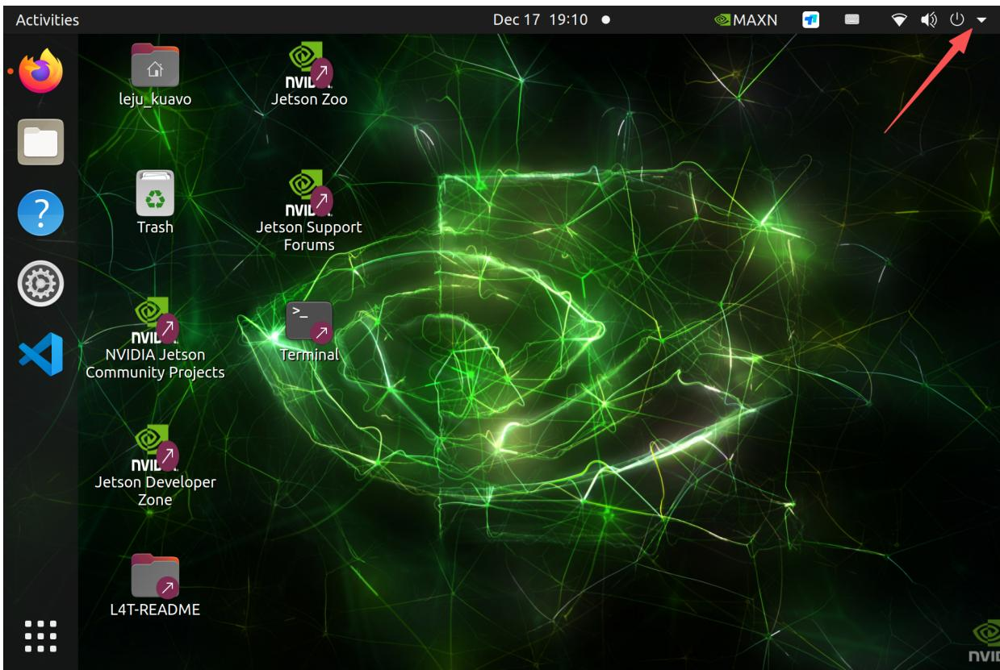


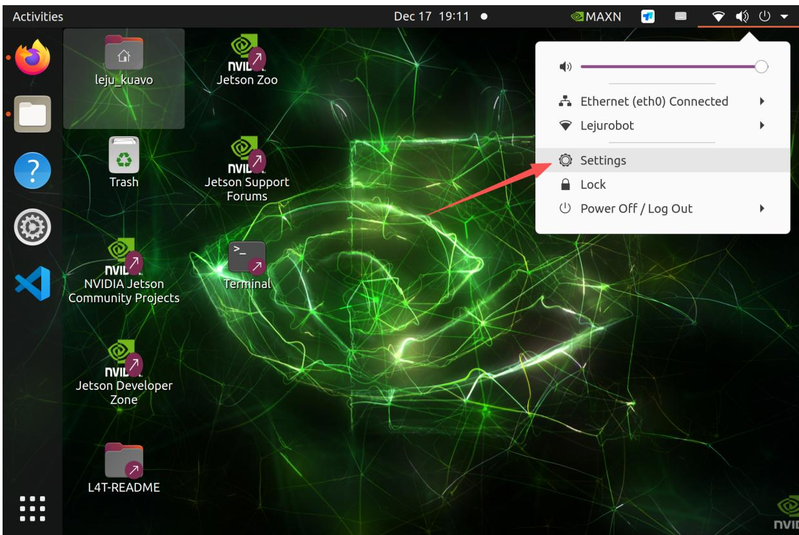


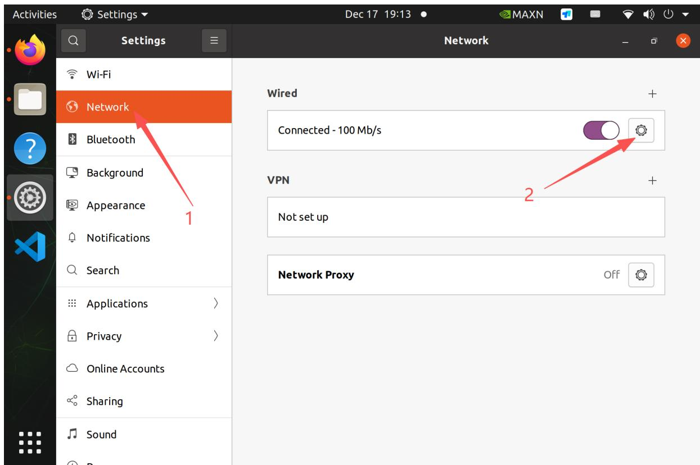


3、将网口设置成 Manual，地址设置为 169.254.128.136，网关设置为 255.255.255.0，修改后点击 Apply，如下图：

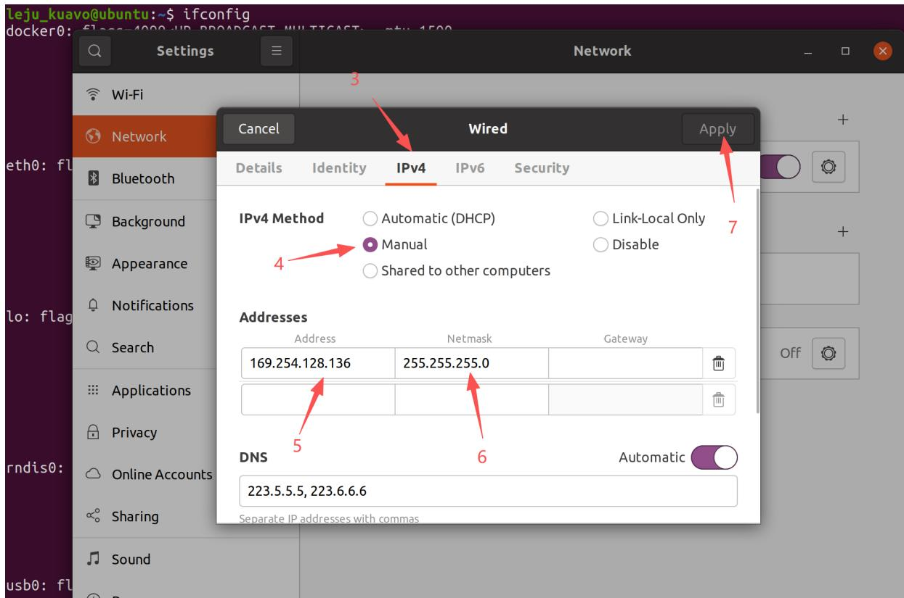


### 3.下位机固定IP

1、下位机外接屏幕，将网卡设置为自动（DHCP），如下图：


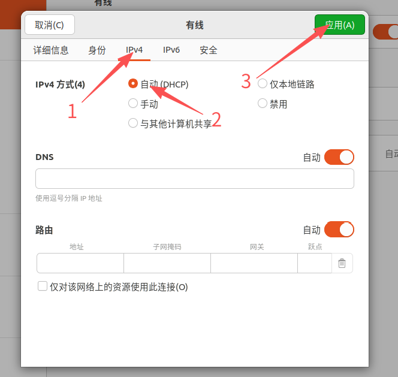


2、新建终端，执行以下命令，如下图：

```batch
cd kuavo-ros-opensource  
sudo ~/kuavo-ros-opensource/src/kuavo_wheel/scripts/setup_fixed_ips.sh --lower
```

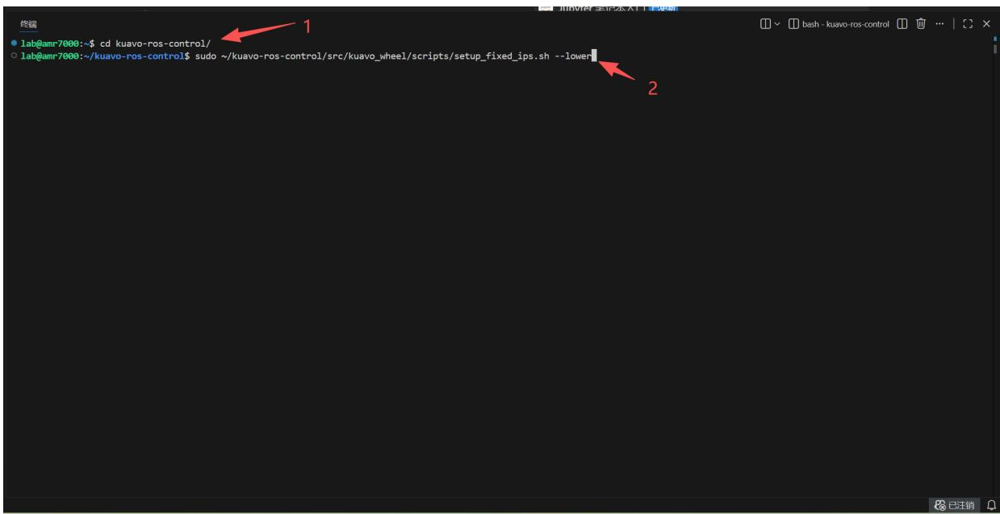


3、配置成功后，如下图：

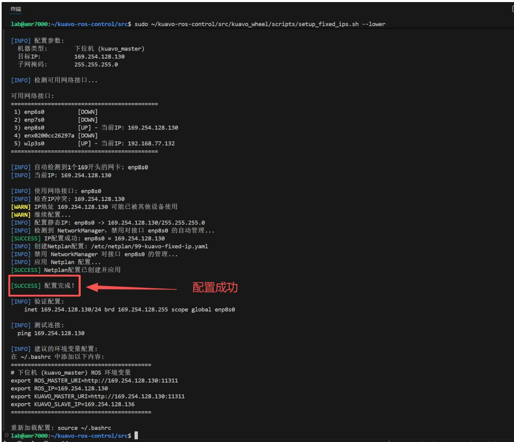


4、在终端ping 169.254.128.130，能ping 后期才能连接底盘：

```fortran
ping 169.254.128.130
```

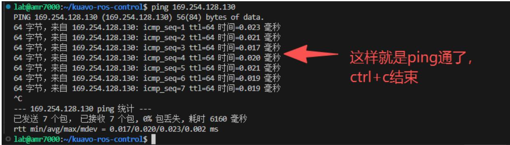


5、在终端ping 169.254.128.2，测试下位机和底盘通讯是否正常：

```txt
ping 169.254.128.2
```

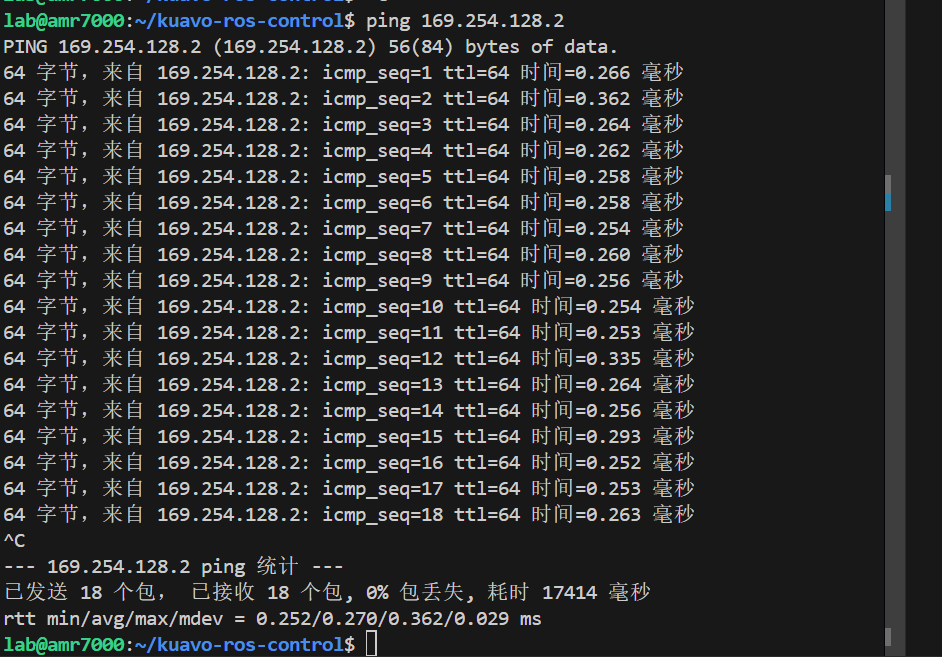

6、在终端 ping 169.254.128.136，测试下位机与上位机的通讯是否正常：

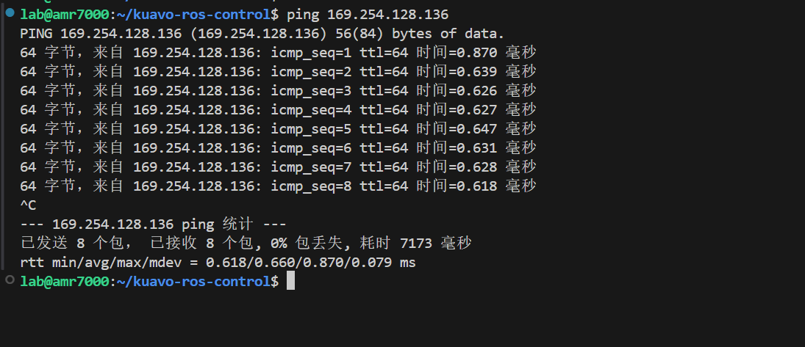

### 4.配置喇叭

1、下位机打开终端，配置udev规则，配置完成后重启机器：

```batch
cd ~/kuavo-ros-opensource/src/kuavo_wheel 
sudo ./audio-udev-new.sh
```

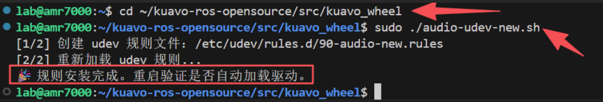

2、下位机接屏幕，进入设置中的音频项，测试喇叭是否有声音

### 5、配置灵巧手(根据实际配置选择灵巧手配置、夹爪、触觉灵巧手配置)

1、修改src/kuavo_assets/config/kuavo_v$ROBOT_VERSION/kuavo.json配置文件中大约第50行的EndEffectorType参数

```javascript
"EndEffectorType": ["qiangnao", "qiangnao"],
```

下图为ROBOT_VERSION = 60版本的修改示例图，修改后ctrl+s保存，如下图：


新建终端

```batch
cd ~/kuavo-ros-opensource/tools/check_tool 
sudo python3 Hardware_tool.py
```

输入字母o加回车展开开发工具栏

输入相应按键进行灵巧手的配置和测试

输入b加回车配置灵巧手usbudev规则

输入 c 加回车 测试灵巧手(如果没反应，需要重启 NUC 使得 udev 规则生效)

输入 j 加回车 测试触觉灵巧手、输入 1 配置usb，输入 2 测试触觉灵巧手正不正常(如果没反应，需要重启 NUC 使得 udev 规则生效)

#### 配置自研二指爪

1、修改 src/kuavo_assets/config/kuavo_v$ROBOT_VERSION/kuavo.json 配置文件中大约第50行的EndEffectorType 参数

```javascript
"EndEffectorType": ["lejuclaw", "lejuclaw"],
```

下图为ROBOT_VERSION = 60版本的修改示例图，修改后ctrl+s保存，如下图：


2、修改kuavo-ros-opensource/src/manipulation_nodes/noitom_hi5_hand.udp_PYthon/launch/launchquest3_ik  
Launch文件中的第10行


```
#原代码
<arg name="ee_type" default="qiangnao"/>
#修改为
<arg name="ee_type" default="lejuclaw"/>
```

3、修改kuavo-ros-opensource/src/humanoid_control/humanoid_controllers/launch/load_kuavo_real_with_vr.launch 文件中的第7行与 load_kuavo_real_wheel_vr.launch 文件中的第8行

```
#原代码
<arg name="ee_type" default="qiangnao"/>
#修改为
<arg name="ee_type" default="lejuclaw"/>
```


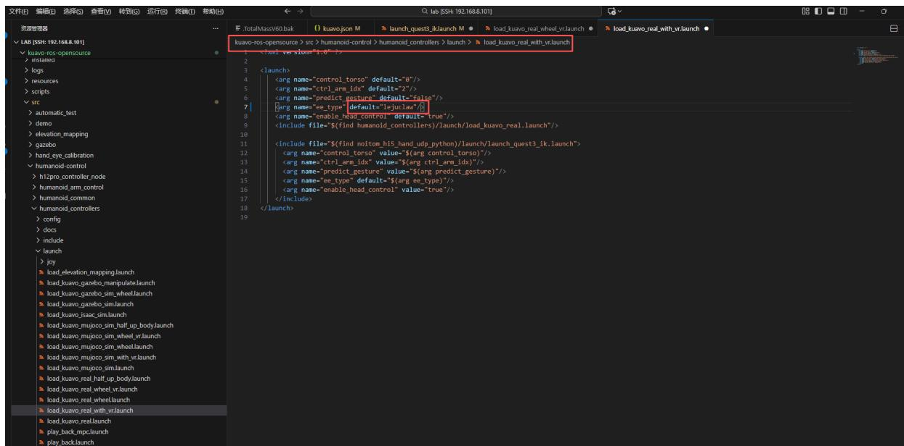


4、测试二指夹爪，新建终端，执行以下命令：

```shell
cd kuavo-ros-opensource/  
sudo python3 tools/check_tool/Hardware_tool.py
```

选择a，测试二指夹爪，如下图：


#### 配置触觉灵巧手

1、修改 src/kuavo_assets/config/kuavo_v$ROBOT_VERSION/kuavo.json 配置文件中大约第50行的EndEffectorType 参数

```javascript
"EndEffectorType": ["qiangnao_touch", "qiangnao_touch"],
```

下图为ROBOT_VERSION = 60版本的修改示例图

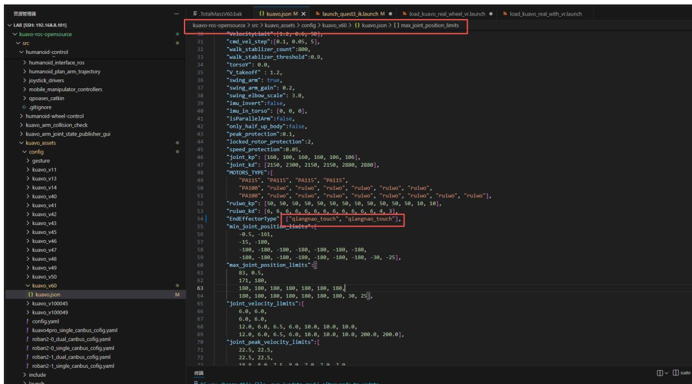


2、修改kuavo-ros-opensource/src/manipulation_nodes/noitom_hi5_hand.udp_PYthon/launch/launchquest3_ik  
Launch 文件中的大约第10行

```txt
#原代码  
<arg name="ee_type" default="qiangnao"/>  
#修改为  
<arg name="ee_type" default="qiangnao_touch"/>
```

3、修改kuavo-ros-opensource/src/humanoid-control/humanoid-controllers/launch/load_kuavo_real_with_vr.launch 文件中的大约第7行

```txt
#原代码  
<arg name="ee_type" default="qiangnao"/>  
#修改为  
<arg name="ee_type" default="qiangnao_touch"/>
```
