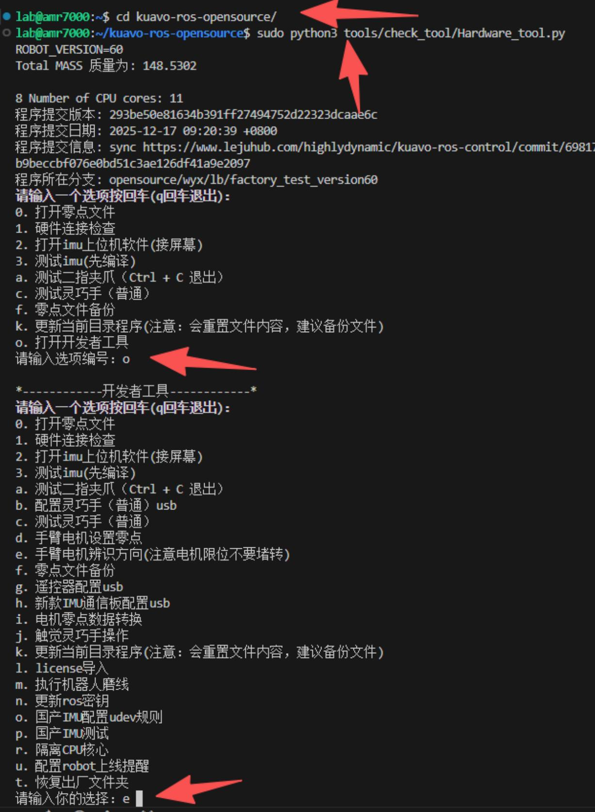
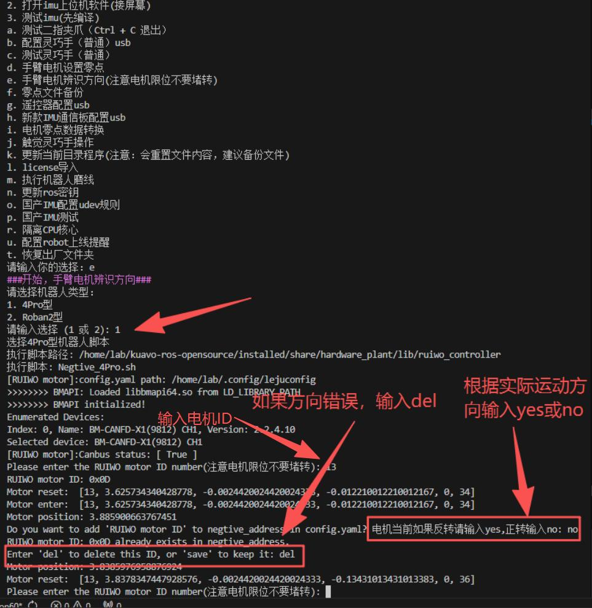

# Kuavo 5-W 辨识手臂和头部电机方向

1、新建终端，执行以下命令启动工具：

```shell
cd kuavo-ros-opensource/  
sudo python3 tools/check_tool/Hardware_tool.py
```

2、在工具界面依次输入 `o`，再输入 `e`，如下图：




3、输入 `1` 进入方向辨识模式（当前暂使用 4pro 流程进行手臂/头部电机方向辨识），然后按提示逐个辨识：


- 电机旋转的正方向与机器人坐标系的正方向一致，符合右手定则。
- 右手定则判定方法：右手握住电机旋转轴，让拇指指向旋转轴的正方向（与机器人坐标系正方向一致），其余四指弯曲方向即为旋转正方向。
- 机器人坐标系正方向：向前为 x 轴正方向，向左为 y 轴正方向，向上为 z 轴正方向。
- **输入电机 ID**：范围为 `1` ~ `14`（`1` 为左手 1 号电机，`14` 为头部最后一个电机）
- **确认方向**：观察电机实际运动方向，选择 `yes`（反转）或 `no`（正转）
- **继续下一个电机**：若方向正确，直接输入下一个电机 ID 继续
- **方向不对时重做**：输入 `del` 删除刚才的设置后，重新辨识一次，确保修改生效

如下图：


