# 机器人关节标定

- [机器人关节标定](#机器人关节标定)
    - [零点校准](#零点校准)
    - [头部和手臂零点自动标定](#头部和手臂零点自动标定)
      - [执行标定程序](#执行标定程序)

### 零点校准
#### Kuavo 4代零点标定

1. 请将工装插入机器人腿部, 如下图所示


2. 请将机器人手臂摆好，如下图所示


长手版本机器人手臂摆直,如下图示意


3. 摆好头部，头部左右居中，头部图示截面保持竖直

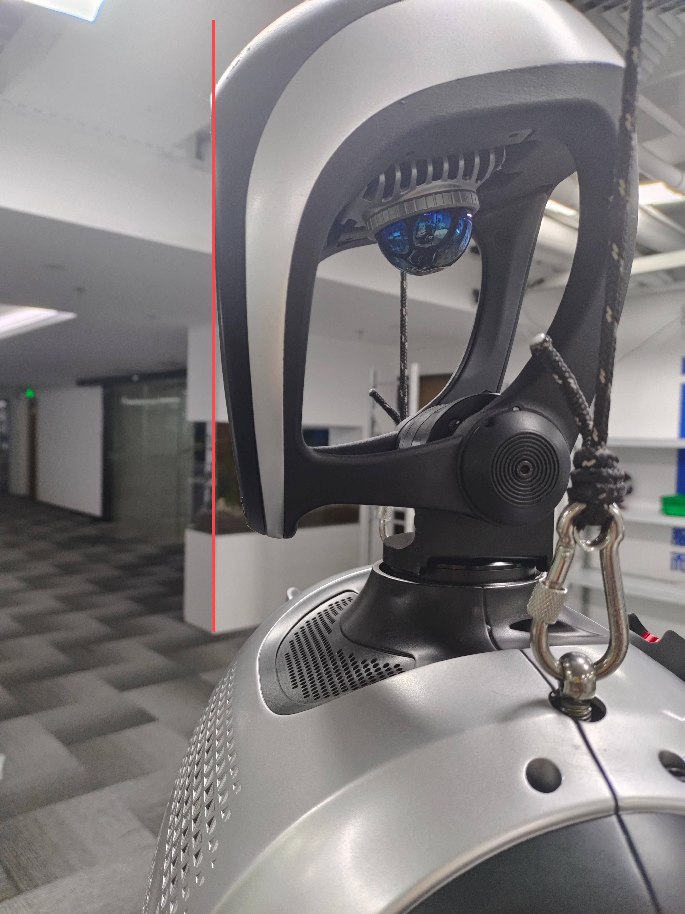

4. 启动机器人校准程序

如果需要校准机器人全身关节，则使用以下命令
新建终端
```bash
cd ~/kuavo-ros-opensource
sudo su
source devel/setup.bash
roslaunch humanoid_controllers load_kuavo_real.launch cali:=true cali_leg:=true cali_arm:=true
```

如果只需要校准机器人头部和手臂(不包含左右手臂前摆关节)，则使用以下命令
新建终端
```bash
cd ~/kuavo-ros-opensource
sudo su
source devel/setup.bash
roslaunch humanoid_controllers load_kuavo_real.launch cali:=true cali_arm:=true
```

5. 在使能完腿部电机后(打印出如下图的位置之后), 零点校准之前电机运动可能会超出限位(如果没超出限位， 则按 `c` 加回车，保存腿部当前位置作为零点)


```bash
0000003041: Slave 1 actual position 9.6946716,Encoder 63535.0000000
0000003051: Rated current 39.6000000
0000003061: Slave 2 actual position 3.9207458,Encoder 14275.0000000
0000003071: Rated current 11.7900000
0000003081: Slave 3 actual position 12.5216674,Encoder 45590.0000000
0000003091: Rated current 42.4300000
0000003101: Slave 4 actual position -37.2605896,Encoder -244191.0000000
0000003111: Rated current 42.4300000
0000003121: Slave 5 actual position 15.8138275,Encoder 207275.0000000
0000003131: Rated current 8.4900000
0000003142: Slave 6 actual position -2.7354431,Encoder -35854.0000000
0000003151: Rated current 8.4900000
0000003161: Slave 7 actual position 5.8642578,Encoder 38432.0000000
0000003171: Rated current 39.6000000
0000003183: Slave 8 actual position -16.8491821,Encoder -61346.0000000
0000003192: Rated current 11.7900000
0000003201: Slave 9 actual position -18.9975585,Encoder -69168.0000000
0000003211: Rated current 42.4300000
0000003221: Slave 10 actual position -64.5283508,Encoder -422893.0000000
0000003231: Rated current 42.4300000
0000003241: Slave 11 actual position -31.0607147,Encoder -407119.0000000
0000003251: Rated current 8.4900000
0000003261: Slave 12 actual position 49.7427368,Encoder 651988.0000000
0000003272: Rated current 8.4900000
0000003281: Slave 13 actual position 26.8544311,Encoder 97774.0000000
0000003291: Rated current 14.9900000
0000003301: Slave 14 actual position -19.9171142,Encoder -72516.0000000
0000003311: Rated current 14.9900000
```

6. 将所有的 `Slave xx actual position ` 后的数字值记录到 `~/.config/lejuconfig/offset.csv` 文件中

⚠️ 注意：

- 如果机器人行走偏左，增大 `offset.csv` 文件中 1 号的值，每次修改幅度为0.5
- 如果机器人行走偏右，减少 `offset.csv` 文件中 7 号的值，每次修改幅度为0.5
- 如果机器人行走重心很低，请重新确认机器人质量后，重新执行设置机器人质量步骤

### 头部和手臂零点自动标定

#### 执行标定程序

1. 使用移位机将机器人拉高,并按下图大致将手臂和头部摆正
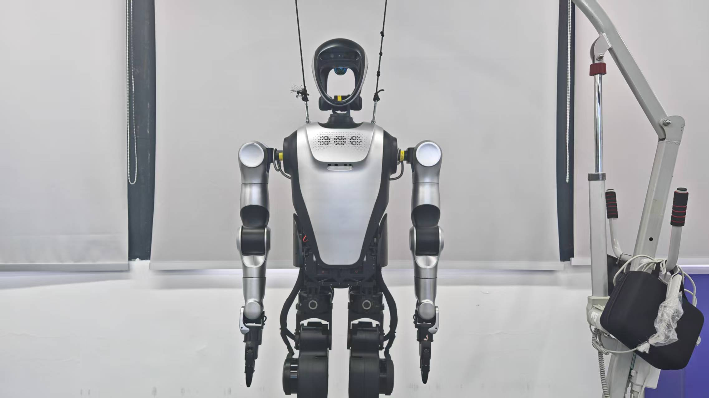

2. 新建一个终端, 输入命令
**注意: 后续"标定手臂"和"标定头部"的操作均在此终端进行**
```bash
cd ~/kuavo-ros-opensource
sudo su
source devel/setup.bash
# 以校准模式启动
roslaunch humanoid_controllers load_kuavo_real.launch cali:=true cali_arm:=true 
```

3. 标定手臂
**注意: 标定手臂前,需要确保机器人前后各空出一米活动空间**
- 等待机器人将腿伸直后, 然后根据提示输入"a","1","1"(每个输完都要按一次回车)
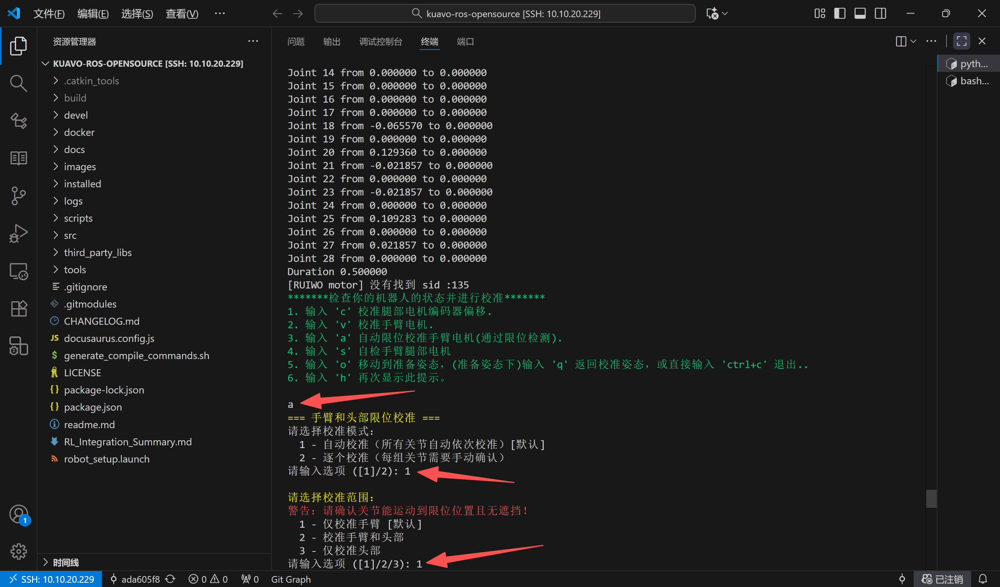
- 等待机器人手臂标定完成并复位,终端会弹出提示,按"s"并回车即可保存手臂零点
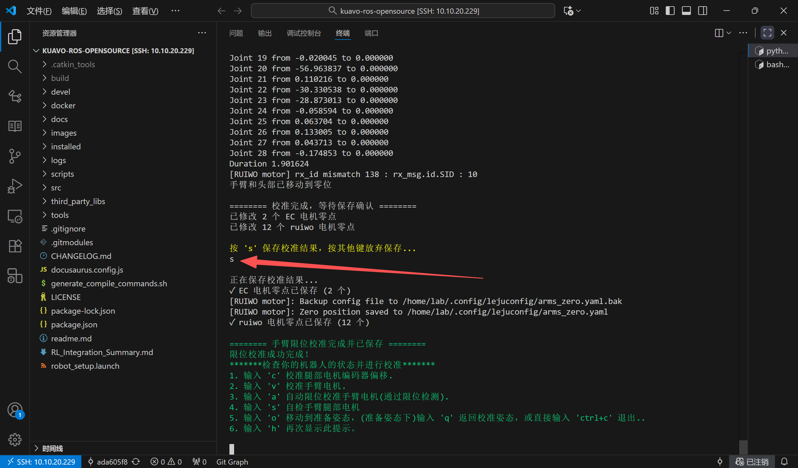

4. 标定头部
- 移位机下降至机器人双足稳定接触地面,如下图
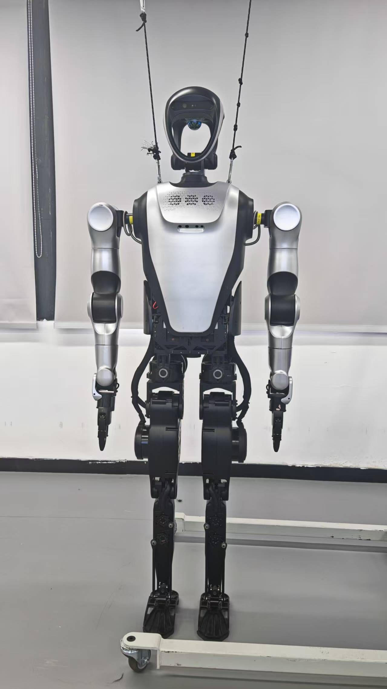

- 用手在后面拖住机器人,移位机继续下降,令机器人双肩的挂绳环扣接近水平,如下图
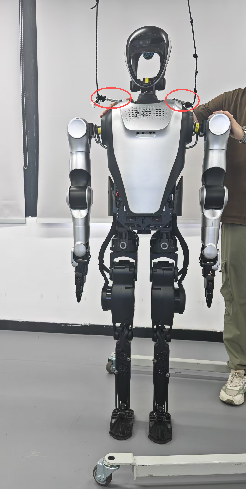

- 根据提示输入"a","1","3"(每个输完都要按一次回车)
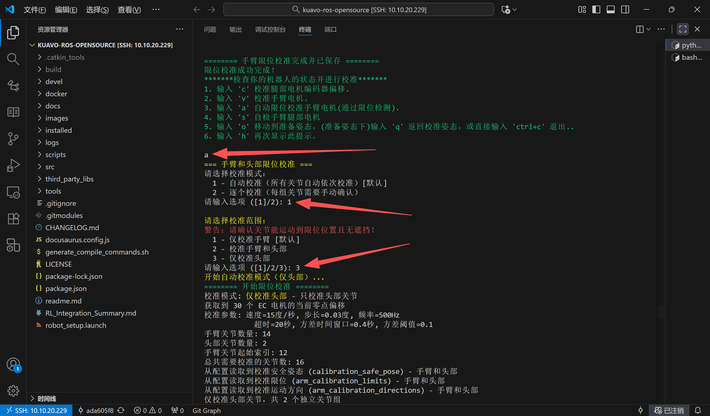
- 等待机器人头部标定完成并复位,终端会弹出提示,按"s"并回车即可保存头部零点
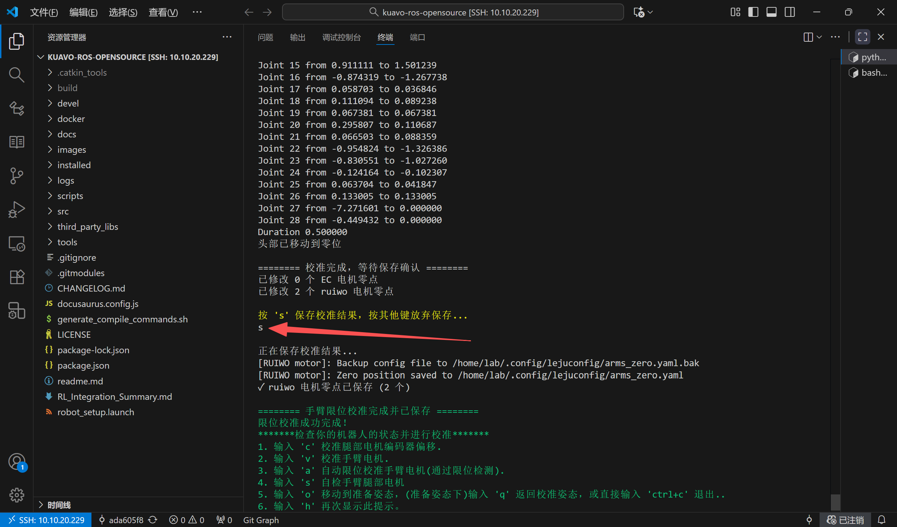
- 移位机上拉至机器人两侧挂绳绷直,然后按"Ctrl+C"关闭此终端
- 至此头部和手臂标定结束,之后正常使用机器人即可
#### Kuavo 5代零点标定
##### 1.插入工装

正面

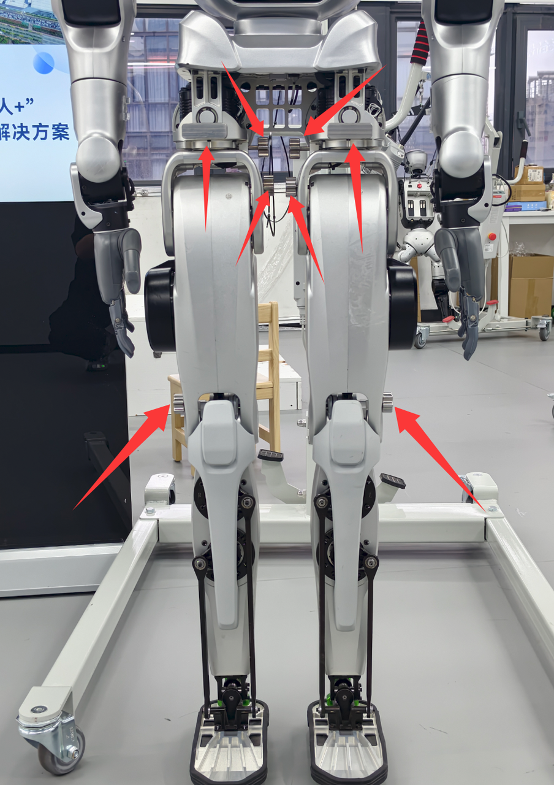

背面

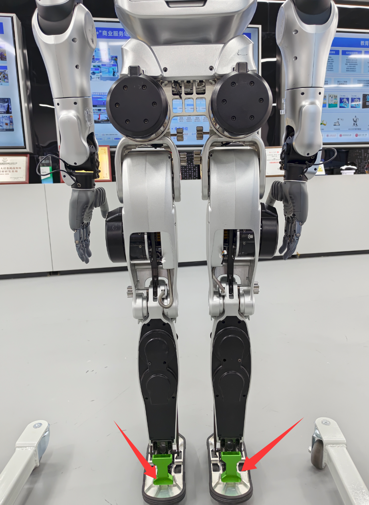

##### 2.插入工装

1. 将手臂和腰部摆正后，确认工装已经正确插入。

2. 启动机器人校准程序，依次执行以下命令：

   ```bash
   cd ~/kuavo-ros-opensource
   sudo su
   source devel/setup.bash
   roslaunch humanoid_controllers load_kuavo_real.launch cali:=true cali_leg:=true cali_arm:=true
   ```
- 按照下列步骤完成零点标定：
  1. 在终端中，看到提示后，键盘输入 `c` 然后按 `Enter`，以保存当前零点位置。
  2. 确认收到保存成功的提示信息。
  3. 再输入 `q` 并按 `Enter`，退出标定程序。
- 标定完成后，可关闭终端，拔出工装。此时，零点标定已完成。

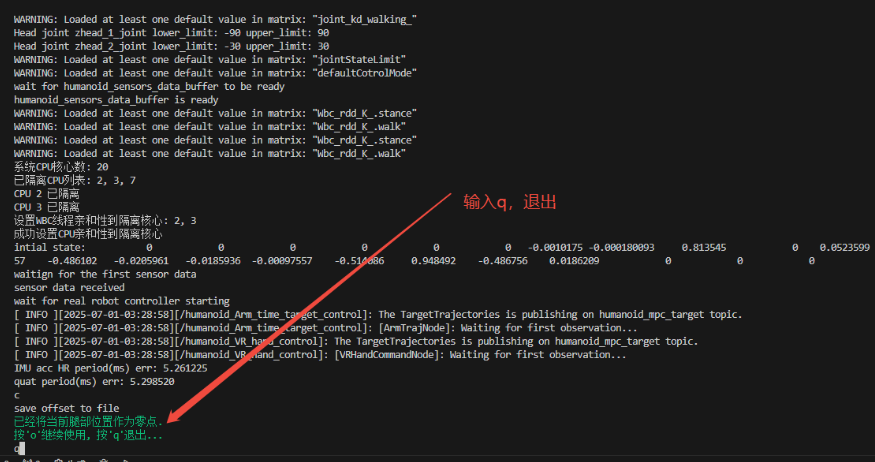

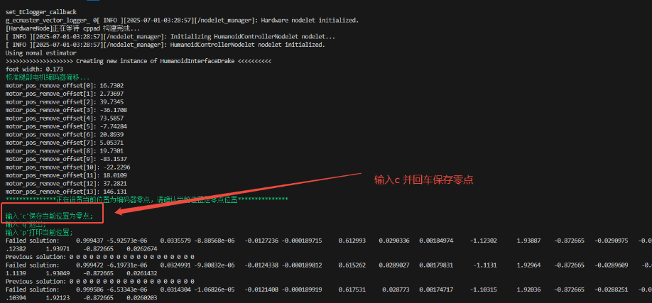