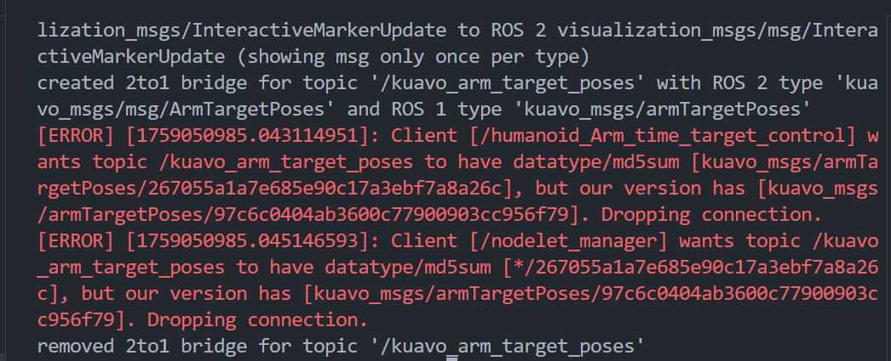
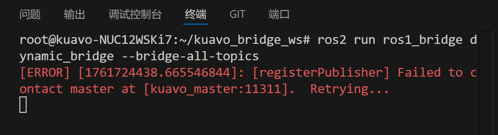

# ROS2接口使用文档

- [ROS2接口使用文档](#ros2接口使用文档)
  - [(1)ROS2接口说明](#1ros2接口说明)
      - [功能说明](#功能说明)
      - [版本说明(⚠️重要⚠️)](#版本说明️重要️)
  - [(2)环境准备](#2环境准备)
    - [拉取代码仓库](#拉取代码仓库)
    - [下载docker容器](#下载docker容器)
    - [ros通信配置](#ros通信配置)
      - [查询本机有线ip地址](#查询本机有线ip地址)
      - [修改环境变量](#修改环境变量)
  - [(3)docker配置](#3docker配置)
    - [1. 构建 msg 和 bridge(仅需运行一次)](#1-构建-msg-和-bridge仅需运行一次)
    - [2. 检查 ROS1 和 ROS2 的消息对（msg pairs）](#2-检查-ros1-和-ros2-的消息对msg-pairs)
    - [3. 运行桥接（Bridge）](#3-运行桥接bridge)
    - [4. 检查桥接结果](#4-检查桥接结果)
  - [(4)ROS2 代码编译](#4ros2-代码编译)
      - [1. 更新 ROS2 GPG 密钥](#1-更新-ros2-gpg-密钥)
      - [2. 初始化 rosdep（第一次需要）](#2-初始化-rosdep第一次需要)
      - [3. 安装依赖项](#3-安装依赖项)
      - [4. 构建 kuavo\_example](#4-构建-kuavo_example)
  - [(5)运行 ROS2 控制示例](#5运行-ros2-控制示例)
    - [控制机器人行走跟踪](#控制机器人行走跟踪)
    - [机器人行走-速度控制](#机器人行走-速度控制)
    - [机器人行走-位置控制](#机器人行走-位置控制)
    - [机器人行走-单步控制](#机器人行走-单步控制)
    - [手臂移动轨迹控制](#手臂移动轨迹控制)
    - [手臂逆运动学（IK）](#手臂逆运动学ik)
    - [灵巧手手势控制](#灵巧手手势控制)
    - [头部控制](#头部控制)
  - [(6)常见问题](#6常见问题)

---

## (1)ROS2接口说明

#### 功能说明

- 本项目主要用于实现 **ROS1（Noetic）与 ROS2（Foxy）之间的通信桥接**，通过消息（ROS Topic）和服务（ROS Service）的双向转发，使机器人底层运行在 ROS1 的节点能够与上层 ROS2 应用无缝交互。  

- 项目基于官方的 **ros1_bridge** 进行扩展，结合 Docker 容器环境，提供了一键构建和运行的脚本，方便开发者快速启动桥接服务。  
开发者可以在 ROS2 侧使用示例程序（如速度控制、位置控制、轨迹规划、单步控制等），同时保持与 ROS1 控制端的兼容，满足机器人在运动控制、传感器数据处理、手臂与头部控制等多种应用场景下的需求。

#### 版本说明(⚠️重要⚠️)

- 目前本项目仅适配最新的master分支, 对下位机1.2.2及之前的tag会存在部分不兼容
- 若用户本地的`kuavo-ros-opensource`版本为1.2.2及以前,用户使用前需要更新下位机代码仓库,或自行将`kuavo_ros2_to_ros1_bridge`中的`ros1/src/kuavo_msgs`功能包替换为与自己下位机本地的`kuavo-ros-opensource/src/kuavo_msgs`完全一致,再进行使用

---

## (2)环境准备

**⚠️⚠️注意:以下操作均需要在`机器人上位机`运行,之后不在赘述⚠️⚠️**

### 拉取代码仓库

```bash
git clone https://gitee.com/leju-robot/kuavo_ros2_to_ros1_bridge.git
```

### 下载docker容器

```bash
# 下载docker容器压缩包
wget https://kuavo.lejurobot.com/docker_images/ros_foxy_bridge.tar.gz
# 下载md5文件
wget https://kuavo.lejurobot.com/docker_images/ros_foxy_bridge.md5 
# 检验下载是否成功(若下载失败, 需要重新下载docker容器压缩包)
md5sum -c ros_foxy_bridge.md5
# 若输出`ros_foxy_bridge.tar.gz: OK` 则说明压缩包下载成功
# 加载容器
docker load -i ros_foxy_bridge.tar.gz
```

### ros通信配置

#### 查询本机有线ip地址
- 终端输入`ifconfig | grep 192.168.26`
- 终端示例输出:
```bash
inet 192.168.26.1  netmask 255.255.255.0  broadcast 192.168.26.255
```
- 记录`inet`的值,一般为`192.168.26.1`或`192.168.26.12`,记住这个值

#### 修改环境变量
- 进入docker容器
```bash
cd ~/kuavo_ros2_to_ros1_bridge
sudo ./docker/run_bridge.sh
```
- 若查询到的`inet`值为`192.168.26.1`,则依次输入
```bash
echo -e "192.168.26.12\tkuavo_master" | sudo tee -a /etc/hosts
echo 'export ROS_MASTER_URI=http://kuavo_master:11311/' >> ~/.bashrc
echo 'export ROS_IP=192.168.26.1' >> ~/.bashrc
```
- 若查询到的`inet`值为`192.168.26.12`,则依次输入
```bash
echo -e "192.168.26.1\tkuavo_master" | sudo tee -a /etc/hosts
echo 'export ROS_MASTER_URI=http://kuavo_master:11311/' >> ~/.bashrc
echo 'export ROS_IP=192.168.26.12' >> ~/.bashrc
```

---

## (3)docker配置

**⚠️⚠️注意:以下操作均需要在`kuavo_ros2_to_ros1_bridge`路径下运行,之后不在赘述⚠️⚠️**

### 1. 构建 msg 和 bridge(仅需运行一次)

```bash
sudo ./docker/run_bridge.sh
./build_msg_and_bridge.sh
```

### 2. 检查 ROS1 和 ROS2 的消息对（msg pairs）

```bash
source bridge_ws/install/setup.bash
ros2 run ros1_bridge dynamic_bridge --print-pairs | grep kuavo_msgs
```

### 3. 运行桥接（Bridge）
- 以下命令任选其一运行即可,注意运行后不要退出该终端
- 初次使用建议选择`全部 topic 桥接`

- 全部 topic 桥接：

```bash
source bridge_ws/install/setup.bash
ros2 run ros1_bridge dynamic_bridge --bridge-all-topics
```

- 指定 topic 桥接：

```bash
source /opt/ros/noetic/setup.bash
rosparam load ros1/src/bridge.yaml
```

```bash
source bridge_ws/install/setup.bash
ros2 run ros1_bridge parameter_bridge
```

### 4. 检查桥接结果

- 新建一个终端

```bash
sudo ./docker/run_bridge.sh
```

- 查看 ROS2 topic 列表：

```bash
source bridge_ws/install/setup.bash
ros2 topic list
```

- 查看 ROS1 topic 列表：

```bash
source /opt/ros/noetic/setup.bash
source ros1/install_isolated/setup.bash
rostopic list
```

---

## (4)ROS2 代码编译

#### 1. 更新 ROS2 GPG 密钥

    ```bash
    ./docker/run_bridge.sh
    ./docker/update_ros2_GPG_key.sh
    apt-get update
    apt-get install python3-pip
    ```

#### 2. 初始化 rosdep（第一次需要）

    ```bash
    sudo rosdep init      # 仅首次执行
    sudo rosdep update
    rosdep install --from-paths kuavo_example/src --ignore-src -r -y
    ```

#### 3. 安装依赖项

    ```bash
    export ROS_DISTRO=foxy
    sudo apt-get install ros-$ROS_DISTRO-tf-transformations
    pip3 install -r kuavo_example/src/kuavo_example_py/requirements.txt
    ```

#### 4. 构建 kuavo_example

    ```bash
    cd kuavo_example
    colcon build --symlink-install
    ```

---

## (5)运行 ROS2 控制示例

**⚠️注意⚠️：**

- 确保机器人下位机已经启动仿真或实机程序
- 确保 bridge 已经启动
- 每次示例运行完后，再次运行前需要重新启动 bridge

### 控制机器人行走跟踪

- 注意:以下两个终端均需要保持运行状态

- 终端一:
```bash
source /opt/ros/foxy/setup.bash
source ros2/install/setup.bash
source kuavo_example/install/setup.bash
ros2 run kuavo_example_py mpc_path_tracer
```

- 终端二:
```bash
source /opt/ros/foxy/setup.bash
source ros2/install/setup.bash
source kuavo_example/install/setup.bash
ros2 run kuavo_example_py path_generator --action start --path-type circle

usage: path_generator [-h] [--action {start,stop}]
                      [--path-type {circle,square,triangle,line,scurve}]

Path Generator Node

optional arguments:
  -h, --help            show this help message and exit
  --action {start,stop}
                        Action to perform (default: start)
  --path-type {circle,square,triangle,line,scurve}
                        Type of path to generate (default: circle)
```

### 机器人行走-速度控制

```bash
# 首次运行需要安装依赖
pip3 install rich
```

```bash
source /opt/ros/foxy/setup.bash
source ros2/install/setup.bash
source kuavo_example/install/setup.bash
ros2 run kuavo_example_py cmd_vel
```

### 机器人行走-位置控制

- 基于机器人自身坐标的位置控制

```bash
source /opt/ros/foxy/setup.bash
source ros2/install/setup.bash
source kuavo_example/install/setup.bash
ros2 run kuavo_example_py cmd_pose
```

- 基于世界坐标的位置控制

```bash
source /opt/ros/foxy/setup.bash
source ros2/install/setup.bash
source kuavo_example/install/setup.bash
ros2 run kuavo_example_py cmd_pose_world
```

### 机器人行走-单步控制

```bash
source /opt/ros/foxy/setup.bash
source ros2/install/setup.bash
source kuavo_example/install/setup.bash
ros2 run kuavo_example_py single_step_control
```

### 手臂移动轨迹控制

- 通过线性插值的轨迹控制

```bash
source /opt/ros/foxy/setup.bash
source ros2/install/setup.bash
source kuavo_example/install/setup.bash
ros2 run kuavo_example_py arm_traj_control
```

- 通过贝塞尔曲线的平滑轨迹控制

```bash
source /opt/ros/foxy/setup.bash
source ros2/install/setup.bash
source kuavo_example/install/setup.bash
ros2 run kuavo_example_py arm_plan_traj_bezier
```

### 手臂逆运动学（IK）

```bash
source /opt/ros/foxy/setup.bash
source ros2/install/setup.bash
source kuavo_example/install/setup.bash
ros2 run kuavo_example_py ik_fk
```

### 灵巧手手势控制

```bash
source /opt/ros/foxy/setup.bash
source ros2/install/setup.bash
source kuavo_example/install/setup.bash
ros2 run kuavo_example_py hand_gesture
```

### 头部控制

```bash
source /opt/ros/foxy/setup.bash
source ros2/install/setup.bash
source kuavo_example/install/setup.bash
ros2 run kuavo_example_py head_control
```

---

## (6)常见问题
1. **md5不匹配报错:**
- 报错截图:

- 问题原因:对于下位机本地的`kuavo-ros-opensource`代码与上位机本地的`kuavo_ros2_to_ros1_bridge`代码,二者的`kuavo_msgs`功能包中存在不一致的消息类型
- 解决方案:使用下位机的`kuavo-ros-opensource/src/kuavo_msgs`功能包替换掉上位机的`kuavo_ros2_to_ros1_bridge/ros1/kuavo_msgs`功能包

2. **运行桥接（Bridge）报错:**
- 报错截图:

- 问题原因:ROS通信中下位机为主机,需要下位机先让机器人站立
- 解决方案:先在下位机启动实机或仿真,再在上位机运行桥接