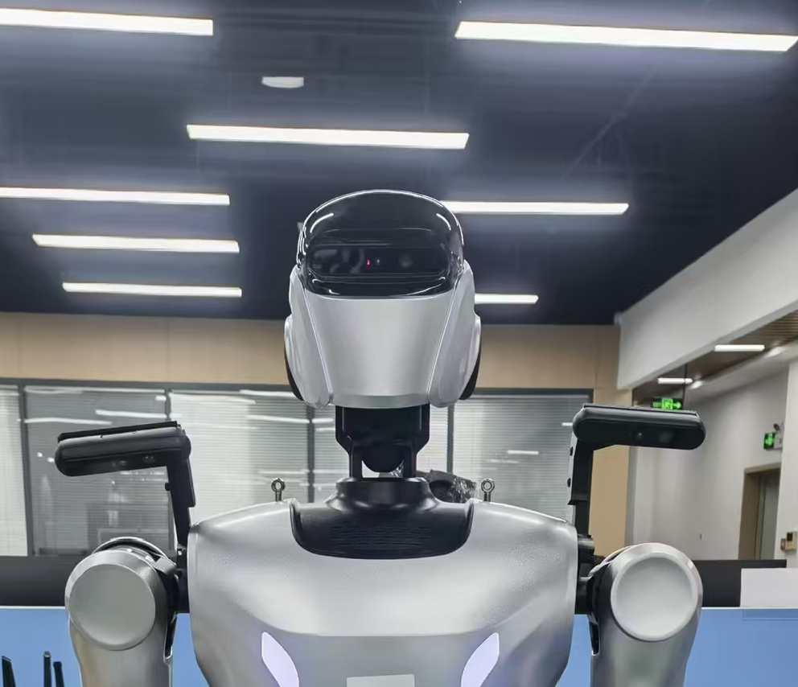
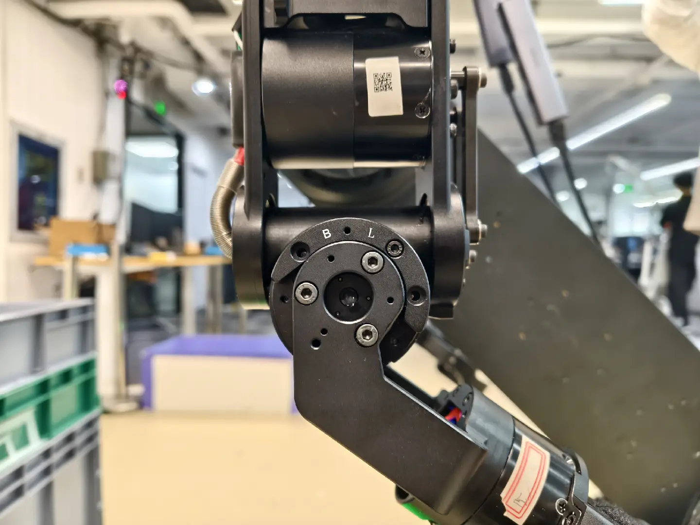
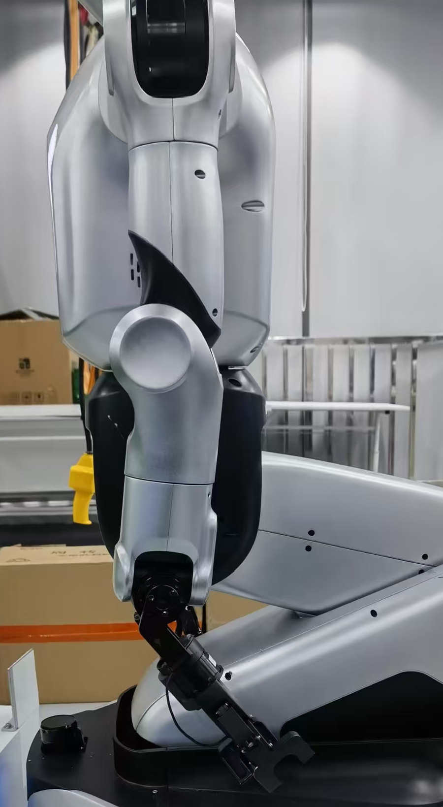
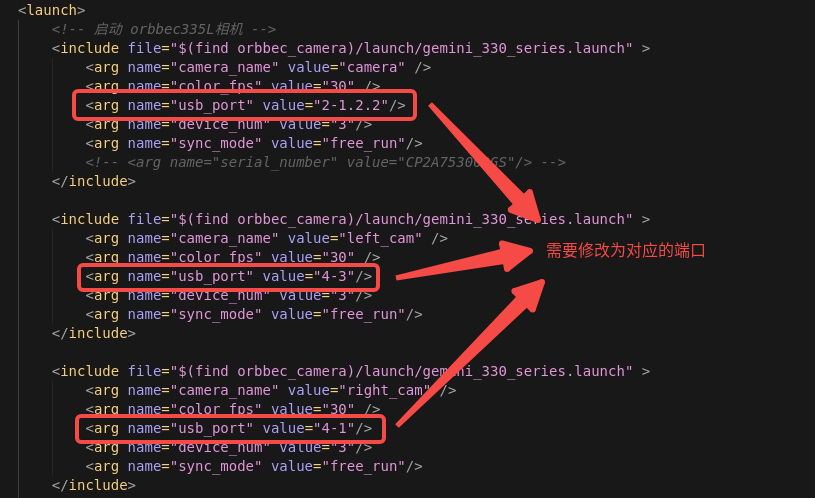
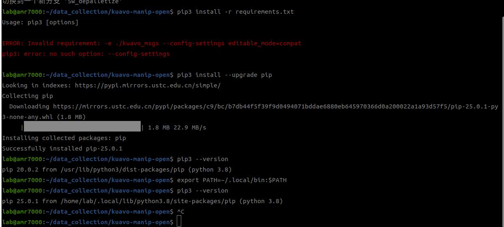
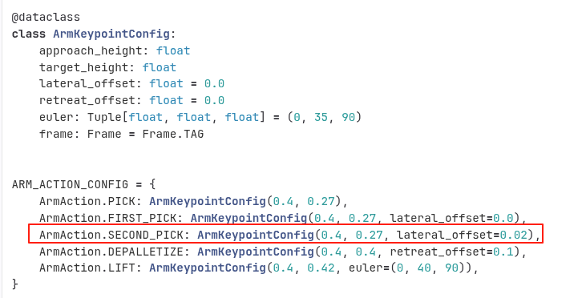
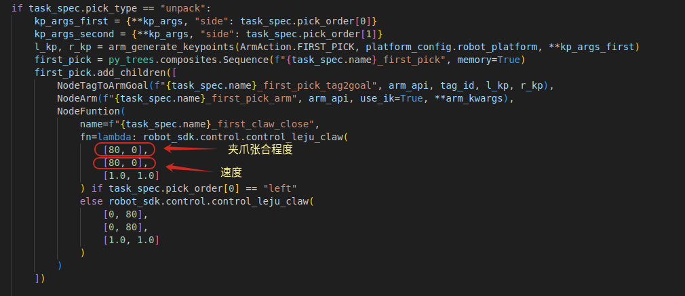
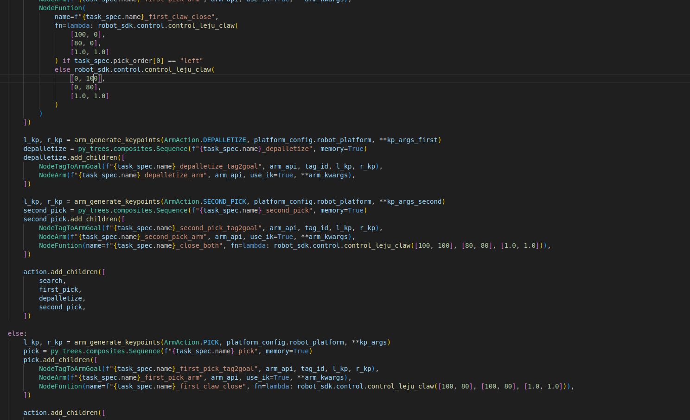

# 拆垛案例（数据采集）

## 说明

- 本案例用于拆垛任务的数据采集：通过 **rosbag** 录制机器人相关话题，例如相机图像、手臂位置轨迹等。

## 示例代码
- 仓库：`kuavo-manip-open`
- 分支：`5w_depalletize`
- 脚本路径：`collector/runner.py`
- 描述：该程序用于交互式选择任务并录制 rosbag 文件。

## 关键函数说明

- `start_recording(self)` / `stop_recording(self)`
  - 功能：开始/停止录制 ROS bag 文件。
  - 流程：启动录制进程 → 后台持续录制 → 终止录制 → 验证结果 → 反馈用户。
- `main()`
  - 功能：程序入口，显示主菜单并调用相应功能。

## 程序逻辑

### 主菜单

- 提供数据采集的不同选项（示例）：
  - 任务：左拆 / 右拆 / 搬箱
  - 箱子尺寸：`0.4` / `0.6`
  - 箱子颜色：绿色 / 灰色 / 黑色

### 录制 ROS bag 文件

```bash
cd kuavo-manip-open/collector/
python3 collector/runner.py -i -n your_task_name --platform wheeled --episodes 100
```

---

## 拆垛数据采集流程

### 1. 硬件需求

- 机器人需增加两个肩部相机（奥比中光 335L），安装位置如下图所示：



### 2. 机器人标零

- 手臂和头部限位标零
  1. 装上最后一个关节的限位环
  2. 使用限位标零
  3. 拆掉最后一个关节的限位环（**标完一定记得拆**）

```bash
cd kuavo-ros-opensource
sudo su 
source devel/setup.bash
roslaunch humanoid_controllers load_kuavo_real_wheel.launch cali:=true
# 根据提示（按 a ...）
# 选择自动限位标零
# 选择标手臂和头部的零点
# 结束后按 s 保存零点
```

- 手动标零
  1. 手动将手臂和头摆到零位
  2. 启动下位机，加上 `cali_arm` 参数

```bash
cd kuavo-ros-opensource
sudo su 
source devel/setup.bash
roslaunch humanoid_controllers load_kuavo_real_wheel.launch cali_arm:=true
# 需要同时标定腿部时可使用（谨慎操作）：
# roslaunch humanoid_controllers load_kuavo_real_wheel.launch cali_arm:=true cali_leg:=true
```



**机器人手臂零位示意图**

> [!NOTE]
> **使用 `cali_leg:=true` 前请确认安全：**
> - 按 `y` 后会全身失能，需要人工扶持
> - 建议将腰部折叠杆放到最低点
> - 上半身垂直地面后可略微后仰（约 8°），以获得更稳定姿态

> [!IMPORTANT]
>
> **头部标零验证（必做）**：按下面步骤验证 TF 与实测误差。

1. 启动 `wheel_bridge.py`：

```bash
python3 src/kuavo_wheel/scripts/wheel_bridge.py
```

2. 查看 TF（将 `tag_5` 按实际使用的 tag id 修改，例如使用 `tag_1` 则改为 `tag_1`）：

```bash
rosrun tf tf_echo odom tag_5
```

3. 用卷尺等方式测量实际值并对比：
   - `X/Y/Z` 每个方向误差建议不超过 **2 cm**（通常约 **1 cm**）
   - `odom` 距离地面上方约 **18 cm**，对比时需要减去该偏置


### 3. 相关代码下载及编译

1. 原子技能（拆垛，优先下载至下位机运行）
- 下载链接：[仓库下载链接](https://atomgit.com/lejurobot)
```bash
cd kuavo-manip-open
# 切换分支（重要）
git checkout 5w_depalletize
```

2. 上位机代码

```bash
git clone https://gitee.com/leju-robot/kuavo_ros_application.git

cd kuavo_ros_application
# 切换分支（重要）
git checkout zxh/depalletizing_task

# 先编译 apriltag_ros
catkin build apriltag_ros
# 再编译全部代码包
catkin build
```

3. 下位机代码

```bash
git clone https://gitee.com/leju-robot/kuavo-ros-opensource.git

cd kuavo-ros-opensource
# 切换分支（重要）
git checkout wzr/dev/wheel_arm

# 进入 root 模式
sudo su

# 设置机器人版本号
export ROBOT_VERSION=60
```

然后完成配置文件准备：

- 在 `kuavo-ros/src/kuavo-ros-opensource/src/demo/grab_box/cfg/` 下新建 `kuavo_v60/` 目录
- 将 `kuavo_v49/` 中的 `bt_config.yaml` 和对应的 `xml` 复制到 `kuavo_v60/` 中

最后编译：

```bash
catkin clean
catkin config -DCMAKE_ASM_COMPILER=/usr/bin/as -DCMAKE_BUILD_TYPE=Release
catkin build humanoid_controllers ar_control grab_box
```

### 4. 环境配置

1. 下位机：确保已设置 `ROBOT_VERSION=60`
2. 上位机：配置相机与 Apriltag

在 `kuavo_ros_application/src/dynamic_biped/launch/sensor_orbbec.launch` 中修改相机的 `usb_port`。可参考以下方法获取端口信息：

```bash
# 运行后可看到多个相机的 usb_port；再通过序列号区分每个相机对应的端口
cd kuavo_ros_application
source devel/setup.bash
rosrun orbbec_camera list_devices_node
```



检查 `kuavo_ros_application/src/ros_vision/detection_apriltag/apriltag_ros/config/tags.yaml`，确认 `standalone_tags` 内容与下面一致：

```yaml
standalone_tags:
  [
    {id: 0, size: 0.08, name: "tag_0"},
    {id: 1, size: 0.08, name: "tag_1"},
    {id: 2, size: 0.08, name: "tag_2"},
    {id: 3, size: 0.08, name: "tag_3"},
    {id: 4, size: 0.08, name: "tag_4"},
    {id: 5, size: 0.08, name: "tag_5"},
    {id: 6, size: 0.08, name: "tag_6"},
    {id: 7, size: 0.08, name: "tag_7"},
    {id: 8, size: 0.08, name: "tag_8"},
    {id: 9, size: 0.08, name: "tag_9"},
  ]
```

3. 需要录制的 topic（含最低 rate 要求）

- `/camera/color/image_raw`：rate ≥ 25
- `/right_cam/color/image_raw`：rate ≥ 25
- `/left_cam/color/image_raw`：rate ≥ 25
- `/sensors_data_raw`：rate ≥ 480
- `/kuavo_arm_traj`：rate ≥ 80
- `/leju_claw_state`：rate ≥ 480
- `/leju_claw_command`：rate ≥ 80

4. 原子技能依赖安装

```bash
cd kuavo-manip-open
pip3 install -r requirements.txt

# 如遇到：pip3 error: no such option: --config-settings
# 可以先升级 pip（建议 >= 21.x），或移除对应参数后重试
pip3 install --upgrade pip
export PATH=~/.local/bin:$PATH
```



### 5. 数采程序运行

#### 5.1 下位机

依次开启多个终端运行（建议按顺序启动）：

```bash
# 终端 1：启动下位机
cd kuavo-ros-opensource
sudo su
source devel/setup.bash
roslaunch humanoid_controllers load_kuavo_real_wheel.launch
```

```bash
# 终端 2：发布 odom -> base_link 的关节 TF
cd kuavo-ros-opensource
sudo su
source devel/setup.bash
python3 src/kuavo_wheel/scripts/wheel_bridge.py
```

```bash
# 终端 3：策略启动
cd kuavo-ros-opensource
sudo su
source devel/setup.bash
roslaunch ar_control robot_strategies.launch
```

```bash
# 终端 4：切换控制模式（按 1 回车切到 ArmOnly）
cd kuavo-ros-opensource
sudo su
source devel/setup.bash
python3 src/demo/wheel_arm_demo/wheel_control_mode_swither.py
```

#### 5.2 上位机

```bash
cd kuavo_ros_application
source devel/setup.bash
roslaunch dynamic_biped sensor_orbbec.launch
```

#### 5.3 机器人拆垛/数采脚本

```bash
cd kuavo-manip-open/collector/
# 可阅读 README.md 了解各参数含义
python3 collector/runner.py -i -n your_task_name --platform wheeled --episodes 100
```


## 常见微调

- 拆垛时由于 `offset` 不同，可能需要微调手臂放置高度。
- 相关代码位置：`kuavo_humanoid_sdk/kuavo_humanoid_sdk/kuavo_strategy_pytree/nodes/funcs.py`



示例：若右手偏高，可将对应数值调小；其他情况按实际偏差对应调整。


根据末端夹子上可能存在的小凸起，过度加紧可能导致夹爪弹开。可通过修改夹爪张合程度进行调整：






- 建议值：将数值改为 `100`（电流较大时不会松开）

## 轮臂使用注意事项

- **躯干抱闸判断**：启动下位机时可能出现躯干抱闸。注意轮臂发出的声音：
  - 听到一声“咔”：通常正常
  - 听到“咔咔”两声：可能躯干抱闸  
    此时建议尽快在终端 `Ctrl+C` 结束下位机程序，然后重新启动，直到轮臂回归正常零位。

- **切换控制模式**：下位机正常启动后需要切换轮臂控制模式。先运行脚本：
  - `kuavo-ros-opensource/src/demo/wheel_arm_demo/wheel_control_mode_swither.py`

终端将显示类似菜单（示例）：

```text
==================================================
    Mobile Manipulator MPC Control Mode Switcher
==================================================
  0: NoControl - no active control
  1: ArmOnly   - controlling arms only, base fixed
  2: BaseOnly  - controlling base only, arms fixed
  3: BaseArm   - controlling both base and arms
  4: ArmEeOnly - controlling arms Ee only
  q: Quit
==================================================
```

按 `1` 回车切换到 **ArmOnly** 模式以控制手臂和躯干；如需控制底盘，可切换到 `2` 或 `3` 模式。
