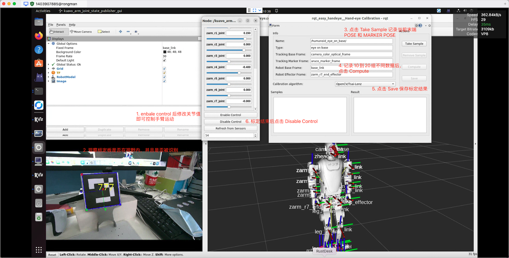

# 手腕相机抓取放置案例

- [手腕相机抓取放置案例](#手腕相机抓取放置案例)
  - [(一)案例介绍](#一案例介绍)
    - [案例功能](#案例功能)
    - [案例流程逻辑](#案例流程逻辑)
    - [二维码标签准备](#二维码标签准备)
  - [(二)手眼标定](#二手眼标定)
    - [功能包位置](#功能包位置)
    - [概述](#概述)
    - [编译](#编译)
    - [标定头部相机](#标定头部相机)
        - [准备标定板](#准备标定板)
        - [准备标定设置](#准备标定设置)
        - [启动标定过程](#启动标定过程)
    - [标定手腕相机](#标定手腕相机)
        - [准备标定设置](#准备标定设置-1)
        - [启动标定过程](#启动标定过程-1)
    - [标定程序操作说明](#标定程序操作说明)
  - [(三)评估标定结果](#三评估标定结果)
    - [概述](#概述-1)
    - [启动评估程序](#启动评估程序)
    - [评估程序操作说明](#评估程序操作说明)
    - [评估指标](#评估指标)
    - [影响评估的因素](#影响评估的因素)
  - [(四)抓取放置演示](#四抓取放置演示)
    - [功能包位置](#功能包位置-1)
    - [概述](#概述-2)
    - [编译](#编译-1)
    - [位姿偏移参数](#位姿偏移参数)
    - [二维码标签设置](#二维码标签设置)
    - [启动方法](#启动方法)


## (一)案例介绍

-  ⚠️⚠️⚠️ **注意： 该案例仅向max版用户开放**

### 案例功能
  - 机器人通过手眼标定,获得末端执行器（手）和视觉传感器（眼）之间的变换关系
  - 机器人获取手眼标定的结果,分别使用手腕相机和头部相机进行物品的抓取和放置

### 案例流程逻辑
  - 参考本文档[(二)手眼标定](#二手眼标定)的部分 进行手眼标定,获取标定结果
  - 参考本文档[(三)评估标定结果](#三评估标定结果)的部分 对标定结果进行评估
  - 参考本文档[(四)抓取放置演示](#四抓取放置演示)的部分 实现基于视觉引导的物体抓取和放置

### 二维码标签准备

二维码获取网址:[二维码下载网站](https://chev.me/arucogen/)

按如下配置打印四个标签

- Dictionary: Original ArUco
- Marker ID:777
  - Marker size, mm:50
  - Marker size, mm:100
- Marker ID:776
  - Marker size, mm:50
  - Marker size, mm:100

## (二)手眼标定

### 功能包位置

`/home/lab/kuavo-ros-opensource/src/hand_eye_calibration`

### 概述

`kuavo_hand_eye_calibration`包提供了为机器人系统执行手眼标定的工具和实用程序。该包设计用于KUAVO机器人臂，并集成了ArUco标记检测系统和easy_handeye标定框架。

手眼标定是确定机器人末端执行器（手）和视觉传感器（眼）之间变换关系的过程。这种标定对于需要机器人运动和视觉反馈精确协调的机器人操作任务至关重要。

### 编译

```bash
cd /home/lab/kuavo-ros-opensource
sudo su
catkin build kuavo_sdk motion_capture_ik
catkin build kuavo_hand_eye_calibration
```

### 标定头部相机

##### 准备标定板
  - gitee仓库模型文件位置: `https://gitee.com/leju-robot/kuavo-ros-opensource/tree/master/docs/models`
  - `标定板3D打印文件`位置: `~/kuavo-ros-opensource/docs/models/4pro手臂加二维码支架.STEP`

##### 准备标定设置
1. 按指定大小（默认为10厘米）打印正确ID的ArUco标记（默认ID为777）
2. 将标记安装标定板上，并且将标定板安装在机器人末端执行器上
3. 确保相机正确安装并连接


##### 启动标定过程

1. 下位机启动机器人, 使机器人站立

2. 在**上位机**启动相机节点，执行以下命令
```bash
roslaunch kuavo_camera cameras.launch has_left_wrist:=false has_right_wrist:=false 
```

3. 启动标定程序
```bash
export DISPLAY=:1.0 # 若是机器人实物接屏幕需要设置 DISPLAY=:0.0
source /home/lab/kuavo-ros-opensource/devel/setup.bash
roslaunch kuavo_hand_eye_calibration kuavo_hand_eye_calibration.launch handeye_cali_eye_on_hand:=false namespace_prefix:=head
```

### 标定手腕相机

##### 准备标定设置
1. 按指定大小（默认为10厘米）打印正确ID的ArUco标记（默认ID为777）
2. 将标记固定在机器人视野前方

##### 启动标定过程

1. 下位机启动机器人, 使机器人站立

2. 在**上位机**启动相机节点，执行以下命令
```bash
roslaunch kuavo_camera cameras.launch has_left_wrist:=true has_right_wrist:=true 
```

3. 启动标定程序
```bash
export DISPLAY=:1.0 # 若是机器人实物接屏幕需要设置 DISPLAY=:0.0
source /home/lab/kuavo-ros-opensource/devel/setup.bash
# 若标定右手 执行
roslaunch kuavo_hand_eye_calibration kuavo_hand_eye_calibration.launch handeye_cali_eye_on_hand:=true namespace_prefix:=right_wrist
# 若标定左手 执行
roslaunch kuavo_hand_eye_calibration kuavo_hand_eye_calibration.launch handeye_cali_eye_on_hand:=true namespace_prefix:=left_wrist
```

### 标定程序操作说明

使用 VNC 或者 TODESK 等远程桌面软件连接机器人

1. 启动标定过程后，easy_handeye图形界面将打开
2. 使用KUAVO机械臂关节状态发布器GUI移动机器人到不同姿态
3. 对于每个姿态，确保相机视图中能看到标记
4. 在easy_handeye GUI中点击"Take Sample"（获取样本）
5. 至少对10-15个不同的机器人姿态重复此过程，确保良好覆盖工作空间
6. 点击"Compute"（计算）以计算标定变换
7. 使用"Save"（保存）按钮保存标定结果



标定结果保存在：
```bash
# 头部相机:
~/.ros/easy_handeye/head_eye_on_base.yaml
# 手腕相机:
~/.ros/easy_handeye/right_wrist_eye_on_hand.yaml
# or ~/.ros/easy_handeye/left_wrist_eye_on_hand.yaml
```

## (三)评估标定结果

### 概述

在标定完成后，您可以通过评估程序来验证标定结果的准确性

标定板被刚性固定在机器人末端执行器（EE, End Effector），那么 标定板相对于末端执行器的变换（Transform）应该是固定的。换句话说，变换矩阵 $T_{\text{EE} \to \text{target}}$ 在理想情况下是恒定的。

评估程序会记录末端执行器与标定板之间的变换关系，并计算统计数据来评估标定结果的准确性。

### 启动评估程序

```bash
export DISPLAY=:1.0 # 若是机器人实物接屏幕需要设置 DISPLAY=:0.0
source /home/lab/kuavo-ros-opensource/devel/setup.bash

# 如果标定眼在头上
roslaunch kuavo_hand_eye_calibration kuavo_hand_eye_evaluate.launch namespace_prefix:=head handeye_cali_eye_on_hand:=false

# 如果标定眼在右手腕
roslaunch kuavo_hand_eye_calibration kuavo_hand_eye_evaluate.launch namespace_prefix:=right_wrist handeye_cali_eye_on_hand:=true

# 如果标定眼在左手腕
roslaunch kuavo_hand_eye_calibration kuavo_hand_eye_evaluate.launch namespace_prefix:=left_wrist handeye_cali_eye_on_hand:=true
```

### 评估程序操作说明

1. 通过 GUI 控制末端移动，使用 `R` 键记录多个不同的机器人姿态位置（建议5个以上不同的位置）
2. 在 GUI 界面 **DISABLE CONTROL** 后，按下 `S` 开始评估
3. 评估程序会自动多次重复移动机器人到每个记录的位置
4. 在每个位置，程序会多次测量标记与末端执行器之间的变换关系,计算并显示变换的统计数据（平均值、标准差、最大差异等）
5. 评估结果将保存在 `~/.ros/easy_handeye/calibration_evaluation/` 目录下
6. 按下 `Q` 退出程序

### 评估指标

- 如果 RMSE、标准差、最大误差都较大，可能是标定过程中存在问题，如机械臂精度不足、相机安装不稳定等。
- 如果误差在多个位置都存在系统性偏移，可能是手眼标定矩阵本身存在错误。
- 如果旋转误差特别大，可能需要检查相机安装的稳定性，或者标定数据的质量。
- 如果 RMSE 随着机械臂运动变大，可能是相机内参误差或者标定板固定不牢固。

### 影响评估的因素

1. 手眼标定的结果
2. 手臂运动精度
3. 相机安装牢固程度
4. 标定板安装牢固程度

## (四)抓取放置演示

**! ! ! 确保已完成完成相应相机的手眼标定 ! ! !**

### 功能包位置

`/home/lab/kuavo-ros-opensource/src/demo/pick_and_place`

以下使用`path($pick_and_place)`代替,实际需要替换成自己的路径

### 概述

`pick_and_place` 包提供了基于视觉引导的物体抓取和放置演示程序。该程序使用 ArUco 标记进行目标检测，支持头部相机和手腕相机的视觉反馈，并实现了精确的位置控制。

### 编译

```bash
cd /home/lab/kuavo-ros-opensource
sudo su
catkin build pick_and_place
```

### 位姿偏移参数

在 `path($pick_and_place)/config/markers.yaml` 中可以配置抓取和放置的位姿偏移

需要根据实际抓取情况的偏差进行设置：

```yaml
offsets:
  pick:
    grasp_x: 0.0    # 抓取位置X轴偏移
    grasp_y: 0.0    # 抓取位置Y轴偏移
    grasp_z: 0.05   # 抓取位置Z轴偏移
  place:
    place_x: 0.0    # 放置位置X轴偏移
    place_y: 0.0    # 放置位置Y轴偏移
    place_z: 0.05   # 放置位置Z轴偏移

orientation:
  pick:
    roll: 0.0       # 抓取姿态roll角度（度）
    pitch: 90.0     # 抓取姿态pitch角度（度）
    yaw: 0.0        # 抓取姿态yaw角度（度）
  place:
    roll: 0.0       # 放置姿态roll角度（度）
    pitch: 90.0     # 放置姿态pitch角度（度）
    yaw: 0.0        # 放置姿态yaw角度（度）
```

### 二维码标签设置

1. 准备 ArUco 标记
   - 物体标记：使用 ID 为 777 的 ArUco 标记 尺寸默认为 5cm × 5cm
   - 放置位置标记：使用 ID 为 776 的 ArUco 标记 尺寸默认为 10cm × 10cm
   - 请确保打印尺寸正确，建议使用硬质材料打印并固定

2. 配置 ArUco 标记参数
   - 修改 launch 文件中的参数 (`path($pick_and_place)/launch/pick_and_place.launch`):
     ```xml
     <arg name="marker_id1" default="777" />    <!-- 物体标记ID -->
     <arg name="marker_size1" default="0.05" />  <!-- 标记边长(米) -->
     <arg name="marker_id2" default="776" />    <!-- 放置位置标记ID -->
     <arg name="marker_size2" default="0.10" />  <!-- 标记边长(米) -->
     ```

   - 同时需要修改配置文件 (`path($pick_and_place)/config/markers.yaml`):
     ```yaml
     marker_object_frame:
       marker_id: 777          # 物体标记ID
       marker_size: 0.05       # 标记边长(米)

     marker_place_frame:
       marker_id: 776          # 放置位置标记ID
       marker_size: 0.10       # 标记边长(米)
     ```

### 启动方法

1. 下位机启动机器人，直到机器人站立

2. 上位机启动相机节点
```bash
cd <kuavo-ros-application>
source devel/setup.bash
roslaunch kuavo_camera cameras.launch
```
3. 参数说明

在 `pick_and_place.launch` 中可以配置以下参数：

- `has_head`：是否使用头部相机（默认：true）
- `control_hand_side`：控制使用哪只手臂（0：左手，1：右手）
- `wrist_side`：使用哪只手腕相机（left：左手，right：右手）
- `has_wrist`：是否使用手腕相机（默认：true）

4. 抓取演示程序 启动示例
```bash
export DISPLAY=:1.0 # 若是机器人实物接屏幕需要设置 DISPLAY=:0.0
cd /home/lab/kuavo-ros-opensource
source /home/lab/kuavo-ros-opensource/devel/setup.bash
# 若仅使用头部摄像头 用右手抓取
roslaunch pick_and_place pick_and_place.launch has_head:=true control_hand_side:=1 has_wrist:=false
# 若使用头部摄像头与右手腕摄像头 用右手抓取
roslaunch pick_and_place pick_and_place.launch has_head:=true control_hand_side:=1 wrist_side:=true
```
