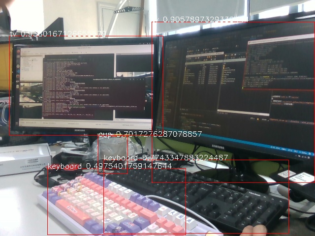
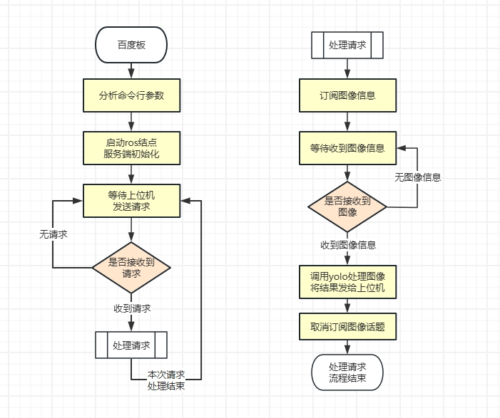

# 百度EdgeBoard接入机器人案例

- [百度EdgeBoard接入机器人案例](#百度edgeboard接入机器人案例)
  - [(一)案例介绍](#一案例介绍)
      - [声明](#声明)
      - [百度扩展板介绍](#百度扩展板介绍)
      - [案例功能](#案例功能)
      - [案例流程逻辑](#案例流程逻辑)
      - [案例核心程序说明](#案例核心程序说明)
      - [视频效果展示](#视频效果展示)
  - [(二)百度EdgeBoard环境配置](#二百度edgeboard环境配置)
    - [1.系统环境配置](#1系统环境配置)
      - [方式一: 系统热更新](#方式一-系统热更新)
      - [方式二: 重刷系统镜像](#方式二-重刷系统镜像)
    - [2.ROS开发环境配置](#2ros开发环境配置)
    - [3.ROS功能包获取](#3ros功能包获取)
      - [方式一: 克隆上位机代码仓库](#方式一-克隆上位机代码仓库)
      - [方式二: 只复制所需的功能包](#方式二-只复制所需的功能包)
  - [(三)百度EdgeBoard模型部署](#三百度edgeboard模型部署)
    - [部署yolo模型](#部署yolo模型)
      - [1：安装opencv及推理工具PPNC](#1安装opencv及推理工具ppnc)
      - [2：安装PaddlePaddle](#2安装paddlepaddle)
      - [3：安装依赖库。](#3安装依赖库)
      - [4：配置config.json文件](#4配置configjson文件)
      - [5：运行推理代码。](#5运行推理代码)
      - [6：查看推理结果。](#6查看推理结果)
    - [部署其他模型](#部署其他模型)
  - [(四)ROS通信系统配置](#四ros通信系统配置)
    - [概述](#概述)
    - [百度EdgeBoard](#百度edgeboard)
    - [机器人上位机](#机器人上位机)
    - [机器人下位机](#机器人下位机)
  - [(五)启动流程示例](#五启动流程示例)
    - [launch启动文件参数说明](#launch启动文件参数说明)
    - [运行示例](#运行示例)
  - [(六)运行效果](#六运行效果)


## (一)案例介绍

#### 声明

  -  ⚠️⚠️⚠️ **注意： 该案例为选配案例, 需要用户自行购买百度扩展板(DK-1A)**

#### 百度扩展板介绍
  - 开发板型号:
    EdgeBoard DK-1A
  
  - 开发板简介:
    EdgeBoard DK-1A是EdgeBoard系列的新一代开发板卡，除具有EdgeBoard系列特有的高性能AI推理性能，还提供包括40PIN等丰富的外设接口，方便用户进行产品的快速搭建及开发。

  - 详细介绍:
    https://ai.baidu.com/ai-doc/HWCE/Vlpxnzrck

#### 案例功能
  - 百度EdgeBoard（DK-1A）部署yolov3模型用于目标检测任务
  - 百度EdgeBoard启动ros服务器,监听请求
  - 机器上位机向百度EdgeBoard发送检测请求,并对返回结果进行语音播报

#### 案例流程逻辑
  - 参考本文档[(二)百度EdgeBoard环境配置](#二百度edgeboard环境配置)部分 配置百度EdgeBoard开发板环境
  - 参考本文档[(三)百度EdgeBoard模型部署](#三百度edgeboard模型部署)部分 部署yolo目标检测模型
  - 参考本文档[(四)ROS通信系统配置](#四ros通信系统配置)部分 配置机器人上下位机及百度EdgeBoard开发板间的通信
  - 参考本文档[(五)启动流程示例](#五启动流程示例)部分 启动本案例程序

#### 案例核心程序说明

* edgeboard_service/scripts/upper_client.py
  1. 初始化机器人上位机客户端,通过语音触发, 发送请求
  2. 收到处理结果,分析结果,调用科大讯飞模型进行语音播报

* edgeboard_service/yolov3-python/tools/edgeboard_server.py
  1. 初始化百度EdgeBoard服务端,监听请求
  2. 收到请求后,订阅图像话题,进行处理,将处理结果通过服务通信返回
  3. 上位机可以在`rqt_image_view`中订阅`/image_view/image_raw`话题,查看图像处理结果
  4. 取消订阅图像话题,恢复监听状态,等待下一次请求
  - 特点：仅在收到请求后进行一次图像处理,可以减少百度板的功耗,节省网络占用等

#### 视频效果展示

<iframe src="//player.bilibili.com/player.html?isOutside=true&aid=114623516778276&bvid=BV11S7Bz5EWu&cid=30313285458&p=1" width="320" height="640" scrolling="no" border="0" frameborder="no" framespacing="0" allowfullscreen="true"></iframe>

## (二)百度EdgeBoard环境配置

### 1.系统环境配置

#### 方式一: 系统热更新

参考文档:

https://ai.baidu.com/ai-doc/HWCE/3lpxo3ayu#%E7%B3%BB%E7%BB%9F%E7%83%AD%E6%9B%B4%E6%96%B0

#### 方式二: 重刷系统镜像

参考文档:

https://ai.baidu.com/ai-doc/HWCE/3lpxo3ayu#%E7%B3%BB%E7%BB%9F%E9%95%9C%E5%83%8F%E7%83%A7%E5%86%99

### 2.ROS开发环境配置

建议使用如下命令, 更换下载源并安装`ros1`的`noetic`版本

`wget http://fishros.com/install -O fishros && . fishros`

### 3.ROS功能包获取

#### 方式一: 克隆上位机代码仓库

终端执行如下命令:

`git clone https://gitee.com/leju-robot/kuavo_ros_application.git`

#### 方式二: 只复制所需的功能包

上位机代码仓库中, 本案例ROS功能包位置:

`~/~/kuavo_ros_application/src/edgeboard_service`

将`edgeboard_service`功能包复制到自己的ROS工作空间的`src`目录下即可

## (三)百度EdgeBoard模型部署

### 部署yolo模型

#### 1：安装opencv及推理工具PPNC
* 打开终端,执行以下命令安装opencv依赖库及EdgeBoard DK-1A推理工具PPNC。
```bash
sudo apt update
sudo apt install libopencv-dev -y
sudo apt install python3-opencv -y
sudo apt install ppnc-runtime -y
```
#### 2：安装PaddlePaddle
* 打开终端,执行以下命令安装PaddlePaddle。
```bash
mkdir Downloads
cd Downloads
wget https://bj.bcebos.com/pp-packages/whl/paddlepaddle-2.4.2-cp38-cp38-linux_aarch64.whl  
sudo pip install paddlepaddle-2.4.2-cp38-cp38-linux_aarch64.whl -i https://pypi.tuna.tsinghua.edu.cn/simple
```

#### 3：安装依赖库。
* 在终端输入以下命令,进入yolov3-python目录,并安装依赖库：
```bash
cd src/edgeboard_service/yolov3-python
sudo pip install -r requirements.txt -i https://pypi.tuna.tsinghua.edu.cn/simple
```

* 说明:
参数`-i https://pypi.tuna.tsinghua.edu.cn/simple`表示此次使用清华源进行安装。由于网络原因,直接使用默认源安装可能会出现报错。

* 同时yolov3的部署额外需要安装onnxruntime软件,终端输入：
```bash
sudo apt update
sudo apt install onnxruntime
```
#### 4：配置config.json文件
* 若无更改,可略过此步骤
* 将模型生产阶段产生的model.nb、model.json、model.po、model.onnx模型文件传输至板卡,置于`yolov3-python/model`文件夹
* model目录下修改config.json配置
```json
{
    "mode": "professional",
    "model_dir": "./model", 
    "model_file": "model"
}
```
* 参数说明:
```
    - mode: 固定为"professional"
    - model_dir：传输至板卡的模型文件(model.json、model.nb、model.onnx、model.po)的目录
    - model_file: 传输至板卡的四个模型文件的文件名,固定为model
```

#### 5：运行推理代码。
* 确保当前位于yolov3-python目录下：
```shell
    sudo python3 tools/infer_demo.py \
    --config ./model/config.json \
    --infer_yml ./model/infer_cfg.yml \
    --test_image ./test_images/000000025560.jpg \
    --visualize \
    --with_profile
```

* 命令行选项参数如下：
```
    - config: 上文建立的config.json的路径
    - infer_yml: 模型导出时生成的infer_cfg.yml文件
    - test_image: 测试图片路径
    - visualize: 是否可视化,若设置则会在该路径下生成vis.jpg渲染结果,默认不生成
    - with_profile: 是否推理耗时,若设置会输出包含前处理、模型推理和后处理的总耗时,默认不输出
```

#### 6：查看推理结果。 
* 在`src/edgeboard_service/yolov3-python`目录下可以看到新增一个名为vis.jpg的推理结果文件。

### 部署其他模型

* 若需要部署其他模型, 可以自行参考官方文档:\
https://ai.baidu.com/ai-doc/HWCE/Olq3rvysr#%E6%A8%A1%E5%9E%8B%E6%8E%A8%E7%90%86

## (四)ROS通信系统配置

### 概述

  - 在夸父机器人的ROS通信系统中, 都是以下位机为ROS主机, 上位机为ROS从机
  - 需先将机器人上位机, 机器人下位机, 百度EdgeBoard连接到同一局域网下, 确保三者能互相ping通
  - 为了不破坏机器人本身的通信结构, 请严格按如下步骤进行操作, 不要修改其余内容

### 百度EdgeBoard

  - 设置ROS_IP:
    - `export ROS_IP=<百度EdgeBoard局域网IP>`
  - 设置ROS_MASTER_URI:
    - `export ROS_IP=http://<机器人下位机局域网IP>:11311`

### 机器人上位机

  - 设置ROS_IP:
    - `export ROS_IP=<机器人上位机局域网IP>`

### 机器人下位机

  - 不需要进行任何修改

## (五)启动流程示例

⚠️ **注意: 该案例使用了科大讯飞的TTS模型。这个模型为收费模型,需要自行创建账号充值获取APPID, APISecret, API Key并将获取到的对应内容复制到程序对应位置,使用时机器人上位机要连接外网（能访问互联网）**

- 该案例所使用的语音合成模型为讯飞语音合成（TTS）模型
  - 访问:`https://console.xfyun.cn/services/tts`,获取APPID,APISecret,APIKey
  - 将程序`~/kuavo_ros_application/src/edgeboard_service/scripts/tts_ws_python3_demo.py/tts_ws_python3_demo.py`第139,140行的APPID,APISecret,APIKey替换成获取到的即可

### launch启动文件参数说明
- `mode`：选择启动哪一个文件
  - `mode:=server`:百度板启动服务,程序仅在收到上位机请求后会订阅话题,处理完图像并返回信息后,将会关闭话题订阅,以此降低能耗
  - `mode:=client`:上位机初始化客户端,发送一次请求,并收到返回信息后进行语音播报

- 仅设置`mode:=server`时可选:
  - `visualize`: 可视化选项,若设置为true,百度板会通过ros话题发布图像检测结果,且在指定路径下生成vis.jpg渲染结果
  - `with_profile`: 是否终端显示模型推理耗时等信息,默认不显示

### 运行示例

**机器人下位机:**
- 若机器人未站立且未配置过H12遥控器服务:
  - 在下位机新建一个终端
  - 运行`roscore`

**百度Edge Board：**
- 进入对应路径
  - `cd kuavo_ros_application`
- 启动服务端：
  - `roslaunch edgeboard_service edgeboard_service.launch mode:=server visualize:=true with_profile:=true`
- 注意：服务会保持持续开启状态,可多次处理请求

**机器人上位机:**
- 启动上位机程序
  - `cd kuavo_ros_application`
  - `sros1`
  - `source /opt/ros/noetic/setup.bash`
  - `source devel/setup.bash`
  - `roslaunch dynamic_biped load_robot_head.launch all_enable:=false`

- 启动服务请求
  - `cd kuavo_ros_application`
  - `source devel/setup.bash`
  - `roslaunch edgeboard_service edgeboard_service.launch mode:=client`
  - 语音输入`夸父夸父`,机器人回应`你好,我在.`
  - 语音输入`你看到了什么?`,机器人发送请求并语音播报结果

- 若想可视化图像处理结果:
  - 百度板:
    - 启动程序时参数设置`visualize:=true`
  - 机器人上位机:
    - 在新终端执行`rqt_image_view`
    - 订阅`/image_view/image_raw`话题以查看图像处理结果

## (六)运行效果

* 上位机客户端终端\


* 上位机语音输出内容
  - 我看到一个鼠标
  - 我看到两个键盘
  - 我看到一个手机

* 百度板服务端终端\


* 图片处理结果示例\


* 上位机终端可视化示例\


* 百度板服务端代码流程图\
