本文简单介绍如何使用乐聚的两个开源仓库 [LejuLab-Train](https://gitee.com/leju-robot/LejuLab-Train) 和 [LejuLab-Deploy](https://gitee.com/leju-robot/LejuLab-Deploy.git) ，对Roban和Kuavo机器人进行RL训练与部署。

# 效果展示
| tasks | Isaac Lab | Mujoco | sim2real |
|:---:|:---:|:---:|:---:|
| roban_dance | 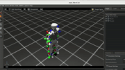 | 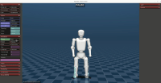 |  |
| kuavo_dance | 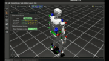 | 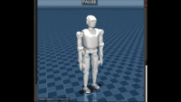 |  |
| roban_standup | 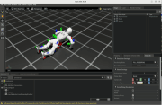 | 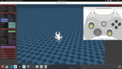 | 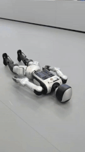 |
| roban_rl_walk | 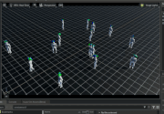 | 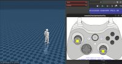 | 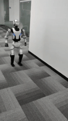 |
 
 
# 📚 目录
- [📝 案例描述](#-案例描述)
- [🧩 框架图示](#-框架图示)
- [🔧 硬件配置](#-硬件配置)
- [ 🤖 机器人强化学习训练全流程](#--机器人强化学习训练全流程)
  - [🎯 功能特性](#-功能特性)
  - [⚙️ 环境要求](#️-环境要求)
  - [🌿 环境配置](#-环境配置)
    - [1. 安装 Isaac Sim 4.5.0](#1-安装-isaac-sim-450)
    - [2. 配置 Isaac Lab 2.1.0](#2-配置-isaac-lab-210)
    - [3. 获取训练代码库](#3-获取训练代码库)
    - [4. 配置 IDE 类型检查（可选但推荐）](#4-配置-ide-类型检查可选但推荐)
  - [🧠 训练方法](#-训练方法)
    - [1. 数据预处理（CSV 转 NPZ）](#1-数据预处理csv-转-npz)
    - [2. 验证动作回放](#2-验证动作回放)
    - [3. 训练RL智能体](#3-训练rl智能体)
      - [3.1 轨迹模仿任务](#31-轨迹模仿任务)
        - [3.1.1 舞蹈任务](#311-舞蹈任务)
        - [3.1.2 倒地起身任务](#312-倒地起身任务)
      - [3.2 速度跟踪任务](#32-速度跟踪任务)
  - [🔍  验证模型](#--验证模型)
  - [⚙️  使用 VS Code Debug 配置（可选但推荐）](#️--使用-vs-code-debug-配置可选但推荐)
    - [1. 设置 Python 解释器](#1-设置-python-解释器)
    - [2. 在 VS Code 中打开项目](#2-在-vs-code-中打开项目)
    - [3. 进入运行和调试](#3-进入运行和调试)
    - [4. 从顶部下拉菜单中选择配置](#4-从顶部下拉菜单中选择配置)
    - [5. 自定义参数](#5-自定义参数)
  - [📋 可用任务](#-可用任务)
  - [🪛 配置](#-配置)
- [🔗 机器人模型部署全流程](#-机器人模型部署全流程)
  - [⬇️  代码拉取](#️--代码拉取)
  - [📦 依赖安装](#-依赖安装)
  - [⚡ 部署 iceoryx 共享内存（首次使用需执行）](#-部署-iceoryx-共享内存首次使用需执行)
  - [📄  修改配置文件](#--修改配置文件)
    - [1. 复制模型文件](#1-复制模型文件)
    - [2. 创建 yaml 配置文件](#2-创建-yaml-配置文件)
    - [3. 修改 controller\_manager.yaml](#3-修改-controller_manageryaml)
  - [✅ 编译](#-编译)
  - [▶️ 运行](#️-运行)
    - [1. Mujoco 仿真](#1-mujoco-仿真)
    - [2. 实物机器人](#2-实物机器人)
    - [3. 控制器配置](#3-控制器配置)

# 📝 案例描述
> **案例介绍如何使用乐聚的两个开源仓库 [LejuLab-Train](https://gitee.com/leju-robot/LejuLab-Train) 和 [LejuLab-Deploy](https://gitee.com/leju-robot/LejuLab-Deploy) ，对Roban和Kuavo机器人进行训练与部署。**
>
> **（1）LejuLab-Train 是一个基于 Isaac Lab 构建的综合性机器人仿真和强化学习框架。该框架为 Roban2 和 Kuavo 5 类人机器人提供了完整的开发工具链，包括动作数据处理、强化学习训练和仿真环境管理。其中包含两类任务：跟踪任务（动作模仿）和速度任务（运动控制）。**
>
> **（2）LejuLab-Deploy 是乐聚机器人开发的人形机器人强化学习部署开发平台，为 Roban 和 Kuavo 系列人形机器人提供仿真与实物控制支持，帮助研究人员和开发者快速部署和测试机器人控制策略。**

# 🧩 框架图示
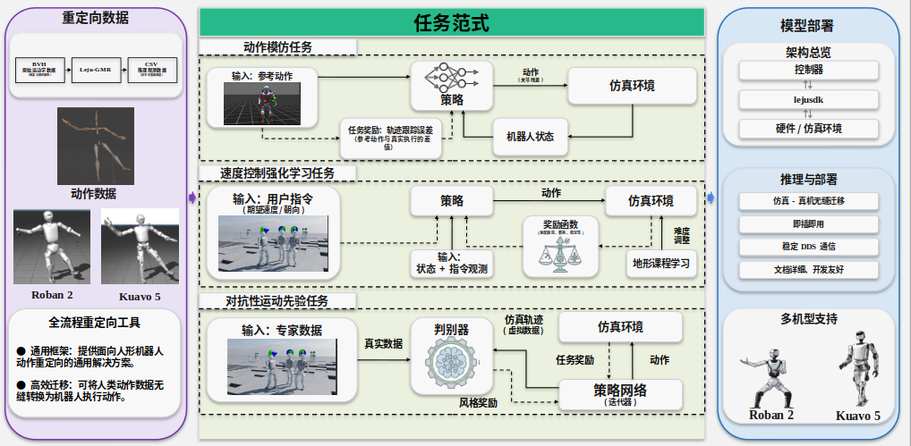

# 🔧 硬件配置
* **机器人平台 ：**&#x52;oban 2 & Kuavo 5
* **算力平台(推荐配置)：**
  * GPU：NVIDIA GeForce RTX 4090  24G
  * Intel i9-14900KF
  * 内存：64G
  * 存储：2TB

# &#x20;🤖 机器人强化学习训练全流程
## 🎯 功能特性
* **多机器人支持**：支持多种机器人模型（RobanS14、KuavoS54 等）
* **动作模仿**：训练 RL 智能体模仿来自 NPZ 文件的参考动作
* **数据转换**：在 CSV 和 NPZ 格式之间转换动作数据
* **动作回放**：在 Isaac Sim 中可视化和回放动作序列
* **RL 训练**：使用 RSL-RL 框架训练策略
* **灵活配置**：支持本地动作文件和 WandB 注册表

## ⚙️ 环境要求
* **操作系统：**&#x4C;inux (推荐 Ubuntu 20.04, x86\_64)
* **Python：**>= 3.10
* **NVIDIA驱动：**&#x4E0E; CUDA 版本兼容
* **CUDA：**&#x9700;要用于 GPU 加速（与Isaac Sim 版本兼容）
* **Isaac Sim：**&#x34;.5.0
* **Isaac Lab：**&#x32;.1.0
* **PyTorch：**&#x9700;要与 Isaac Lab 版本兼容

## 🌿 环境配置
### 1. 安装 Isaac Sim 4.5.0
需要先手动下载[NVIDIA Isaac Sim 4.5.0](https://docs.isaacsim.omniverse.nvidia.com/4.5.0/installation/download.html)，安装步骤请参考[官网](https://isaac-sim.github.io/IsaacLab/v2.1.0/source/setup/installation/binaries_installation.html)，此处提供的步骤仅供参考。

```bash
# 安装 Isaac Sim 参考步骤
mkdir ~/rl_project && mkdir ~/rl_project/isaacsim # 也可以不创建rl_project，其他文件夹存放工程，后续将rl_project替换为您自己的工程文件夹名称即可
cd ~/Downloads 
unzip "isaac-sim-standalone-4.5.0-linux-x86_64.zip" -d ~/rl_project/isaacsim
cd ~/rl_project/isaacsim
export ISAACSIM_PATH="${HOME}/rl_project/isaacsim"
export ISAACSIM_PYTHON_EXE="${ISAACSIM_PATH}/python.sh"
${ISAACSIM_PATH}/isaac-sim.sh
```
初次运行需要加载全部组件，请耐心等待，直到窗口弹出这一步完成，可以结束该进程。

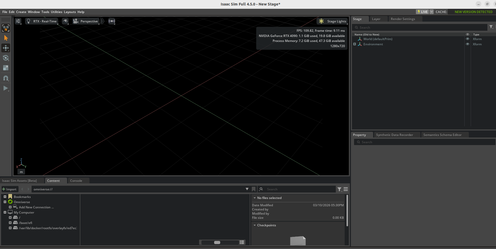

### 2. 配置 Isaac Lab 2.1.0
安装步骤请参考[官网](https://isaac-sim.github.io/IsaacLab/v2.1.0/source/setup/installation/binaries_installation.html)，此处提供的步骤仅供参考。
```bash
# 安装 Isaac Lab 参考步骤
cd ~/rl_project
git clone https://github.com/isaac-sim/IsaacLab.git
cd IsaacLab
git checkout v2.1.0
ln -s ../isaacsim _isaac_sim # 建立软链接 ln -s path_to_isaac_sim _isaac_sim
./isaaclab.sh --conda rl_project
conda activate rl_project
./isaaclab.sh --install
```
后续脚本需在 Isaac Lab 正确安装并激活的 Conda 环境中执行。

### 3. 获取训练代码库
```bash
pip install "numpy>=1.19.5,<2"
git clone https://gitee.com/leju-robot/LejuLab-Train.git
cd LejuLab-Train
cd source/leju_robot
pip install -e .                    # 以“可编辑模式”安装当前目录中的Python包
```

### 4. 配置 IDE 类型检查（可选但推荐）
为了在 VS Code/Pyright 中获得正确的 IDE 支持（自动补全、类型检查），您需要在 `pyproject.toml` 中配置 `extraPaths`：
```toml
[tool.pyright]
extraPaths = [
    "/path/to/IsaacLab2.1/source/isaaclab",
    "/path/to/IsaacLab2.1/source/isaaclab_assets",
    "/path/to/IsaacLab2.1/source/isaaclab_mimic",
    "/path/to/IsaacLab2.1/source/isaaclab_rl",
    "/path/to/IsaacLab2.1/source/isaaclab_tasks",
    "/path/to/IsaacLab2.1/IsaacLabExtensionRoban/source/amp-rsl-rl",
    "/path/to/IsaacLab2.1/IsaacLabExtensionRoban/source/ext_kuavo",
    "/path/to/isaac-sim-4.5/exts/omni.isaac.ml_archive/pip_prebundle",
]
```
&#x20;  **为什么需要这个配置？**
* 这些路径指向 Isaac Lab 的源代码包，它们不是作为标准 Python 包安装的；
* Pyright（VS Code 的类型检查器）需要这些路径来解析导入并提供自动补全；
* 没有此配置，您可能会在 IDE 中看到导入错误和缺少类型提示；
* **重要**：请更新路径以匹配您实际的 Isaac Lab 安装目录。
* **注意**：此配置仅影响 IDE 类型检查，**不会影响**运行时执行。实际的导入在运行时可以正常工作，因为 Isaac Lab 包在执行时被添加到 `PYTHONPATH` 中。

## 🧠 训练方法
### 1. 数据预处理（CSV 转 NPZ）
将动作捕捉数据经由GMR处理后，得到包含机器人base\_link全局位姿和关节角度数据的 csv 格式数据，本工程提供将 csv 格式数据通转换为数据信息更丰富的 npz 格式的脚本。若设备性能不够高，不建议去掉参数`--headless`，否则将严重卡顿，低配 GPU 或 CPU 运行时必须使用`--headless`。

```bash
python scripts/motion_tool/"csv_to_npz&deploycsv.py" \
    --input_file path/to/motion.csv \
    --input_fps 30 \
    --output_fps 50 \
    --robot robanS14 \
    --npz_output output/motion.npz \
    --csv_output output/motion_deploy.csv
    --headless
```
**参数说明：**
* `--input_file`: 输入 CSV 文件路径（必需）
* `--input_fps`: 输入动作的帧率（默认：30）
* `--output_fps`: 输出动作的帧率（默认：50）
* `--frame_range START END`: 可选，要提取的帧范围
* `--npz_output`: 输出 NPZ 文件路径
* `--csv_output`: 可选的部署 CSV 输出路径
* `--robot`: 机器人型号名称（默认：robanS14）
* `--headless`: 无 GUI 运行

### 2. 验证动作回放
在开始训练前，请先测试转换后的动作数据是否能正确回放。
```bash
python scripts/motion_tool/replay_npz.py \
    --motion_file path/to/motion.npz \
    --robot robanS14
```
**参数说明：**
* `--motion_file`: NPZ 动作文件路径
* `--robot`: 机器人型号名称（robanS14、kuavo S54）
### 3. 训练RL智能体
#### 3.1 轨迹模仿任务
##### 3.1.1 舞蹈任务
```bash
python scripts/reinforcement_learning/rsl_rl/train.py \
    --task Tracking-Dance-Flat-RobanS14 \
    --motion_file source/leju_robot/leju_robot/assets/motion_data/mimic/npz_data/robanS14_new_year_dance_50fps.npz \
    --num_envs 8192 \
    --headless \
    --max_iterations 25000
# roban的舞蹈任务包含 charleston、new_year 舞蹈。
# --motion_file source/leju_robot/leju_robot/assets/motion_data/mimic/npz_data/robanS14_charleston_dance_50fps.npz
```
```bash
python scripts/reinforcement_learning/rsl_rl/train.py \
    --task Tracking-Dance-Flat-KuavoS54 \
    --motion_file source/leju_robot/leju_robot/assets/motion_data/mimic/npz_data/kuavos54_dance_50fps.npz \
    --num_envs 8192 \
    --headless \
    --max_iterations 25000
# 该任务为 kuavo 5 的舞蹈任务。
```

##### 3.1.2 倒地起身任务
```bash
python scripts/reinforcement_learning/rsl_rl/train.py \
    --task Tracking-Standup-Flat-RobanS14 \
    --motion_file source/leju_robot/leju_robot/assets/motion_data/mimic/npz_data/robanS14_prone_50fps.npz \
    --num_envs 8192 \
    --headless \
    --max_iterations 25000
# roban的倒地起身任务包含 前倒地起身（prone）、后倒地起身（supine）。
# --motion_file source/leju_robot/leju_robot/assets/motion_data/mimic/npz_data/robanS14_supine_50fps.npz
```

#### 3.2 速度跟踪任务
```bash
# 该类任务包含 roban 和 kuavo 的PPO Flat Walk
# roban
python scripts/reinforcement_learning/rsl_rl/train.py \
    --task Velocity-Flat-RobanS14 \
    --num_envs 8192 \
    --headless \
    --max_iterations 25000 
# kuavo
python scripts/reinforcement_learning/rsl_rl/train.py \
    --task Velocity-Flat-KuavoS54-Play \
    --num_envs 8192 \
    --headless \
    --max_iterations 25000
```

**⚠️注意：**&#x6B64;处的 kuavo PPO Flat Walk 任务，请使用 [pip install](https://isaac-sim.github.io/IsaacLab/v2.1.0/source/setup/installation/pip_installation.html#) 方式安装 Isaac Sim和Isaac Lab。

**参数说明：**
* `--task`: 任务名称（如 `Tracking-Dance-Flat-RobanS14`、`Velocity-Flat-RobanS14`、`Velocity-Rough-AMP-Walk-RobanS14`），可以在`init.py`脚本中查看任务名称，示例目录如下`source/leju_robot/leju_robot/tasks/tracking/config/robanS14/dance/init.py`
* `--motion_file`: 参考动作 NPZ 文件路径（跟踪任务必需）
* `--num_envs`: 并行环境数量（请根据电脑配置合理选择）
* `--max_iterations`: 最大训练迭代次数
* `--headless`: 无 GUI 运行
* `--resume`: 从检查点恢复训练
* `--load_run`: 要加载的检查点的运行 ID
* `--checkpoint`: 检查点文件名（如 `model_25000.pt`）

## 🔍  验证模型
加载训练好的模型检查点，在 Isaac Lab 中进行演示，同时会生成可用于部署的`.onnx`文件。

```bash
python scripts/reinforcement_learning/rsl_rl/play.py \
    --task Tracking-Dance-Flat-RobanS14-Play \
    --motion_file assets/motion_data/your_task_type/npz_data/{motion_name}.npz \
    --load_run your_date_and_time \
    --checkpoint model_25000.pt \
    --num_envs 1
```

**参数说明：**
* `--task`: 任务名称，需带 `-Play` 后缀
* `--motion_file`: 参考动作文件的路径，格式为 .npz，用于指定机器人需要模仿的动作序列。
* `--load_run`: 训练日志中的运行 ID
* `--checkpoint`: 检查点文件名
* `--num_envs`: 环境数量（通常为 1 ，用于可视化）

## ⚙️  使用 VS Code Debug 配置（可选但推荐）
项目在 `.vscode/launch.json` 中包含了预配置的 VS Code 调试配置，可以一键启动训练和测试任务。

**使用方法：**
### 1. 设置 Python 解释器
* 按 `Ctrl+Shift+P`（Mac 上为 `Cmd+Shift+P`）打开命令面板
* 输入 "Python: Select Interpreter" 并选择
* 选择虚拟环境中的 Python 解释器（例如 `venv/bin/python` 或 `conda envs/your_env/bin/python`）
* 或者点击 VS Code 右下角的 Python 版本，选择正确的解释器
* **此步骤是必需的** - VS Code 必须使用安装了 Isaac Lab 和项目依赖的相同 Python 环境

### 2. 在 VS Code 中打开项目
* 在项目根目录打开 VS Code

### 3. 进入运行和调试
* 按 `F5` 或点击侧边栏的"运行和调试"图标
* 或使用菜单：`运行 > 启动调试`

### 4. 从顶部下拉菜单中选择配置
* **动作工具：**
  * `csv to npz`: 将 CSV 动作文件转换为 NPZ 格式
  * `pkl to npz`: 将 PKL 动作文件转换为 NPZ 格式
  * `replay npz`: 回放单个 NPZ 动作文件

* **训练配置：**
  * `train robanS14 walk`: 训练 RobanS14 速度控制任务
  * `train robanS14 dance`: 训练 RobanS14 舞蹈跟踪任务
  * `train robanS14 standup`: 训练 RobanS14 站立跟踪任务
  * `train kuavoS54 walk`: 训练 KuavoS54 速度控制任务
  * `train kuavoS54 dance`: 训练 KuavoS54 舞蹈跟踪任务

* **运行配置：**
  * `play robanS14 walk`: 测试训练好的 RobanS14 速度策略
  * `play robanS14 dance`: 测试训练好的 RobanS14 舞蹈策略
  * `play robanS14 standup`: 测试训练好的 RobanS14 站立策略
  * `play kuavoS54 walk`: 测试训练好的 KuavoS54 速度策略
  * `play kuavoS54 dance`: 测试训练好的 KuavoS54 舞蹈策略

### 5. 自定义参数
* 编辑 `.vscode/launch.json` 以修改参数
* 取消注释/注释行以启用/禁用选项
* 更新运行配置中的 `--load_run` 和 `--checkpoint`

**提示：**
* 在代码中设置断点进行调试
* 训练时使用 `--headless` 标志以无 GUI 模式运行（更快）
* 根据 GPU 内存调整 `--num_envs`
* 对于运行配置，使用您的训练运行 ID 更新 `--load_run`

**📋 可用任务**

**跟踪任务（动作模仿）：**
* `Tracking-Dance-Flat-RobanS14` / `Tracking-Dance-Flat-RobanS14-Play`
* `Tracking-Standup-Flat-RobanS14` / `Tracking-Standup-Flat-RobanS14-Play`
* `Tracking-Dance-Flat-KuavoS54` / `Tracking-Dance-Flat-KuavoS54-Play`

**速度任务（运动控制）：**
* `Velocity-Flat-RobanS14` / `Velocity-Flat-RobanS14-Play`
* `Velocity-Flat-KuavoS54` / `Velocity-Flat-KuavoS54-Play`

🪛 **配置**

机器人配置定义在：
* `source/leju_robot/leju_robot/tasks/{task_type}/config/{robot_name}/`

每个机器人都有自己的配置，包括：
* 环境设置
* MDP 组件（观测、奖励、事件等）
* 智能体配置
* 任务特定参数

# 🔗 机器人模型部署全流程
## ⬇️  代码拉取
```bash
git clone -b beta https://gitee.com/leju-robot/LejuLab-Deploy.git
```

## 📦 依赖安装
```bash
sudo apt-get update && sudo apt-get install -y \
    build-essential cmake \
    libacl1-dev libncurses5-dev
```

## ⚡ 部署 iceoryx 共享内存（首次使用需执行）
项目支持通过 iceoryx 共享内存加速进程间通信，建议部署以获得更优的实时性能。
```bash
./src/leju_launch/scripts/setup_cyclonedds_config.sh
```

部署脚本会完成以下操作：
* 安装 RouDi 守护进程为系统服务（开机自启）
* 部署 CycloneDDS 配置文件到 `/etc/cyclonedds/`
* 设置 `CYCLONEDDS_URI` 环境变量默认为 `cyclonedds_shm.xml`
> **注意：** 部署完成后需要**注销当前用户重新登录**或**重启系统**才能生效。

卸载：
```bash
./src/leju_launch/scripts/setup_cyclonedds_config.sh --remove
```

## 📄  修改配置文件
### 1. 复制模型文件
sim2sim 和 sim2real 模型部署流程相似。首先请将训练框架所用的 csv 文件和 onnx 文件复制到对应路径，此处以 robanS14 为例。
```bash
# csv 文件放置路径
LejuLab-Deploy/src/leju-controllers/leju-rl-controller/config/14/motion_data/
# onnx 模型文件放置路径
LejuLab-Deploy/src/leju-controllers/leju-rl-controller/config/14/policy
```

### 2. 创建 yaml 配置文件
`LejuLab-Deploy/src/leju-controllers/leju-rl-controller/config/<robot_version>/`路径下创建配置文件。例如创建`config_mimic_hpny_dance_sim.yaml` 配置文件。

修改配置文件中模型相关文件路径：
```yaml
# ONNX 策略模型路径（相对于此配置文件）
  policy_path: "policy/<onnx_name>.onnx"
    
# csv 运动数据路径 
  motion_data_path: "motion_data/<csv_name>.csv"
  
# Motion 数据配置
  motion:
    default_motion: "hpny_dance"        # 默认动作名称（启动时加载）
    motions:                                  # 命名的动作数据文件
      - name: "hpny_dance"                   # 动作名称
        file: "motion_data/<csv_name>.csv"
```
修改机器人关节参数，sim2sim 的参数修改为和训练模型输出的`params/env.yaml`一致。sim2real 参数需根据机器人实际调整。
```yaml
joint_default_pos:
        [0.,                                  # 腰部
         -0.412, -0.0437, -0.287, 0.5, -0.2, 0.,   # 左腿
#...
actuator_kp:
    [ 100.0,
#... 
actuator_kd:
    [ 100.0,
#...   
```

### 3. 修改 controller\_manager.yaml
修改控制器配置文件`LejuLab-Deploy/src/leju-controllers/leju-rl-controller/config/14/controller_manager.yaml`，修改config参数为刚刚创建的配置文件名。
```yaml
loop_dt: 0.001
default_controller: "hpny"
# 贺年舞蹈
  - name: "hpny_dance"
    type: "GenericRLController"
    config: "config_mimic_hpny_dance_sim.yaml"
    enabled: true
```

## ✅ 编译
```bash
catkin build
sudo su # 实物需要在root用户下运行
```

## ▶️ 运行
**通用说明**
* 选择机器人版本（数值定义参考 `lejusdk-utils/robot_version.hpp` 中 `RobotVersions` 常量）
  * `export ROBOT_VERSION=14`  ：Roban 2 代
  * `export ROBOT_VERSION=54`  ：Kuavo 5 代
* 手柄控制（通用）
  * `start`：从待机/准备状态切换到运行/站立状态
  * `back`：进入安全停机/关节松弛状态
  * 其他按键和摇杆：根据不同控制器（如 RL demo / mimic）实现行走、转向、舞蹈等功能，详见对应控制器文档

### 1. Mujoco 仿真
```bash
source devel/setup.bash

# Roban 2
export ROBOT_VERSION=14
roslaunch leju_launch load_mujoco_sim.launch
# Kuavo 5
export ROBOT_VERSION=54
roslaunch leju_launch load_mujoco_sim.launch
```
* 通过如上命令启动控制器、Mujoco 仿真器和手柄控制等功能包
* 根据终端提示，按下\`start\`按键
* 点击 Mujoco 仿真中的 \`Run\` 运行按钮
* tips: 如果开始时机器人倒地，可以先\`Pause\`和\`Reset\`仿真，然后再\`Run\`

### 2. 实物机器人
```bash
sudo su  # 需要 root 权限
source devel/setup.bash

# Roban 2
export ROBOT_VERSION=14
roslaunch leju_launch load_real.launch
# Kuavo 5
export ROBOT_VERSION=54
roslaunch leju_launch load_real.launch
```
* 对于实物机器人，也许您首先需要对电机进行零点标定，但这并不是必须的，因为机器人在出厂时已经标定完毕，如果存在如下情况您可手动执行标定工具重新进行标定:
  * 准备站立时，发现关节角度与零点位置位置存在偏差
  * 硬件维修更换电机
* 电机零点标定工具参考文档: \[电机零点标定工具]\(./docs/howto-use-motor-cali-tool.md)
* 拉起机器人背后的急停按钮，执行上述命令
* 将移位架升起，等待机器人进入膝盖微曲状态
* 降低移位架，让机器人脚掌刚刚好接触地面
* 使用手柄 `start` 按键使机器人站立
* 结束使用机器人请按手柄 `back` 按键

### 3. 控制器配置
控制器配置文件位于 `src/leju-controllers/leju-rl-controller/config/<ROBOT_VERSION>/controller_manager.yaml`，通过修改 `default_controller` 字段切换控制模式，待机器人站立之后，按下西瓜键即可播放舞蹈，播放结束后再次按西瓜键可重复播放。
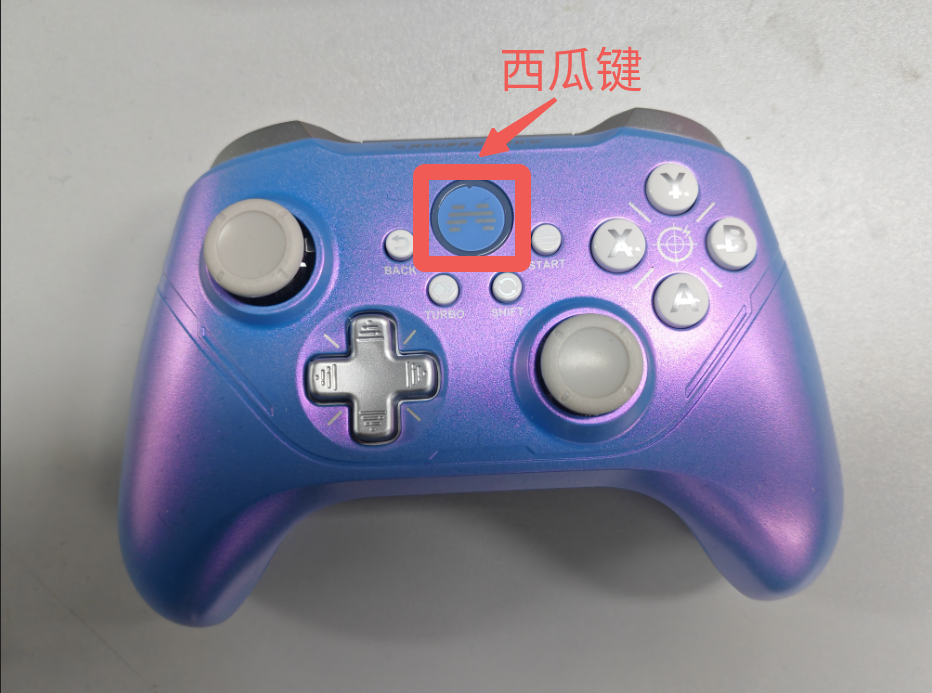
