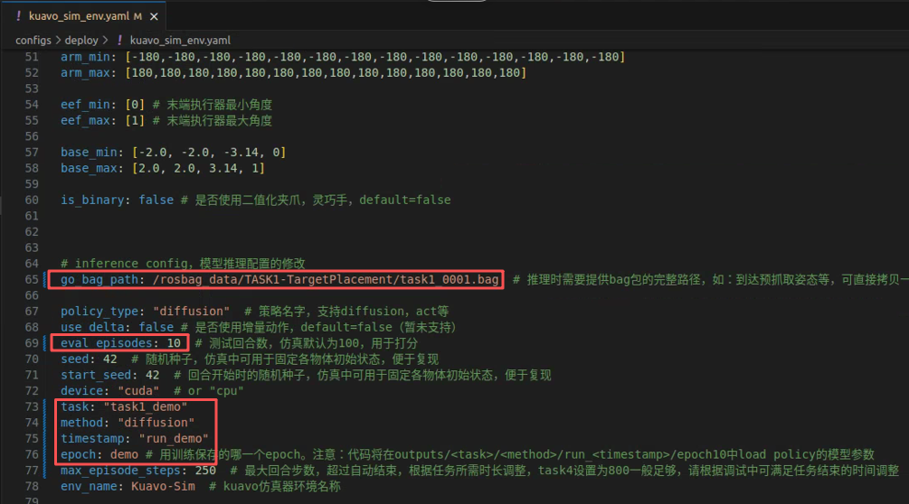

# ▶️ 仿真环境使用

- [▶️ 仿真环境使用](#️-仿真环境使用)
  - [案例概述](#案例概述)
  - [效果展示](#效果展示)
  - [使用教程](#使用教程)
    - [1. 代码仓库下载 + 环境配置](#1-代码仓库下载--环境配置)
      - [PS: kuavo\_data\_challenge（推理侧）环境配置缺少部分包，会影响模型推理脚本的启动。解决方法如下，按需安装](#ps-kuavo_data_challenge推理侧环境配置缺少部分包会影响模型推理脚本的启动解决方法如下按需安装)
    - [2. 仿真运行](#2-仿真运行)
      - [**(1) 启动仿真侧进程**](#1-启动仿真侧进程)
      - [**(2) 推理侧配置模型config配置文件**](#2-推理侧配置模型config配置文件)
      - [**(3) 启动推理侧进程**](#3-启动推理侧进程)
      - [**(4) 启动rqt\_image\_view查看摄像头话题**](#4-启动rqt_image_view查看摄像头话题)
    - [3. 模仿学习模型训练流程（可选）](#3-模仿学习模型训练流程可选)
  - [Huggingface数据集下载相关](#huggingface数据集下载相关)

## 案例概述

> 本案例介绍基于Kuavo_data_challenge仓库和对应的数据集实现乐聚夸父机器人双臂物体抓取放置任务。案例提供基于Diffusion Policy实现对乐聚夸父机器人双臂操作的仿真部署，介绍如何使用Kuavo_data_challenge仓库配置环境，模型训练和mujoco仿真部署。

## 效果展示

- 任务1：传送带抓取放置。评判抓取效果请参照[双臂抓取4个任务的评分标准](https://github.com/LejuRobotics/kuavo-ros-opensource/blob/b03c296612e6c64954b811a94306a4b23e2bb8c3/readme.md#%E4%BB%BB%E5%8A%A1%E8%AF%B4%E6%98%8E%E5%90%8E%E7%BB%AD%E5%8F%AF%E8%83%BD%E4%BC%9A%E6%9C%89%E4%BF%AE%E6%94%B9)


<iframe
  src="//player.bilibili.com/player.html?isOutside=true&bvid=BV1Qn2VBuE2G&p=1"
  scrolling="no"
  border="0"
  frameborder="no"
  framespacing="0"
  allowfullscreen="true">
</iframe>


## 使用教程

### 1. 代码仓库下载 + 环境配置

本案例需要配置两个代码仓库，并启动两个进程（仿真侧，推理侧）协同工作。推理侧用于模型推理（启动模仿学习模型），仿真测用于接受推理结果与环境交互并评分（启动mujuco仿真节点接受模型推理结果）。

- 推理侧：需要配置好python环境，推荐使用conda。可参考官方文档说明：[kuavo_data_challenage的Python环境配置](https://github.com/LejuRobotics/kuavo_data_challenge/blob/main/README_ZH.md#4-python-%E7%8E%AF%E5%A2%83%E9%85%8D%E7%BD%AE)
- 仿真侧：需要安装并启动对应的docker环境，以模拟下位机ros环境启动mujuco节点。可参考官方文档说明：[kuavo-ros-opensource环境配置](https://github.com/LejuRobotics/kuavo-ros-opensource/blob/opensource/kuavo-data-challenge/readme.md)。

同时还配套了视频教程：[安装训练指南 — 赛事手册 文档](https://kdc-doc.netlify.app/tianchi/cn/pages/installation)。

请按照说明文档配置对应环境，以下教程默认环境配置成功。


#### PS: kuavo_data_challenge（推理侧）环境配置缺少部分包，会影响模型推理脚本的启动。解决方法如下，按需安装

```bash
conda activate kdc

# 如果报错缺少kuavo_humanoid_sdk模块，降低版本，因为最新版本可能不兼容
pip install kuavo_humanoid_sdk==1.2.1
# 如果报错缺少deprecated，则安装。
pip install deprecated 
# 如果报错缺少apriltag_ros，则安装。若使用ROS Noetic + python3可以按照以下方式安装
sudo apt update
sudo apt install ros-noetic-apriltag-ros
```

### 2. 仿真运行

⚠️ **注意**: 本案例需要同时启动两个进程（两个终端），推理侧用于启动模仿学习模型，仿真侧用于启动mujuco节点。

#### **(1) 启动仿真侧进程**

在第一个终端中启动kuavo-ros-opensource仿真环境，运行脚本打开节点：

```bash
cd kuavo-ros-opensource
./docker/run_with_gpu.sh kuavo_opensource_mpc_wbc_img:0.6.1 # 启动容器
# 进入容器中kuavo_ws路径下
export ROBOT_VERSION=45
source devel/setup.zsh
# 启动仿真侧mujoco进程，选择任务1
python3 src/data_challenge_simulator/examples/deploy/deploy.py
```

#### **(2) 推理侧配置模型config配置文件**

- **第一步：下载demo模型**

本案例提供了一个简单的Diffusion Policy模仿学习模型，模型文件较大需要额外下载并放到指定路径中。模型文件下载：[模型文件1](https://kuavo.lejurobot.com/kuavo_research_editiion/%E4%B8%8A%E8%82%A2%E6%93%8D%E4%BD%9C/%E6%A1%88%E4%BE%8B%E8%B5%84%E6%96%99/model/config.json)，[模型文件2](https://kuavo.lejurobot.com/kuavo_research_editiion/%E4%B8%8A%E8%82%A2%E6%93%8D%E4%BD%9C/%E6%A1%88%E4%BE%8B%E8%B5%84%E6%96%99/model/model.safetensors)。两个模型文件构成一个模仿学习模型，放到`kuavo_data_challenge/outputs/train/task1_demo/diffusion/run_demo/epochdemo`中（需要自己新建文件夹）


- **第二步：下载轨迹数据**

推理时需要提供bag包的完整路径，如：到达预抓取姿态等，可直接拷贝一个训练用rosbags控制。案例提供一条数据：[任务1抓取任务rosbag数据下载](https://kuavo.lejurobot.com/kuavo_research_editiion/%E4%B8%8A%E8%82%A2%E6%93%8D%E4%BD%9C/%E6%A1%88%E4%BE%8B%E8%B5%84%E6%96%99/task1_0001.bag)。放到`kuavo_data_challenge/rosbag_data/TASK1-TargetPlacement`（需要自己新建文件夹）


- **第三步：修改仿真配置文件**

修改`kuavo_data_challenge/configs/deploy/kuavo_sim_env.yaml`中65-78行的模型接口，使用案例提供的demo模型和50条开源rosbags数据集。如下所示：


```yaml
go_bag_path: /rosbag_data/TASK1-TargetPlacement/task1_0001.bag  # 推理时需要提供bag包的完整路径。

policy_type: "diffusion"  # demo模型是diffusion policy
eval_episodes: 10  # 推理评估回合数用于打分
task: "task1_demo"  # 训练模型自定义的任务名称
method: "diffusion"
timestamp: "run_demo"
epoch: demo  
```




#### **(3) 启动推理侧进程**

新建一个终端，按照以下命令启动。

```bash
cd kuavo_data_challenge
conda activate kdc
# 方法1：直接运行自动测试脚本（推荐方式）
python kuavo_deploy/examples/scripts/script_auto_test.py --task auto_test --config configs/deploy/kuavo_sim_env.yaml

# 方法2：按照教程运行总脚本文件，再选择命令
bash kuavo_deploy/eval_kuavo.sh
# 运行后选择3，进一步选择示例，配置文件路径为configs/deploy/kuavo_sim_env.yaml（仿真），随后选择自己需要进行的脚本。具体命令功能查看kdc仓库文档说明。
```

方法2是启动交互式页面，功能较多，可以参照[kdc交互页面概览](https://github.com/LejuRobotics/kuavo_data_challenge/blob/main/kuavo_deploy/readme/inference.md)自行研究。本案例只针对启动仿真的功能，推荐使用方法1。

**PS：仿真侧下运行的程序如果报错，报错记录会存在`Kuavo_data_challenge/log`中，可以查阅自行debug。**


#### **(4) 启动rqt_image_view查看摄像头话题**

```bash
# roscore启动后新开终端输入, 选择对应摄像头话题可查看
rqt_image_view
```

| 仿真环境话题名                              | 功能说明                   |
| ------------------------------------------- | -------------------------- |
| /cam_h/color/image_raw/compressed           | 上方相机 RGB 彩色图像      |
| /cam_h/depth/image_raw/compressedDepth      | 上方相机深度图             |
| /cam_l/color/image_raw/compressed           | 左侧相机 RGB 彩色图像      |
| /cam_l/depth/image_rect_raw/compressedDepth | 左侧相机深度图             |
| /cam_r/color/image_raw/compressed           | 右侧相机 RGB 彩色图像      |
| /cam_r/depth/image_rect_raw/compressedDepth | 右侧相机深度图             |
| /gripper/command                            | 仿真 rq2f85 夹爪控制命令   |
| /gripper/state                              | 仿真 rq2f85 夹爪当前状态   |
| /joint_cmd                                  | 所有关节控制指令（含腿部） |
| /kuavo_arm_traj                             | 机器人机械臂轨迹控制       |
| /sensors_data_raw                           | 所有传感器原始数据         |


### 3. 模仿学习模型训练流程（可选）

`kuavo_data_challenage`仓库内文档有阐述详细的训练过程：[kdc模仿学习模型训练总流程](https://github.com/LejuRobotics/kuavo_data_challenge/blob/main/README_ZH.md#-使用方法)，可以自行训练模型。训练所需仿真数据可以在[乐聚天池比赛开源数据集](https://huggingface.co/datasets/LejuRobotics/kuavo_data_challenge)下载。


## Huggingface数据集下载相关

**方法1：使用hf工具下载**

参考[官方文档](https://huggingface.co/docs/hub/datasets-downloading)配置hf，使用`hf download xxx/xxx --repo_type dataset`下载。下载前要进行token的配置，参考[官方文档](https://huggingface.co/docs/huggingface_hub/en/guides/cli#download-a-specific-revision)自定义一个token。

如果要下载数据集里个别文件或文件夹，可以使用`--include`参数：

```bash
# 下载我们kdc的数据库中TASK1的数据，--include标注路径 *表示目录下所有文件，--local-dir表示存放位置
hf download LejuRobotics/kuavo_data_challenge \
  --repo-type dataset \
  --include "sim/TASK1-TargetPlacement/*" \
  --local-dir "替换成保存路径"
```

**方法2：使用hfd工具下载（推荐国内用户）**

国内下载huggingface模型或数据集用hf工具比较慢，依赖代理速度。推荐使用多线程工具专用多线程下载器 hfd，可以参考网络上的[文档教程](https://zhuanlan.zhihu.com/p/721778923)配置。下载完成`hfd.sh`脚本后，运行以下代码：

```bash
./hfd.sh LejuRobotics/kuavo_data_challenge  \
  --include "sim/TASK1-TargetPlacement/*"  \
  --local-dir "替换成保存路径" \
  --tool aria2c \
  --dataset

# 若提示没有权限下载需要token，参考上面hf的token配置，将自己的token导入到环境变量里
export HF_USERNAME="你的huggingface用户名"
export HF_TOKEN="你的token"
```