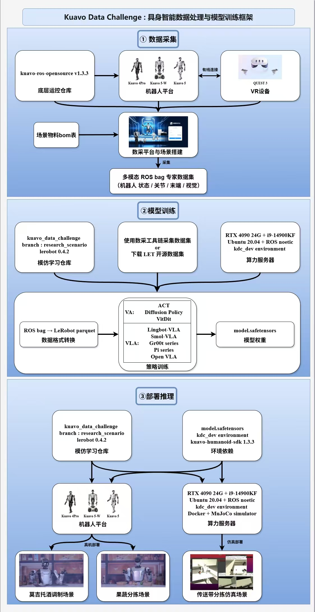
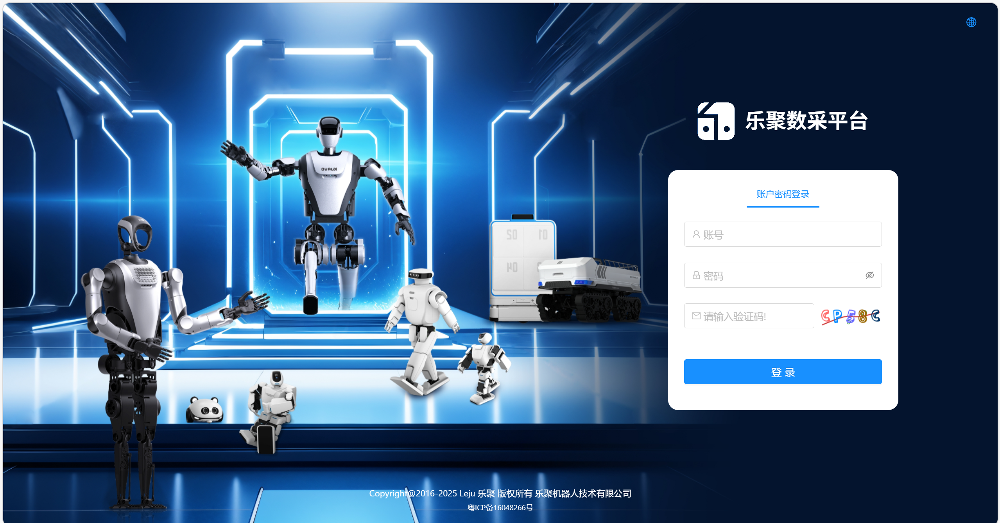
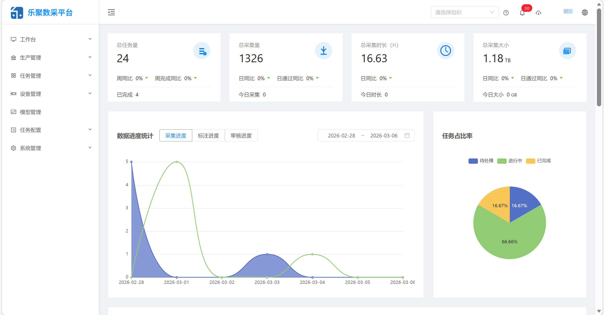
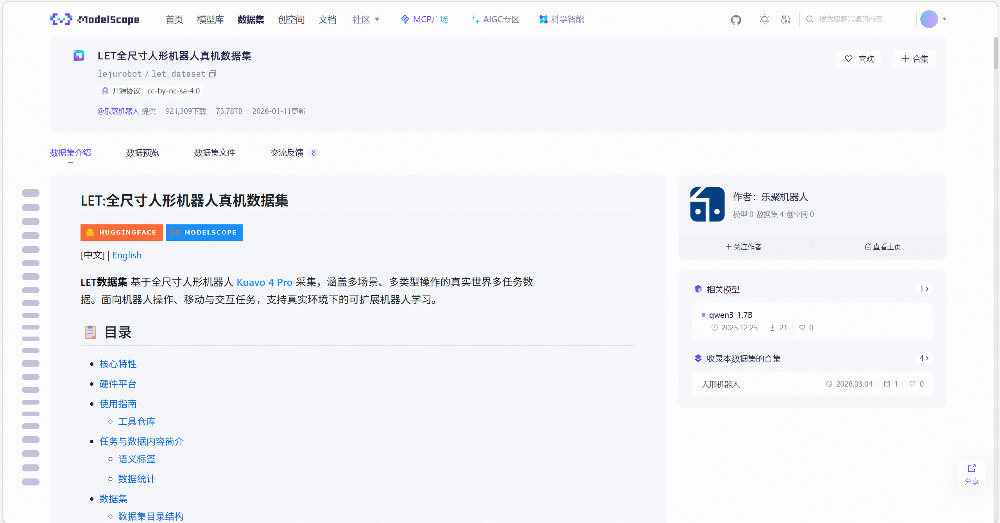

# 🧠 具身智能数据处理与模型训练框架

- [🧠 具身智能数据处理与模型训练框架](#-具身智能数据处理与模型训练框架)
  - [📝 案例概述](#-案例概述)
  - [🗺️ 框架图示](#️-框架图示)
  - [🔧 硬件配置](#-硬件配置)
  - [🧩 软件环境](#-软件环境)
- [🤖 机器人模仿学习全流程](#-机器人模仿学习全流程)
  - [🔧 环境配置](#-环境配置)
  - [📦 数据采集](#-数据采集)
  - [📨 kuavo\_data\_challenge 使用方法](#-kuavo_data_challenge-使用方法)
    - [🌐 LET开源数据集](#-let开源数据集)
    - [1. 数据格式转换](#1-数据格式转换)
    - [2. 模仿学习训练](#2-模仿学习训练)
    - [3. 真机模型部署](#3-真机模型部署)
    - [4. 推理效果调优](#4-推理效果调优)
    - [5. 说明](#5-说明)
- [🔬 科研场景实现](#-科研场景实现)
  - [🍸 莫吉托酒调制 -- 长程任务拆解能力](#-莫吉托酒调制----长程任务拆解能力)
  - [🍎 果蔬分拣 -- 模型泛化能力](#-果蔬分拣----模型泛化能力)
  - [⚠️ 注意事项](#️-注意事项)

## 📝 案例概述
>这是一个基于夸父机器人的具身智能数据处理与模型训练框架，支持 Kuavo 4pro & Kuavo 5 & Kuavo 5W

|**Kuavo 4pro 莫吉托酒调制**|**Kuavo 5 果蔬分拣**|
| -- | -- |
|  |  |

> **案例介绍如何使用 乐聚数采平台 采集数据，kuavo_data_challenge 仓库配置服务器、真机环境，数据格式转换，模型训练和 Kuavo 4pro & Kuavo 5 & Kuavo 5W 真机部署推理。并实现乐聚夸父机器人 Kuavo 4pro 莫吉托酒调制场景 和 Kuavo 5 果蔬分拣场景。**

## 🗺️ 框架图示



## 🔧 硬件配置
 - 机器人平台 ：Kuavo 4pro & Kuavo 5 & Kuavo 5W
 - VR设备 ：Quest3
 - 路由器 ：小米 BE6500 Pro WiFi7 * 1
 - USB转网口设备：绿巨能USB3.0千兆有线网卡 * 1
 - Type-C转网口设备：绿联Type-C转网口RJ45 * 1
 - 网线：2m 千兆网线 * 2
 - 算力服务器：
   - GPU：NVIDIA GeForce RTX 4090 D 24G
   - CPU：Intel i9-14900KF
   - 内存：64G
   - 存储：2TB

 **路由器、USB转网口设备、Type-C转网口设备 也可以使用其他能被正常识别的型号**

 ## 🧩 软件环境
 - 算力服务器：Ubuntu 20.04 + ROS noetic + NVIDIA CUDA Toolkit
 - 下位机 `kuavo-ros-opensource` 仓库版本：tag 1.3.3
 - 模仿学习 `kuavo_data_challenge` 仓库分支: research_scenario
 - `kuavo-humanoid-sdk` SDK 版本: 1.3.3
 - `lerobot` version: 0.4.2


# 🤖 机器人模仿学习全流程

## 🔧 环境配置

🤖 [KUAVO-DATA-CHALLENGE](https://github.com/LejuRobotics/kuavo_data_challenge/tree/research_scenario) 是一个完整的机器人模仿学习框架，基于 [LeRobot](https://github.com/huggingface/lerobot) 构建，专为 Kuavo 人形机器人设计。该框架提供了从数据转换、模型训练到真机部署的完整工具链。

更多使用说明、数据集规范与策略介绍，可前往📖 [**Kuavo Data Challenge 官方文档站**](https://www.kdc.docs.lejurobot.com/)

### 🎯 核心特性：
- 🔄 **数据转换**: 支持 ROS bag 到 LeRobot parquet 格式的转换
- 🚀 **一键训练**: IL 模型训练框架 (diffusion policy, ACT)
- 🎮 **实时部署**: 支持训练模型在实际机器人上的实时推理和控制

### ♻️ 环境要求
- **系统**：推荐 Ubuntu 20.04（22.04 / 24.04 建议使用 Docker 容器运行）  
- **Python**：推荐 Python 3.10  
- **ROS**：ROS Noetic + Kuavo Robot ROS 补丁（支持 Docker 内安装）  
- **依赖**：Docker、NVIDIA CUDA Toolkit（如需 GPU 加速）

🔔 `/`目录下存储空间有限，建议一下操作在`/media/data`目录下进行

### 📦 安装指南

#### 1. 操作系统环境配置
推荐 **Ubuntu 20.04 + ROS noetic + NVIDIA CUDA Toolkit + Docker**。  
<details>
<summary>详细步骤（展开查看），仅供参考</summary>

##### a. 安装操作系统与 NVIDIA 驱动
```bash
sudo apt update
sudo apt upgrade -y
ubuntu-drivers devices
# 测试通过版本为 535，可尝试更新版本（请勿使用 server 分支）
sudo apt install nvidia-driver-535
# 重启计算机
sudo reboot
# 验证驱动
nvidia-smi
```

##### b. 安装 NVIDIA Container Toolkit

```bash
sudo apt install curl
curl -fsSL https://nvidia.github.io/libnvidia-container/gpgkey | sudo gpg --dearmor -o /usr/share/keyrings/nvidia-container-toolkit-keyring.gpg
curl -s -L https://nvidia.github.io/libnvidia-container/stable/deb/nvidia-container-toolkit.list | sed 's#deb https://#deb [signed-by=/usr/share/keyrings/nvidia-container-toolkit-keyring.gpg] https://#g' | sudo tee /etc/apt/sources.list.d/nvidia-container-toolkit.list
sudo apt-get update
export NVIDIA_CONTAINER_TOOLKIT_VERSION=1.17.8-1
sudo apt-get install -y nvidia-container-toolkit=${NVIDIA_CONTAINER_TOOLKIT_VERSION} nvidia-container-toolkit-base=${NVIDIA_CONTAINER_TOOLKIT_VERSION} libnvidia-container-tools=${NVIDIA_CONTAINER_TOOLKIT_VERSION} libnvidia-container1=${NVIDIA_CONTAINER_TOOLKIT_VERSION}
```

##### c. 安装 Docker

```bash
sudo apt update
sudo apt install git
sudo apt install docker.io
# 配置 NVIDIA Runtime
nvidia-ctk
sudo nvidia-ctk runtime configure --runtime=docker
sudo systemctl restart docker
sudo docker info | grep -i runtime
# 输出中应包含 "nvidia" Runtime
```

</details>

---

#### 2. ROS 环境配置

由于真机kuavo机器人是ubuntu20.04 + ROS Noetic（非docker），因此推荐直接安装 ROS Noetic，若因ubuntu版本较高无法安装 ROS Noetic，可使用docker。

<details>
<summary>a. 系统直接安装 ROS Noetic（<b>推荐</b>）（展开查看），仅供参考</summary>

* 官方指南：[ROS Noetic 安装](http://wiki.ros.org/noetic/Installation/Ubuntu)
* 国内加速源推荐：[小鱼ROS](https://fishros.org.cn/forum/topic/20/)

安装示例：

```bash
wget http://fishros.com/install -O fishros && . fishros
# 菜单选择：5 配置系统源 → 2 更换源并清理第三方源 → 1 添加ROS源
wget http://fishros.com/install -O fishros && . fishros
# 菜单选择：1 一键安装 → 2 不更换源安装 → 选择 ROS1 Noetic 桌面版
```

测试 ROS 安装：

```bash
roscore  # 新建终端
rosrun turtlesim turtlesim_node  # 新建终端
rosrun turtlesim turtle_teleop_key  # 新建终端
```

</details>

<details>
<summary>b. 使用 Docker 安装 ROS Noetic（展开查看），仅供参考</summary>

- 首先最好是换个源：

```bash
sudo vim /etc/docker/daemon.json
```

- 然后在这个json文件中写入一些镜像源：

```json
{
    "registry-mirrors": [
        "https://docker.m.daocloud.io",
        "https://docker.imgdb.de",
        "https://docker-0.unsee.tech",
        "https://docker.hlmirror.com",
        "https://docker.1ms.run",
        "https://func.ink",
        "https://lispy.org",
        "https://docker.xiaogenban1993.com"
    ]
}
```

- 然后保存文件并退出后，重启docker服务：

```shell
sudo systemctl daemon-reload && sudo systemctl restart docker
```

- 现在开始创建镜像，首先建立Dockerfile：
```shell
mkdir /path/to/save/docker/ros/image
cd /path/to/save/docker/ros/image
vim Dockerfile
```
然后在Dockerfile文件中写入如下内容：

```Dockerfile
FROM ubuntu:20.04

ENV DEBIAN_FRONTEND=noninteractive

RUN sed -i 's|http://archive.ubuntu.com/ubuntu/|http://mirrors.tuna.tsinghua.edu.cn/ubuntu/|g' /etc/apt/sources.list && \
    sed -i 's|http://security.ubuntu.com/ubuntu/|http://mirrors.tuna.tsinghua.edu.cn/ubuntu/|g' /etc/apt/sources.list

RUN apt-get update && apt-get install -y locales tzdata gnupg lsb-release
RUN locale-gen en_US.UTF-8
ENV LANG=en_US.UTF-8 LANGUAGE=en_US:en LC_ALL=en_US.UTF-8

# 设置ROS的debian源
RUN sh -c 'echo "deb http://packages.ros.org/ros/ubuntu $(lsb_release -sc) main" > /etc/apt/sources.list.d/ros-latest.list'

# 添加ROS的Keys
RUN apt-key adv --keyserver 'hkp://keyserver.ubuntu.com:80' --recv-key C1CF6E31E6BADE8868B172B4F42ED6FBAB17C654

# 安装ROS Noetic
# 设置键盘布局为 Chinese
RUN apt-get update && \
    apt-get install -y keyboard-configuration apt-utils && \
    echo 'keyboard-configuration keyboard-configuration/layoutcode string cn' | debconf-set-selections && \
    echo 'keyboard-configuration keyboard-configuration/modelcode string pc105' | debconf-set-selections && \
    echo 'keyboard-configuration keyboard-configuration/variant string ' | debconf-set-selections && \
    apt-get install -y ros-noetic-desktop-full && \
    apt-get install -y python3-rosdep python3-rosinstall python3-rosinstall-generator python3-wstool build-essential && \
    rm -rf /var/lib/apt/lists/*

# 初始化rosdep
RUN rosdep init
```
写入完毕后保存退出。

- 执行ubuntu20.04 + ROS Noetic镜像的构建：

```shell
sudo docker build -t ubt2004_ros_noetic .
```

- 构建完成后进入镜像即可，初次启动容器加载镜像：

```shell
sudo docker run -it --name ubuntu_ros_container ubt2004_ros_noetic /bin/bash
# 或 GPU 启动（推荐）
sudo docker run -it --gpus all --runtime nvidia --name ubuntu_ros_container ubt2004_ros_noetic /bin/bash
# 可选，挂载本地目录路径等
# sudo docker run -it --gpus all --runtime nvidia --name ubuntu_ros_container -v /path/to/your/code:/root/code ubt2004_ros_noetic /bin/bash
```

之后每次加载：
```shell
sudo docker start ubuntu_ros_container
sudo docker exec -it ubuntu_ros_container /bin/bash
```

- 或者：自定义启动加载文件，launch_docker.sh, 注意，由于涉及挂载python环境，请在第4步完成后再使用这种sh方式！
```shell
#!/bin/bash

# Paths
CODE_DIR=/path/to/code
PYTHON_DIR=/path/to/python_env
DATA_DIR=/path/to/data
IMAGE=ros:noetic
CONTAINER=ros_noetic

# Create container if it doesn't exist
if ! docker ps | grep -q "$CONTAINER"; then
    echo "🛠  Creating container $CONTAINER ..."
    docker create --name=$CONTAINER $IMAGE
fi

# Run container with mounts and environment
echo "🚀 Starting container $CONTAINER ..."
docker run \
    -i -t \
    -v $CODE_DIR:/code \
    -v $DATA_DIR:/data \
    -v $PYTHON_DIR:$PYTHON_DIR \
    --env PATH=/path/to/python_venv/kdc_dev/bin:/usr/local/sbin:/usr/local/bin:/usr/sbin:/usr/bin:/sbin:/bin \
    $CONTAINER /bin/bash
```


- 进入镜像后，初始化ros环境变量，然后启动roscore

```shell
source /opt/ros/noetic/setup.bash
roscore
```

无误的话，ubuntu20.04 + ros noetic的docker配置方式就结束了。

</details>

⚠️ 警告：如果上述中ROS使用的是docker环境，下方后续的代码可能需要在容器里面运行，如有问题，请核对当前是否在容器内！

---
#### 3. 克隆代码
```bash
# SSH
git clone git@github.com:LejuRobotics/kuavo_data_challenge.git
# 或者
# HTTPS
git clone https://github.com/LejuRobotics/kuavo_data_challenge.git

cd kuavo-data-challenge
# 切换分支
git checkout research_scenario

# 更新third_party下的lerobot子模块：
git submodule init
git submodule update --recursive --progress
cd third_party/lerobot/
git reset --hard 0f551df8f4bad4c504e395ea3df74fc5f714016f # 切换 0.4.2 commit

```
#### 4. Python 环境配置

<details>
<summary>使用 conda （推荐）或 python venv 创建虚拟环境 kdc_dev（python 3.10）：</summary>

- ananconda配置：

```bash
conda create -n kdc_dev python=3.10
conda activate kdc_dev
```

- 或， 源码安装Python3.10.18，再用venv创建虚拟环境

⚠️ 注意：```ppa:deadsnakes``` 在2025年6月后不能在ubuntu20.04上提供了，下述安装方式不一定成功：

```bash
sudo apt update
sudo apt install -y software-properties-common
sudo add-apt-repository ppa:deadsnakes/ppa
sudo apt update
sudo apt install -y python3.10 python3.10-venv python3.10-dev
```
可以尝试下，不行请使用源码安装：
```bash
sudo apt update
sudo apt install -y build-essential libssl-dev zlib1g-dev libncurses5-dev libncursesw5-devlibreadline-dev libsqlite3-dev libgdbm-dev libdb5.3-dev libbz2-dev libexpat1-dev liblzma-dev tk-dev libffi-dev uuid-dev wget

wget https://www.python.org/ftp/python/3.10.18/Python-3.10.18.tgz
tar -xzf Python-3.10.18.tgz
cd Python-3.10.18
./configure --prefix=$HOME/python3.10 --enable-optimizations
make -j$(nproc)
sudo make install
```
然后创建venv环境：

```bash
python3.10 -m venv kdc_dev
source kdc_dev/bin/activate
```

查看和确保安装正确：
```shell
python  # 查看python版本，看到确认输出为3.10.xxx（通常是3.10.18）
# 输出示例：
# Python 3.10.18 (main, Jun  5 2025, 13:14:17) [GCC 11.2.0] on linux
# Type "help", "copyright", "credits" or "license" for more information.
# >>> 

pip --version # 查看pip对应的版本，看到确认输出为3.10的pip
# 输出示例：pip 25.1 from /path/to/your/env/python3.10/site-packages/pip (python 3.10)
```
#### 5. 安装依赖：

```bash
source /opt/ros/noetic/setup.bash  # 进入python环境先source好ros自带的python库，建议这行写入~/.bashrc

pip config set global.index-url https://pypi.tuna.tsinghua.edu.cn/simple  # 建议首先换源，能加快下载安装速度

# 算力服务器
pip install -r requirements_ilcode.txt   # 无需ROS Noetic，但只能使用kuavo_train模仿学习训练代码，kuavo_data（数转）及 kuavo_deploy（部署代码）均依赖ROS
# 或
pip install -r requirements_total.txt    # 需确保 ROS Noetic 已安装 (推荐)

# 机器人上位机 AGX orin
pip install -r requirements_total_agxorin.txt    # 需确保 ROS Noetic 已安装 (推荐)
```

安装完打印下检查下lerobot版本：2025年11月20日为0.4.2版本
```bash
pip show lerobot
```

若不是 0.4.2：
```bash
cd third_party/lerobot
git fetch
git reset --hard 0f551df8f4bad4c504e395ea3df74fc5f714016f
cd ../../
```

重新pip install -r requirement即可。

如果pip安装完毕但运行训练代码时报ffmpeg或torchcodec的错：

```bash
conda install ffmpeg==6.1.1

# 或

# pip uninstall torchcodec
```
</details>

---
<a id="data-collect"></a>
## 📦 数据采集 

 - ⚠️⚠️⚠️ **注意： 下位机代码使用标签为`1.3.3`的 `kuavo-ros-opensource`** [kuavo-ros-opensource · Gitee](https://gitee.com/leju-robot/kuavo-ros-opensource/tree/1.2.2/)  
 ⚠️⚠️⚠️ **注意：采集前先对机器人做 [头部和手部零点标定](https://kuavo.lejurobot.com/manual/basic_usage/kuavo-ros-control/docs/3%E8%B0%83%E8%AF%95%E6%95%99%E7%A8%8B/%E6%9C%BA%E5%99%A8%E4%BA%BA%E5%85%B3%E8%8A%82%E6%A0%87%E5%AE%9A/) ，标记零点位置（手臂正常摆直，头部需要保证在采集时摄像头能看清完整场景），保证采集和部署时机器人零点一致**，头部和手臂零点会对模型部署效果产生影响。
### 章节介绍

>数据采集是采集基于`ROS`录制某一时间段机器人行为生成的`RosBag`包，可将其视为原始数据。提供给模型训练的是需要经过转化的数据，因此本数据采集系统除了提供最基础的**数据采集**功能外，还提供了**数据处理**功能。同时，鉴于机器人末端不同、资源存储路径存在差异等原因，本数据采集系统提供了灵活的**参数配置**。

### 🚀 乐聚数采平台

[**乐聚数采管理平台**](http://www.lejugym.com/platform/#/user/login) 是一款专为具身智能领域打造SaaS服务平台，它提供了数据采集、标注、审核、存储、管理、可视化等功能，更好的帮助用户高效管理与分析数据。



 - 平台详细使用说明请查看[乐聚数采平台 用户手册](https://www.lejugym.com/manual/docs/总览/系统介绍)


#### 1. 确认环境
确认上位机agx主目录 `/home/leju_kuavo` 下存在 `kuavo_data_pilot` 工作空间，目录结构如下： 
```bash
kuavo_data_pilot/
├── src/                      # 核心功能模块
│   ├── kuavo_data_pilot_bin  # 相机启动脚本与Gradio平台
│   ├── kuavo_msgs/           # 消息依赖
│   ├── manipulation_nodes/   # 数采平台依赖
│   ├── OrbbecSDK_ROS1/       # 奥比中光相机功能包
│   └── realsense-ros/        # realsense相机功能包
└── ...
```

#### 2.设备管理

按照 [乐聚数采平台 用户手册 设备管理](https://www.lejugym.com/manual/docs/category/设备管理) 
- ① 配置机器人：**填写上位机IP地址** ，**点击 MAC 地址右边刷新键** 即可自动获取上位机无线网卡 MAC 地址
- ② 配置 NAS（如果有）

#### 3.新增采集任务

按照 [乐聚数采平台 用户手册 任务配置](https://www.lejugym.com/manual/docs/category/任务配置) 和 [乐聚数采平台 用户手册 业务流程](https://www.lejugym.com/manual/docs/category/业务流程) 配置场景、新增采集任务。

#### 4.配置手腕相机
1. 上位机AGX终端执行 `rs-enumerate-devices` 查看左右手腕相机Device info/Serial Number
2. 终端执行 `sudo vim /etc/kuavo.conf` 将查到的设备号改入 `CAMERA_LEFT=,CAMERA_RIGHT=`
3. 终端执行：
```bash
sudo systemctl start start_camera.service
```
4. 另开终端执行`rqt_image_view`查看`cam_h` `cam_l` `cam_r`对应话题画面是否正确，如果左右手腕相机画面相反，返回第2步交换设备号
5. 确认相机设置正确后可选择设置相机服务开机自启：
```bash
sudo systemctl enable start_webserver.service 
```
#### 5.连接数采平台
上位机终端执行
```bash
sudo systemctl start start_webserver.service # 启动websocket连接服务
sudo journalctl -u start_webserver.service -f # 查看服务运行日志，首次启动服务会先安装一系列依赖，更新deb版本
sudo systemctl enable start_webserver.service # 确认正常后可选择设置开机自启动服务
```
- 此时进入数据采集，配置好的机器人设备状态会由 `离线` 转为 `空闲` ，点击`空闲`，界面会显示机器人三个摄像头的画面，状态 `空闲` 转为 `忙碌` 。
- 以后启动机器人，若上位机IP不变，进入数采平台即可直接连接机器人。

#### 6.启动机器人VR遥操
- 参考教程 [VR使用开发案例](https://kuavo.lejurobot.com/manual/basic_usage/kuavo-ros-control/docs/5%E5%8A%9F%E8%83%BD%E6%A1%88%E4%BE%8B/%E9%80%9A%E7%94%A8%E6%A1%88%E4%BE%8B/VR%E4%BD%BF%E7%94%A8%E5%BC%80%E5%8F%91%E6%A1%88%E4%BE%8B/) 
启动 **位置增量 + 姿态绝对 VR遥操程序** ，有线VR方案参考 [有线VR方案使用指南](https://kuavo.lejurobot.com/manual/basic_usage/kuavo-ros-control/docs/6%E5%B8%B8%E7%94%A8%E5%B7%A5%E5%85%B7/%E6%9C%89%E7%BA%BFVR%E6%96%B9%E6%A1%88%E4%BD%BF%E7%94%A8%E6%8C%87%E5%8D%97/) 
```bash
# 下位机执行
cd kuavo-ros-opensource
sudo su
source devel/setup.bash
roslaunch noitom_hi5_hand_udp_python launch_quest3_ik.launch \
    ip_address:=your_quest_ip \
    use_cpp_incremental_ik:=true \
    use_incremental_hand_orientation:=false
```

- VR程序启动后，点击 `开始采集` 即可进行数采任务。
- 后面的数据标注、审核、导出工作按 [乐聚数采平台 用户手册](http://gym.lejurobot.com/manual/docs/%E6%80%BB%E8%A7%88/%E7%B3%BB%E7%BB%9F%E4%BB%8B%E7%BB%8D) 操作即可。
- 数采任务完成后可再多采集一个 `go_bag.bag` ，用于模型部署推理时控制机器人手臂到达工作开始位置。

## 📨 kuavo_data_challenge 使用方法

### 🌐 LET开源数据集

>LET数据集 基于全尺寸人形机器人 Kuavo 采集，涵盖多场景、多类型操作的真实世界多任务数据。面向机器人操作、移动与交互任务，支持真实环境下的可扩展机器人学习。

数据集链接: [LET全尺寸人形机器人真机数据集](https://www.modelscope.cn/datasets/lejurobot/let_dataset)


- [**案例一 莫吉托酒调制**](#Cocktail_Making) 使用的ROS bag 数据集已上传至 [LET全尺寸人形机器人真机科研场景数据集](https://www.modelscope.cn/datasets/lejurobot/let_research_dataset/files)[let_research_dataset/rosbag/real/Unlabelled/Cocktail_Making-P4-Claw]
- [**案例二 果蔬分拣**](#Fruit_Vegetable_Sorting) ROS bag 数据集已上传至 [LET全尺寸人形机器人真机科研场景数据集](https://www.modelscope.cn/datasets/lejurobot/let_research_dataset/files)[let_research_dataset/rosbag/real/Unlabelled/Fruit_Vegetable_Sorting-P5-claw]

<a id="data-format-conversion"></a>
### 1. 数据格式转换
<details>
<summary>详细步骤</summary>
- ⚠️⚠️⚠️ 从数采平台直接导出 lerobot 格式数据集，可跳过此步。

#### 数据集来源

- 从**LET开源数据集**下载 rosbag 数据集
- 使用 **gym工具** 下载数采平台云端 rosbag 数据集，参考 [gym工具使用说明](https://www.lejugym.com/manual/docs/gym工具使用说明/安装与初始化) 。

---

将 **Kuavo** 原生 `rosbag` 数据转换为 **Lerobot** 框架可用的 `parquet` 格式：

```bash
##### Kuavo 5
python kuavo_data/CvtRosbag2Lerobot.py \
  --config-path=../configs/data/ \
  --config-name=KuavoRosbag2Lerobot_kuavo5.yaml \
  rosbag.rosbag_dir=/path/to/rosbag \
  rosbag.lerobot_dir=/path/to/lerobot_data

##### Kuavo 4pro
python kuavo_data/CvtRosbag2Lerobot.py \
  --config-path=../configs/data/ \
  --config-name=KuavoRosbag2Lerobot_kuavo4pro.yaml \
  rosbag.rosbag_dir=/path/to/rosbag \
  rosbag.lerobot_dir=/path/to/lerobot_data
```

说明：

* `rosbag.rosbag_dir`：原始 rosbag 数据路径
* `rosbag.lerobot_dir`：转换后的lerobot-parquet 数据保存路径，通常会在此目录下创建一个名为lerobot的子文件夹
* `configs/data/KuavoRosbag2Lerobot.yaml`：配置文件

#### 配置文件
使用`KuavoRosbag2Lerobot.yaml`进行配置，关键配置项说明：

|参数|描述|示例值|
| :-: | :-: | :-: |
|`eef_type`|末端执行器类型，可选：leju_claw,qiangnao|qiangnao|
|`which_arm`|需要哪一只手臂的关节 + 图像数据,可选: left, right, both|both|
|`use_depth`|是否需要深度图像数据|true|
|`task_description`|任务描述，自定义|"Pick and Place"|
|`train_hz`|训练数据的采样频率|10|
|`resize/width`|主相机图像缩放宽度|848|

</details>

<a id="imitation-learning-training"></a>
### 2. 模仿学习训练

<details>
<summary>详细步骤</summary>

使用转换好的数据进行模仿学习训练：

```bash
python kuavo_train/train_policy.py \
  --config-path=../configs/policy/ \
  --config-name=diffusion_config.yaml \
  task=your_task_name \
  method=your_method_name \
  root=/path/to/lerobot_data/lerobot \
  training.batch_size=32 \
  policy_name=diffusion
```

说明：

* `--config-name`: 配置文件，对应`policy_name`填写`diffusion_config.yaml`或`act_config.yaml`
* `task`：自定义，任务名称（最好与数转中的task定义对应），如`pick and place`
* `method`：自定义，方法名，用于区分不同的训练，如`diffusion_bs128_usedepth_nofuse`等
* `root`：训练数据的本地路径，注意加上lerobot，与1中的数转保存路径需要对应，为：`/path/to/lerobot_data/lerobot`
* `training.batch_size`：批大小，可根据 GPU 显存调整
* `policy_name`：使用的策略，用于策略实例化的，目前支持`diffusion`和`act`
* 其他参数可详见yaml文件说明，推荐直接修改yaml文件，避免命令行输入错误

#### 配置文件
使用`diffusion_config.yaml`或`act_config.yaml`进行配置，关键配置项说明：

|参数|描述|示例值|
| :-: | :-: | :-: |
|`max_epoch`|最大训练轮次|500|
|`save_freq_epoch`|模型参数保存频率|10|
|`device`|训练设备|cuda|
|`resume`|是否开启断点续训|false|
|`resume_timestamp`|从`outputs/train/<task>/<method>/<resume_timestamp>`中加载最后一个epoch参数续训|run_20251118_144927|

#### 2.1 模仿学习训练：单机多卡模式

安装 `accelerate` 库： `pip install accelerate` (一般安装lerobot时已经安装)

```bash

accelerate launch kuavo_train/train_policy_with_accelerate.py \
  --config_file configs/accelerate/accelerate_config.yaml \
  --config-path=../configs/policy \
  --config-name=diffusion_config.yaml
```
说明：
* `--config-name`: 配置文件，对应`policy_name`填写`diffusion_config.yaml`或`act_config.yaml`参数配置参考上面**2. 模仿学习训练**详细参数说明 

#### 配置文件
使用`accelerate_config.yaml`进行配置，关键配置项说明：

|参数|描述|示例值|
| :-: | :-: | :-: |
|`num_processes`|该实例中使用进程数（对应GPU数）|2|
|`gpu_ids`|指定使用第几号GPU|"0,1"

</details>

<a id="real-robot-deployment"></a>
### 3. 真机模型部署

<details>
<summary>详细步骤</summary>

完成训练后调用模型进行真机部署：
修改配置文件 `kuavo_env.yaml`，`env_name`为`Kuavo-Real`，其他如`eef_type`，`obs_key_map`等按需修改，即可在真机上部署测试。

- 如果是4pro机器人，选择配置文件 `kuavo_env_kuavo4pro.yaml`；如果是5代人形，选择配置文件 `kuavo_env_kuavo5.yaml`

- 边侧机推理请见 [边侧机通信配置方案](https://github.com/LejuRobotics/kuavo_data_challenge/blob/dev/kuavo_deploy/readme/setup_robot_connection.md)

#### 配置文件
关键配置项说明：

|参数|描述|示例值|
| :-: | :-: | :-: |
|`env_name`|kuavo环境名称|Kuavo-Real|
|`eef_type`|末端执行器类型，可选：leju_claw,qiangnao|qiangnao|
|`which_arm`|需要哪一只手臂的关节 + 图像数据,可选: left, right, both|right|
|`head_init`|机器人头部初始位置|null|
|`ros_rate`|推理控制频率|10|
|`image_size`|主相机图像大小：宽，高|&IMGSIZE [848, 480]|
|`frame_alignment`|是否启用帧对齐|true|
|`go_bag_path`|到达工作位置的bag|/path/to/your/go.bag|
|`policy_type`|策略名字 |"act"|
|`device`|推理设备|cuda|
|`task`|任务名|"your_task"|
|`method`|方法名|"your_method"|
|`timestamp`|时间戳|"your_timestamp"|
|`epoch`|训练输出的轮次,可填50,100,best等|best|
|`max_episode_steps`|最大回合步数|200|

⚠️ 注意：
1.  **模型部署** 配置文件中的参数需与 **数据格式转换** 或 **数采平台导出** 配置参数一致
2. 代码将在`outputs/train/<task>/<method>/<timestamp>/epoch<epoch>`中load policy的模型参数

#### 3.1 硬件启动

机器人正常站立后，调用 `/enable_wbc_arm_trajectory_control` ROS 服务，启用 WBC（Whole Body Control，全身控制）手臂轨迹控制，并将控制模式设置为 1（自动摆臂模式）:
```bash
rosservice call /enable_wbc_arm_trajectory_control "control_mode: 1"
```

#### 3.2 真机推理部署脚本
- 启动真机推理部署脚本：
  ```bash
  python kuavo_deploy/eval_kuavo.py
  ```

命令行弹出提示：
```bash
=== Kuavo机器人控制示例 ===
此脚本展示如何使用命令行参数控制不同的任务
-e 支持暂停、继续、停止功能

  📋 控制功能说明:
  🔄 暂停/恢复: 发送 SIGUSR1 信号 (kill -USR1 <PID>)
  ⏹️  停止任务: 发送 SIGUSR2 信号 (kill -USR2 <PID>)
  📊 查看日志: tail -f log/kuavo_deploy/kuavo_deploy.log

1. 显示帮助信息:
python kuavo_deploy/src/scripts/script.py --help

2. 干运行模式 - 查看将要执行的操作:
python kuavo_deploy/src/scripts/script.py --task go --dry_run --config /path/to/custom_config.yaml

3. 到达工作位置:
python kuavo_deploy/src/scripts/script.py --task go --config /path/to/custom_config.yaml

4. 从当前位置直接运行模型:
python kuavo_deploy/src/scripts/script.py --task run --config /path/to/custom_config.yaml

5. 插值至bag的最后一帧状态开始运行:
python kuavo_deploy/src/scripts/script.py --task go_run --config /path/to/custom_config.yaml

6. 从go_bag的最后一帧状态开始运行:
python kuavo_deploy/src/scripts/script.py --task here_run --config /path/to/custom_config.yaml

7. 回到零位:
python kuavo_deploy/src/scripts/script.py --task back_to_zero --config /path/to/custom_config.yaml

8. 仿真中自动测试模型，执行eval_episodes次:
python kuavo_deploy/src/scripts/script_auto_test.py --task auto_test --config /path/to/custom_config.yaml

9. 启用详细输出:
python kuavo_deploy/src/scripts/script.py --task go --verbose --config /path/to/custom_config.yaml

=== 任务说明 ===
go          - 先插值到bag第一帧的位置，再回放bag包前往工作位置
run         - 从当前位置直接运行模型
go_run      - 到达工作位置直接运行模型
here_run    - 插值至bag的最后一帧状态开始运行
back_to_zero - 中断模型推理后，倒放bag包回到0位
auto_test   - 仿真中自动测试模型，执行eval_episodes次

请选择要执行的示例: 1. 显示普通测试帮助信息 2. 显示自动测试帮助信息 3. 进一步选择示例
1. 执行: python kuavo_deploy/src/scripts/script.py --help
2. 执行: python kuavo_deploy/src/scripts/script_auto_test.py --help
3. 进一步选择示例
请选择要执行的示例 (1-3) 或按 Enter 退出:
```

在命令行输入3，按 Enter ，弹出提示
```bash
请输入自定义配置文件路径:
```
输入自定义配置文件路径，默认配置文件参考`configs/deploy/kuavo_env_kuavo4pro.yaml`；如果是5代，输入路径 `configs/deploy/kuavo_env_kuavo5.yaml`，弹出提示
```bash
📁 配置文件路径: configs/deploy/kuavo_env.yaml
🔍 正在解析配置文件...
📋 模型配置信息:
   Task: your_task
   Method: your_methof
   Timestamp: your_timestamp
   Epoch: 300
📂 完整模型路径: your_path
✅ 模型路径存在
可选择要执行的示例如下:
1. 先插值到bag第一帧的位置，再回放bag包前往工作位置(干运行模式)
执行: python kuavo_deploy/src/scripts/script.py --task go --dry_run --config /path/to/config.yaml
2. 先插值到bag第一帧的位置，再回放bag包前往工作位置
执行: python kuavo_deploy/src/scripts/script.py --task go --config /path/to/config.yaml
3. 从当前位置直接运行模型
执行: python kuavo_deploy/src/scripts/script.py --task run --config /path/to/config.yaml
4. 到达工作位置并直接运行模型
执行: python kuavo_deploy/src/scripts/script.py --task go_run --config /path/to/config.yaml
5. 插值至bag的最后一帧状态开始运行
执行: python kuavo_deploy/src/scripts/script.py --task here_run --config /path/to/config.yaml
6. 回到零位
执行: python kuavo_deploy/src/scripts/script.py --task back_to_zero --config /path/to/config.yaml
7. 先插值到bag第一帧的位置，再回放bag包前往工作位置(启用详细输出)
执行: python kuavo_deploy/src/scripts/script.py --task go --verbose --config /path/to/config.yaml
8. 仿真中自动测试模型，执行eval_episodes次
执行: python kuavo_deploy/src/scripts/script_auto_test.py --task auto_test --config /path/to/config.yaml
9. 退出
请选择要执行的示例 (1-9)
```
* 选择需要的功能，一般先输入 `2` 前往工作位置，再输入 `3` 启动**真机同步推理程序**，`p` 暂停推理，`s / ctrl+c`停止推理

#### 3.3 真机异步推理
步骤同 [3.2 真机推理部署脚本](#section_3_2)，输入 `2` 前往工作位置后，执行下面**真机异步推理程序**
```bash
##### Kuavo 4pro
python kuavo_deploy/eval_kuavo_async_no_lock_kuavo4pro.py --kuavo-config-path /your_working_dir/configs/data/KuavoRosbag2Lerobot_kuavo4pro.yaml --device=cuda --fps=10 --task="tiaojiu" --duration=300

##### Kuavo 5
python kuavo_deploy/eval_kuavo_async_no_lock_kuavo5.py --kuavo-config-path /your_working_dir/configs/data/KuavoRosbag2Lerobot_kuavo5.yaml --device=cuda --fps=10 --task="pick fruit" --duration=300
```


⚠️⚠️⚠️ **首次执行需小心，可将机器人身旁物品先移开，观察到达工作位置和运行模型是否正常，符合预期**

</details>

### 4. 推理效果调优

<details>
<summary>详细步骤</summary>

 - 以ACT算法为例
#### 4.1 同步推理
ACT 策略在**每次取动作**前会按配置决定「用整段 chunk 还是只取前几步」「是否做时间集成」。以下参数在 `configs/policy/act_config.yaml` 的 `policy` 下配置，影响**平滑性、实时性与推理频率**。

| 参数 | 位置（配置） | 典型取值 / 默认 | 说明 |
|------|----------------|----------------|------|
| **temporal_ensemble_coeff** | `policy.temporal_ensemble_coeff` | `None`或 `0.01` / `-0.1` 等 | 非 `None` 时启用**时间集成**：每步都推理整段 chunk，对多步预测做指数加权平均再输出当前步动作。**系数大于 0（如 0.01）偏旧动作、更平滑；小于 0（如 -0.1）偏新动作、更跟当前观测**。启用时 `n_action_steps` 必须为 1，且每步都推理，计算量较大。 |
| **n_action_steps** | `policy.n_action_steps` | 1 或 1～chunk_size | 每次推理后从 chunk 中**实际取用的步数**：取前 `n_action_steps` 步入队，逐步执行，队空再推理。**越小**（如 1～10）推理越频繁、动作越跟观测、实时性更好，但算力与延迟增加；**越大**（如 50～100）推理更少、更平滑、延迟感更小，但对突发变化反应更慢。 |

- **实现与约束**：逻辑在 `third_party/lerobot/src/lerobot/policies/act/modeling_act.py` 的 `ACTPolicy.select_action()`


#### 4.2 异步推理

异步推理（`eval_kuavo_async_no_lock_kuavo.py`）通过**动作缓冲区 + 推理线程 + 执行线程**解耦推理与执行，影响**平滑性、实时性、推理频率与断档风险**。

| 参数/环节 | 位置（代码/配置） | 当前默认值 | 说明 |
|-----------|-------------------|------------|------|
| **action_buffer_size** | `ACTAsyncRealDemoConfig.action_buffer_size` | 20 | 动作缓冲区容量。**越大**越能吸收推理抖动、不易断档，但旧动作堆积会增延迟；**越小**越跟最新规划，但易出现 buffer 空、执行卡顿。 |
| **min_buffer_size** | `ACTAsyncRealDemoConfig.min_buffer_size` | 4 | 当 buffer 中动作数 ≤ 此值时触发新一轮推理。**越大**越早触发、推理更频繁、动作更新更及时，算力与实时性更高；**越小**触发越晚、推理更少，可能断档。 |
| **chunk 取段** | `action_buffer.put(postprocessed_actions[...]` | `[5:25]`（取 20 步） | 每次推理得到的 chunk 只取**索引 5～25**入队并替换旧缓冲。取段越靠前越跟当前观测，越靠后越平滑。 |
| **推理后 sleep** | `get_actions_async` 内单次推理后 | `max(0, 0.03 - inference_model_time)` | 单次推理后至少间隔约 30ms，限制推理频率，避免占满 CPU。 |

- **实现文件**：`kuavo_deploy/eval_kuavo_async_no_lock_kuavo.py`

#### 4.3 模型输出与动作平滑

模型输出的关节目标会经过**裁剪(关节末端范围限制)、首帧插值、帧间插值、低通滤波**再下发给机器人。以下参数目前均在代码中固定，仅作说明；若需调节平滑性与响应速度，可尝试修改对应代码与默认值。

| 环节 | 位置（代码） | 当前默认值 | 说明 |
|------|----------------|------------|------|
| **低通滤波** | `kuavo_deploy/kuavo_env/KuavoBaseRosEnv.py` 中导入 `LowPassFilter` | `cutoff_hz=1.0`, `dt=0.01` | 对每步下发的动作做一阶低通，减小高频抖动。**cutoff_hz 越小越平滑、跟踪越慢**，可尝试 0.5～2.0。 |
| **首帧插值** | `step()` 内首帧部分 | `num_points=100`, `dt=0.01`（总时长约 1s） | 从当前关节状态线性插值到第一拍目标。点数越多、每步间隔越小，首步越平滑。 |
| **帧间插值** | `step()` 内非首帧部分 | `action_dt=0.1`, `interpolated_dt=0.01`（10 个插值点） | 上一拍动作到当前动作的线性插值总时长与步长。**增大 action_dt（如 0.15～0.2）可提高平滑性**，但会略增延迟。 |

- **实现文件**：
动作执行在 `kuavo_deploy/kuavo_env/KuavoBaseRosEnv.py`（`step()`、`exec_action()`）
低通滤波器在 `kuavo_deploy/kuavo_env/lowpass_filter.py`（`LowPassFilter`：`cutoff_hz` / `tau`、`dt`、`alpha`）。

</details>

### 5. 说明

<details>
<summary>详细步骤</summary>

#### 📡 ROS 话题说明

| 话题名 | 功能说明 |
| --------------------------------------------- | ------------- |
| `/cam_h/color/image_raw/compressed` | 上方相机 RGB 彩色图像 |
| `/cam_h/深度/image_raw/compressedDepth` | 上方相机深度图，realsense |
| `/cam_l/color/image_raw/compressed` | 左侧相机 RGB 彩色图像 |
| `/cam_l/深度/image_rect_raw/compressedDepth` | 左侧相机深度图，realsense |
| `/cam_r/color/image_raw/compressed` | 右侧相机 RGB 彩色图像 |
| `/cam_r/深度/image_rect_raw/compressedDepth` | 右侧相机深度图，realsense |
| `/control_robot_hand_position` | 灵巧手关节角控制指令|
| `/dexhand/state` | 灵巧手当前关节角状态 |
| `/leju_claw_state` | 乐聚夹爪当前关节角状态 |
| `/leju_claw_command` | 乐聚夹爪关节角控制指令|
| `/joint_cmd` | 所有关节的控制指令|
| `/kuavo_arm_traj` | 机器人机械臂轨迹控制|
| `/sensors_data_raw` | 所有传感器原始数据|


#### 📁 代码输出结构

```
输出/
├── train/<task>/<method>/run_<timestamp>/ # 训练模型与参数
├── eval/<task>/<method>/run_<timestamp>/ # 测试日志与视频
```

#### 📂 核心代码结构

```
KUAVO-DATA-CHALLENGE/
├── configs/ #配置文件
├── kuavo_data/ # 数据处理转换模块
├── kuavo_deploy/ # 部署脚本（模拟器/真机）
├── kuavo_train/ # 模仿学习训练代码
├── lerobot_patches/ # Lerobot 运行补丁
├──outputs/ # 模型与结果
├──third_party/ # Lerobot 依赖
└──requirements_xxx.txt #依赖列表
└── README.md # 说明文档
```
</details>

# 🔬 科研场景实现

## 🍸 莫吉托酒调制 -- 长程任务拆解能力{#Cocktail_Making}

### 🏠 场景介绍
 **莫吉托酒调制长程任务** 执行流程：

- ① 初始状态为机器人双手抬起，位于吧台上方
- ② 右夹爪夹持柠檬，放入莫吉托杯
- ③ 右夹爪夹持薄荷叶，放入莫吉托杯，右夹爪归位
- ④ 左夹爪夹持气泡水瓶，将气泡水平稳倒入杯中，丢弃空瓶
- ⑤ 左夹爪夹持朗姆酒瓶，将酒液平稳倒入杯中，稳定放置酒瓶，左夹爪归位


### 🖥️ 系统环境

- 机器人版本：**KUAVO 4PRO MAXA** + 夹爪
- 下位机 `kuavo-ros-opensource` 仓库版本：tag 1.3.3
- 模仿学习 `kuavo_data_challenge` 仓库分支: research_scenario
- `kuavo-humanoid-sdk` SDK 版本: 1.3.3
- `lerobot` version: 0.4.2
- VR模式：位置增量 + 姿态绝对 + 有线（建议）
- 模仿学习框架：ACT

### 📦 场景所需物品

|物品|数量|尺寸|图片|购买链接（参考）|
| :-: | :-: | :-: | :-: | :-: |
|白色餐盘|2|直径:15cm,高度:2cm||[链接](https://item.jd.com/10209212432608.html?extension_id=eyJhZCI6IjI2OCIsImNoIjoiMiIsInNrdSI6IjEwMjA5MjEyNDMyNjA4IiwidHMiOiIxNzczMDQyMjc2IiwidW5pcWlkIjoie1wiY2xpY2tfaWRcIjpcIjk0NDgxMDcwLTk0NWQtNDc1NS04MWZlLWUzMmQ5YjQzNTlmMVwiLFwibWF0ZXJpYWxfaWRcIjpcIjY3ODk0MDM0NTY1XCIsXCJwb3NfaWRcIjpcIjI2OFwiLFwic2lkXCI6XCIxZWIwNjdiMi0xNmQzLTRmNGQtOTBjYy1hYzlkZDFmNmIxMzNcIn0ifQ%3D%3D&jd_pop=94481070-945d-4755-81fe-e32d9b4359f1&abt=0)|
|白朗姆酒|1|百加得40°白朗姆酒500ml||[链接](https://item.jd.com/100003057114.html?extension_id=eyJhZCI6IjI2OCIsImNoIjoiMiIsInNrdSI6IjEwMDAwMzA1NzExNCIsInRzIjoiMTc3MzA0MjcwOCIsInVuaXFpZCI6IntcImNsaWNrX2lkXCI6XCIxMWYyOWY1Ni1hZjcwLTRmZjgtODI4Mi00OWZjYjNkZjY1OGVcIixcIm1hdGVyaWFsX2lkXCI6XCIxMDcwNzMwNTg1MlwiLFwicG9zX2lkXCI6XCIyNjhcIixcInNpZFwiOlwiZGQzZjQ0NGUtMDM2ZS00OGM0LWJlMjctMjg2NjQyOWE2NTdiXCJ9In0%3D&jd_pop=11f29f56-af70-4ff8-8282-49fcb3df658e&abt=0)|
|莫吉托杯|1|大号 口径:6.3cm,高度:16cm,容量530ml||[链接](https://item.taobao.com/item.htm?abbucket=11&id=728445062458&mi_id=00000ifaAhozOnGSnhwqfc-gFyyCAArOTod4-D8WaH_beeI&ns=1&priceTId=214781c617730417027992263e1c04&spm=a21n57.1.hoverItem.18&utparam=%7B%22aplus_abtest%22%3A%2276ea49937f8237219ad4df073ca5c7af%22%7D&xxc=taobaoSearch)|
|气泡水瓶|1|泰象苏打气泡水325ml||[链接](https://item.jd.com/10045059589223.html?extension_id=eyJhZCI6IjI2OCIsImNoIjoiMiIsInNrdSI6IjEwMDQ1MDU5NTg5MjIzIiwidHMiOiIxNzczMDQyODIwIiwidW5pcWlkIjoie1wiY2xpY2tfaWRcIjpcIjNjN2Q0ZGViLTcwMDUtNDcyYi04ZDAxLTkzZmU1NDBkYjAxNVwiLFwibWF0ZXJpYWxfaWRcIjpcIjg3OTkxMzYwMjY3NjYzOTIxMjJcIixcInBvc19pZFwiOlwiMjY4XCIsXCJzaWRcIjpcImQwZmFhZjIxLTZlNjItNGJmYi1iMjUyLTJhNGRkZTllMWVkNVwifSJ9&jd_pop=3c7d4deb-7005-472b-8d01-93fe540db015&abt=0)|
|吧台垫|1|黑色70*40cm||[链接](https://item.taobao.com/item.htm?app=chrome&bxsign=scdJPpr7YnL0rkjrqesq-BBt7_s1XNXddAIB4Z0ITnN6PJ0fGnK1O44IqUeHNiVBQs8faqzy3w33XOZU7pQ_ORX2IfdnGOEYGtoohIremUEddqgUS4TFJpB2f5hH2RQ7iTcmI_TJbr24pGBnPBoybvmuQ&cpp=1&id=847226644689&price=53.88&shareUniqueId=34785848465&share_crt_v=1&shareurl=true&short_name=h.7liKRsuPg08mIrs&sourceType=item&sp_tk=S0ZHWFVlT21VR1g%3D&spm=a2159r.13376460.0.0&suid=9c2d6203-4a92-4b89-a00d-45c7ff8ab7e6&tbSocialPopKey=shareItem&tk=KFGXUeOmUGX%20MF278%20%E3%80%8C%E9%98%B2%E6%BB%91%E6%9D%AF%E5%9E%AB%E5%AD%90%E5%90%A7%E5%8F%B0%E5%9E%AB%E6%B2%A5%E6%B0%B4%E5%9E%AB%E9%9B%AA%E5%85%8B%E6%9D%AF%E9%98%B2%E9%9C%87%E5%9E%AB%E8%B0%83%E9%85%92%E5%92%96%E5%95%A1%E6%9C%BA%E6%A1%8C%E9%9D%A2%E6%BB%A4%E6%B0%B4%E9%9A%94%E6%B0%B4%E9%9A%94%E7%83%AD%E3%80%8D&un=20681593be97a41b582cc023dccf23b4&un_site=0&ut_sk=1.Yzwwpv6cHfMDAI3y3677IGwJ_21646297_1768546088752.Copy.1&wxsign=tbwziYg3KcbOrMtpHIGneTxdFxDUqGOE10vR-Wi5fGkS3Bc4yl6enc30u0j_Z5BdxTP8HWvvE4kWMWERw75plIysRhdEHUx5i11ed3LaiRpNBW24KsFC3byNzagGalv_uOVnhY8WA9r07uI5TEY_2q3gQ)|
|倒酒器|1|304不锈钢倒酒器||[链接](https://detail.tmall.com/item.htm?ali_refid=a3_420434_1006%3A2595833341%3AH%3ANPZIatctvacLFTUjUzZc%2BQ%3D%3D%3A7257b56b9631b32375d764677d6518b5&ali_trackid=282_7257b56b9631b32375d764677d6518b5&id=945724886898&mi_id=0000M0uOeC93h_SxXbrULUYHfDSHayihGOmBgXgKXqLPNF8&mm_sceneid=1_0_7897648861_0&skuId=5851583560573&spm=a21n57.1.hoverItem.6&utparam=%7B%22aplus_abtest%22%3A%224bd251f4ff18e0084ea05e980afdb344%22%7D&xxc=ad_ztc)|
|柠檬|1|塔希提无籽青柠檬 长度:约6cm,宽度:约4cm 切半||[链接](https://item.jd.com/10039470577836.html?extension_id=eyJhZCI6IjI2OCIsImNoIjoiMiIsInNrdSI6IjEwMDM5NDcwNTc3ODM2IiwidHMiOiIxNzczMDQzMTMzIiwidW5pcWlkIjoie1wiY2xpY2tfaWRcIjpcIjNjNjc5MDRlLWFjMTAtNDQxNi04ZWNiLTY2ZGNmM2E0ZDgxZVwiLFwibWF0ZXJpYWxfaWRcIjpcIjU1NzI5NTk4ODc3XCIsXCJwb3NfaWRcIjpcIjI2OFwiLFwic2lkXCI6XCJmMmI4OGFmZS0xNTQ5LTQyYWMtOTY1Ni1lNTMxNzYxODkwNTlcIn0ifQ%3D%3D&jd_pop=3c67904e-ac10-4416-8ecb-66dcf3a4d81e&abt=0)|
|薄荷叶|1|能放进杯中即可||任意|
|垃圾桶|1|任意（用于扔气泡水瓶）|任意|任意|
|白色椭圆桌|1|高度:96cm,最大长度:240cm,最大宽度:120cm||无|

### 🚀 整体流程

#### 数据采集

1. 将下位机仓库 **kuavo-ros-opensource** 代码版本切换为 **tag 1.3.3**，参考 [数据采集](#data-collect) 配置好场景、机器人，将机器人与数采平台进行连接。

2. 采集前先对机器人做 [头部和手部零点标定](https://kuavo.lejurobot.com/manual/basic_usage/kuavo-ros-control/docs/3%E8%B0%83%E8%AF%95%E6%95%99%E7%A8%8B/%E6%9C%BA%E5%99%A8%E4%BA%BA%E5%85%B3%E8%8A%82%E6%A0%87%E5%AE%9A/) ，标记零点位置（手臂正常摆直，头部需要保证在采集时摄像头能看清完整场景），**保证采集和部署时机器人零点一致**，头部和手臂零点会对模型部署效果产生影响。

3. 机器人启动站立程序
```bash
rostopic pub /cmd_pose geometry_msgs/Twist "linear:
  x: 0.0
  y: 0.0
  z: 0.0
angular:
  x: 0.0
  y: 0.0
  z: 0.0"
```
4. 向`/cmd_pose`话题发布空信息，控制机器人姿态归位，**提高机器人数据采集时身体姿态的一致性**；使用[ROS话题接口](https://kuavo.lejurobot.com/manual/basic_usage/kuavo-ros-control/docs/4%E5%BC%80%E5%8F%91%E6%8E%A5%E5%8F%A3/%E6%8E%A5%E5%8F%A3%E4%BD%BF%E7%94%A8%E6%96%87%E6%A1%A3/#robot_head_motion_data-%E5%A4%B4%E9%83%A8%E5%85%B3%E8%8A%82%E6%8E%A7%E5%88%B6)或者数采平台端侧控制功能控制机器人**俯视**吧台，**头部pitch旋转20°**；标记机器人站立位置。

1. 启动 **位置增量 + 姿态绝对 VR遥操程序** ，有线VR参考[有线VR方案使用指南](./../../../6常用工具/有线VR方案使用指南.md)
```bash
cd kuavo-ros-opensource
sudo su
source devel/setup.bash
roslaunch noitom_hi5_hand_udp_python launch_quest3_ik.launch \
    ip_address:=your_quest_ip \
    use_cpp_incremental_ik:=true \
    use_incremental_hand_orientation:=false
```

1. VR控制双手抬起，位于吧台上方（工作位置）。采集30条如视频所示的完整调酒流程，对夹取柠檬这一局部动作单独采集30条，提高夹取柠檬的成功率，形成数据集。


#### 数据转换

1. 使用 **gym工具** 下载数采平台云端rosbag数据集到训练主机上，参考 [gym工具使用说明](https://www.lejugym.com/manual/docs/gym工具使用说明/安装与初始化) 。

2. 参考 [数据格式转换](#data-format-conversion) 把数据转换为 lerobot 数据集。

#### 模型训练

1. 参考 [模仿学习训练](#imitation-learning-training) 选用 ACT 策略进行训练。

#### 模型推理

1. 将训练好的模型权重放置到机器人上位机KDC仓库中，目录结构应如下：
```bash
outputs
 └── train
     └── your_task_name
         └── your_method
             └── timestamp
                 ├── epochxxx
                 │   ├── config.json
                 │   └── model.safetensors
                 ├── policy_postprocessor_step_0_unnormalizer_processor.safetensors
                 ├── policy_postprocessor.json
                 ├── policy_preprocessor_step_3_normalizer_processor.safetensors
                 └── policy_preprocessor.json
```
2. 机器人正常站立后，调用 `/enable_wbc_arm_trajectory_control` ROS 服务，启用 WBC（Whole Body Control，全身控制）手臂轨迹控制，并将控制模式设置为 1（自动摆臂模式）:
```bash
rosservice call /enable_wbc_arm_trajectory_control "control_mode: 1"
```
3. 将 `go.bag` 移动到机器人上位机，参考 [真机模型部署](#real-robot-deployment) 进行模型推理，复现视频效果:

- 启动真机推理部署脚本 执行 `task go`，先插值到 `go.bag` 第一帧的位置，再回放 `go.bag` 包前往工作位置。
- 执行真机异步推理脚本（默认参数）`kuavo_deploy/eval_kuavo_async_no_lock_kuavo4pro.py`

## 🍎 果蔬分拣 -- 模型泛化能力{#Fruit_Vegetable_Sorting}

### 🏠 场景介绍
 **果蔬分拣泛化任务** 执行流程：
- 以机器人第一视角，左侧为蔬菜收纳框，右侧为水果收纳框。桌面随机摆放苹果、香蕉、青椒、胡萝卜四类果蔬。机器人初始状态为双手抬起，位于桌面上方（不遮挡收纳盒）自主完成全部果蔬的识别、抓取与分类投放进两类收纳筐。


### 🖥️ 系统环境

- 机器人版本：**KUAVO 5 MAXA** + 夹爪
- 下位机 `kuavo-ros-opensource` 仓库版本：tag 1.3.3
 - 模仿学习 `kuavo_data_challenge` 仓库分支: research_scenario
 - `kuavo-humanoid-sdk` SDK 版本: 1.3.3
 - `lerobot` version: 0.4.2
- VR模式：位置增量 + 姿态绝对 + 有线（建议）
- 模仿学习框架：ACT

### 📦 场景所需物品

|物品|数量|尺寸|图片|购买链接（仅供参考）|
| :-: | :-: | :-: | :-: | :-: |
|香蕉模型|1|长度:19cm,宽度:4.5cm||无|
|苹果模型|1|高度:7cm,直径:7.5cm||无|
|青椒模型|1|高度:9cm,宽度:6.5cm||无|
|胡萝卜模型|2|长度:21cm,宽径:4.5cm||无|
|竹筐|2|浅咖啡色 长度:30cm,宽度:20cm,高度:7cm||[链接](https://item.jd.com/10075437277695.html?extension_id=eyJhZCI6IjI2OCIsImNoIjoiMiIsInNrdSI6IjEwMDc1NDM3Mjc3Njk1IiwidHMiOiIxNzczMDQ4NzEzIiwidW5pcWlkIjoie1wiY2xpY2tfaWRcIjpcIjM4MjBlZDk3LTg5MmEtNDliMS1hOTAzLWQ1ZGUzM2NkYjhiN1wiLFwibWF0ZXJpYWxfaWRcIjpcIjIwMjA4MTMzODc4XCIsXCJwb3NfaWRcIjpcIjI2OFwiLFwic2lkXCI6XCJhZmI5OTNmZC1hZDVlLTQ2M2YtYThiNC05YWRkYWRjMzlhNmNcIn0ifQ%3D%3D&jd_pop=3820ed97-892a-49b1-a903-d5de33cdb8b7&abt=0)
|白色椭圆桌|1|高度:96cm,最大长度:240cm,最大宽度:120cm||无|

### 🚀 整体流程

#### 数据采集

采集流程与 **莫吉托酒调制** 一致，采集过程有差异：

- ① 四类果蔬随机位置、姿态摆放于桌面
- ② 先分拣靠近机器人的果蔬
- ③ 左侧靠近蔬菜筐的蔬菜用左夹爪分拣，右侧靠近水果框的水果用右夹爪分拣
- ④ 远离对应框的果蔬，则用左右手交换的方式进行分拣

#### 数据转换与模型训练

- 整体流程与 **莫吉托酒调制** 一致，注意在配置参数中⚠️更改机器人版本为 `KUAVO5`，`KUAVO5` 比 `KUAVO4pro` 多一个腰部自由度，读取手臂关节数据的维度有变化。

#### 模型推理

- 整体流程与 **莫吉托酒调制** 一致，最后执行的是Kuavo5真机异步推理脚本（默认参数）`kuavo_deploy/eval_kuavo_async_no_lock_kuavo5.py`

## ⚠️ 注意事项

1. 每条数据在任务的起始阶段，手臂与头部姿态应尽量保持一致；每条数据在任务的结束阶段，手臂与头部姿态也应尽量保持一致。
2. 采集数据需减少停顿动作，防止模型推理时因歧义产生往复运动。
3. 采集数据时需避免：在相同相机画面、相同手臂姿态的条件下，出现不同的下一步动作。否则会导致训练出的模型权重存在歧义，模型无法准确判断下一步运动指令。
4. 建议使用有线VR方案（低时延、动作丝滑） + 增量式VR程序（操作更容易、可执行范围更广）。


