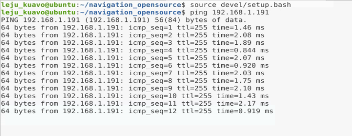
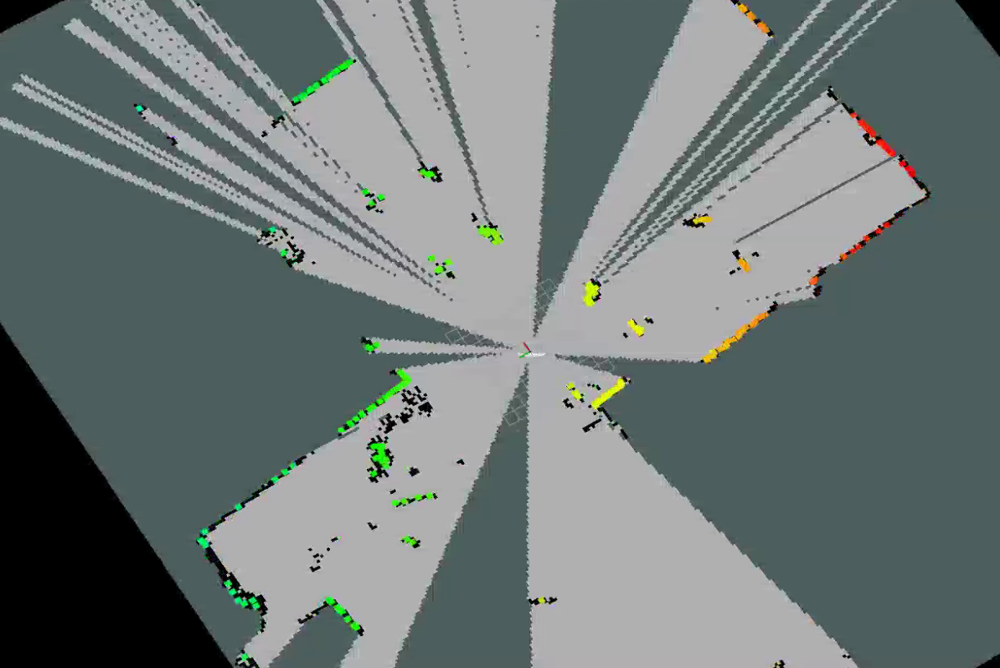
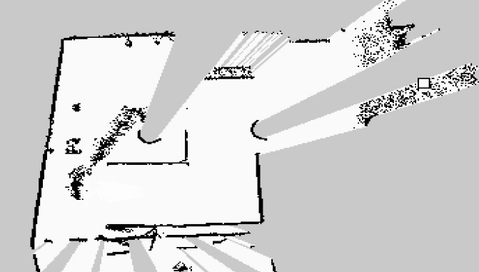
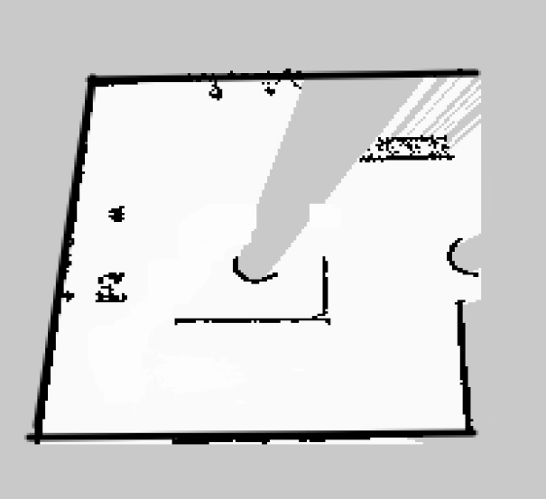
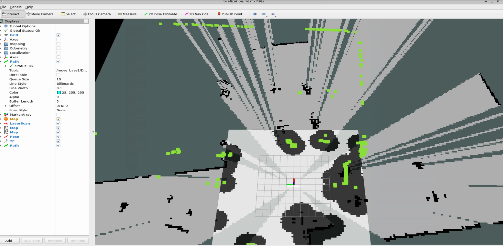
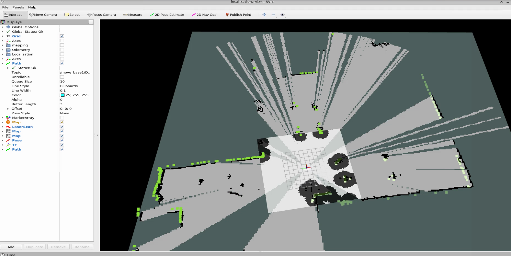

# 机器人开源导航案例使用指南

⚠️⚠️⚠️ **注意： 综合案例为参考案例，复杂度较高，使用该案例需要具备相关领域基础知识**

⚠️⚠️⚠️ **注意： 综合案例非标准交付功能，仅提供参考**

## 📋 目录
1. [系统概述](#1-系统概述)
2. [环境准备](#2-环境准备)
3. [硬件连接](#3-硬件连接)
4. [建图操作](#4-建图操作)
5. [地图编辑](#5-地图编辑)
6. [定位导航](#6-定位导航)
7. [常见问题](#7-常见问题)

---

## 1. 系统概述
本案例是基于KUAVO导航解决方案，可以实现：
> 这仅仅是示例，还有一些局限性，比如建图时对于动态障碍物的处理并不好，会把动态障碍物经过的路线识别成障碍物，所以建图时尽量在静态场景，对于地图中的噪点可以通过[地图编辑](#5-地图编辑)解决。
> 代码只能部署到机器人上位机
- 🗺️ **自动建图**：扫描环境并生成地图
- 📍 **定位**：在地图中确定机器人的位置
- 🚀 **自主导航**：自动规划路径并避开障碍物到达目标，在导航时可以动态避障

### 1.2 系统主要特点

✅ **开箱即用**：预配置好的参数，新手也能快速上手  
✅ **功能完整**：从建图到导航的一站式解决方案  
✅ **实时处理**：基于FAST-LIO的SLAM算法  
✅ **基于雷达纯定位**：只用关注livox_frame的坐标，不用关注机器人本身在地图上的坐标

## 2. 环境准备
> **需要使用远程桌面运行程序，方便查看效果，和实现导航**

安装依赖：

```bash
pip3 install open3d==0.16.0
pip3 install watchdog==4.0.2
sudo apt-get install libsdl-image1.2-dev
# 上位机若为NX或AGX即用户名为leju_Kuavo，执行下面一行命令，反之不用
sudo apt install ros-noetic-tf2-sensor-msgs
```
拉取代码并编译：
```bash
cd ~/kuavo_ros_application
rm -rf .catkin_tools
git pull
git checkout opensource/navigation_demo
cd ~/kuavo_ros_application/src/navigation_opensource
catkin build
```
---

## 3. 硬件连接

### 3.1 连接Livox激光雷达

**步骤1：测试连接**
```bash
# 测试网络连通性
ping 192.168.1.191  # 出厂设置，需要确认没问题

# 如果无法ping通，检查：
# 1. 有线是否连接正常
# 2. IP地址是否在同一网段
# 3. 激光雷达是否正常供电
```
正常连接输出：


---

## 4. 建图操作

### 4.1 基础建图流程

**步骤1：启动建图系统**
```bash
# 进入工作空间
cd ~/kuavo_ros_application/src/navigation_opensource
source devel/setup.bash
# 启动基础建图
roslaunch kuavo_nav_demo kuavo_build_map.launch
```

**步骤2：观察建图效果**
- 打开RViz可视化界面
- 观察点云地图的构建过程
- 确认激光雷达数据正常

**步骤3：控制机器人移动**
- 使用遥控器或键盘控制机器人
- 建议速度：0.1-0.4 m/s
- 避免快速转弯和急停
> 也可以挂着机器人建图（不启动机器人）， 让机器人处于使能状态，能确保头部角度保持水平不变 **（推荐）**

**步骤4：完成建图**
- 覆盖整个目标区域
- 确保地图质量正常
- 保存地图数据

效果如下图：


### 4.4 保存地图

**自动保存**
```bash
cd ~/kuavo_ros_application/src/navigation_opensource
source devel/setup.bash
# 启动自动保存
roslaunch kuavo_nav_demo save_pgm_map_auto_fix.launch
```
> 若未出现报错，现在可以关闭建图相关终端和程序

---

## 5. 地图编辑

### 5.1 为什么需要编辑地图？

建图过程中可能会包含：
- 🚶 动态障碍物（行人、车辆）
- 🗑️ 临时物体（垃圾桶、椅子）
- 🌫️ 环境干扰 (场景中包含玻璃等反光性强的物品)

### 5.2 使用图像编辑软件（推荐）

**安装编辑工具：**
```bash
# 安装KolourPaint（推荐）
sudo apt install kolourpaint

# 或安装GIMP
sudo apt install gimp
```

**编辑地图：**
```bash
# 打开地图文件
kolourpaint ~/kuavo_ros_application/src/navigation_opensource/src/kuavo_nav_demo/maps/test_map.pgm
```

**编辑技巧：**
- 🟦 **白色区域**：空闲空间（机器人可以通行）
- ⬛ **黑色区域**：障碍物（机器人不能通过）
- ⬜ **灰色区域**：未知区域（机器人谨慎通行）
- 🖌️ **橡皮**：擦除错误障碍物
- 🖌️ **黑色画笔**：添加障碍物

### 5.3 使用地图编辑器

**启动ROS地图编辑器：**
```bash
# 进入编辑器目录
cd ~/kuavo_ros_application/src/navigation_opensource/src/ros_map_editor

# 启动编辑器
python3 MapEditor.py ~/kuavo_ros_application/src/navigation_opensource/src/kuavo_nav_demo/maps/test_map.pgm
```

**编辑器功能：**
- 🖱️ 鼠标涂抹编辑
- 💾 实时保存
- 🔄 撤销/重做

### 5.4 地图质量检查

编辑完成后，请检查：
- ✅ 地图边界是否完整
- ✅ 障碍物是否准确
- ✅ 是否有明显错误

#### 编辑示例：

编辑前：



编辑后：



---

## 6. 定位导航

### 6.1 启动实物导航系统

> 需要先启动机器人
**方法1：一键启动（推荐）**
```bash
cd ~/kuavo_ros_application/src/navigation_opensource
source devel/setup.bash
# 启动完整导航系统
roslaunch kuavo_nav_demo kuavo_nav_test.launch
```

**方法2：分步启动**
```bash
# 1. 启动激光雷达驱动
roslaunch livox_ros_driver2 msg_MID360.launch

# 2. 启动定位模块
roslaunch fast_lio_localization kuavo_localize.launch

# 3. 启动导航模块
roslaunch kuavo_nav_demo kuavo_movebase.launch
```

### 6.2 设置初始位姿

**在RViz中设置：**
1. 打开RViz界面
2. 点击顶部工具栏的"2D Pose Estimate"按钮
3. 在地图上点击并拖动，设置机器人的初始位置和朝向
4. 确认位姿准确

初始化前：

初始化后：


### 6.3 设置导航目标

**在RViz中设置：**
1. 点击顶部工具栏的"2D Nav Goal"按钮
2. 在地图上点击并拖动，设置目标位置和朝向
3. 机器人将自动规划路径并开始导航


### 6.4 监控导航状态

**主要话题说明：**

- **/Odometry** (`nav_msgs/Odometry`)
  - 由fastlio发布的里程计信息
- **/localization** (`nav_msgs/Odometry`)
  - 融合后的全局定位结果，由transform_fusion.py发布。其位姿信息为map→body的变换，供导航等模块使用。
- **/move_base/result** (`move_base_msgs/MoveBaseActionResult`)
  - 导航结果（成功/失败）。
- **/move_base/status** (`actionlib_msgs/GoalStatusArray`)
  - 当前所有导航目标的状态。
- **/move_base_simple/goal** (`geometry_msgs/PoseStamped`)
  - RViz中设置的导航目标点。

**查看导航状态：**
```bash
# 查看导航状态
rostopic echo /move_base/status


# 查看速度命令
rostopic echo /cmd_vel
```

**RViz可视化：**
- 🟢 绿色路径：全局规划路径
- 🔵 蓝色路径：局部规划路径


### 6.5 导航参数调整

**调整速度参数：**
```bash
# 编辑速度参数
vim ~/kuavo_ros_application/src/navigation_opensource/src/kuavo_nav_demo/param/base_local_planner_params.yaml
```

**常用参数：**
```yaml
TrajectoryPlannerROS:
  max_vel_x: 0.5          # 最大前进速度 (m/s)
  min_vel_x: 0.1          # 最小前进速度 (m/s)
  max_vel_theta: 1.0      # 最大旋转速度 (rad/s)
  min_in_place_vel_theta: 0.4  # 最小原地旋转速度
  acc_lim_x: 0.5          # 前进加速度限制
  acc_lim_theta: 0.5      # 旋转加速度限制
```

**调整避障参数：**
```bash
# 编辑代价地图参数
vim ~/kuavo_ros_application/src/navigation_opensource/src/kuavo_nav_demo/param/costmap_common_params.yaml
```

**常用参数：**
```yaml
obstacle_range: 2.5       # 障碍物检测范围 (m)
raytrace_range: 3.0       # 射线追踪范围 (m)
inflation_radius: 0.55    # 障碍物膨胀半径 (m)
cost_scaling_factor: 10.0 # 代价缩放因子
```

### 仿真导航
> 如果想研究机器人的规划算法建议使用仿真，不涉及雷达和定位
```bash
# 先启动仿真
cd ~/kuavo_ros_application/src/navigation_opensource
source devel/setup.bash
roslaunch kuavo_nav_demo kuavo_nav_test_sim.launch
```
---

## 7. 常见问题

### 7.1 建图问题

**Q: 建图时点云飘移怎么办？**
A: 
- 确保激光雷达安装稳固


**Q: 地图中出现大量噪点，或者出现太低高度的障碍物没有扫到？**
A:
> 修改navigation_opensource/src/FAST_LIO/launch/Pointcloud2Map.launch中的pointcloud_min_z参数，将-0.5增大或减小。

- 启用高度滤波，设置合适的高度范围
- 使用地图编辑工具手动清除

**Q: 将地面识别为障碍物？**
A:
> 修改navigation_opensource/src/FAST_LIO/launch/Pointcloud2Map.launch中的max_range参数，将10减小。
- 雷达处于非水平状态，确保雷达状态保持水平

### 7.2 定位问题

**Q: 初始定位不准确？**
A:
- 确保提供了较为准确的初始位姿估计
- 在机器人静止状态下进行初始化
- 确保建图时头部角度和导航时角度一致

**Q: 定位过程中出现偏移？**
A:
- 确保地图质量良好，特征丰富
- 检查激光雷达是否被遮挡
- 周围环境和建图时变化不大

### 7.3 导航问题

**Q: 机器人无法规划路径？**
A:
- 查看雷达和地图是否对齐，俯视和侧视去看！！！！！
- 检查地图中是否存在障碍物阻断路径
- 确保起点和终点都在可达区域
- 调整全局规划器参数，如`default_tolerance`


**Q: 机器人无法靠近目标点？**
A:
- 增加`xy_goal_tolerance`和`yaw_goal_tolerance`
- 检查目标点周围是否有障碍物
- 调整局部代价地图参数

### 7.4 系统错误

**Q: 找不到激光雷达设备？**
A:
- 检查网络连接和IP设置
- 确保激光雷达供电正常

---


## 🙏 致谢

本项目集成了来自各种开源项目的工作：

- [FAST-LIO](https://github.com/hku-mars/FAST_LIO) - 高性能LiDAR-惯性里程计
- [FAST-LIO-LOCALIZATION](https://github.com/HViktorTsoi/FAST_LIO_LOCALIZATION) - 基于FAST-LIO的定位框架
- [Livox ROS Driver](https://github.com/Livox-SDK/livox_ros_driver) - Livox激光雷达驱动
- [ROS Navigation Stack](https://github.com/ros-planning/navigation) - ROS导航栈
- [OctoMap](https://github.com/OctoMap/octomap) - 八叉树地图库
