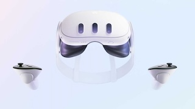
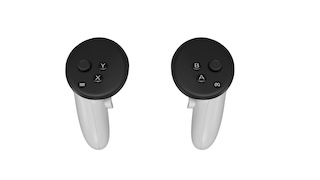
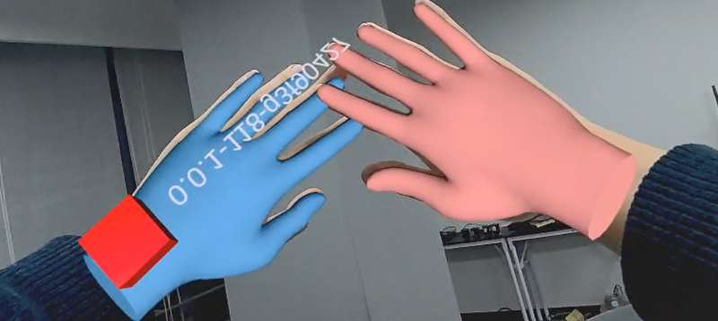

# VR使用开发案例

- [VR使用开发案例](#vr使用开发案例)
  - [说明](#说明)
    - [QUEST 3 设备](#quest-3-设备)
    - [手柄](#手柄)
  - [Quest3 相关使用](#quest3-相关使用)
    - [介绍](#介绍)
    - [安装 SideQuest](#安装-sidequest)
    - [如何更新 Quest3 的系统固件](#如何更新-quest3-的系统固件)
    - [如何启动已安装的程序](#如何启动已安装的程序)
    - [如何导出已录制的视频](#如何导出已录制的视频)
    - [如何去除空间限制](#如何去除空间限制)
    - [如何实时查看到 Quest3 投屏的屏幕](#如何实时查看到-quest3-投屏的屏幕)
  - [QUEST3 VR控制](#quest3-vr控制)
    - [准备](#准备)
    - [使用](#使用)
      - [启动python版本的ik（跟随人体姿态绝对式VR）](#启动python版本的ik跟随人体姿态绝对式vr)
      - [启动C++版本的ik（末端增量式VR）](#启动c版本的ik末端增量式vr)
    - [QUEST3 视频流](#quest3-视频流)
    - [若发现VR设备显示的视频流数据画面翻转，并且机器人摄像头为奥比中光摄像头，可以按下面操作解决](#若发现vr设备显示的视频流数据画面翻转并且机器人摄像头为奥比中光摄像头可以按下面操作解决)
      - [前置准备](#前置准备)
      - [安装步骤](#安装步骤)
      - [注意事项](#注意事项)


## 说明

- 本案例使用VR设备为Quest3，可以通过VR手柄实现机器人手臂和灵巧手的遥操以及机器人的基本运动，可用于具身智能的数据采集。

### QUEST 3 设备

- 

### 手柄

- 


## Quest3 相关使用
### 介绍

在使用遥操作的时候我们需要用到 Quest3 的设备来捕捉用户的动作控制机器人来搜集数据。在这个文档中我们会介绍在使用 Quest3 的过程中会遇到的几个问题或者需要用到的操作

### 安装 SideQuest

如果无法下载，可以使用我们提供的源来安装。我们提供的地址是：[SideQuest下载地址](https://kuavo.lejurobot.com/Quest_apks/SideQuest-Setup-0.10.42-x64-win.exe "SideQuest 下载地址")，请注意这个源不会和官方的版本同步更新，目前同步的日期是 2024/11/22。请大家如果在发现版本距离久的时候自行下载软件。

基本使用请参考官方视频，或者 Bilili 的视频： [SideQuest的基本使用](https://www.bilibili.com/video/BV1uY41157Ki/?share_source=copy_web&vd_source=2d815abfceff1874dd081e6eb77cc262 "SideQuest基本使用")

如何在 Quest3 里面授权的视频: [Quest3 允许授权](https://www.bilibili.com/video/BV1zzBiYqE8m/?share_source=copy_web&vd_source=2d815abfceff1874dd081e6eb77cc262 "Quest3 允许授权")

### 如何更新 Quest3 的系统固件

目前已知的是 V68 的系统固件版本会存在卡顿和遥控器定位的问题。大家的设备如果是 V68 需要升级系统固件。

升级系统固件需要把 Quest3 连接在一个可以访问 meta 服务器网络的环境下。

具体升级的方法请参考: [Quest3 更新系统固件](https://www.bilibili.com/video/BV1FBBiYMEp4/?share_source=copy_web&vd_source=2d815abfceff1874dd081e6eb77cc262 "Quest3 更新系统固件")

### 如何启动已安装的程序

手柄: [如何启动程序-手柄](https://www.bilibili.com/video/BV1EBBiYKE9B/?share_source=copy_web&vd_source=2d815abfceff1874dd081e6eb77cc262 "如何启动程序-手柄")

手势识别: [如何启动程序-手势](https://www.bilibili.com/video/BV1JBBiYMEmK/?share_source=copy_web&vd_source=2d815abfceff1874dd081e6eb77cc262 "如何启动程序-手势")

### 如何导出已录制的视频

在我们技术支持的时候工程师可能需要大家录制一段在软件里面的操作画面然后发送给我们。

录制视频的方法请参考：[Quest3 录制视频](https://www.bilibili.com/video/BV1U7411p7h2/?share_source=copy_web&vd_source=2d815abfceff1874dd081e6eb77cc262 "Quest3 录制视频")

导出视频的方法请参考: [Quest3 录屏分享](https://www.bilibili.com/video/BV1fzBiYiEa2/?share_source=copy_web&vd_source=2d815abfceff1874dd081e6eb77cc262 "Quest3 录屏分享")

### 如何去除空间限制

默认 Quest3 会需要用户建立一个虚拟空间，当你操作 VR 的时候走出这个空间就会自动暂停我们的程序提示回到虚拟空间上。在展馆之类的场景的时候就有限制。如果想要去掉这个限制，可以参考以下视频。注意：按照视频中说明操作之后主界面的 paththrough 会不起作用，但是进入程序里面是可以透视的，不影响使用。

参考视频：[Quest3 突破空间限制](https://www.bilibili.com/video/BV1iYzwYqEwt/?share_source=copy_web&vd_source=2d815abfceff1874dd081e6eb77cc262 "Quest3 突破空间限制")

### 如何实时查看到 Quest3 投屏的屏幕

1. 先完成授权的步骤，请参考前面: <如何在 Quest3 里面授权的视频>

2. 根据自己的系统安装 

- [scrcpy-linux-x86_64-v3.1.tar.gz](https://kuavo.lejurobot.com/statics/scrcpy-linux-x86_64-v3.1.tar.gz)
- [scrcpy-macos-aarch64-v3.1.tar.gz](https://kuavo.lejurobot.com/statics/scrcpy-macos-aarch64-v3.1.tar.gz)
- [scrcpy-macos-x86_64-v3.1.tar.gz](https://kuavo.lejurobot.com/statics/scrcpy-macos-x86_64-v3.1.tar.gz)
- [scrcpy-win64-v3.1.zip](https://kuavo.lejurobot.com/statics/scrcpy-win64-v3.1.zip)

3. 各自解压之后在对应的目录下启动终端，确保当前电脑已经通过 USB 连接 Quest3, 并且 Quest3 已经开机

4. 执行对应的 scrcpy 指令

示例视频

<iframe src="//player.bilibili.com/player.html?isOutside=true&aid=113683724243013&bvid=BV1kAk2Y1Edm&cid=27433897643&p=1" scrolling="no" border="0" frameborder="no" framespacing="0" allowfullscreen="true"></iframe>

## QUEST3 VR控制

### 准备
1. 设备准备：
   - QUEST 3 头显
   - KUAVO_HAND_TRACK VR 应用（请联系乐聚工作人员安装）

2. 网络准备：
   - 确保 VR 设备和机器人连接同一 WiFi

### 使用
- 若您的机器末端执行器为夹爪
  - 检查下位机本地的`/home/lab/kuavo-ros-opensource/src/kuavo_assets/config/kuavo_v$ROBOT_VERSION/kuavo.json`这个文件
    - 找到`"EndEffectorType": ["qiangnao", "qiangnao"],`这一行
    - 将其修改为`"EndEffectorType": ["lejuclaw", "lejuclaw"],`(若已为"lejuclaw"则不需要修改)

  - 检查下位机本地的`/home/lab/kuavo-ros-opensource/src/manipulation_nodes/noitom_hi5_hand_udp_python/launch/launch_quest3_ik.launch`这个文件
    - 找到`<arg name="ee_type" default="qiangnao"/>`这一行
    - 将其修改为`<arg name="ee_type" default="lejuclaw"/>`(若已为"lejuclaw"则不需要修改)

  - 检查下位机本地的`/home/lab/kuavo-ros-opensource/src/humanoid-control/humanoid_controllers/launch/load_kuavo_real_with_vr.launch`这个文件
    - 找到`<arg name="ee_type" default="qiangnao"/>`这一行
    - 将其修改为`<arg name="ee_type" default="lejuclaw"/>`(若已为"lejuclaw"则不需要修改)

  - 注意:该配置在更新代码仓库后会失效, 需要重新进行检查和配置
  
-   > 旧版镜像如果没有包含VR相关依赖，需要手动安装：`cd src/manipulation_nodes/noitom_hi5_hand_udp_python && pip install -r requirements.txt && cd -`

#### 启动python版本的ik（跟随人体姿态绝对式VR）
- 正常启动机器人完成站立
- 启动VR节点
  ```bash
  sudo su
  source devel/setup.bash
  
  # VR先和机器人连到同一局域网, VR 会广播 自身IP 到局域网中
  # 启动python版本的ik（跟随人体姿态）
  roslaunch noitom_hi5_hand_udp_python launch_quest3_ik.launch
  ```

  > 如果手动输入VR的IP地址, 在启动命令后追加参数 `ip_address:=192.168.3.32`(替换成VR的实际IP地址)

  > 现在 VR 头盔中的 APP 会自动广播自身IP，启动节点不需要手动输入 ip，但是假如 VR 节点程序关掉了，你需要在 VR 头盔中重新打开 VR 程序，才会重新广播IP

  > 启动程序之后，将手柄放置视野外，会触发启动VR中的手势识别功能，手臂跟随模式下可以控制机器人手臂和手指跟随运动，这时要注意避免视角中出现多个检测目标（多双手），手势检测效果如下图：

  > 

  > 默认控制双手，如果需要控制单手，可以增加选项`ctrl_arm_idx:=0`, 其中0，1，2分别对应左手，右手，双手
  - 参考[参考机器人VR控制教程](../../2快速开始/快速开始.md)

  > 开启手势识别，可以增加选项 `predict_gesture:=true`，利用神经网络预测手势，灵巧手会直接根据手势预测结果进行运动，目前支持的手势有（只有当预测结果同时满足：高置信度（>80%）明显优于第二预测（差值>0.3）预测分布集中（熵值<0.8）才会返回具体的手势类别。否则会认为预测失败，灵巧手会采用原来的方式控制）
  - 参考[灵巧手手势使用案例](灵巧手手势使用案例.md)
- 同时启动VR节点和机器人
  - 运行
  ```bash
  sudo su
  source devel/setup.bash
  roslaunch humanoid_controllers load_kuavo_real_with_vr.launch
  ```

- 躯干映射  

  - 运行  

  >  首先需要在launch文件启动时增加参数`control_torso:=true`

  ```bash
    roslaunch noitom_hi5_hand_udp_python launch_quest3_ik.launch ip_adress:=填入VRip control_torso:=true
  ```

  > vr程序启动后，按下A键站立，长按左右前扳机将手部解锁，随后按下左前扳机+B进入躯干映射模式，此时操控人员可以进行下蹲和前后倾斜鞠躬。使用前**务必在站立状态下长按VR右手柄的meta键**以标定躯干高度。**注意：不能长时间执行蹲下和弯腰动作，且在执行躯干运动时幅度不宜过大**

- 低延迟模式  

  > 在有线模式下建议使用建议使用低时延模式，可以实现更快速的动作  

  - 使用前准备

  > 参考[有线vr使用教程](../../6常用工具/有线VR方案使用指南.md)，**注意网线和vr的转接线头如果是usb口的话必须使用usb3.0的转接口，否则路由器可能会识别不到VR设备**，随后在路由器的后台查看VR设备的ip地址- 运行 

  - 运行 

  ```bash
  roslaunch noitom_hi5_hand_udp_python launch_quest3_ik.launch ip_address:=vr有线ip 
  ```

  > vr程序启动后，同时按下左边前扳机+X，开启低时延模式；按下左边侧扳机+X，关闭低时延模式

#### 启动C++版本的ik（末端增量式VR）
- 首先检查 `src/humanoid-control/humanoid_controllers/launch/load_kuavo_real.launch` 中 `with_mm_ik` 参数是否为 `true` 
- 正常启动机器人完成站立
1. 启动VR节点
  ```bash
  # 增量位置 + 绝对姿态
  roslaunch noitom_hi5_hand_udp_python launch_quest3_ik.launch ip_address:=your quest ip use_cpp_incremental_ik:=true use_incremental_hand_orientation:=false

  # 增量位置 + 增量姿态
  roslaunch noitom_hi5_hand_udp_python launch_quest3_ik.launch ip_address:=your quest ip use_cpp_incremental_ik:=true use_incremental_hand_orientation:=true
  ```
2. 人体姿态标定
  为确保操作精准度与舒适度，可选头戴或者挂脖：

  - **正常头戴标定**：
    *   正常佩戴 VR 头显。
    *   操作员大臂自然下垂，小臂水平置于腰侧。
    *   **长按 Meta 键** 进行标定。
  - **挂脖模式标定**（不需要挂脖无需进行此操作）：
    *   将 VR 头显取下，改为挂脖佩戴（确保居中对称）。
    *   保持大臂自然下垂，小臂水平置于腰侧。
    *   **再次长按 Meta 键** 进行标定。
3. 激活增量控制
  - 同时按下 **左手柄 `X`** + **右手柄 `A`**。
  - **状态确认**：
    *   若手臂从微弯切换至**完全伸直**，说明激活成功。
    *   等待 **5秒**，机器人准备完毕。
    *   若无响应，请重新尝试按下 `X` + `A`。
4. 增量操作说明
  - 机器人双臂完全伸直 5 秒后，按下任意侧手柄的**侧扳机** 即可开始控制。

| 左侧扳机 (L) | 右侧扳机 (R) | 机器人行为 | 预期响应 |
| :--: | :--: | :--: | :--: |
| ✔ 按下 | ⭕ 松开 | **仅左臂运动** | 右臂保持锁定，左臂跟随手柄增量移动 |
| ⭕ 松开 | ✔ 按下 | **仅右臂运动** | 左臂保持锁定，右臂跟随手柄增量移动 |
| ✔ 按下 | ✔ 按下 | **双臂运动** | 双手同时进行增量控制 |
| ⭕ 松开 | ⭕ 松开 | **停止/锁定** | 机器人双臂立即停止在当前位置，不跟随移动 |

5. 操作Tips
  - **空间受限处理**：
    *   在直臂模式下向后收回手臂时，若感到活动空间受限，可先将手臂稍向外侧平移（**左手向左，右手向右**），然后再进行内收动作。
  - **分段操作**：
    *   从“绝对式”切换到“增量式”需要适应过程。
    *   进行长距离或精细操作时，推荐采用**"松开扳机 → 调整人手到舒适位置 → 重新按下扳机"**的策略，以找到最舒适的操作姿势并缓解疲劳。
  - **姿态调整**：
    *   增量式不依赖于人体手臂的映射位置，但**保持与设备一致的姿态**能够获得更好的操作体验。建议在增量操作过程中保持与设备相对接近的姿态。


### QUEST3 视频流

本程序可以将上位机的摄像头画面传输到 VR 设备中显示。具体设置步骤如下：

1. 在上位机（带有摄像头的设备）上安装依赖：
- 需要克隆下位机kuavo-ros-opensource仓库，然后配置依赖：
  ```bash
  cd /home/lab/kuavo-ros-opensource
  sudo apt install v4l-utils
  sudo su
  python3 -m pip install aiortc==1.9.0
  catkin build  noitom_hi5_hand_udp_python
  ```

2. 启动视频流：

- 安装依赖：
```bash
sudo apt install libv4l-dev
```
- 在上位机运行：
   ```bash
   cd ~/kuavo_ros_application/
   source devel/setup.bash
  # 打开摄像头
  # 旧版4代, 4Pro
  roslaunch dynamic_biped load_robot_head.launch
  # 标准版, 进阶版, 展厅版, 展厅算力版
  roslaunch dynamic_biped load_robot_head.launch use_orbbec:=true
  # Max版
  roslaunch dynamic_biped load_robot_head.launch use_orbbec:=true enable_wrist_camera:=true
  ```
  
- 在下位机运行(下位机仓库版本>1.2.1)：
   ```bash
   # 下面程序已经启动了VR控制程序，请勿重复遥控器启动
   roslaunch noitom_hi5_hand_udp_python launch_quest3_ik_videostream_robot_camera.launch # ip_adress:=填入VR IP地址
   ```

### 若发现VR设备显示的视频流数据画面翻转，并且机器人摄像头为奥比中光摄像头，可以按下面操作解决

#### 前置准备

1. **下载修复版APK**  
   [leju_kuavo_hand-0.0.1-298-gdc7cfac.apk](https://kuavo.lejurobot.com/Quest_apks/leju_kuavo_hand-0.0.1-298-gdc7cfac.apk)

2. **准备USB数据线**  
   用于连接电脑和Quest 3设备

3. **安装ADB工具**（如已安装可跳过）
   - **Windows**: 下载 [scrcpy-win64-v3.3.1.zip](https://github.com/Genymobile/scrcpy/releases/download/v3.3.1/scrcpy-win64-v3.3.1.zip) 并解压，adb.exe位于解压目录中
   - **Linux**: 下载 [scrcpy-linux-x86_64-v3.3.1.tar.gz](https://github.com/Genymobile/scrcpy/releases/download/v3.3.1/scrcpy-linux-x86_64-v3.3.1.tar.gz) 并解压
```bash
   tar -xzf scrcpy-linux-x86_64-v3.3.1.tar.gz
   cd scrcpy-linux-x86_64-v3.3.1
```

#### 安装步骤

**步骤1：连接设备并授权**
1. 用USB线连接Quest 3和电脑
2. 戴上VR头显，会看到USB调试授权提示，选择「始终允许」并确认

**步骤2：将APK文件放到adb工具目录**
- **Windows**: 将下载的APK文件复制到解压后的scrcpy目录（与adb.exe同目录）
- **Linux**: 
```bash
  cp /path/to/leju_kuavo_hand-0.0.1-298-gdc7cfac.apk ./
```

**步骤4：安装APK**

在终端中执行（需在adb所在目录）：

- **Windows**:
```bash
  .\adb.exe install leju_kuavo_hand-0.0.1-298-gdc7cfac.apk
```

- **Linux**:
```bash
  ./adb install leju_kuavo_hand-0.0.1-298-gdc7cfac.apk
```

#### 注意事项

- ⚠️ 安装前请确保VR设备电量充足
- ⚠️ 确保USB线支持数据传输（部分充电线不支持数据传输）
- 💡 安装成功后会显示"Success"提示
- 💡 如果adb一直显示"waiting for device"，检查VR设备是否已授权USB调试