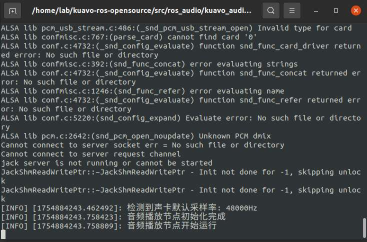

# 大模型联网搜索与视觉推理案例

## 描述

  - 使用大模型接入语音对话，实现了一个语音交互系统，包括录音、语音转写、视觉推理、联网搜索、对话生成和语音播放功能。
  
  - 示例代码路径:`~/kuavo_ros_application/src/kuavo_large_model/kuavo_kimi_model/kimi_python3_demo.py`

## 程序逻辑

1. 导入模块及定义全局变量

  - 作用：导入所需的Python标准库和第三方库并定义录音和音频处理的全局参数。

2. RosAudioPublisher类
  - 作用：初始化ros节点，创建音频数据发布器，向下位机传输数据流，使用外放设备播放音频
  
  - publish_pcm_audio_data函数：将pcm文件按照int16格式发布audio_data话题。

3. recorder 函数

  - 作用：实现录音功能，根据音量阈值和静默时间自动开始和结束录音。

  - 关键逻辑：

    - 使用 pyaudio 打开音频流并读取数据。

    - 通过 audioop.rms 计算音频数据的音量。

    - 如果音量超过阈值，开始录音；如果静默时间超过设定值，结束录音。

    - 录音数据保存为PCM文件。

4. kimi_vision_chat 函数

  - 作用：使用 Kimi API（通过 https://api.moonshot.cn/v1 接口）调用 moonshot-v1-8k-vision-preview 视觉模型进行对话，并将回复通过TTS转换为语音播放。

  - 关键逻辑：

    - 从摄像头捕获一帧图像并保存为 picture.jpg。

    - 构造请求体，发送到 Kimi 的 API。

    - 解析API返回的回复内容。

    - 调用 tts_xunfei 将回复转换为语音并播放。

5. kimi_network_chat 函数

  - 作用：使用 Kimi API（通过 https://api.moonshot.cn/v1 接口）调用 moonshot-v1-128k 语言模型进行对话，并将回复通过TTS转换为语音播放。

  - 关键逻辑：

    - 构造请求体，发送到 Kimi 的 API。

    - 调用 search_impl 函数执行网络搜索。

    - 通过循环持续调用 chat 函数获取回复内容。

    - 解析API返回的回复内容。

    - 调用 tts_xunfei 将回复转换为语音并播放。

6. Client 类

  - 作用：实现与讯飞实时语音转写标准版（RTASR）服务的WebSocket通信。

  - 关键逻辑：

    - 初始化WebSocket连接并生成签名。

    - 发送音频数据到RTASR服务。

    - 接收并解析RTASR返回的转写结果。


7. 主程序

  - 作用：主程序逻辑，循环录音、转写、对话和播放。

  - 关键逻辑：

    - 初始化视频捕获对象。

    - 调用 recorder 录音。

    - 使用 Client 类将录音发送到RTASR服务。

    - 定义正则表达式关键词。

    - 用户输入包含关键词则调用 kimi_network_chat 进行对话和联网搜索并播放回复。

    - 用户输入不包含关键词则调用 kimi_vision_chat 进行对话和视觉推理并播放回复。

## 环境配置

### 上位机依赖安装

1. 运行一键部署脚本
```bash
cd ~/kuavo_ros_application/src/ros_audio/kuavo_audio_player/scripts
chmod +x deploy_autostart_h12pro.sh
./deploy_autostart_h12pro.sh
```

2. 安装额外依赖
```bash
# 安装音频和摄像头相关系统库
sudo apt install -y portaudio19-dev python3-pyaudio v4l-utils

# 安装Python依赖（指定版本）
python3 -m pip install pyaudio==0.2.11 websocket-client==1.6.1 opencv-python==4.8.0.76
python3 -m pip install numpy==1.22.2 requests==2.31.0 openai==1.0.0
```

## 说明

   ⚠️ **注意: 该案例使用了科大讯飞的RTASR，TTS模型以及北京月之暗面（moonshot）的 moonshot-v1-8k-vision-preview 视觉模型和 moonshot-v1-128k 语言模型。这四个模型均为收费模型，需要自行创建账号充值获取API Key并将获取到的API Key复制到程序对应地方，使用时机器人上位机要连接外网（能访问互联网）**

   - 该案例所使用的语音，文字转换模型为讯飞的模型： https://www.xfyun.cn/
      - 讯飞实时语音转写标准版（RTASR）
        - 访问讯飞平台,选择语音识别-实时语音转写标准版:https://console.xfyun.cn/services/rta，获取app_id和api_key
        - 将程序`~/kuavo_ros_application/src/kuavo_large_model/kuavo_kimi_model/kimi_python3_demo.py`第425,426行的app_id和api_key替换成获取到的即可
      
      - 讯飞语音合成（TTS）模型
        - 访问讯飞平台,选择语音合成-在线语音合成:https://console.xfyun.cn/services/tts，获取APPID，APISecret，APIKey
        - 将程序`~/kuavo_ros_application/src/kuavo_large_model/kuavo_kimi_model/tts_ws_python3_demo.py`第139，140行的APPID，APISecret，APIKey替换成获取到的即可

   - 该案例所使用的大模型为北京月之暗面（moonshot）推出的 moonshot-v1-8k-vision-preview 视觉模型和 moonshot-v1-128k 语言模型： https://platform.moonshot.cn/
     - 获取Kimi API Key：
       - 进入 https://platform.moonshot.cn/ ，点击用户中心
       - 充值，创建获取API Key    
       - 将程序`~/kuavo_ros_application/src/kuavo_large_model/kuavo_kimi_model/kimi_python3_demo.py `第224，278行的api-key替换成获取到的即可

## 执行

⚠️ **注意: 请保证上下位机ROS主从通信正常工作**


  
   - 下位机
      ```bash
      cd kuavo-ros-opensource #进入下位机工作空间
      sudo su
      catkin build kuavo_audio_player
      source devel/setup.bash
      roslaunch kuavo_audio_player play_music.launch
      ```
  - 效果
     

  - 上位机
    ```bash
    sudo modprobe -r uvcvideo && sudo modprobe uvcvideo
    cd kuavo_ros_application  # 进入上位机工作空间(根据实际部署目录切换)
    source /opt/ros/noetic/setup.bash
    source devel/setup.bash
    python3 src/kuavo_large_model/kuavo_kimi_model/kimi_python3_demo.py 
    ```
