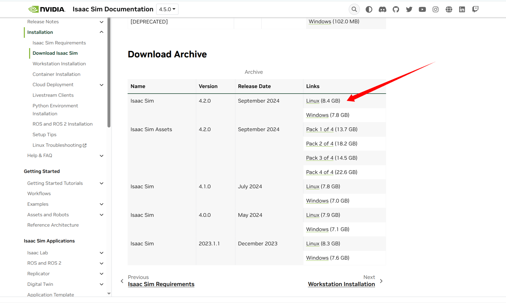

# 强化学习案例lab版
- [强化学习案例lab版](#强化学习案例lab版)
  - [0. 概述](#0-概述)
  - [1. 效果展示](#1-效果展示)
  - [2. 环境准备 (Environment Preparation)](#2-环境准备-environment-preparation)
  - [3. 模型训练 (Train Your Model)](#3-模型训练-train-your-model)
  - [4. 模型转换 (Convert .pt to .onnx)](#4-模型转换-convert-pt-to-onnx)
  - [5. 模型部署 (Deploy to Sim/Real)](#5-模型部署-deploy-to-simreal)

## 0. 概述

> 本案例简单介绍如何使用乐聚开源的强化学习运动控制仓库leju_robot_rl实现对乐聚夸父机器人的训练和部署。

## 1. 效果展示

  - sim2sim

  <iframe src="//player.bilibili.com/player.html?isOutside=true&aid=115235298024093&bvid=BV18bp9zkERM&cid=32506317717&p=1" scrolling="no" border="0" frameborder="no" framespacing="0" allowfullscreen="true"></iframe>

  - sim2real

  <iframe src="//player.bilibili.com/player.html?isOutside=true&aid=115235297957804&bvid=BV1gbp9zkEST&cid=32506317823&p=1" scrolling="no" border="0" frameborder="no" framespacing="0" allowfullscreen="true"></iframe>


## 2. 环境准备 (Environment Preparation)

- **系统要求:**Ubuntu 20.04/22.04 LTS

在开始之前，请确保完成以下环境配置步骤。推荐使用 Conda 创建独立的虚拟环境。

1.  **下载所需软件**
    *   下载 Isaac Sim 4.2 ，流程参考：[](https://docs.isaacsim.omniverse.nvidia.com/4.2.0/index.html)
    *   下载 Isaac Lab 1.4.1 (本例将Isaac Lab下载至主目录下)，流程参考：[](https://isaac-sim.github.io/IsaacLab/v1.4.1/source/setup/installation/binaries_installation.html)
    - 若在上述网址没能找到Isaac Sim 4.2 的安装路径，可参考[4.5版本的网址](https://docs.isaacsim.omniverse.nvidia.com/4.5.0/installation/download.html)，如图：
    
    *   下载 rsl_rl，推荐使用`commit 386875591808cfd1462a42446b1fa0a22ac161d0`
    ```bash
    git clone https://github.com/leggedrobotics/rsl_rl.git
    cd rsl_rl
    git checkout 386875591808cfd1462a42446b1fa0a22ac161d0
    ```

2.  **设置软链接**
    *   在 Isaac Lab 目录下为其 Isaac Sim 创建软链接。
    ```bash
    ln -s {isaacsim_path} _isaac_sim
    ```

3.  **创建并配置 Conda 虚拟环境 (推荐)**

    > **重要提示**: 开始之前，请务必确保 Conda 的包搜索渠道已正确配置，以 `conda-forge` 为主渠道，并启用严格通道优先级。

    ```bash
    # 添加 conda-forge 渠道
    conda config --add channels conda-forge
    # 设置通道优先级为严格
    conda config --set channel_priority strict
    ```

    接下来，使用 Isaac Lab 的脚本创建并激活 Conda 环境。

    ```bash
    # 创建名为 your_envs_name 的 Conda 环境
    ./isaaclab.sh --conda your_envs_name

    # 激活环境
    conda activate your_envs_name
    ```

4.  **配置 Python 环境并安装依赖**

    > **注意**: 如果不使用 Conda 虚拟环境，后续所有 `python` 命令需替换为 `~/IsaacLab/isaaclab.sh -p`，所有 `pip` 命令需替换为 `~/IsaacLab/isaaclab.sh -p -m pip`。使用 Conda 将方便许多。

    ```bash
    # 进入 Isaac Sim 根目录，执行官方脚本设置环境
    # cd /{isaacsim_path}
    source setup_python_env.sh

    # 进入 Isaac Lab 根目录，安装 rl_games
    # cd ~/IsaacLab
    ./isaaclab.sh --install rl_games

    # 进入 leju_robot_rl 项目目录，安装自定义扩展
    # cd ~/leju_robot_rl
    pip install -e leju_robot_rl/exts/ext_template

    # 进入 rsl_rl 库目录，进行本地安装
    # cd {rsl_rl_path}
    pip install -e .
    ```

5.  **确认成功安装Isaac Lab 1.4.1**
  
    - 请使用[Isaac Lab官方文档网站](https://isaac-sim.github.io/IsaacLab/v1.4.1/source/setup/installation/binaries_installation.html#verifying-the-isaac-lab-installation)确认您的Isaac Lab成功安装后，再进行后续步骤。

## 3. 模型训练 (Train Your Model)

- 克隆leju_robot_rl仓库 
```bash
git clone https://gitee.com/leju-robot/leju_robot_rl.git
```

- 训练开始前，需要对以下文件进行修改。
  - 禁用关节加速度更新（IsaacLab下）
    *   **文件路径**: `/{isaaclab_path}/source/extensions/omni.isaac.lab/omni/isaac/lab/assets/articulation/articulation_data.py`
    *   **修改内容**: 注释掉 `self.joint_acc` 这一行。

        ```python
        # around line 82 in articulation_data.py
        def update(self, dt: float):
            # update the simulation timestamp
            self._sim_timestamp += dt
            # Trigger an update of the joint acceleration buffer at a higher frequency
            # since we do finite differencing.
            # self.joint_acc # <- 注释掉此行
        ```

- 完成以上修改后，即可运行 `train.py` 脚本开始训练。
    ```bash
        # conda activate your_env
        # cd leju_robot_rl
        python scripts/rsl_rl/train.py \
        --task Legged-Isaac-Velocity-Flat-Kuavo-S42-v0 \
        --num_envs 4096 \
        --headless
    ```

## 4. 模型转换 (Convert .pt to .onnx)

训练完成后，将 PyTorch 模型文件 (`.pt`) 转换为机器人部署所需的 ONNX 格式 (`.onnx`)。

1.  运行 `play.py` 脚本。
```bash
    # cd leju_robot_rl
    python scripts/rsl_rl/play.py \
    --task Legged-Isaac-Velocity-Flat-Kuavo-S42-Play-v0 \
    --num_envs 32
```
2.  脚本会自动加载训练好的 `.pt` 模型，并生成对应的 `.onnx` 文件。
3.  新生成的 `.onnx` 模型文件文件位置为`leju_robot_rl/logs/rsl_rl/Kuavo/s42/flat/{time_train}/exported/policy_s42.onnx`，将其拷贝至下位机环境或真实机器人上，目标位置为`/home/lab/kuavo-rl-opensource/kuavo-robot-deploy/src/humanoid-control/humanoid_controllers/model/networks`。
---

## 5. 模型部署 (Deploy to Sim/Real)

将训练好的模型部署到仿真环境或真实机器人上。

- 下载kuavo_rl_opensource仓库

```bash
git clone -b beta https://gitee.com/leju-robot/kuavo-rl-opensource.git
```

1.  **修改 `launch` 文件，文件位置为`/home/lab/kuavo-rl-opensource/kuavo-robot-deploy/src/humanoid-control/humanoid_controllers/launch`。**
- 如果是将模型部署至仿真环境，则对`load_kuavo_mujoco_sim.launch`进行修改；
如果是将模型部署至真实机器人，则对`load_kuavo_real.launch`进行修改:
```bash
# 原有代码为：
<arg name="rl_param"  default="$(find humanoid_controllers)/config/kuavo_v$(arg robot_version)/rl/skw_rl_param.info"/>
# 应修改为：
# 确保程序使用的是flat_csp.info
<arg name="rl_param"  default="$(find humanoid_controllers)/config/kuavo_v$(arg robot_version)/rl/flat_csp.info"/>
```

2.  **修改 `flat_csp.info` 文件，文件位置为`/home/lab/kuavo-rl-opensource/kuavo-robot-deploy/src/humanoid-control/humanoid_controllers/config/kuavo_v46/rl`**:
  *   将其中引用的原始 `.onnx` 模型更改为新生成的模型。
```bash
# 原有代码为：
networkModelFile          /policy_s46_demo.onnx;
# 将其修改为：
# 确保程序使用的模型是您训练生成的：
networkModelFile          /your_new_model.onnx;
```
  *   我们的代码仓库里提供了一个基于该案例训练好的模型`policy_s46_demo.onnx`可以直接使用

3. **编译**
```bash
cd kuavo-rl-opensource/kuavo-robot-deploy/
sudo su
export ROBOT_VERSION=46
source installed/setup.bash
catkin build humanoid_controllers
```

4.  **启动**:

- H12遥控器控制说明
  - 实物启动 
    - 启动前确保`E`建在最左边，`F`建在最右边。
    - 机器人缩腿后`F`键拨到最左边是站立。
    - 在机器人站立后，依次按下对应进入强化学习模式和解锁的按键。此时可以通过摇杆控制机器人。
    - `E`键拨到最右边是停止程序（注意此时机器人不会自动下蹲）

  - 强化学习H12遥控器建位说明： [跳转](../../2快速开始/快速开始.md)


⚠️ **注意**: 如果您的下位机部署了h12遥控器的开机自启动服务，运行该案例前需要依次执行 `sudo systemctl stop ocs2_h12pro_monitor.service` 和 `sudo pkill -f ros` 然后再继续下列步骤。

```bash
# 新开终端
cd kuavo-rl-opensource/kuavo-robot-deploy
sudo su
export ROBOT_VERSION=46
source devel/setup.bash
# 仿真环境下
roslaunch humanoid_controllers load_kuavo_mujoco_sim.launch joystick_type:=sim # 启动rl控制器、wbc、仿真器。
# 实物环境下
roslaunch humanoid_controllers load_kuavo_real.launch joystick_type:=h12 # 可以选择cali:=true和cali_arm:=true进行校准启动，但校准启动不会自动缩腿，需要把F键拨到最左边两次，第一次是执行缩腿，第二次是执行站立 。
```
> 注意：仿真和实物选择一个启动即可。也可通过键盘控制，joystick_type参数指定为sim即可，终端有按键功能提示。