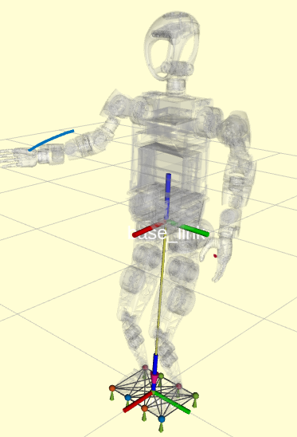
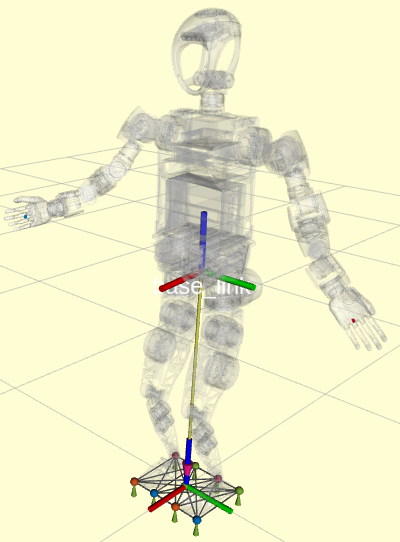

# 手臂轨迹规划案例

- [手臂轨迹规划案例](#手臂轨迹规划案例)
  - [1. 描述](#1-描述)
  - [2. 编译与启动](#2-编译与启动)
    - [2.1 编译](#21-编译)
    - [2.2 启动参数](#22-启动参数)
    - [2.3 启动示例](#23-启动示例)
  - [3. ROS 接口](#3-ros-接口)
    - [3.1 话题](#31-话题)
      - [发布的话题](#发布的话题)
        - [`/<interpolate_type>/arm_traj`](#interpolate_typearm_traj)
        - [`/<interpolate_type>/arm_traj_state`](#interpolate_typearm_traj_state)
        - [`/kuavo_arm_traj`](#kuavo_arm_traj)
    - [3.2 服务](#32-服务)
        - [`/<interpolate_type>/plan_arm_trajectory`](#interpolate_typeplan_arm_trajectory)
        - [`/<interpolate_type>/stop_plan_arm_trajectory`](#interpolate_typestop_plan_arm_trajectory)
  - [4. 使用指南](#4-使用指南)
    - [4.1 三次样条插值器](#41-三次样条插值器)
      - [4.1.1 功能概述](#411-功能概述)
      - [4.1.2 主要步骤](#412-主要步骤)
      - [4.1.3 注意事项](#413-注意事项)
    - [4.2 贝塞尔曲线插值器](#42-贝塞尔曲线插值器)
      - [4.2.1 功能概述](#421-功能概述)
      - [4.2.2 主要步骤](#422-主要步骤)
      - [4.2.3 注意事项](#423-注意事项)
  - [5. 补充说明](#5-补充说明)
    - [5.1 TACT文件格式说明](#51-tact文件格式说明)
      - [5.1.1 功能概述](#511-功能概述)
      - [5.1.2 主要字段说明](#512-主要字段说明)
      - [5.1.3 示例](#513-示例)
      - [5.1.4 备注](#514-备注)

## 1. 描述

- 本文介绍用于规划人形机器人的手臂关节状态轨迹的实现
- 示例代码位于 `/home/lab/kuavo-ros-opensource/src/demo/examples_code/hand_plan_arm_trajectory`
- 目前提供两种插值方法用于实现手臂关节状态轨迹规划:
  1. 三次样条插值器 (`plan_arm_traj_cubicspline_demo.py`)
  2. 贝塞尔曲线插值器 (`plan_arm_traj_bezier_demo.py`)

## 2. 编译与启动

### 2.1 编译

```bash
cd /home/lab/kuavo-ros-opensource #仓库目录
sudo su
catkin build kuavo_sdk humanoid_plan_arm_trajectory
```

### 2.2 启动参数

以下是轨迹规划模块启动时可选的参数:

- `joint_state_topic`: 发布关节状态的话题名称, 默认值为 `kuavo_arm_traj`
- `joint_state_unit`: 关节角度单位, 可选 `rad` 或 `deg`, 默认值为 `deg`
- `use_nodelet`: 是否使用 nodelet 方式启动, 默认值为 `false`

### 2.3 启动示例

在启动脚本前需要先启动humanoid_plan_arm_trajectory.launch文件： 
- **注意: 部分版本的轨迹规划服务会在启动机器人时自动启动,注意不要重复启动**
- 判断方式: 终端输入`rosnode list | grep trajectory`
- 若已存在`/humanoid_plan_arm_trajectory_node`, 则跳过此步
- 若不存在`/humanoid_plan_arm_trajectory_node`, 则运行:
  ```bash
  cd kuavo-ros-opensource  # 进入下位机工作空间
  sudo su
  source devel/setup.bash
  # 仿真
  roslaunch humanoid_controllers load_kuavo_mujoco_sim.launch joystick_type:=sim # 启动rl控制器、wbc、仿真器。
  # 实物 
  roslaunch humanoid_controllers load_kuavo_real.launch joystick_type:=h12 
  # 启动对应节点
  roslaunch humanoid_plan_arm_trajectory humanoid_plan_arm_trajectory.launch 
  ```

新开终端启动脚本：三次样条法

```bash
cd kuavo-ros-opensource  
sudo su
source devel/setup.bash
cd src/demo/examples_code/hand_plan_arm_trajectory # 示例脚本路径
python3 plan_arm_traj_cubicspline_demo.py
```

效果图如下：



新开终端启动脚本：贝塞尔曲线法

```bash
cd kuavo-ros-opensource 
sudo su
source devel/setup.bash
cd src/demo/examples_code/hand_plan_arm_trajectory # 示例脚本路径
python3 plan_arm_traj_bezier_demo.py
```

效果图如下：



## 3. ROS 接口

### 3.1 话题

#### 发布的话题

##### `/<interpolate_type>/arm_traj`

话题描述: 发布规划的手臂轨迹

消息类型: `trajectory_msgs/JointTrajectory`

| 字段          | 类型                     | 描述                        |
| ----------- | ---------------------- | ------------------------- |
| header      | std_msgs/Header        | 消息头                       |
| joint_names | string[]               | 关节名称数组                    |
| points      | JointTrajectoryPoint[] | 轨迹点数组,只有points[0]包含最新的关节值 |

##### `/<interpolate_type>/arm_traj_state`

话题描述: 发布轨迹执行状态

消息类型: `humanoid_plan_arm_trajectory/planArmState`

| 字段          | 类型    | 描述          |
| ----------- | ----- | ----------- |
| progress    | int32 | 轨迹执行进度,单位毫秒 |
| is_finished | bool  | 轨迹是否执行完成    |

##### `/kuavo_arm_traj`

话题描述: 控制手部关节位置

消息类型: `sensor_msgs/JointState`

| 字段       | 类型              | 描述        |
| -------- | --------------- | --------- |
| header   | std_msgs/Header | 消息头       |
| name     | string[]        | 关节名称      |
| position | float64[]       | 关节位置      |
| velocity | float64[]       | 关节速度      |
| effort   | float64[]       | 关节力矩(未使用) |

### 3.2 服务

##### `/<interpolate_type>/plan_arm_trajectory`

话题描述: 轨迹规划服务

其中 `<interpolate_type>` 可以是:

- `bezier`: 贝塞尔曲线插值
- `cubic_spline`: 三次样条插值

**贝塞尔曲线插值服务**

消息类型: `humanoid_plan_arm_trajectory/planArmTrajectoryBezierCurve`

请求参数:

| 字段                            | 类型                      | 描述           |
| ----------------------------- | ----------------------- | ------------ |
| multi_joint_bezier_trajectory | jointBezierTrajectory[] | 多个关节的贝塞尔轨迹数组 |
| start_frame_time              | float64                 | 轨迹的开始时间,单位秒  |
| end_frame_time                | float64                 | 轨迹的结束时间,单位秒  |
| joint_names                   | string[]                | 关节名称数组       |

返回结果:

| 字段      | 类型   | 描述     |
| ------- | ---- | ------ |
| success | bool | 规划是否成功 |

**三次样条插值服务**

消息类型: `humanoid_plan_arm_trajectory/planArmTrajectoryCubicSpline`

请求参数:

| 字段               | 类型                              | 描述     |
| ---------------- | ------------------------------- | ------ |
| joint_trajectory | trajectory_msgs/JointTrajectory | 关节轨迹规范 |

返回结果:

| 字段      | 类型   | 描述     |
| ------- | ---- | ------ |
| success | bool | 规划是否成功 |

##### `/<interpolate_type>/stop_plan_arm_trajectory`

话题描述: 停止轨迹执行服务

消息类型: `std_srvs/Trigger`

## 4. 使用指南

### 4.1 三次样条插值器

#### 4.1.1 功能概述

`plan_arm_traj_cubicspline_demo.py` 使用三次样条插值器来规划机器人的手臂轨迹。

#### 4.1.2 主要步骤

1. **初始化节点和服务**:
   
   - 初始化 ROS 节点 `arm_trajectory_cubicspline_demo`
   - 订阅 `/cubic_spline/arm_traj` 话题
   - 发布 `/kuavo_arm_traj` 话题

2. **服务调用**:
   
   - 设置手臂控制模式
   - 使用轨迹规划服务

3. **轨迹规划**:
   
   - 定义关节位置和时间点
   - 将当前关节状态作为起始点
   - 发送轨迹请求

#### 4.1.3 注意事项

- 确保所有服务和话题配置正确
- 确保 `mpc_observation` 消息可用

### 4.2 贝塞尔曲线插值器

#### 4.2.1 功能概述

`plan_arm_traj_bezier_demo.py` 使用贝塞尔曲线插值器来规划机器人的手臂轨迹。

#### 4.2.2 主要步骤

1. **初始化节点和服务**:
   
   - 初始化 ROS 节点 `arm_trajectory_bezier_demo`
   - 订阅 `/bezier/arm_traj` 话题
   - 发布 `/kuavo_arm_traj` 话题

2. **服务调用**:
   
   - 设置手臂控制模式
   - 使用轨迹规划服务

3. **轨迹规划**:
   
   - 读取 JSON 动作数据
   - 定义贝塞尔曲线控制点
   - 发送轨迹请求

#### 4.2.3 注意事项

- 确保所有服务和话题配置正确
- 确保 JSON 文件路径正确且数据有效

## 5. 补充说明

### 5.1 TACT文件格式说明

#### 5.1.1 功能概述

1. TACT 文件是用于编辑 kuavo 的头部、手臂和手指的关节运动，文件内容采用 JSON 格式进行存储与组织。

2. TACT 文件可以通过手部编辑软件（[使用手册](./../6常用工具/手臂动作编辑工具使用手册.md)）导出，welcome.tact 是欢迎动作，放在同目录下的 action_files 文件夹下。

3. 用户可以自定义动作帧供贝塞尔曲线插值器使用，具体可以参考[plan_arm_traj_bezier_no_tact_demo.py](../../../src/demo/examples_code/hand_plan_arm_trajectory/plan_arm_traj_bezier_no_tact_demo.py)

#### 5.1.2 主要字段说明

1. **顶层结构**
   
   | **键名**    | **类型** | **描述**                        |
   | --------- | ------ | ----------------------------- |
   | `frames`  | list   | 每一项为一个时间点中包含贝塞尔曲线插值器需要的所有关节数据 |
   | `musics`  | list   | 音乐数据                          |
   | `finish`  | int    | 动作结束时刻，单位为毫秒                  |
   | `first`   | int    | 动作起始时刻，单位为毫秒                  |
   | `version` | str    | `.tact` 文件的版本号，示例值：`"1.0.0"`  |

2. **frames**
   
   | **键名**      | **类型** | **描述**                                                                |
   | ----------- | ------ | --------------------------------------------------------------------- |
   | `servos`    | list   | 每个元素都对应 kuavo 中特定关节的角度（[映射关系表](#514-备注)）                                         |
   | `keyframe`  | int    | 关键帧的时间点，单位为毫秒                                                         |
   | `attribute` | dict   | 包含所有关节的贝塞尔曲线控制点配置，一一对应 `servos` 中的每个关节，key 是关节编号，data 是用于调整贝赛尔曲线形状的参数 |

3. **attribute**
   
   | **键名**   | **类型** | **描述**                                                           |
   | -------- | ------ | ---------------------------------------------------------------- |
   | `CP`     | list   | 控制点的坐标列表，包含左控制点和右控制点的数据，控制点定义为`[时间偏移量, 角度偏移量]`, 与 `CPType` 的长度一致 |
   | `CPType` | list   | 控制点类型，长度与 `CP` 对应，分别对应左控制点和右控制点，可选 `AUTO` 或 `MANUAL`             |
   | `select` | bool   | 在贝塞尔曲线插值器中未使用                                                    |

#### 5.1.3 示例

```json
{
    "frames": [
        {
            "servos": [20, 0, 0, -30, 15, -10, 0, 0, 5, -5, 10, 0, -5, 0, 0, 0, 0, 0, 0, 0, 0, 0, 0, 0, 0, 0, 0, 0],
            "keyframe": 50,
            "attribute": {
                "1": {
                    "CP": [[0, 0], [21, 0]],
                    "CPType": ["AUTO", "AUTO"],
                    "select": false
                },
                "2": {
                    "CP": [[10, 10], [20, 20]],
                    "CPType": ["MANUAL", "AUTO"],
                    "select": true
                },
                "3": {
                    ...
                },
                ...
            }
        },
        {
            ...
        },
        ...
    ],
    "musics": [],
    "finish": 500,
    "first": 0,
    "version": "1.0.0"
}
```

#### 5.1.4 备注

1. "servos" 字段的每个元素对应 kuavo 关节的名称

| 索引  | 关节名称                     |
| --- | ------------------------ |
| 0   | l_arm_pitch              |
| 1   | l_arm_roll               |
| 2   | l_arm_yaw                |
| 3   | l_forearm                |
| 4   | l_hand_yaw               |
| 5   | l_hand_pitch             |
| 6   | l_hand_roll              |
| 7   | r_arm_pitch              |
| 8   | r_arm_roll               |
| 9   | r_arm_yaw                |
| 10  | r_forearm                |
| 11  | r_hand_yaw               |
| 12  | r_hand_pitch             |
| 13  | r_hand_roll              |
| 14  | l_thumb_distal_pitch     |
| 15  | l_thumb_proximal_yaw     |
| 16  | l_index_proximal_finger  |
| 17  | l_middle_proximal_finger |
| 18  | l_ring_proximal_finger   |
| 19  | l_pinky_proximal_finger  |
| 20  | r_thumb_distal_pitch     |
| 21  | r_thumb_proximal_yaw     |
| 22  | r_index_proximal_finger  |
| 23  | r_middle_proximal_finger |
| 24  | r_ring_proximal_finger   |
| 25  | r_pinky_proximal_finger  |
| 26  | head_yaw                 |
| 27  | head_pitch               |
