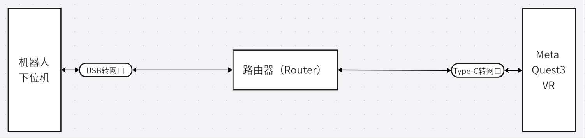

# 有线VR方案使用指南

- [有线VR方案使用指南](#有线vr方案使用指南)
  - [描述](#描述)
    - [准备工作](#准备工作)
    - [连接方式](#连接方式)
  - [操作步骤](#操作步骤)

## 描述

本文档介绍了有线VR方案的使用方法。

### 准备工作

有线VR方案需要准备以下设备：

- 路由器：1个
- 长网线：2根
- USB转网口设备：1个
  - 推荐型号： [推荐型号购买链接](https://item.jd.com/100055085622.html#switch-sku) （不使用这款也可以，只要设备驱动正常，且能被下位机识别正常工作即可）
- Type-C转网口设备：1个 （不做推荐，能被VR识别正常工作即可）

### 连接方式

有线VR方案的连接方式如下图所示：

## 操作步骤
1. 机器人，路由器，VR开机
2. 将USB转网口设备插在机器人背壳的下位机USB口，使用网线连接到路由器的LAN口。（⚠️⚠️⚠️注意：一定要先启动机器人，大约等待半分钟后再连接USB转网口设备，否则可能导致下位机无法正确识别）
3. 将Type-C转网口设备插在VR的Type-C口，使用网线连接到路由器的LAN口。
4. 登陆路由器的管理界面，确保下位机和VR在同一局域网内。
5. 正常启动机器人以及VR程序即可。
