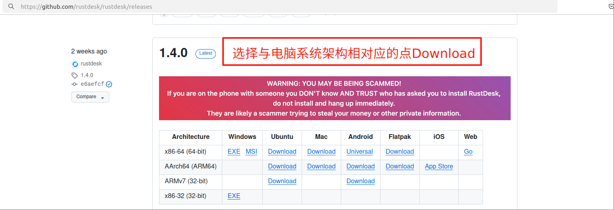
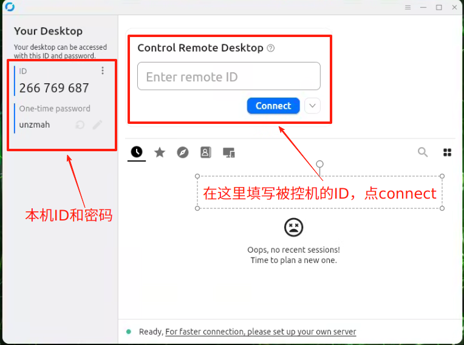

# 远程桌面工具

我们推荐一款名为rustdesk的远程桌面工具，rustdesk是github上开源免费的项目，用户可以自行下载使用。

## 下载链接

- [rustdesk下载链接](https://github.com/rustdesk/rustdesk/releases)

 

 用户选择与电脑系统及架构相对应的版本点击downloaw按钮即可下载。

## 使用示例

安装好rustdesk后，需要将两台电脑连接在同一局域网下,可以通过互相ping的方式来验证。确认无误后，填入被控机的ID点击connect后填入密码即可。密码可在设置里的security中设置一个固定的。

 

 ⚠️⚠️⚠️ **注意： 当您尝试用您的设备通过rustdesk远程控制机器人上位机时，需要给上位机接一个HDMI欺骗器，否则无法远程**