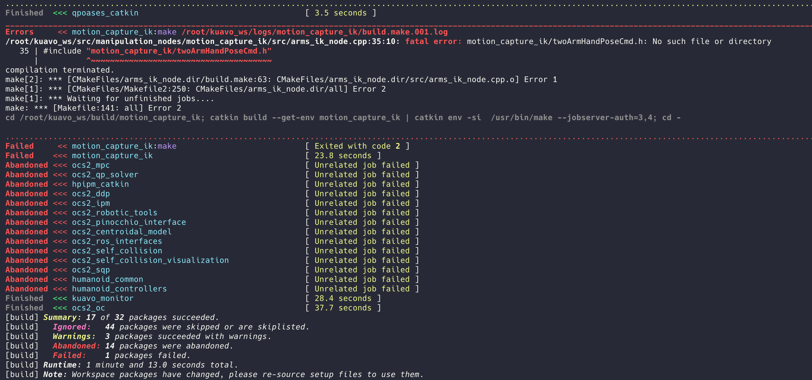
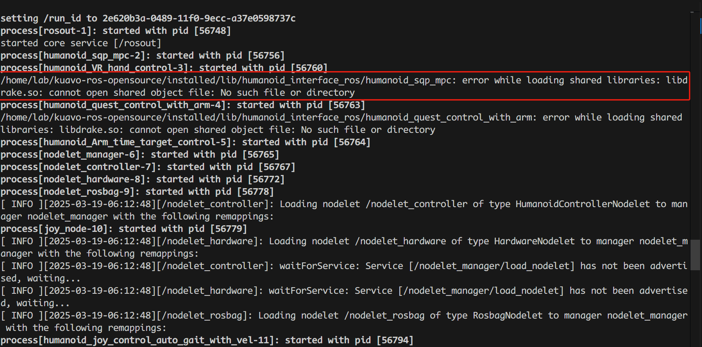
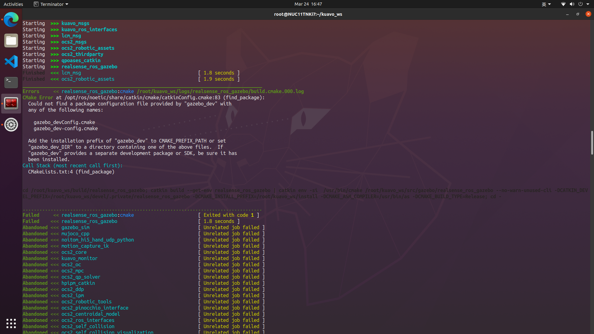
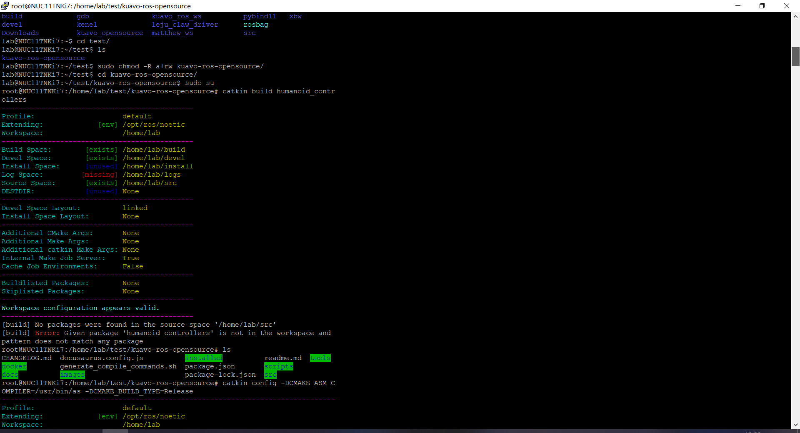
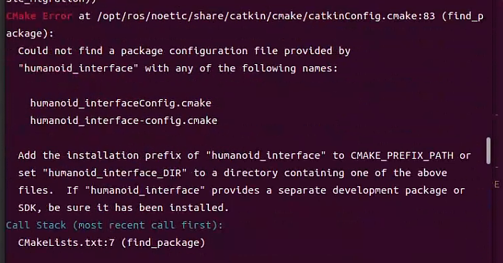
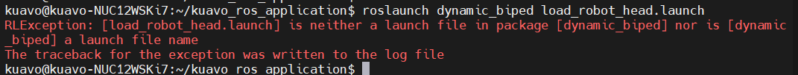
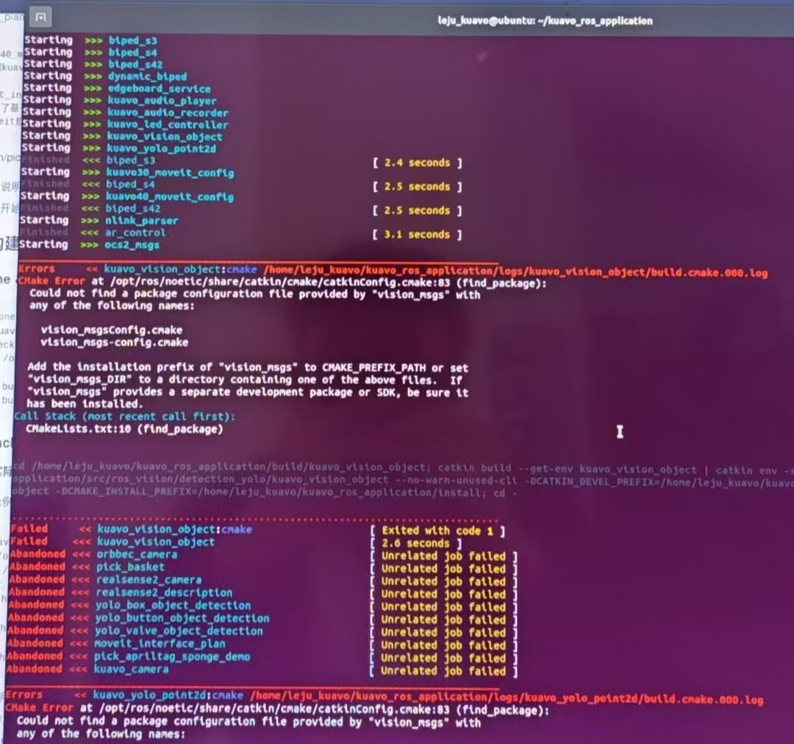
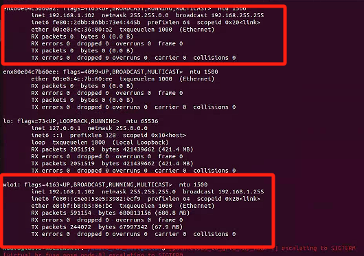
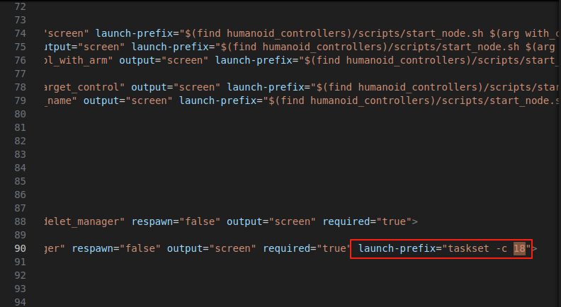

# 故障排查

- [故障排查](#故障排查)
  - [硬件](#硬件)
    - [一、EC 主站无法运行](#一ec-主站无法运行)
  - [软件](#软件)
    - [一、docker 编译报错](#一docker-编译报错)
    - [二、上位机](#二上位机)
    - [三、下位机](#三下位机)
  - [轮臂](#轮臂)
    - [一、软件](#一软件)

## 硬件

### 一、EC 主站无法运行

1. **找不到从站:**

    * **检查 XML 文件:** 确认使用了正确的 XML 配置文件，该文件定义了 EtherCAT 网络的拓扑结构。
    * **检查 EtherCAT 网线:** 检查网线连接是否牢固，是否存在断开或接触不良的情况。可以尝试更换线材，如果更换后还是显示断连，则可能为驱动器插座损坏，需要更换驱动器

2. **DCM out (超时):**

    * **程序卡死:** 检查程序是否存在死循环或阻塞，导致进程卡死。
    * **CPU 内核隔离:** 确认已进行 CPU 内核隔离，避免其他进程干扰实时控制程序。
    * **程序版本:**  确认使用的是最新版本的程序，老版本程序可能存在已知的 bug。

3. **通讯丢帧:**

    * **网线连接:** 检查网线连接是否牢固可靠。
    * **网线质量:**  使用高质量的 EtherCAT 网线，避免劣质网线导致的通讯问题。
    * **驱动器座子虚焊:** 检查驱动器座子是否存在虚焊。
    * **驱动器座子:** 检查驱动器座子是否存在机械性损伤或接触不良。

## 软件

### 一、docker 编译报错

1. **catkin build humanoid_humanollers报关于motion_capture_ik相关的错:** 



`catkin build motion_capture_ik` 单独编译这个功能包

2. **报关于缺少.so文件的错** 

 

执行`echo 'export LD_LIBRARY_PATH=$LD_LIBRARY_PATH:/opt/drake/lib' >> ~/.zshrc && source ~/.zshrc`（如果是bash环境就修改bashrc）

3. **catkin build humanoid_humanollers报关于gazebo_sim相关的错:**

 

```bash
sudo apt-get update
sudo apt-get install ros-noetic-gazebo-dev
sudo apt-get install ros-noetic-gazebo-ros-pkgs ros-noetic-gazebo-ros-control
catkin build realsense_ros_gazebo
catkin build humanoid_controllers
```

4. **catking config工作空间不对**

 

/home/lab/.catkin_tools改成.catkin_tools.bak

5. **编译时出现humanoid_interface依赖报错**



```bash
#运行下面命令
source installed/setup.zsh
catkin build humanoid_controllers
```
6. 桌面软件工具无法连接机器人时，可以先尝试关掉电脑防火墙
  


情况是如上图，按照文档操作后，长时间加载，不能连接到机器人。

### 二、上位机

1. **load_robot_head.launch报错**:

 

拉取master分支最新的commit
```bash
#确保目前处于master分支
git fetch
git pull 
source /opt/ros/noetic/setup.bash
catkin build apriltag_ros
catkin build 
```

2. **上位机为AGX时，编译kuavo-ros-application代码仓库关于vision_msgs的报错**：

 

```bash
sudo apt install ros-noetic-vision-msgs
catkin build apriltag_ros
catkin build 
```

3. **上位机打开rviz,无雷达数据**：

- 终端输入`ifconfig`, 检查是否连接了`192.168.1.xx`网段的wifi

 

- 如果有, 需要断开.1网段的wifi, 连接其他非.1网段的wifi

### 三、下位机

1. **仿真环境启动中机器人前倾摔倒的故障排查**
- 问题描述：
 在运行 MuJoCo / Isaac / Gazebo 仿真器时，机器人可能出现前倾摔倒的现象。此问题可能与 CPU 线程数有关。

- 解决步骤：

 * 检查系统的 CPU 线程数：
   终端中输入`lscpu`
   如果输出中的 CPU(S) 数值小于 18，表示系统的 CPU 线程数不足，可能导致仿真器运行时分配给仿真任务的计算资源不足，进而影响机器人控制的稳定性，导致机器人摔倒。

 * 修改对应仿真器源码:
   例如 `/home/lab/kuavo-ros-opensourcesrc/humanoid-control/humanoid_controllers/launch/load_kuavo_mujoco_sim.launch` 文件：
   在文件中搜索**18**，找到以下配置项：`launch-prefix="taskset -c 12"`
   删除掉图片中框起来的部分即可。
   


## 轮臂

### 一、软件

1. **使用roslaunch humanoid_controllers load_kuavo_real.launch joystick_type:=h12启动机器人，手臂抖动伴随异响**:

解决方式：将/kuavo-ros-opensource/src/humanoid-control/humanoid_controllers/config/kuavo_v45/mpc/下的文件task.info，

将 参数值改成1，重启机器人，再次进行编译后用

roslaunch humanoid_controllers load_kuavo_real.launch only_half_up_body:＝true joystick_type:=h12 

命令启动，手臂抖动问题消失，无其他报错，能够调用手臂轨迹规划案例。
