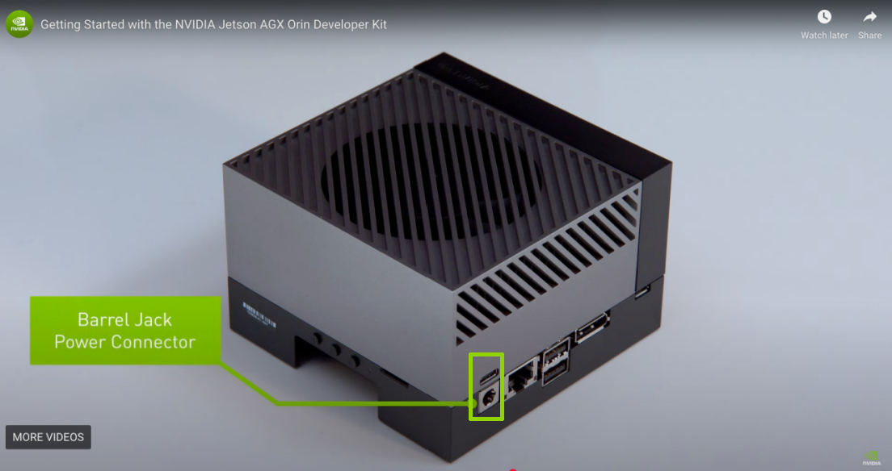
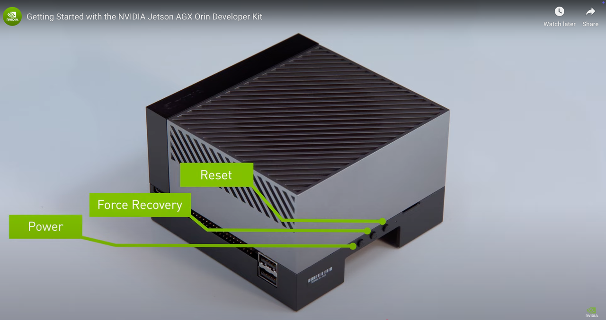
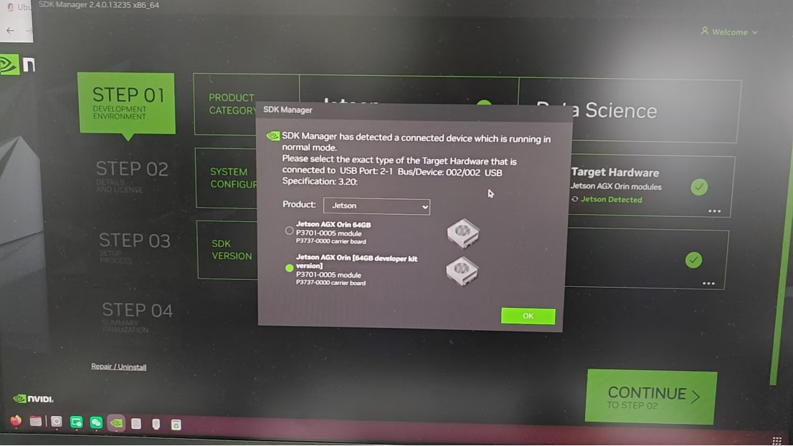
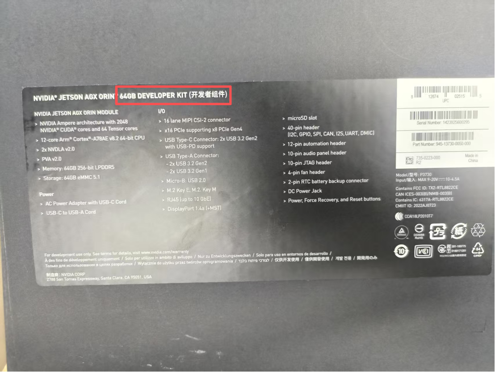
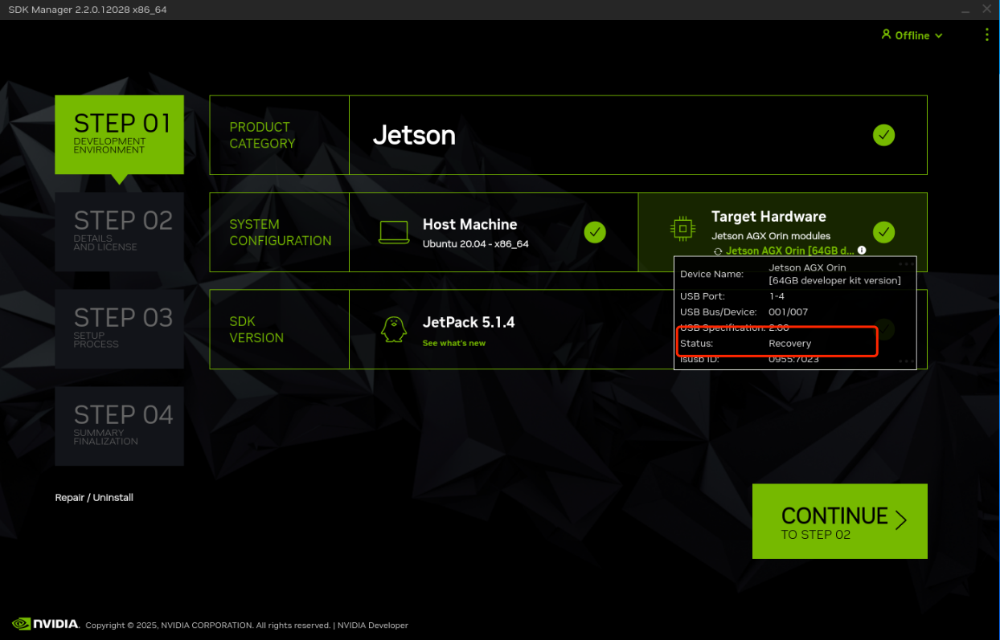
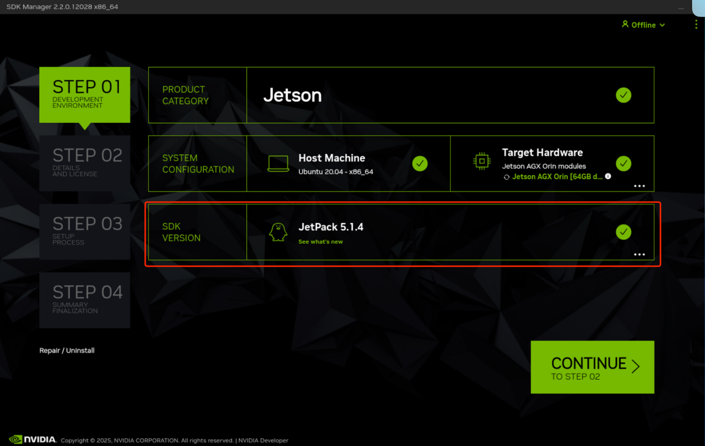
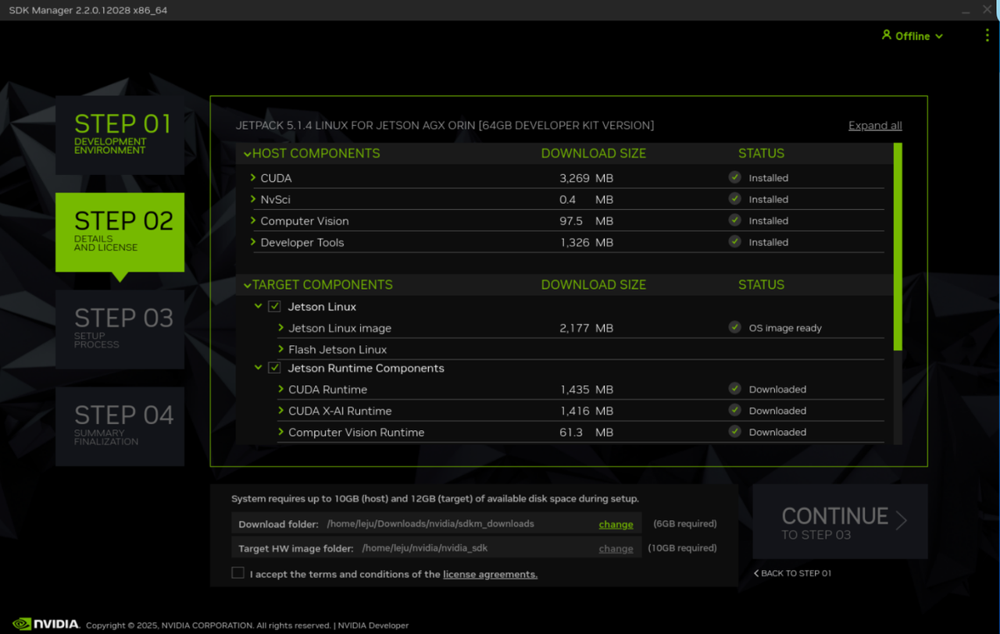
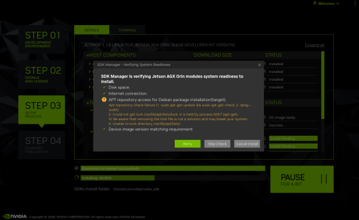
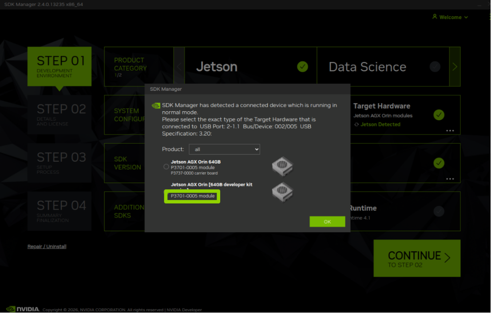

# 机器人上位机烧录镜像(AGX)

[AGX_1.3.0.zip 镜像下载地址](https://kuavo.lejurobot.com/back_images/AGX_1.3.0.zip)

##  事前准备

1. ⼀台 **ubuntu 20.04** 系统的电脑, 带显示器
2. NVIDIA Jetson AGX Orin 设备
3. 烧录镜像的移动硬盘
4. 申请注册英伟达账号（登录SDK Manger使⽤）

##  **步骤：**

 一共两种方式：

 1. 直接官网下载：NVIDIA SDK Manager 下载---申请注册英伟达账号---NVIDIA Jetson AGX Orin 进入 Recovery 模式---下载 JetPack 5.14

 2. 使用移动硬盘镜像烧录：NVIDIA SDK Manager 下载---申请注册英伟达账号---NVIDIA Jetson AGX Orin 进入 Recovery 模式---拷贝镜像---烧录镜像

 注意：下载 JetPack 5.14、拷贝镜像、烧录镜像、备份镜像，都需要在 Recovery 模式下执行

##  NVIDIA SDK Manager 下载

⚠️：**已下载则跳过**

在 ubuntu 打开终端, 输入以下指令下载 NVIDIA SDK Manager

```Shell
# 下载 CUDA keyring 包
Wget https://developer.download.nvidia.com/compute/cuda/repos/ubuntu2004/x86_64/cuda-keyring_1.1-1_all.deb
 
# 安装 keyring 包
sudo dpkg -i cuda-keyring_1.1-1_all.deb
 
# 更新软件包列表
sudo apt-get update
 
# 安装 SDK Manager
sudo apt-get -y install sdkmanager
```

**申请注册英伟达账号**

在终端中输入以下指令，打开NVIDIA SDK Manager

```Plain
sdkmanager --archivedversions
```

已注册则直接在NVIDIA SDK Manager中的developer.nvidia.com选项登录 未注册：

1. 在developer.nvidia.com选项注册账号。
2. 注册完之后在developer.nvidia.com选项登录。
3. 登录时可能会显示没有授权，登录失败。
4. 访问NVIDIA开发者官网 https://developer.nvidia.com/。点击右上角登录


5. 在登录界面输入刚刚注册的邮箱和密码
6. 完成信息填写


7. 按照提示完成授权后，在NVIDIA SDK Manager中的developer.nvidia.com选项登录

常见问题：

1. 邮箱注册失败或者无法授权：换一个邮箱试试看。

##  NVIDIA Jetson AGX Orin 进入 Recovery 模式

1. 将电源线接通 NVIDIA Jetson AGX Orin，如下图 



2. 接通电源后，迅速长按 NVIDIA Jetson AGX Orin 中的强制恢复(Force Recovery)按钮和重置(Reset)按钮，如下图 

3. 长按两秒后，先松开重置(Reset)按钮然后再松开强制恢复(Force Recovery)按钮
4. 使用自带的 USB 转 type-c 线将，NVIDIA Jetson AGX Orin 与 ubuntu 电脑连接
5. 选择对应的版本，包装盒上可以查看版本信息





6. 打开 NVIDIA SDK Manager 确认是否已经进入 Recovery(恢复) 模式, 如下图 



常见问题：

1. SDK manager没有检测到设备：先检查电源线和数据传输线是否插反。如果检查无误，多刷新几次即可。

##  下载 JetPack 5.14

 ⚠️：**已下载则跳过**

1. 打开 SDK Manager，选择 SDK 版本（5.14）如下图 



2. 点击 Continue，然后点击下方 `I accept the terms and conditions of the license agreements`
3. 等待 SDK 下载完成(可能需要较久时间下载)，下载完成会有提示，`Status` 会变成 `Installed` 或者 `Downloaded`, 如下图 



常见问题：

1. 为什么找不到5.1.4版本：如果你不是在终端打开，或者在终端中只输入sdkmanager指令打开，可能找不到5.1.4版本。解决办法：在终端中输入以下指令，打开NVIDIA SDK Manager：

```Plain
sdkmanager --archivedversions
```

2. 为什么5.1.4的版本无法选择：原因：您乌班图版本不是20.04
3. 安装过程中，出现以下问题：原因可能是网络不好。确保网络连接正常，然后多Retry几次就行。



##  拷贝镜像

⚠️：**已拷贝则跳过**

在 ubuntu 上打开文件管理系统，找到移动硬盘文件夹, 将里面的 `nvidia_jeston_agx_orin_backup_images_20250325_191219.tar.gz` 拷贝到 `~/nvidia/nvidia_sdk/JetPack_5.1.4_Linux_JETSON_AGX_ORIN_TARGETS/Linux_for_Tegra/tools/backup_restore` 然后解压

```Shell
#进入 backup_restore 目录
cd ~/nvidia/nvidia_sdk/JetPack_5.1.4_Linux_JETSON_AGX_ORIN_TARGETS/Linux_for_Tegra/tools/backup_restore
 
#  把移动硬盘的备份文件复制过来
# （注意：将下面命令中的移动硬盘路径替换成你实际的）
cp /media/你的用户名/你的移动硬盘名/nvidia_jeston_agx_orin_backup_images_220250325_191219.tar.gz ./
tar -xzf 
 
# 解压备份文件
nvidia_jeston_agx_orin_backup_images_20250325_191219.tar.gz
```

##  烧录镜像

在 ubuntu 终端执行(大约10-15分钟)：

```Shell
cd ~/nvidia/nvidia_sdk/JetPack_5.1.4_Linux_JETSON_AGX_ORIN_TARGETS/Linux_for_Tegra
sudo ./tools/backup_restore/l4t_backup_restore.sh  -e mmcblk0 -r jetson-agx-orin-devkit
```

如果最后输出日志看到

```Shell
Operation finishes. You can manually reset the device
```

说明烧录成功!

##  备份镜像

在 ubuntu 终端执行(大约10-15分钟)：

```Shell
cd ~/nvidia/nvidia_sdk/JetPack_5.1.4_Linux_JETSON_AGX_ORIN_TARGETS/Linux_for_Tegra
sudo ./tools/backup_restore/l4t_backup_restore.sh  -e mmcblk0 -b jetson-agx-orin-devkit
cd ~/nvidia/nvidia_sdk/JetPack_5.1.4_Linux_JETSON_AGX_ORIN_TARGETS/Linux_for_Tegra/tools/backup_restore
timestamp=$(date +%Y%m%d_%H%M%S) && sudo tar --warning=no-file-changed -czf "nvidia_jeston_agx_orin_backup_images_${timestamp}.tar.gz" images/
```

## 常见问题：

1. 备份时，执行完下面指令会报错Error: Unrecognized module SKU：

```Plain
sudo ./tools/backup_restore/l4t_backup_restore.sh  -e mmcblk0 -b jetson-agx-orin-devkit
```

原因：备份脚本在尝试读取你 Jetson 设备信息时，没有成功获取到硬件型号，主机和设备的通信虽然建立了，但在识别具体硬件型号这一步卡住了。 解决办法：

- 检查设备连接状态，查看设备是否处于恢复模式。重新执行：

```Plain
sudo ./tools/backup_restore/l4t_backup_restore.sh  -e mmcblk0 -b jetson-agx-orin-devkit
```

- 如果上面办法没解决，我们可以通过手动指定硬件信息来绕过这个自动识别过程。

(1).在manager点击设备，查看 ID和SKU



(2).执行以下代码

```Markdown
Shell
# 1. 进入Linux_for_Tegra目录
cd ~/nvidia/nvidia_sdk/JetPack_5.1.6_Linux_JETSON_AGX_ORIN_TARGETS/Linux_for_Tegra

# 2. 设置正确的环境变量
export BOARDID=3701
export BOARDSKU=0005
# FAB版本如果不知道可以先不设置

# 3. 执行备份命令
sudo -E ./tools/backup_restore/l4t_backup_restore.sh -e mmcblk0 -b p3701-0005
```

如果成功了，备份镜像就完成了。

(3).不顺利的话，错误有可能从"Unrecognized module SKU"变成了明确的"Invalid target board - p3701-0005"

解决办法：使用软链接

执行以下指令：

```Markdown
Shell
# 1. 进入目录
cd ~/nvidia/nvidia_sdk/JetPack_5.1.6_Linux_JETSON_AGX_ORIN_TARGETS/Linux_for_Tegra

# 2. 创建软链接（让 p3701-0005.conf 指向 jetson-agx-orin-devkit.conf）
ln -s jetson-agx-orin-devkit.conf p3701-0005.conf

# 3. 验证软链接是否创建成功
ls -la p3701-0005.conf

# 4. 设置环境变量并执行备份
export BOARDID=3701
export BOARDSKU=0005
sudo -E ./tools/backup_restore/l4t_backup_restore.sh -e mmcblk0 -b p3701-0005
```

(4).如果上面的命令还是报错，我们试试跳过 EEPROM 检查的方法：

```Plain
Shell
cd ~/nvidia/nvidia_sdk/JetPack_5.1.6_Linux_JETSON_AGX_ORIN_TARGETS/Linux_for_Tegra

export BOARDID=3701
export BOARDSKU=0005

sudo -E SKIP_EEPROM_CHECK=1 ./tools/backup_restore/l4t_backup_restore.sh -e mmcblk0 -b p3701-0005
```

这个 SKIP_EEPROM_CHECK=1 会告诉脚本跳过读取硬件信息的步骤，直接使用你指定的设备型号进行备份。

2. 报错：tar: images：无法 stat: 没有那个文件或目录：原因：设备可能没有在恢复模式。解决办法：让设备进入恢复模式，然后重新执行指令即可。
3. 执行下面指令时

```Plain
sudo ./tools/backup_restore/l4t_backup_restore.sh  -e mmcblk0 -b jetson-agx-orin-devkit
```

听见“滴”的一声，设备退出恢复模式：这是正常现象。终端如果持续输出：

```Plain
  tar: Write checkpoint 10000
  tar: Write checkpoint 20000
  tar: Write checkpoint 30000
  ..........
```

说明备份进程在持续输出，耐心等待即可。