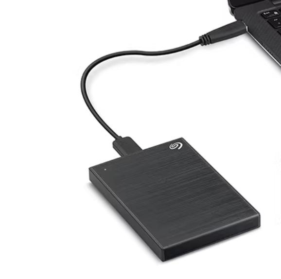
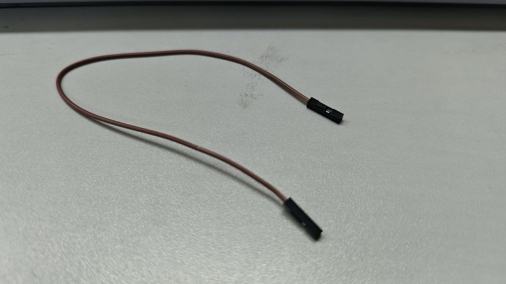
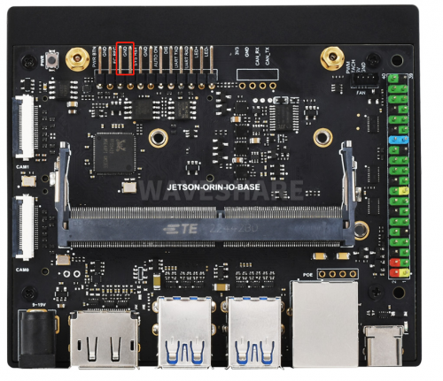
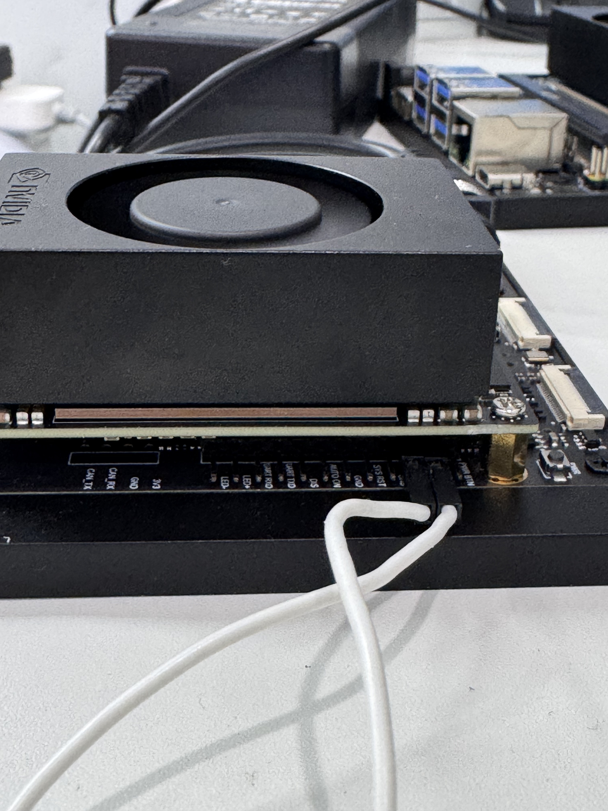
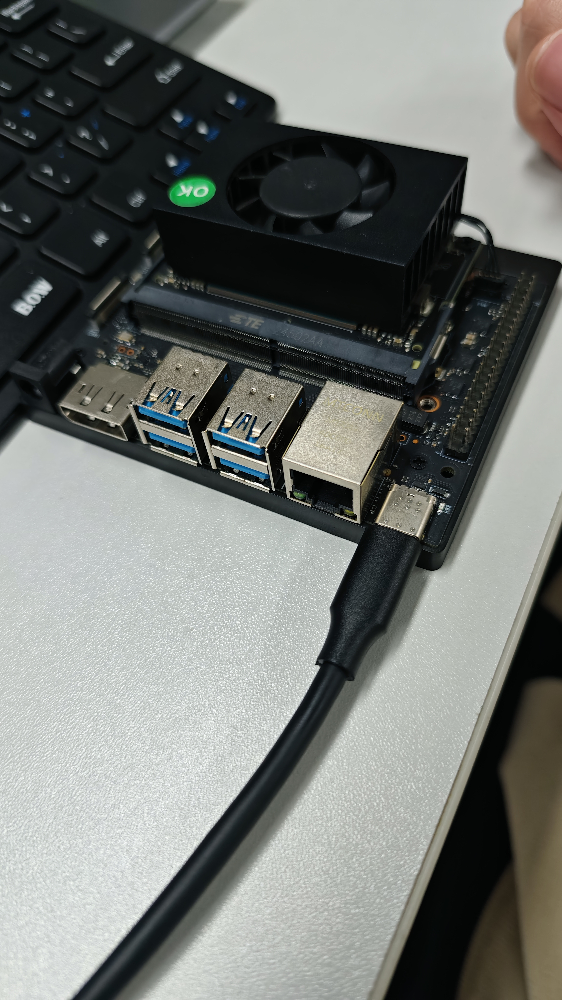
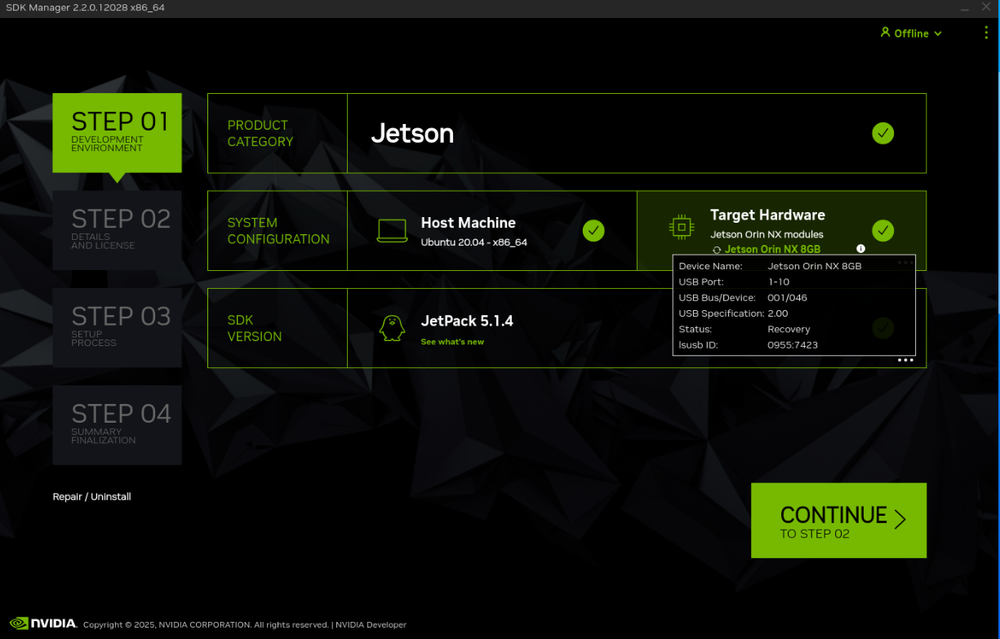
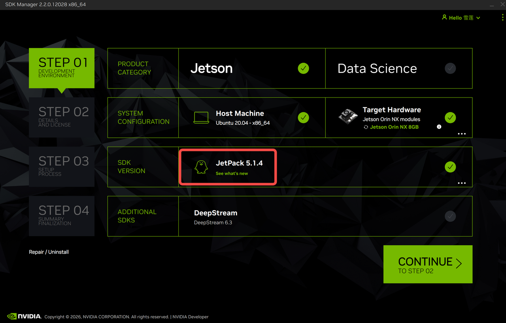

# 机器人上位机烧录镜像(NX)

[NX_1.3.0.zip 镜像下载地址](https://kuavo.lejurobot.com/back_images/NX_1.3.0.zip)

## 事前准备

|      | 物品                                                          | 数量 | 示例图                                                       |
| ---- | ------------------------------------------------------------ | ---- | ------------------------------------------------------------ |
| 1    | 安装了 **ubuntu 20.04** 系统的电脑/主机, 带显示器                | 1    | /                                                           |
| 2    | NVIDIA Jetson Orin NX 设备(安装于机器人胸口位置，需要拆卸身体外壳) | 1    | /                                                            |
| 3    | 烧录镜像的移动硬盘（250GB以上）                                 | 1    |  |
| 4    | 一根杜邦线（双母头）                                           | 1    |  |
| 5    | type-c数据线（需要能数据通信）                                 | 1    | /                                                            |
| 6    | 申请注册英伟达账号（登录SDK Manger使⽤）                        | 1    | /                                                            |

## 烧录前准备

1. 使 Orin NX 进入 Recovery 模式，将杜邦线短接NVIDIA Jetson Orin NX 的 GND 和 REC ，进入 Force Recovery Mode(强制恢复模式)





2. NX上电（可按机器人后背按钮接通整机电源）
3. 使用usb转type-c线，usb端接入ubuntu主机，type-c端接入 NX 上的接口



此时 NX 已与ubuntu主机连接，可进行镜像烧录

4. 若烧录完成后需要先将机器人断电，将短接的杜邦线和接入的type-c拔掉，然后将机器人后壳装好重启机器人

## 一、拷贝镜像

在 ubuntu 主机上打开文件管理系统，找到移动硬盘文件夹, 将里面的`nvidia_jeston_nx_backup_images_20250325_191108.tar.gz` 镜像文件拷贝到ubuntu主机目录`~/nvidia/nvidia_sdk/JetPack_5.1.4_Linux_JETSON_ORIN_NX_TARGETS/Linux_for_Tegra/tools/backup_restore` 然后解压，在主机终端中运行以下命令

```Shell
cd ~/nvidia/nvidia_sdk/JetPack_5.1.4_Linux_JETSON_ORIN_NX_TARGETS/Linux_for_Tegra/tools/backup_restore
tar -xzf nvidia_jeston_nx_backup_images_20250325_191108.tar.gz
```

## 二、命令行烧录镜像

在 ubuntu 主机中新建终端，然后运行下方命令执行(大约10-15分钟)：

```Shell
cd ~/nvidia/nvidia_sdk/JetPack_5.1.4_Linux_JETSON_ORIN_NX_TARGETS/Linux_for_Tegra
sudo ./tools/backup_restore/l4t_backup_restore.sh -e nvme0n1 -r jetson-orin-nano-devkit
```

如果最后输出日志看到

```
Operation finishes. You can manually reset the device
```

说明烧录成功!

## 三、备份镜像

若自己在上位机 NX 做项目开发，需要将项目系统文件和依赖库备份的话，可以自行备份镜像后恢复

1. ubuntu主机与 NX 连接，连接方式参考烧录前准备
2. 在ubuntu终端执行(大约10-15分钟)：

```Shell
cd ~/nvidia/nvidia_sdk/JetPack_5.1.4_Linux_JETSON_ORIN_NX_TARGETS/Linux_for_Tegra
sudo ./tools/backup_restore/l4t_backup_restore.sh  -e nvme0n1 -b jetson-orin-nano-devkit
cd ~/nvidia/nvidia_sdk/JetPack_5.1.4_Linux_JETSON_ORIN_NX_TARGETS/Linux_for_Tegra/tools/backup_restore
timestamp=$(date +%Y%m%d_%H%M%S) && sudo tar --warning=no-file-changed -czf "nvidia_jeston_nx_backup_images_${timestamp}.tar.gz" images/
```

3. 此时会在ubuntu主机`~/nvidia/nvidia_sdk/JetPack_5.1.4_Linux_JETSON_ORIN_NX_TARGETS/Linux_for_Tegra/tools/backup_restore`目录中出现`nvidia_jeston_nx_backup_images_xxx.tar.gz` 文件，这个文件即为可复用的镜像文件

## 四、SDK manager界面烧录镜像（自定义环境）

1. 首先需要在ubuntu主机上安装SDK Manager，在 ubuntu 打开终端, 输入以下指令下载 NVIDIA SDK Manager

        ```Shell
        wget https://developer.download.nvidia.com/compute/cuda/repos/ubuntu2004/x86_64/cuda-keyring_1.1-1_all.deb
        sudo dpkg -i cuda-keyring_1.1-1_all.deb
        sudo apt-get update
        wget https://developer.download.nvidia.cn/compute/cuda/repos/ubuntu2004/x86_64/sdkmanager_2.2.0-12028_amd64.deb  
        sudo apt install ./sdkmanager_2.2.0-12028_amd64.deb
        ```

2. 按照烧录前准备将NX切换成 Recovery 模式并连接至主机
3. 在主机终端中运行 SDK Manager

    ```Plain
    sdkmanager --archived-versions
    ```

4. 可以看到界面已经显示连接到NX



5. 此时需要配置刷入JetPack 5.1.4 版本需要在SDK VERSION选项中选择5.1.4，然后点击continue



6. 将 I accept the terms and conditions of the license agreements 选项打上√，然后点击continue继续安装
7. 等待完成烧录，完成后将 NX 恢复。

## 五、重刷镜像常见问题

1. 刷入镜像需要下载sdk manager 2.2.0-12028

      ```Plain
      wget https://developer.download.nvidia.cn/compute/cuda/repos/ubuntu2004/x86_64/sdkmanager_2.2.0-12028_amd64.deb  
      sudo apt install ./sdkmanager_2.2.0-12028_amd64.deb 
      ```

2. Sdk manager界面无法选择jetpack 5.1.4

    需要运行命令 `sdkmanager --archived-versions `启动sdk界面后才可以选择

3. 若出现cuda安装报错：`cuda-cross-aarch64-11-4 : Depends: g++-aarch64-linux-gnu → 缺少 ARM64 交叉编译的GCC 编译器；`

   然后进行一下操作：
   1. 获取可用的依赖包
   `apt-cache madison gcc-9-aarch64-linux-gnu g++-9-aarch64-linux-gnu`
   2. 安装适配版本的 gcc-9-aarch64-linux-gnu
   `sudo apt install -y gcc-9-aarch64-linux-gnu=<你的可用版本号>`
   3. 安装对应的 g++-9-aarch64-linux-gnu（版本号和上面一致）
   `sudo apt install -y g++-9-aarch64-linux-gnu=<你的可用版本号>`
   4. 安装完整的交叉编译工具链（无需指定版本，apt 会自动匹配）
   `sudo apt install -y gcc-aarch64-linux-gnu g++-aarch64-linux-gnu`