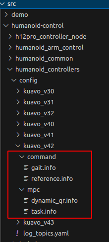

# info 文件说明
## info 文件路径及分布 
机器人运动，VR 遥操作等效果，可通过 info 配置文件来进行局部调优，使运动效果得到改善。
以 kuavo_v42 为例，文件夹路径及文件分布如下：

各文件的功能说明如下：
* $\text{gait.info}$：用于调整机器人步态的落足时序；
* $\text{reference.info}$：用于调整遥控器的限幅，和各关节的控制模式和上层扭矩的kpkd；
* dynamic_qr.info：MPC 根据步态，切换到对应的QR矩阵；
* $\text{task.info}$：MPC 和 WBC 各任务和约束，主要的修改文件；

## 各文件的具体说明

[TOC]

### gait. info

每种步态通过在 list 中写明来载入步态表，例如 "walk"，"trot"；
目前 kuavo 能稳定支持的步态包括：stance，trot 和 walk，在调整时重点关注。

不同的步态，描述的是完成周期性运动的落足情况。对于每个步态，有以下两部分组成：
* modeSequence：接触模式，用于描述机器人双脚与地面的接触情况；
* switchingTimes：用于描述不同接触模式的持续时间，与接触模式一一对应；

modeSequence 是两个英文字母组成的字符串，单个英文描述单腿的接触情况，先左腿后右腿。
对于单条腿，接触模式有以下几种：
* S：stance，表示脚掌完全接触地面；
* F：floating，表示脚掌完全离开地面；
* T：Toe，表示仅脚尖接触地面；
* H：Heel，表示仅脚跟接触地面；

### reference. info

reference.info 文件包括两个方面：
1. 规划层的限幅（遥控器指令限幅，VR操作时手臂摆动的速度限幅）；
2. 关节层的电机模式和对应的kpkd参数；

以下具体介绍：
|           数据名                  |          描述          |
| :----------------------------:   | --------------------- |
| cmdvelLinearXLimit               | 机器人前进的最大速度，单位：m/s  |
| cmdvelAngularYAWLimit            | 机器人绕 yaw 方向转动的最大速度，单位：rad/s  |
| targetTorsoDispalcementVelocity  | 使用 VR 遥操作时，躯干的最大速度，平动单位：m/s，转动单位：rad/s|
| defaultCotrolMode                | 各个关节发送指令时，默认的电机模式 |
| joint_kp_                        | 站立模式下，各关节(除了头部) CST 模式下的扭矩指令，EC主站中位置环对应的kp系数 (2kHz) |
| joint_kd_                        | 站立模式下，各关节(除了头部) CST 模式下的扭矩指令，EC主站中速度环对应的kd系数 (2kHz) |
| head_kp_                         | 上层控制器下发头部扭矩时，执行的位置环对应的kp系数 (500Hz) |
| head_kd_                         | 上层控制器下发头部扭矩时，执行的速度环对应的kd系数 (500Hz) |
| joint_kp_walking_                | 机器人运动时，对应关节 CST 模式下，EC主站中位置环对应的kp系数 (2kHz) |
| joint_kd_walking_                | 机器人运动时，对应关节 CST 模式下，EC主站中位置环对应的kp系数 (2kHz) |
| acc_filter_cutoff_freq           | 获取传感器数据后，加速度计的滤波截止频率 |
| gyro_filter_cutoff_freq          | 获取传感器数据后，陀螺仪的滤波截止频率 |
| arm_joint_pos_filter_cutoff_freq | 手臂角度指令的滤波截止频率 |
| arm_joint_vel_filter_cutoff_freq | 手臂速度指令的滤波截止频率 |

### dynamic_qr.info

dynamic_qr.info 用于根据不同步态，MPC可切换不同的权重矩阵。

需要注意的是：
  * 若启用 dynamic_qr，则要保证矩阵维度对应于变量的维度，否则求解器报错；
  * 目前仅 DDP 支持，若使用 SQP 求解器，则 dynamic_qr 不会生效。

目前支持三种Q矩阵的切换
|     数据名         |          描述         |
| ----------------- | --------------------- |
|  Q_base_stance    |    stance 步态时生效    |
|   Q_base_walk     |  walk 和 trot 步态生效  |
|   Q_base_jump     |   jump 步态生效         |

### task. info

task.info 主要包括以下几种配置信息：
1. MPC 的模型设置；
2. 运动时，MPC 全身摆动轨迹的配置；
3. MPC 求解器设置；
4. MPC 使用的权重矩阵 Q，P，R；
5. MPC 各种软约束和硬约束的参数；
6. WBC 的扭矩约束和摩擦锥约束；
7. wbc 加速度任务的增益系数；
8. wbc 各加速度任务的权重；
9. 卡尔曼滤波器的参数设置；
10. 接触力估计的参数设置；
11. 代码运行时，重要频率的监测数据；

#### 几乎不修改的配置

该节所列出的配置，在项目中基本不修改，与具体的功能之间的关系较难量化。

|    数据名              |  包含子成员  |          描述          |
| :-------------------: | :--------: | --------------------- |
| centroidalModelType   |  无        | MPC使用的模型类型 (0为全质心模型，1为单刚体模型)  |
| humanoid_interface    |  verbose    | 布尔量，为true可显示humanoid_interface载入时的具体过程  |
|                       |  useAnalyticalGradientsDynamics | 采用解析的动力学模型，只支持false |
|                       |  useAnalyticalGradientsConstraints | 采用解析的末端足底运动学，支持false |
|   sqp   | nThreads  |  sqp 求解时，参与并行计算的最大CPU数量      | 
|         | dt        |  用户定义的动力学离散化时间                |
|         | sqpIteration |  sqp 求解的迭代次数，次数多则增加求解时间 |
|         | deltaTol |  x(t)和u(t)的均方根误差小于该值，终止迭代 |
|         | g_max & g_min |   g 表示违反约束的值函数的范数, 分别表示最大和最小值 |
|         | inequalityConstraintMu &  inequalityConstraintDelta| 表示不等式约束违反的宽松程度 |
|         | projectStateInputEqualityConstraints | 是否使用投影方法求解硬约束 |
|         | printSolverStatistics &  printSolverStatus &  printLinesearch | 求解过程的相关信息打印 |
|         | useFeedbackPolicy | 是否启用 RiccatiFeedback |
|         | integratorType | 动力学离散化方法 |
|         | threadPriority | MPC 求解时，所使用线程的优先级 |
| ddp & ipm | 若干 | 渐渐不再使用，略 |
| rollout | AbsTolODE | ODE 求解器的绝对容忍误差 |
|         | RelTolODE | ODE 求解器的相对容忍误差 |
|         | timeStep  | 逐步推进动力学模拟的时间步长 |
|         | integratorType | 推进动力学模拟使用的积分器类型 |
|         | maxNumStepsPerSecond | ODE 求解器每秒最大的积分点数量 |
|         | checkNumericalStability | 布尔变量，是否需要检查 rollout 过程的数值稳定性 |
|  mpc  | timeHorizon | MPC 预测时域，越长则求解耗时越长 |
|       | solutionTimeWindow | 希望保留的优化输出的时间序列长度， 负数表示检索整个预测时域的优化输出 |
|       | recordSolverData | 布尔量，表示是否要回放MPC求解结果 |
|       | coldStart | 每次运算MPC是否重置，通常不重置，求解速度更快 |
|       | debugPrint | 在终端中实时打印MPC调用的时间信息 |s
|       | mpcDesiredFrequency &  mrtDesiredFrequency | mpc和mrt模块的期望输出频率 |
| MonitorParams | totalNum | 监测器的数据队列长度 |
|               | recentNum | 监测器对异常给予警报的新数据数量 |
|               | warningThreshold &  errorThreshold | 警告/报错倍数，若最新数据大于队列数据 的均值加"方差*倍数"，则打印警告/错误信息 |
|               | mpcFrequencyBiasPercent &  mpcFrequencyBiasPercent | 频率阈值百分比，mpc/wbc 需保持在期望频率的上下百分比区间内， 否则打印警报；若队列所有数据均在阈值区间外，则打印报错 |
|               | printWarning | 布尔量，是否将警告信息在终端中打印 |
| contact_cst_st | 无 | 时间长度，单位:s。膝关节 kpkd 在修改步态前的设置时间 之后，会切换为 joint_kp_walking_ 中的设置 |
| contact_cst_et | 无 | 时间长度，单位:s。膝关节 kpkd 在修改步态后的设置时间 之内，会切换为 joint_kp_walking_ 中的设置 |

#### 与 MPC 相关的调参设置

|    数据名              |  包含子成员  |          描述          |
| :-------------------: | :--------: | --------------------- |
| model_settings | positionErrorGain &  positionErrorGain &  velocityErrorGain_xy | 下肢摆动足跟踪约束的位置和速度误差增益 |
|                | phaseTransitionStanceTime | 切换为站立的延迟时间 |
|                | verboseCppAd | 打印 CppAD 的装载情况 |
|                | recompileLibrariesCppAd | 若路径已存在文件，是否重新编译CppAD，默认为false |
|                | modelFolderCppAd | CppAD 文件的缓存路径，需与版本号保持一致 |
|                | modelDof &  mpcArmsDof &  mpcLegsDof | 分别表示: 全身关节总的自由度 &  &emsp;&emsp;&emsp;&emsp;参与MPC计算的手臂自由度 &  &emsp;&emsp;&emsp;&emsp;参与MPC计算的下肢自由度
|                | jointNames | 总共可参与MPC计算的关节名称，与 modelDof 关联 |
|                | jointNamesReal | 实物机器人可控制的关节名称，与实物电机数量关联 |
|                | contactNames6DoF | 参与MPC计算的六维接触点，通常是上肢 |
|                | contactNames3DoF | 参与MPC计算的三维接触点，通常是下肢，且必须为8点 |
|                | eeFrame | MPC中与末端六维跟踪约束相关的坐标系名称 |
| swing_trajectory_config | liftOffVelocity | 机器人抬腿的末端z方向初速度 |
|                         | touchDownVelocity | 机器人落足的末端z方向速度 |
|                         | swingHeight | 机器人抬腿的最高高度 |
|                         | swingTimeScale | 如果摆动相总时间小于该值，则抬腿高度会降低 |
|                         | toeSwingHeight | 拟人步态中，脚跟着地时，脚尖的z方向高度 |
|                         | heelSwingHeight | 拟人步态中，脚尖着地时，脚跟的z方向高度 |
|                         | deadBandVelocity | 拟人步态中，躯干x方向速度小于该值，则退化为trot |
|                         | heelToeMaxHeightVelocity | 拟人步态中，躯干x方向速度小于该值， 则将拟人步态的脚跟脚尖抬升高度进行缩小 |
|                         | swing_shoulder_center &  swing_shoulder_center &  swing_elbow_scale | 分别表示：摆臂时肩膀pitch电机的转动中心(单位:rad)& &emsp;&emsp;&emsp;&emsp;摆臂时肩膀pitch电机的摆动范围(单位:rad)& &emsp;&emsp;&emsp;&emsp;摆臂时肘关节电机的摆动范围(单位:rad) |
| Q & P | 无 | Q为过程状态权重，P为终端状态权重(默认不启用)， 内部 scaling 为缩放因子，将矩阵数据统一缩放， 权重的顺序为：归一化质心动量，基坐标位姿，关节位置 |
| R | 无 | R为控制权重矩阵，scaling为缩放因子，权重的顺序为： 三维接触点的接触力，六维接触点的接触力， 三维接触点相对躯干的摆动速度，手臂各关节速度 |
| endEffector &  finalEndEffector | muPosition & muOrientation | 手臂末端点的跟踪和终端约束，目前不会使用 |
| enableZeroSixDofForceConstraint | 无 | 布尔量，表示是否启用手臂末端零力约束 |
| frictionConeSoftConstraint | frictionCoefficient | 摩擦锥约束中设置的摩擦系数 |
|                            |  mu & delta | 分别表示：缩放因子，越大则约束惩罚程度越大 & 松弛屏障阈值，越小则越接近对数屏障 |
| basePitchLimits | 若干 | 表示对躯干 pitch 的 state-only 约束， 限制 mrt 中 pitch 的角度和角速度的输出范围 |
| zeroVelocityConstraint | enable | 布尔量，是否启用软约束，约束支撑相零速度， 默认需要启用，硬约束求解难度较大 |
| softSwingTrajConstraint | weight | 摆动足的x-y方向跟踪软约束的权重 |
| selfCollision | 若干 | 自碰撞约束，可写入碰撞对，用于约束 URDF中对应名称的连杆不可碰撞 |
#### 与 WBC 相关的调参设置

WBC 以全身逆动力学为约束，构建多个加速度任务，从而优化得到机器人执行的前馈扭矩。
可调参数具体如下表：
|    数据名              |  包含子成员  |          描述          |
| :-------------------: | :--------: | --------------------- |
| torqueLimitsTask | 无 | 全身各电机的扭矩约束， 左右需对称，仅设置一组 |
| Wbc_rdd_K_ | stance & walk | 质心位置跟踪加速度任务的 kp/kd，  stance 在双支撑阶段生效, walk 在之外的阶段生效 |
| frictionConeTask | frictionCoefficient | WBC 中摩擦锥约束的摩擦系数 |
| swingLegTask | real & sim | 摆动足跟踪加速度任务。 kp/kd 表示z方向跟踪增益, kp/kd_xy 表示x-y方向跟踪增益， real 在实物中生效，sim 在仿真中生效 |
| baseAccelTask | kp & kd | 躯干x-y方向基坐标跟踪任务，目前不使用 |
| baseHeightTask | kp & kd | 躯干基坐标z方向高度跟踪任务，目前不使用 |
| baseAngularTask | kp & kd | 躯干角度跟踪加速度任务， kp/kd 的顺序为 roll/pitch/yaw |
| armAccelTask | kp & kd | 手臂关节跟踪加速度任务，对应的各关节kp/kd |
| weight | stance & walk | stance 在双支撑阶段生效，walk 在之外的阶段生效， 若干参数表示各自任务对应的权重 |

#### 状态估计相关的调参设置

|    数据名              |  包含子成员  |          描述          |
| :-------------------: | :--------: | --------------------- |
| kalmanFilter | footRadius | 脚掌 z 方向的偏置，单位: m |
|              | imuProcessNoisePosition | imu 估计位置的过程噪声协方差 |
|              | imuProcessNoiseVelocity | imu 估计速度的过程噪声协方差 |
|              | imuProcessNoiseZPosition &  imuProcessNoiseZVelocity | 仅stance步态生效，z方向 imu  估计位置/速度的过程噪声 |
|              | footProcessNoisePosition | 引入足端位置的过程噪声协方差 |
|              | footSensorNoisePosition  | 引入足端位置的测量噪声协方差 |
|              | footSensorNoiseVelocity | 引入足端速度的测量噪声协方差 |
|              | footHeightSensorNoise | 足端高度的测量噪声协方差 |
| contactForceEsimation | cutoffFrequency | 测量广义动量的截止频率 |
|                       | contactThreshold | 判断足端接触状态的z方向阈值 |
|                       | detectCutoffFrequency | 基于关节冲量的接触检测，对应滤波器的截止频率 |
|                       | maxEnergyThreshold & minEnergyThreshold & maxEnergyThreshold2 & minEnergyThreshold2 | 基于关节冲量的接触检测， 对应的一些阈值设置 |
|                       | time_treshold_ | 两次接触状态判断，之间的时间间隔阈值 |
