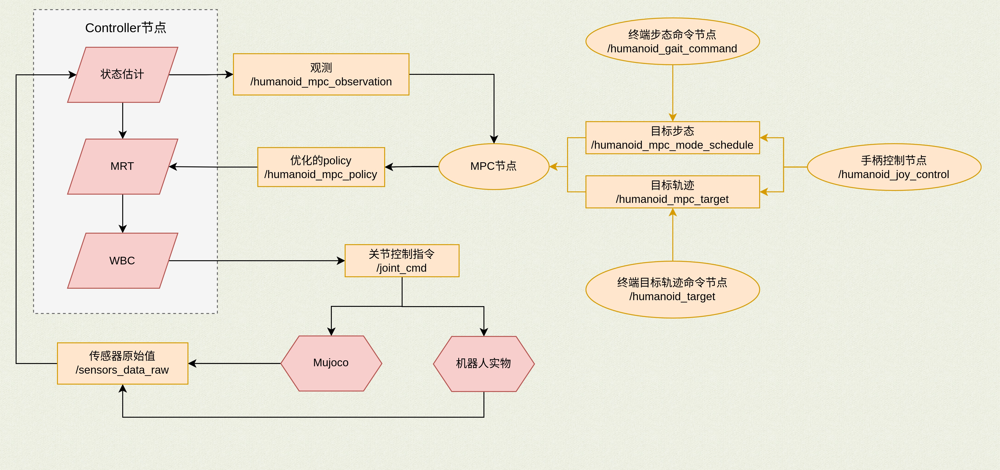
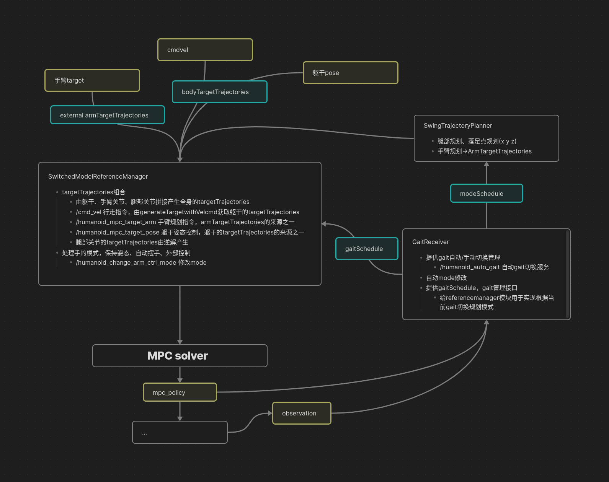

# 运动控制API

节点的含义参考:[topics定义](./readme.topics.md)

- 控制流程图：

- MPC节点处理目标轨迹的流程

---

## 目录

- [1. 行走控制](#1-行走控制)
- [2. 操作控制](#2-操作控制)
- [3. 传感器与状态](#3-传感器与状态)
- [4. 控制器调试](#4-控制器调试)
- [5. VR相关](#5-vr相关)

---

## 1. 行走控制

- 本节包含**MPC**控制机器人行走、步态切换和躯干运动的接口。
- **RL以及多控制器相关的文档和接口说明查看另外一个`RL控制框架ROS接口文档.md`**

### 1.1 服务 (Services)

#### `/humanoid_auto_gait`

**类型:** 未指定

**功能说明:**

是否自动切换gait，默认true，收到非零的 `/cmd_vel` 会自动切换到walk模式，收到全0的 `/cmd_vel` 会自动切换到stance模式。

**使用说明:**

- 手动模式下，需要先发布 `/humanoid_mpc_mode_schedule` 才能切换gait模式

---

#### `/humanoid_single_step_control`

**类型:** `kuavo_msgs::singleStepControl`

**功能说明:**

单步控制，通过给出时间序列和对应的躯干位姿，可以控制机器人的单步行走

**使用说明:**

- 时间序列和躯干位姿序列长度必须一致，时间序列需要不断递增
- 每次服务请求的躯干位姿都是基于局部坐标系，但是一次服务请求中的躯干位姿序列需要以第一个位姿为基准不断变化

---

#### `/humanoid_get_current_gait_name`

**类型:** `kuavo_msgs::changeArmCtrlMode`

**功能说明:**

该服务用户获取机器人当前的步态名称，比如`stance`、`walk`等

**消息字段:**

| 字段 | 类型 | 描述 |
| --- | --- | --- |
| gait_name | string | 返回数据，机器人当前的步态名称 |
| success | bool | 返回数据, 是否调用成功 |

---

### 1.2 话题 (Topics)

#### `/cmd_vel`

**类型:** `geometry_msgs::Twist`

**功能说明:**

控制指令，6dof 速度指令，机器人的target指令的速度形式，包含xy方向速度、高度z和yaw方向速度，但 roll、pitch 方向不控制。

**消息字段:**

| 字段 | 类型 | 描述 |
| --- | --- | --- |
| linear.x | float64 | x线性速度, 单位(m/s) |
| linear.y | float64 | y线性速度, 单位(m/s) |
| linear.z | float64 | 增量高度, 单位(m) |
| angular.z | float64 | yaw方向速度, 单位(radian/s) |
| angular.x | float64 | 未使用 |
| angular.y | float64 | 未使用 |

**使用说明:**

- 直接发送非0的 `/cmd_vel` 指令，机器人会自动切换到walk拟人步态行走,
- 行走过程中发送全0的 `/cmd_vel` 指令，机器人会自动切换到 stance 站立状态。
- linear.z 增量高度表示: 机器人最终的高度=标称高度+linear.z, 标称高度可通过`rosparam get /com_height`

---

#### `/cmd_pose`

**类型:** `geometry_msgs::Twist`

**功能说明:**

位置控制指令, 可用与控制机器人从当前位置到达目标 pose

**消息字段:**

| 字段 | 类型 | 描述 |
| --- | --- | --- |
| linear.x | float64 | 基于当前位置的 x 方向值, 单位(m) |
| linear.y | float64 | 基于当前位置的 y 方向值, 单位(m) |
| linear.z | float64 | 增量高度, 单位(m) |
| angular.z | float64 | yaw方向速度, 单位(radian/s) |
| angular.y | float64 | 未使用 |
| angular.x | float64 | 未使用 |

**使用说明:**

- 比如 x = 0.5, 即基于机器人当前位置向前 0.5 m.
- linear.z 增量高度表示: 机器人最终的高度=标称高度+linear.z, 标称高度可通过`rosparam get /com_height`

---

#### `/humanoid_mpc_target_pose`

**类型:** `ocs2_msgs::mpc_target_trajectories`

**功能说明:**

躯干 6dof 位姿规划指令

**消息字段:**

| 字段 | 类型 | 描述 |
| --- | --- | --- |
| timeTrajectory | float64[] | 时间戳, 定义每个轨迹点的时间, 单位(s) |
| stateTrajectory | ocs2_msgs/mpc_state[] | 躯干 6dof 状态目标值 |
| inputTrajectory | ocs2_msgs/mpc_input[] | 躯干 6dof 状态输入值 |

**使用说明:**

- 躯干 6dof 位姿规划指令,只包含6维度 `poseTargetTrajectories`
- 注意位姿指令优先级比 cmd_vel 指令高，不要同时发送两种指令
- 其中, value 数组的元素顺序为: x,y,z,yaw,pitch,roll, 位置单位(m), 方向单位(radian)

---

#### `/humanoid_mpc_mode_schedule`

**类型:** `ocs2_msgs::mode_schedule`

**功能说明:**

用于切换gait指令

**使用说明:**

- 注意: 发布的模板要和gait.info中定义的gait严格一致

---

#### `/humanoid_mpc_gait_change`

**类型:** `std_msgs::String`

**功能说明:**

用于切换gait指令

**使用说明:**

- 描述：输入步态名字即可，例如：'walk','stance'
- **注意：** 该话题是在`/humanoid_mpc_mode_schedule`的基础上进行封装给用户使用的，为保证安全仅支持`walk`和`stance`切换

---

#### `/humanoid_mpc_stop_step_num`

**类型:** `std_msgs::Int32`

**功能说明:**

停止步数，从当前统计的步数开始，机器人会在后续第N步自动停下

**使用说明:**

- 可以在发送`/humanoid_mpc_mode_schedule`之前或者行走时发送，步数控制没接收一次指令只作用一次.

---

#### `/humanoid_mpc_foot_pose_target_trajectories`

**类型:** `kuavo_msgs::footPoseTargetTrajectories`

**功能说明:**

用于单步控制

**使用说明:**

- 参考`src/humanoid-control/humanoid_interface_ros/scripts/simStepControl.py`,发布脚的步态位姿（xyz+yaw,后续会添加脚的pitch和yaw）指令
- 事实上, 可以指定每一步的脚步态位姿, 以及对应时刻的躯干姿态, 但这一功能建议高级开发者使用

---

## 2. 操作控制

本节包含控制机器人手臂、手部、头部和末端执行器的接口。

### 2.1 服务 (Services)

#### `/humanoid_get_arm_ctrl_mode`

**类型:** `kuavo_msgs::changeGaitMode`

**功能说明:**

获取当前控制模式，返回 control_mode

---

#### `/humanoid_change_arm_ctrl_mode`

**类型:** `kuavo_msgs::changeArmCtrlMode`

**功能说明:**

修改手臂控制模式，control_mode 有三种模式

**控制模式:**

- 0: keep pose 保持姿势
- 1: auto_swing_arm 行走时自动摆手，切换到该模式会自动运动到摆手姿态
- 2: external_control 外部控制，手臂的运动由外部控制

---

#### `/gesture/list`

**设备支持:**

- ✅ qiangnao (标准灵巧手 for Kuavo)
- ✅ qiangnao_touch (触觉灵巧手 for Kuavo)
- ✅ revo2 (revo2 二代手 for Roban)

**功能说明:**

列出所有预设的手势

**示例代码:**

[list_all_gestures.py](../src/demo/gesture/list_all_gestures.py)

  
<b> 点击展开查看所有手势列表, 注意:如与服务接口返回不一致, 请以实际情况为准!</b>

  <table>
  <tr><th>名称</th><th>名称</th><th>别名</th><th>描述</th></tr>
  <tr><td>单指点（内收式）</td><td>"finger-pointing-opposed"</td><td>"number_1"</td><td>用于触动按钮开关、点击键盘、鼠标、指示方向。该手势也可用于表示数字"1"</td></tr>
  <tr><td>单指点（外展式）</td><td>"finger_pointing-unopposed"</td><td>"number_8"</td><td>用于触动按钮开关，表示数字"8"。</td></tr>
  <tr><td>两指夹（内收式）</td><td>"two-finger-spread-opposed"</td><td>"number_2", "victory"</td><td>用于夹持条状物体，如香烟，也可表示"胜利"、数字"2"。</td></tr>
  <tr><td>两指夹（外展式）</td><td>"two-finger-spread-unopposed"</td><td>"hold-cigarette"</td><td>用于夹持条状物体，如香烟。</td></tr>
  <tr><td>两指捏（外展式）</td><td>"precision-pinch-unopposed"</td><td>"ok","number_3"</td><td>用于捏取尺寸、重量较小的物体，表示"OK"。</td></tr>
  <tr><td>两指捏（内收式）</td><td>"precision-pinch-opposed"</td><td></td><td>用于捏取尺寸、重量较小的物体，如硬币、卡片、钥匙、固体胶、花生、葡萄。</td></tr>
  <tr><td>鼠标手势</td><td>"mouse-control"</td><td></td><td>用于控制鼠标，选定该手势以后，仿生手形成对鼠标的包络。</td></tr>
  <tr><td>兔指</td><td>"rock-and-roll"</td><td></td><td>用于彰显个性。</td></tr>
  <tr><td>三指捏（外展式）</td><td>"tripod-pinch-unpposed"</td><td></td><td>用于捏取尺寸中等或是盘状的物体，如手机，瓶盖，固体胶等。</td></tr>
  <tr><td>三指捏（内收式）</td><td>"tripod-pinch-opposed"</td><td>"number_7"</td><td>捏取物体，表示手势数字七。</td></tr>
  <tr><td>食指弹</td><td>"flick-index-finger"</td><td></td><td>用于利用电机和扭簧配合弹出食指。</td></tr>
  <tr><td>中指弹</td><td>"flick-middle-finger"</td><td></td><td>用于利用电机和扭簧配合弹出中指。</td></tr>
  <tr><td>托夹式（大拇指内收）</td><td>"inward-thumb"</td><td>"number_4"</td><td>多用于托碗、盘子等。表示手势数字四。</td></tr>
  <tr><td>四指拿</td><td>"four-finger-straight"</td><td></td><td>用于端取碗或大直径的圆柱物体，物体不接触手心。</td></tr>
  <tr><td>五指张开</td><td>"palm-open"</td><td>"number_5"</td><td>用于平托物体，表示手势数字五。</td></tr>
  <tr><td>握拳</td><td>"fist"</td><td></td><td>握持各类不同大小、形状的物体，如水杯、网球、球拍、苹果。</td></tr>
  <tr><td>虎克提</td><td>"thumbs-up"</td><td>"thumbs-up"</td><td>用于提取物体，如手提袋、包等。同时表达：真棒！点个赞！</td></tr>
  <tr><td>侧边捏</td><td>"side-pinch"</td><td></td><td>用于拿接名片、捏物品等。</td></tr>
  <tr><td>夹笔1</td><td>"pen-grip1"</td><td></td><td>用于夹普通笔、毛笔等写字。</td></tr>
  <tr><td>夹笔2</td><td>"pen-grip2"</td><td></td><td>用于夹普通笔、毛笔等写字。</td></tr>
  <tr><td>五指抓</td><td>"cylindrical-grip"</td><td>"five-finger-grab"</td><td>用于抓取物体，手心不完全接触物体。</td></tr>
  <tr><td>666</td><td>"shaka-sign"</td><td>"number_6", "666"</td><td>表示数字六，同时也是网路用语666。</td></tr>
  <tr><td>五指捏</td><td>"five-finger-pinch"</td><td></td><td>用于抓握物体。</td></tr>
  <tr><td>两指侧捏</td><td>"two-finger-side-pinch"</td><td>"pen-grip3"</td><td>利用食指侧边配合大拇指完成物品捏取。</td></tr>
  </table>
  

---

#### `/gesture/execute`

**设备支持:**

- ✅ qiangnao (标准灵巧手 for Kuavo)
- ✅ qiangnao_touch (触觉灵巧手 for Kuavo)
- ✅ revo2 (revo2 二代手 for Roban)

**功能说明:**

该服务用于**抢占式**执行预设的手势(假如有手势正在执行则会中断该执行)，通过 gesture_names 来选择手势，手势名称可以通过 `/gesture/list` 查看

**使用说明:**

- **警告:不要在使用 `/control_robot_hand_position`控制灵巧手的同时调用该接口, 否则会出现无法预料的效果.**

**示例代码:**

[gesture_client.py](../src/demo/gesture/gesture_client.py)

---

#### `/gesture/execute_state`

**设备支持:**

- ✅ qiangnao (标准灵巧手 for Kuavo)
- ✅ qiangnao_touch (触觉灵巧手 for Kuavo)
- ✅ revo2 (revo2 二代手 for Roban)

**功能说明:**

该服务用于查询是否有手势正在执行

---

#### `/dexhand/change_force_level`

**类型:** `kuavo_msgs::handForceLevel`

**设备支持:**

- ✅ qiangnao (标准灵巧手 for Kuavo)
- ✅ qiangnao_touch (触觉灵巧手 for Kuavo)
- ❌ revo2 (revo2 二代手 for Roban)

**功能说明:**

该服务修改灵巧手的抓力程度

---

#### `/control_robot_leju_claw`

**类型:** `kuavo_msgs::controlLejuClaw`

**设备支持:**

- ✅ lejuclaw (二指夹爪)

**功能说明:**

该服务用于控制二指夹爪

**消息字段:**

| 字段 | 类型 | 描述 |
| --- | --- | --- |
| data | kuavo_msgs/endEffectorData | 请求数据, 夹爪相关的消息 |
| success | bool | 返回数据, 是否调用成功 |
| message | string | 返回数据, 消息 |

关于 data 字段, 其中 `kuavo_msgs/endEffectorData`的消息定义如下:

| 字段 | 类型 | 描述 |
| --- | --- | --- |
| name | string[] | 必填项, 数组长度为2, 数据为"left_claw", "right_claw" |
| position | float64[] | 必填项, 数组长度为2, 夹爪目标位置值, 范围为0 ~ 100, 表示行程占比, 0 为张开, 100 为闭合 |
| velocity | float64[] | 选填项, 数组长度为2, 夹爪目标速度值, 0 ~ 100, 不填写时默认为50 |
| effort | float64[] | 选填项, 数组长度为2, 夹爪目标电流, 单位 A, 不填写时默认为 1.0A |

**使用说明:**

- **注意/警告**：如果当前夹爪处于运动状态，那么发送新的请求就会被丢弃处理，不会执行，望知悉。
- name: 注意名称只能设置为"left_claw"或 "right_claw"
- position: 范围 0 ~100, 表示行程占比, 0 为张开, 100 为闭合
- velocity: 速度, 默认为 50,
- effort: 力距, 电机不会输出大于该值的电流, 如果给的过小，可能运动效果受限，推荐 1A~2A）, 默认为 1.0 A.

**示例代码:**

[leju_claw_client.py](../src/demo/control_lejuclaw/leju_claw_client.py)

---

#### `/dexhand/left/enable_touch_sensor` 和 `/dexhand/right/enable_touch_sensor`

**类型:** `kuavo_msgs::controlLejuClaw`

**设备支持:**

- ✅ qiangnao_touch (触觉灵巧手 for Kuavo)

**功能说明:**

该服务用于开启/关闭对应的手指触觉传感器.

**消息字段:**

| 字段 | 类型 | 描述 |
| --- | --- | --- |
| mask | uint8 | 用btis位来表示开启/关闭哪个传感器 |

- THUMB_SENSOR 0x01
- INDEX_SENSOR 0x02
- MIDDLE_SENSOR 0x04
- RING_SENSOR 0x08
- PINKY_SENSOR 0x10

---

### 2.2 话题 (Topics)

#### `/robot_head_motion_data`

**类型:** `kuavo_msgs::robotHeadMotionData`

**功能说明:**

用于控制机器人头部的运动，通过发布目标关节角度来实现头部控制。

**消息字段:**

| 字段 | 类型 | 描述 |
| --- | --- | --- |
| joint_data | float64[] | 关节数据, 单位(degree) |

**使用说明:**

- joint_data: 机器人头部关节数据，长度为 2,
- joint_data[0]：偏航角度（yaw），范围：[-30°, 30°],
- joint_data[1]：俯仰角度（pitch），范围：[-25°, 25°].

---

#### `/robot_waist_motion_data`

**类型:** `kuavo_msgs::robotWaistControl`

**功能说明:**

用于控制机器人腰部转动的目标角度（躯干绕竖直轴 yaw 方向）。发布该话题后，控制器会按内部规划将腰部驱动到目标角度。

**消息字段:**

| 字段 | 类型 | 描述 |
| --- | --- | --- |
| header | std_msgs/Header | 消息头，可设置 header.stamp |
| data | std_msgs/Float64MultiArray | data.data 为长度 1 的数组，表示腰部目标角度 |

**使用说明:**

- `data.data[0]`：腰部目标角度，**单位：度（°）**。左转为负、右转为正；具体范围以机型为准，超出范围会被控制器限制。

---

#### `/control_robot_hand_position`

**类型:** `kuavo_msgs::robotHandPosition`

**设备支持:**

- ✅ qiangnao (标准灵巧手 for Kuavo)
- ✅ qiangnao_touch (触觉灵巧手 for Kuavo)
- ✅ revo2 (revo2 二代手 for Roban)

**功能说明:**

用于控制机器人双手(手指)的运动，通过发布手指目标关节位置来实现手部的精确控制。

**消息字段:**

| 字段 | 类型 | 描述 |
| --- | --- | --- |
| left_hand_position | uint8[] | 左手手指位置, 单位(degree) |
| right_hand_position | uint8[] | 右手手指位置, 单位(degree) |

**使用说明:**

- left_hand_position：左手各关节的目标位置，包含6个元素，每个元素的取值范围为[0, 100], 0 为张开，100 为闭合,
- right_hand_position：右手各关节的目标位置，包含6个元素，每个元素的取值范围为[0, 100], 0 为张开，100 为闭合,。
- 6个元素对应: 大拇指关节，拇指外展肌，食指关节, 中指关节，无名指关节，小指关节.

---

#### `/kuavo_arm_traj`

**类型:** `sensor_msgs::JointState`

**功能说明:**

用于控制机器人手臂运动，通过发布手臂目标关节位置来实现手臂的精确控制.

**消息字段:**

| 字段 | 类型 | 描述 |
| --- | --- | --- |
| name | string[] | 关节名称 |
| position | float64[] | 关节位置, 单位(degree) |
| velocity | float64[] | 关节速度 -- |
| effort | float64[] | 关节扭矩, 单位(N·m) |

**使用说明:**

- 每个字段的数组长度相等, 长度为配置文件中`NUM_ARM_JOINT`, 即两条手臂的关节数和.
- 其中, 前`NUM_ARM_JOINT/2`个元素为左臂数据, 后`NUM_ARM_JOINT/2`个元素为右臂数据.
- **<mark>WARN</mark>**: 请注意，目前只有位置信息会生效，后续支持速度和扭矩之后当前备注会去掉.

---

#### `/kuavo_arm_target_poses`

**类型:** `kuavo_msgs::armTargetPoses`

**功能说明:**

控制机器人手臂在指定时间内到达目标位置

**消息字段:**

| 字段 | 类型 | 描述 |
| --- | --- | --- |
| times | float64[] | 时间, 单位(s) |
| values | float64[] | 手臂关节位置, 单位(degree) |

**使用说明:**

- times: 机器人手臂到达目标位置的时间，全局时间，不断递增
- values: 每一次机器人手臂目标位置，长度为 `NUM_JOINT` * times.size()

---

#### `/joint_cmd`

**类型:** `kuavo_msgs::jointCmd`

**功能说明:**

用于控制机器人

**消息字段:**

| 字段 | 类型 | 描述 |
| --- | --- | --- |
| joint_q | float64[] | 关节位置, 单位(radian) |
| joint_v | float64[] | 关节速度, 单位(radian/s) |
| tau | float64[] | 关节扭矩,单位(N·m) |
| tau_max | float64[] | 最大关节扭矩,单位(N·m) |
| tau_ratio | float64[] | 扭矩系数 |
| joint_kp | float64[] | kp 参数 |
| joint_kd | float64[] | kd 参数 |
| control_modes | int32[] | 关节对应的控制模式 |
| header | std_msgs/Header | 时间戳等信息 |

**使用说明:**

- 数组长度为配置文件中的`NUM_JOINT`, 即关节总数和
- 关节控制模式中, 0: Torque 控制模式, 1: Velocity 控制模式, 2: Position 控制模式

---

#### `/humanoid_mpc_target_arm`

**类型:** `ocs2_msgs::mpc_target_trajectories`

**功能说明:**

手臂规划指令，用于控制手臂运动

**消息字段:**

| 字段 | 类型 | 描述 |
| --- | --- | --- |
| timeTrajectory | float64[] | 时间戳, 定义每个轨迹点的时间, 单位(s) |
| stateTrajectory | ocs2_msgs/mpc_state[] | 手臂关节状态目标值, 单位(radian) |
| inputTrajectory | ocs2_msgs/mpc_input[] | 手臂关节状态输入值, 单位(radian) |

**使用说明:**

- **注意:** 只有在手臂控制模式为`external_control`时才会生效,
- **注意:** 每次调用`/humanoid_change_arm_ctrl_mode`切换mode之后，会从旧的轨迹插值到新的轨迹的过程，需要等待插值完成才会执行新的轨迹。插值过程可以通过`/humanoid_get_arm_ctrl_mode`获取当前控制模式。

---

#### `/leju_claw_command`

**类型:** `kuavo_msgs::lejuCalwCommand`

**设备支持:**

- ✅ lejuclaw (二指夹爪)

**功能说明:**

该话题用于控制二指夹爪

**消息字段:**

| 字段 | 类型 | 描述 |
| --- | --- | --- |
| data | kuavo_msgs/endEffectorData | 夹爪相关的消息 |

**使用说明:**

- **注意/警告**：如果当前夹爪处于运动状态，那么发送新的请求就会被丢弃处理，不会执行，望知悉。
- 关于 data 字段,详情见服务`control_robot_leju_claw`的描述。

---

#### `/dexhand/command`

**类型:** `kuavo_msgs::dexhandCommand`

**配置要求:**

只有在`kuavo.json`中配置`EndEffectorType`为`qiangnao`或`qiangnao_touch`时才会发布该话题.

**设备支持:**

- ✅ qiangnao (标准灵巧手 for Kuavo)
- ✅ qiangnao_touch (触觉灵巧手 for Kuavo)
- ✅ revo2 (revo2 二代手 for Roban)

**功能说明:**

该话题用于控制灵巧手，**双手**.

**消息字段:**

| 字段 | 类型 | 描述 |
| --- | --- | --- |
| header | std_msgs/Header | 消息头，包括序列号、时间戳和帧ID |
| control_mode | int8 | 控制模式，支持 POSITION_CONTROL 和 VELOCITY_CONTROL |
| data | int16[] | 对应控制模式的数据, 长度为必须为 12，其中 前 6 个元素控制左手，后 6 个元素控制右手 |

**使用说明:**

- 数据顺序为："l_thumb", "l_thumb_aux", "l_index", "l_middle", "l_ring", "l_pinky",
                          "r_thumb", "r_thumb_aux", "r_index", "r_middle", "r_ring", "r_pinky"
- 位置控制模式下，每个元素的数据的范围为[0, 100], 0 为完全打开，100 为完全关闭
- 速度控制模式下，每个元素的数据的范围为[-100, 100] 负数表示打开，正数表示关闭

---

#### `/dexhand/left/command`

**类型:** `kuavo_msgs::dexhandCommand`

**配置要求:**

只有在`kuavo.json`中配置`EndEffectorType`为`qiangnao`或`qiangnao_touch`时才可以使用该话题.

**设备支持:**

- ✅ qiangnao (标准灵巧手 for Kuavo)
- ✅ qiangnao_touch (触觉灵巧手 for Kuavo)
- ✅ revo2 (revo2 二代手 for Roban)

**功能说明:**

该话题用于单独控制**左**灵巧手.

**消息字段:**

| 字段 | 类型 | 描述 |
| --- | --- | --- |
| header | std_msgs/Header | 消息头，包括序列号、时间戳和帧ID |
| control_mode | int8 | 控制模式，支持 POSITION_CONTROL 和 VELOCITY_CONTROL |
| data | int16[] | 对应控制模式的数据, 长度为必须为 6 |

**使用说明:**

- 数据顺序为："l_thumb", "l_thumb_aux", "l_index", "l_middle", "l_ring", "l_pinky"
- 位置控制模式下，每个元素的数据的范围为[0, 100], 0 为完全打开，100 为完全关闭
- 速度控制模式下，每个元素的数据的范围为[-100, 100] 负数表示打开，正数表示关闭

---

#### `/dexhand/right/command`

**类型:** `kuavo_msgs::dexhandCommand`

**配置要求:**

只有在`kuavo.json`中配置`EndEffectorType`为`qiangnao`或`qiangnao_touch`时才可以使用该话题.

**设备支持:**

- ✅ qiangnao (标准灵巧手 for Kuavo)
- ✅ qiangnao_touch (触觉灵巧手 for Kuavo)
- ✅ revo2 (revo2 二代手 for Roban)

**功能说明:**

该话题用于单独控制**右**灵巧手.

**消息字段:**

| 字段 | 类型 | 描述 |
| --- | --- | --- |
| header | std_msgs/Header | 消息头，包括序列号、时间戳和帧ID |
| control_mode | int8 | 控制模式，支持 POSITION_CONTROL 和 VELOCITY_CONTROL |
| data | int16[] | 对应控制模式的数据, 长度为必须为 6 |

**使用说明:**

- "r_thumb", "r_thumb_aux", "r_index", "r_middle", "r_ring", "r_pinky"
- 位置控制模式下，每个元素的数据的范围为[0, 100], 0 为完全打开，100 为完全关闭
- 速度控制模式下，每个元素的数据的范围为[-100, 100] 负数表示打开，正数表示关闭

---

#### `/leju_claw_state`

**类型:** `kuavo_msgs::lejuClawState`

**设备支持:**

- ✅ lejuclaw (二指夹爪)

**功能说明:**

发布二指夹抓的状态, 位置, 速度, 力距等信息

**消息字段:**

| 字段 | 类型 | 描述 |
| --- | --- | --- |
| state | int8[] | 二指夹爪的状态, 数组长度为2, 第一个为左夹爪, 第二个为右夹爪 |
| data | kuavo_msgs/endEffectorData | 二指夹爪的位置, 速度, 力距等信息 |

**state 状态值含义:**

- -1 : Error, 表示有执行时有错误,
- 0 : Unknown, 初始化时默认的状态,
- 1 : Moving, 表示夹爪正在执行, 移动中,
- 2 : Reached, 表示夹爪已经执行到达期望的位置,
- 3 : Grabbed, 表示夹爪抓取到物品.

关于 data 字段, 其中 `kuavo_msgs/endEffectorData`的消息定义如下:

| 字段 | 类型 | 描述 |
| --- | --- | --- |
| name | string[] | 数组长度为2, 数据为"left_claw", "right_claw" |
| position | float64[] | 数组长度为2, 当前夹爪的位置值, 范围为0 ~ 100, 表示行程占比, 0 为张开, 100 为闭合 |
| velocity | float64[] | 数组长度为2, 当前夹爪的速度值, 0 ~ 100 |
| effort | float64[] | 数组长度为2, 当前夹爪的电流, 单位 A |

点击展开查看该话题消息示例

<pre>
---
state: [2, 2]
data: 
  name: 
    - left_claw
    - right_claw
  position: [9.987484540626303, 10.596808042569597]
  velocity: [-0.05616569519042969, -10.0]
  effort: [0.061054229736328125, -0.08546829223632812]
</pre>

---

#### `/dexhand/state`

**类型:** `sensor_msgs::ointState`

**配置要求:**

只有在`kuavo.json`中配置`EndEffectorType`为`qiangnao`或`qiangnao_touch`时才会发布该话题.

**设备支持:**

- ✅ qiangnao (标准灵巧手 for Kuavo)
- ✅ qiangnao_touch (触觉灵巧手 for Kuavo)
- ✅ revo2 (revo2 二代手 for Roban)

**功能说明:**

发布灵巧手的状态数据.

**消息字段:**

| 字段 | 类型 | 描述 |
| --- | --- | --- |
| header | std_msgs/Header | 消息头, 包含时间戳等信息 |
| name | string[] | 关节名称数组, 包含12个关节名称: ["l_thumb", "l_thumb_aux", "l_index", "l_middle", "l_ring", "l_pinky", "r_thumb", "r_thumb_aux", "r_index", "r_middle", "r_ring", "r_pinky"] |
| position | float64[] | 关节位置数组, 长度为12, 前6个为左手关节位置, 后6个为右手关节位置 |
| velocity | float64[] | 关节速度数组, 长度为12, 前6个为左手关节速度, 后6个为右手关节速度 (类型为`qiangnao_touch`该字段才有效) |
| effort | float64[] | 关节电流数组, 长度为12, 前6个为左手关节电流, 后6个为右手关节电流 (类型为`qiangnao_touch`该字段才有效) |

点击展开查看该话题消息示例

<pre>
header: 
  seq: 1234
  stamp: 
    secs: 1678234567
    nsecs: 890123456
  frame_id: ''
name: ['l_thumb', 'l_thumb_aux', 'l_index', 'l_middle', 'l_ring', 'l_pinky',
       'r_thumb', 'r_thumb_aux', 'r_index', 'r_middle', 'r_ring', 'r_pinky']
position: [10.0, 10.0, 10.0, 10.0, 10.0, 10.0,
           10.0, 10.0, 10.0, 10.0, 10.0, 10.0]
velocity: [0.0, 0.0, 0.0, 0.0, 0.0, 0.0,
           0.0, 0.0, 0.0, 0.0, 0.0, 0.0]
effort: [0.0, 0.0, 0.0, 0.0, 0.0, 0.0,
         0.0, 0.0, 0.0, 0.0, 0.0, 0.0]

</pre>

---

#### `/dexhand/touch_state`

**类型:** `kuavo_msgs::dexhandTouchState`

**设备支持:**

- ✅ qiangnao_touch (触觉灵巧手 for Kuavo)

**功能说明:**

发布触觉灵巧手的触觉状态数据

**消息字段:**

| 字段 | 类型 | 描述 |
| --- | --- | --- |
| header | std_msgs/Header | 消息头, 包含时间戳等信息 |
| left_hand | kuavo_msgs/touchSensorStatus[5] | 左手触觉传感器数据，一共5个，每个手指一个 |
| right_hand | kuavo_msgs/touchSensorStatus[5] | 右手触觉传感器数据，一共5个，每个手指一个 |

其中，`kuavo_msgs/touchSensorStatus`具体字段如下：

| 字段 | 类型 | 描述 |
| --- | --- | --- |
| header | std_msgs/Header | 消息头, 包含时间戳等信息 |
| normal_force1 | uint16 | 触觉传感器1的法向力 |
| normal_force2 | uint16 | 触觉传感器2的法向力 |
| normal_force3 | uint16 | 触觉传感器3的法向力 |
| tangential_force1 | uint16 | 触觉传感器1的切向力 |
| tangential_force2 | uint16 | 触觉传感器2的切向力 |
| tangential_force3 | uint16 | 触觉传感器3的切向力 |
| tangential_direction1 | uint16 | 触觉传感器1的切向力方向 |
| tangential_direction2 | uint16 | 触觉传感器2的切向力方向 |
| tangential_direction3 | uint16 | 触觉传感器3的切向力方向 |
| self_proximity1 | uint32 | 触觉传感器1的自接近度 |
| self_proximity2 | uint32 | 触觉传感器2的自接近度 |
| mutual_proximity | uint32 | 触觉传感器的相互接近度 |
| status | uint16 | 触觉传感器状态 |

**使用说明:**

- 其中，
  - 法向力，切向力数值单位是 100 * N， 例如切向力 1000 表示 1000 / 100 N, 即 10 N。法向力，切向力的测量范围是 0 ~ 25 N
  - 切向力方向单位是角度，数值范围为 0 ~ 359 度。靠近指尖的方向为 0 度，按顺时针旋转最大到 359 度，当数值为 65535 (0xFFFF) 时，表示切向力方向无效
  - 自接近和互接近都是 32 位的无符号数据，自接近即自电容接近, 互接近即互电容接近

*建议使用plotjuggler观测数据会更加直观*

点击展开查看该话题消息示例

<pre>
  .....
  - 
    normal_force1: 0
    normal_force2: 627
    normal_force3: 0
    tangential_force1: 0
    tangential_force2: 324
    tangential_force3: 0
    tangential_direction1: 65535
    tangential_direction2: 169
    tangential_direction3: 0
    self_proximity1: 253689856
    self_proximity2: 0
    mutual_proximity: 0
    status: 0
---
</pre>

---

## 3. 传感器与状态

本节包含机器人传感器数据、状态估计和硬件参数配置的接口。

### 3.1 服务 (Services)

#### `/hardware/change_motor_param`

**类型:** `kuavo_msgs::changeMotorParam`

**功能说明:**

该服务用于修改机器人的电机参数（Kp,Kd）

**消息字段:**

| 字段 | 类型 | 描述 |
| --- | --- | --- |
| data | motorParam[] | 电机参数数组 |
| data[].Kp | float32 | 电机位置环比例系数 |
| data[].Kd | float32 | 电机速度环比例系数 |
| data[].id | int16 | 电机ID |
| success | bool | 返回数据, 是否调用成功 |
| message | string | 返回数据, 调用结果描述信息 |

**使用说明:**

- 温馨提示: **此接口建议高级开发人员在了解底层参数的情况下使用**
- 适用范围: 仅 EcMaster 驱动类型为 `youda`时可调用
- id: 从 1 开始到 28，顺序依次是左腿，右腿，左手臂，右手臂，头部

---

#### `/hardware/get_motor_param`

**类型:** `kuavo_msgs::getMotorParam`

**功能说明:**

该服务用于获取机器人的电机参数（Kp,Kd），会返回所有电机的参数，目前仅支持腿部电机的参数获取。

**消息字段:**

| 字段 | 类型 | 描述 |
| --- | --- | --- |
| success | bool | 返回数据, 是否调用成功 |
| message | string | 返回数据, 调用结果描述信息 |
| data | motorParam[] | 电机参数数组 |
| data[].Kp | float32 | 电机位置环比例系数 |
| data[].Kd | float32 | 电机速度环比例系数 |
| data[].id | int16 | 电机ID |

**使用说明:**

- 适用范围: 仅 EcMaster 驱动类型为 `youda`时可调用

---

### 3.2 话题 (Topics)

#### `/sensors_data_raw`

**类型:** `kuavo_msgs::sensorsData`

**功能说明:**

实物机器人, 仿真器发布的传感器原始数据

**关节数据顺序说明:**

- 其中关节数据的数组长度为`NUM_JOINT`, 对应的数据顺序为:
- 前 12 个数据为下肢电机数据,
  - 0~5 为左下肢数据, 从髋部到脚踝(l_leg_roll, l_leg_yaw, l_leg_pitch, l_knee, l_foot_pitch, l_foot_roll)或 (leg_l1_link ~ leg_l6_link),
  - 6 ~ 11 为右边下肢数据, 从髋部到脚踝(r_leg_roll, r_leg_yaw, r_leg_pitch, r_knee, r_foot_pitch, r_foot_roll)或 (leg_r1_link ~ leg_r6_link),
- 接着 14 个数据为手臂电机数据,
  - 12 ~ 18 左臂电机数据("l_arm_pitch","l_arm_roll","l_arm_yaw","l_forearm_pitch","l_hand_yaw","l_hand_pitch","l_hand_roll")或 (zarm_l1_link ~ zarm_l7_link),
  - 19 ~ 25 为右臂电机数据("r_arm_pitch","r_arm_roll","r_arm_yaw","r_forearm_pitch","r_hand_yaw","r_hand_pitch","r_hand_roll")或 (zarm_r1_link ~ zarm_r7_link),
- 最后 2 个为头部电机数据, 分别为 head_yaw 和 head_pitch

**单位说明:**

- 位置单位(radian), 速度单位(radian/s), 加速度单位($\text{radian/s}^2$), 电流单位(A)

**imu 数据:**

- gyro: 表示陀螺仪的角速度，单位弧度每秒（rad/s）
- acc: 表示加速度计的加速度，单位米每平方秒（m/s2）
- quat: IMU的姿态（orientation）

点击展开, 查看详细信息

<pre>
header: 
  seq: 12028
  stamp: 
    secs: 1734002867
    nsecs: 952211935
  frame_id: "world"
sensor_time: 
  secs: 1734002863
  nsecs: 513991885
joint_data: 
  joint_q: [0.026292379618910847, 0.0012565525970072934, -0.46589279499265196, 0.8472814377866258, -0.43456802362156954, -0.020588213456024258, -0.010740878825888322, 0.0009747305059122245, -0.4617130929047874, 0.8398330625015864, -0.4313331427839838, 0.016407415058422116, 0.1562699355347137, -0.0029839259182819337, 0.01402881811737341, -0.41354828385354153, -0.009272523407697117, 0.003463595922208125, 0.002333791907715107, 0.14838970348066316, -0.002592709033527363, 0.013336381914541087, -0.3964576094312078, -0.006844738688651578, -0.002286452415980247, 0.002170133275937443, 0.00010562195028182119, -0.02258757065051111]
  joint_v: [0.0019357455951581628, 0.0002509729935419816, -0.0017307335002665002, 0.0012450297658478063, -0.0002449846147599648, -0.00023706291947615585, 0.0019265934181571633, 0.0003100407820283069, -0.0005860094950443657, -0.00093172449919971, 0.0008021287356467032, -0.00023212165731592726, -0.0005710154958765399, 0.00025620890889182065, -0.00042231955660115264, 0.0011454862813642566, 2.988163533121534e-05, 0.0004698774468651401, -0.00029352780159587645, 1.076451530947101e-05, 0.00020952608215549467, -0.00018991936074134433, -0.0002804815991273259, -0.00022883795261225562, -7.585617294307817e-05, -0.0003142193157499753, -0.00016112484688223037, -0.0006472295410961712]
  joint_vd: [0.06652946901502152, 0.004685216387530649, -0.041131952594448754, -0.01153607100985226, 0.056198895064060436, -0.09327870014529241, 0.06631148708897405, 0.0047593720238684085, -0.0748329153641484, 0.05134502736342962, 0.020491775861405763, -0.09314760496446849, 0.03895387116232497, -0.015879218681562297, 0.054326337956208136, -0.0721226410038569, -0.01987039219257937, 0.010121452530463235, 0.019737003259808636, -0.0037288679221230366, -0.013824946192415387, 0.047627089823003746, 0.008041870977588095, -0.018803051323320146, -0.01254935685449973, 0.024411906053327846, -0.10310422504797603, 0.1719642417071119]
  joint_torque: [-2.8472634966272388, -0.16510699557080644, 1.8135375256554243, -23.55785897792861, 12.613209002810178, -0.11210072157563972, 2.095643998149961, 0.12347433008977467, 1.685015488906013, -22.282013666967703, 12.130410032000661, -0.11211291505247714, 0.06069013510048164, 0.16840246388773947, 0.031062137161746533, -0.7096358610137007, -0.02055795156615387, -0.17595362329201503, 0.04199657210565942, 0.05732483653963738, -0.2672773839702898, -0.04653761761847096, -0.6748741020124397, 0.017636967943772803, -0.1666151232114029, -0.04171160369558399, -0.001103288204557661, 0.22685284314291726]
imu_data: 
  gyro: 
    x: -0.0014778574034073203
    y: 0.0006846039918042923
    z: -0.000249155494180815
  acc: 
    x: -0.5282382638541029
    y: -0.06979393436668513
    z: 9.794686707664885
  free_acc: 
    x: -0.006515659880611979
    y: -0.010966612664629186
    z: 0.023782457252618627
  quat: 
    x: -0.003000903047814188
    y: 0.026669606998420636
    z: -0.00023145971525553044
    w: 0.999639771652693
end_effector_data: 
  name: []
  position: []
  velocity: []
  effort: []
---
</pre>

---

#### `/humanoid_mpc_observation`

**类型:** `ocs2_msgs::mpc_observation`

**功能说明:**

发布机器人当前状态值

**消息字段:**

| 字段 | 类型 | 描述 |
| --- | --- | --- |
| time | float64 | 时间 |
| state | ocs2_msgs/mpc_state | 状态向量, 详情可见[文档](./docs/readme.topics.md) |
| input | ocs2_msgs/mpc_input | 控制向量, 详情可见[文档](./docs/readme.topics.md) |
| mode | int8 | 0 ~15, SS, FF, SF.... |

**使用说明:**

- mode 可见`gait.info`文件中定义, 值为 0~15
- 可订阅该话题获取机器人当前状态, 比如关节值等....

---

#### `/humanoid_mpc_arm_commanded`

**类型:** `ocs2_msgs::mpc_target_trajectories`

**功能说明:**

发布当前使用的手臂目标轨迹

---

#### `/humanoid_mpc_gait_time_name`

**类型:** `kuavo_msgs::gaitTimeName`

**功能说明:**

发布步态的时间和名字

**消息字段:**

| 字段 | 类型 | 描述 |
| --- | --- | --- |
| start_time | float32 | 开始时间 |
| gait_name | string | 步态名称 |

**使用说明:**

- gait_name 见`gait.info`中定义, 比如walk,trot,stance....

---

#### `/humanoid_mpc_mode_scale`

**类型:** `std_msgs::Float32`

**功能说明:**

步态的缩放比例,用于控制步频

---

#### `/humanoid_mpc_mode_schedule`

**类型:** `ocs2_msgs::mode_schedule`

**功能说明:**

步态序列

---

#### `/humanoid_mpc_policy`

**类型:** `ocs2_msgs::mpc_flattened_controller`

**功能说明:**

mpc计算的结果

---

#### `/humanoid_mpc_target`

**类型:** `ocs2_msgs::mpc_target_trajectories`

**功能说明:**

发送给mpc的期望状态

---

#### `/state_estimate/end_effector/contact_point_*/feet_height`

**功能说明:**

第x个接触点的"足端高度"

---

#### `/state_estimate/end_effector/contact_point_*/pos`

**功能说明:**

第x个接触点的位置

---

#### `/state_estimate/end_effector/contact_point_*/vel`

**功能说明:**

第x个接触点的速度

---

#### `/state_estimate/mode`

**类型:** `std_msgs::Float64`

**功能说明:**

估计的步态mode

---

#### `/state_estimate/base/linear_vel`

**功能说明:**

估计的躯干线速度,顺序为xyz

---

#### `/state_estimate/base/pos_xyz`

**功能说明:**

估计的躯干位置,顺序为xyz

---

#### `/state_estimate/base/angular_vel_zyx`

**功能说明:**

估计的角速度,顺序为xyz

---

#### `/state_estimate/base/angular_zyx`

**功能说明:**

估计的欧拉角,顺序为zyx(ypr)

---

#### `/state_estimate/joint/pos`

**功能说明:**

估计的关节位置

---

#### `/state_estimate/joint/vel`

**功能说明:**

估计的关节速度

---

#### `/odom`

**类型:** `nav_msgs::Odometry`

**功能说明:**

用于发布机器人的里程计信息

---

## 4. 控制器调试

本节包含用于调试MPC、WBC控制器和监控系统性能的话题。

### 4.1 质心相关

#### `/humanoid_controller/com/r`

**类型:** `std_msgs::Float64MultiArray`

**功能说明:**

质心位置

**使用说明:**

- 其中 data[] 长度为3, 分别为 x, y, z 的值, 单位(m)

---

#### `/humanoid_controller/com/r_des`

**类型:** `std_msgs::Float64MultiArray`

**功能说明:**

质心期望位置

**使用说明:**

- 其中 data[] 长度为3, 分别为期望的 x, y, z 的值, 单位(m)

---

#### `/humanoid_controller/com/rd`

**类型:** `std_msgs::Float64MultiArray`

**功能说明:**

质心速度

**使用说明:**

- 其中 data[] 长度为3, 分别为 x, y, z 的加速度值, 单位($ \text{m/s}^2 $)

---

#### `/humanoid_controller/com/rd_des`

**类型:** `std_msgs::Float64MultiArray`

**功能说明:**

质心期望速度

**使用说明:**

- 其中 data[] 长度为3, 分别为期望 x, y, z 的加速度值, 单位($ \text{m/s}^2$)

---

#### `/humanoid_controller/com/com_lf_diff`

**类型:** `std_msgs::Float64MultiArray`

**功能说明:**

左脚质心位置 xyz, 单位(m)

---

#### `/humanoid_controller/com/com_lf_diff_des`

**类型:** `std_msgs::Float64MultiArray`

**功能说明:**

左脚质心期望位置 xyz, 单位(m)

---

#### `/humanoid_controller/com/com_rf_diff`

**类型:** `std_msgs::Float64MultiArray`

**功能说明:**

右脚质心位置 xyz, 单位(m)

---

#### `/humanoid_controller/com/com_rf_diff_des`

**类型:** `std_msgs::Float64MultiArray`

**功能说明:**

右脚质心期望位置 xyz, 单位(m)

---

### 4.2 MPC优化状态

#### `/humanoid_controller/optimizedState_mrt/com/angular_vel_xyz`

**类型:** `std_msgs::Float64MultiArray`

**功能说明:**

从mpc(mrt)取得的质心线速度, 顺序为xyz, 单位(m/s)

---

#### `/humanoid_controller/optimizedState_mrt/com/angular_zyx`

**类型:** `std_msgs::Float64MultiArray`

**功能说明:**

从mpc(mrt)取得的质心角速度, 顺序为zyx, 单位(radian/s)

---

#### `/humanoid_controller/optimizedState_mrt/base/linear_vel_xyz`

**类型:** `std_msgs::Float64MultiArray`

**功能说明:**

从mpc(mrt)取得的躯干线速度, 顺序为xyz, 单位(m/s)

---

#### `/humanoid_controller/optimizedState_mrt/base/pos_xyz`

**类型:** `std_msgs::Float64MultiArray`

**功能说明:**

从mpc(mrt)取得的躯干位置, 单位(m)

---

#### `/humanoid_controller/optimizedState_mrt/joint_pos`

**类型:** `std_msgs::Float64MultiArray`

**功能说明:**

从mpc(mrt)取得的关节位置, 单位(radian)

**使用说明:**

- 消息长度为配置的`NUM_JOINT`关节数

---

#### `/humanoid_controller/optimizedInput_mrt/force_*`

**类型:** `std_msgs::Float64MultiArray`

**功能说明:**

从mpc(mrt)取得的第x个接触点的接触力, 单位(N)

---

#### `/humanoid_controller/optimizedInput_mrt/joint_vel`

**类型:** `std_msgs::Float64MultiArray`

**功能说明:**

从mpc(mrt)取得的关节期望速度

**使用说明:**

- 消息长度为配置的`NUM_JOINT`关节数

---

#### `/humanoid_controller/optimized_mode`

**类型:** `std_msgs::Float64`

**功能说明:**

mpc 给出的 mode

---

### 4.3 摆动腿控制

#### `/humanoid_controller/swing_leg/acc_desired`

**类型:** `std_msgs::Float64MultiArray`

**功能说明:**

发布接触点期望加速度, 单位( $\text{m/s}^2$ )

**使用说明:**

- 数组长度24, 即左右接触点(0~7) xyz 的加速度

---

#### `/humanoid_controller/swing_leg/acc_desired_*`

**类型:** `std_msgs::Float64MultiArray`

**功能说明:**

发布特定序号的接触点期望加速度, 单位($\text{m/s}^2$)

**使用说明:**

- 其中`*`表示 0-7, 分别表示左右接触点, 左: 0~3, 右: 4-7
- 数组长度为 3, 即 xyz 的加速度

---

#### `/humanoid_controller/swing_leg/pos_desired`

**类型:** `std_msgs::Float64MultiArray`

**功能说明:**

发布接触点期望位置, 单位(m)

**使用说明:**

- 数组长度24, 即左右接触点(0~7) xyz 的期望位置

---

#### `/humanoid_controller/swing_leg/pos_desired_*`

**类型:** `std_msgs::Float64MultiArray`

**功能说明:**

发布特定序号接触点期望位置, 单位(m)

**使用说明:**

- 其中`*`表示 0-7, 分别表示左右接触点, 左: 0-3, 右: 4-7
- 数组长度为 3, 即 xyz 位置值

---

#### `/humanoid_controller/swing_leg/pos_measured`

**类型:** `std_msgs::Float64MultiArray`

**功能说明:**

发布接触点当前的测量位置, 单位(m)

---

#### `/humanoid_controller/swing_leg/pos_measured_*`

**类型:** `std_msgs::Float64MultiArray`

**功能说明:**

发布特定序号接触点当前的测量位置, 单位(m)

**使用说明:**

- 其中`*`表示 0-7, 分别表示左右接触点, 左: 0~3, 右: 4-7
- 数组长度为 3, 即 xyz 的加速度

---

#### `/humanoid_controller/swing_leg/vel_desired`

**类型:** `std_msgs::Float64MultiArray`

**功能说明:**

发布接触点的期望速度, 单位(m/s)

**使用说明:**

- 数组长度24, 即左右接触点(0~7) xyz 的期望速度

---

#### `/humanoid_controller/swing_leg/vel_desired_*`

**类型:** `std_msgs::Float64MultiArray`

**功能说明:**

发布特定序号接触点的期望速度, 单位(m/s)

**使用说明:**

- 其中`*`表示 0-7, 分别表示左右接触点, 左: 0-3, 右: 4-7
- 数组长度为 3, 即 xyz 期望速度

---

#### `/humanoid_controller/swing_leg/vel_measured`

**类型:** `std_msgs::Float64MultiArray`

**功能说明:**

发布接触点当前的实际测量速度, 单位(m/s)

---

#### `/humanoid_controller/swing_leg/vel_measured_*`

**类型:** `std_msgs::Float64MultiArray`

**功能说明:**

发布特定序号接触点当前的实际测量速度, 单位(m/s)

**使用说明:**

- 其中`*`表示 0-7, 分别表示左右接触点, 左: 0-3, 右: 4-7
- 数组长度为 3, 即 xyz 期望速度

---

### 4.4 WBC优化结果

#### `/humanoid_controller/wbc_planned_body_acc/angular`

**类型:** `std_msgs::Float64MultiArray`

**功能说明:**

wbc优化后的躯干角加速度, 单位($ \text{rad/s}^2 $)

---

#### `/humanoid_controller/wbc_planned_body_acc/linear`

**类型:** `std_msgs::Float64MultiArray`

**功能说明:**

wbc优化后的躯干线性加速度, 单位($ \text{m/s}^2 $)

---

### 4.5 性能监控

#### `/monitor/frequency/mpc`

**类型:** `std_msgs::Float64`

**功能说明:**

mpc 频率(Hz)

---

#### `/monitor/frequency/wbc`

**类型:** `std_msgs::Float64`

**功能说明:**

wbc 频率(Hz)

---

#### `/monitor/time_cost/mpc`

**类型:** `std_msgs::Float64`

**功能说明:**

mpc 计算耗时, 单位(ms)

---

#### `/monitor/time_cost/wbc`

**类型:** `std_msgs::Float64`

**功能说明:**

wbc 计算耗时, 单位(ms)

---

## 5. VR相关

本节包含VR操控和遥操作相关的话题。

#### `/drake_ik/input_pos`

**功能说明:**

ik输入的位置姿态, 顺序为l_hand_xyz,l_hand_quat,r_hand_xyz,r_hand_quat

---

#### `/drake_ik/eef_pose`

**功能说明:**

ik的结果正解得到的末端位置姿态

---

#### `/humanoid_controller/wbc_arm_eef_pose`

**功能说明:**

手臂当前实际末端位置

---

#### `/leju_quest_bone_poses`

**功能说明:**

quest3节点发出的原始全身骨骼数据

---

#### `/quest_joystick_data`

**功能说明:**

quest3节点发出的手柄数据

---
