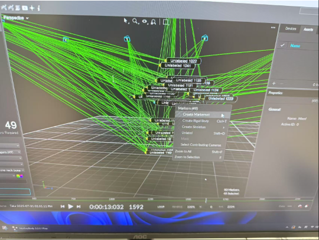
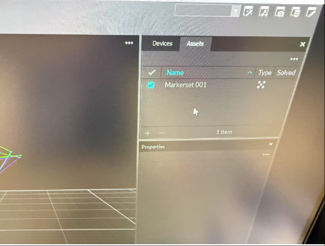
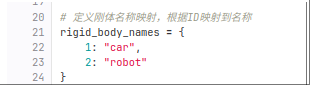
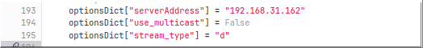
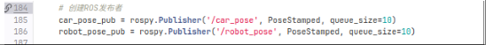

# 动作捕捉系统使用说明（Motion Capture Workflow）

本说明文档介绍了如何使用动作捕捉软件对物体进行追踪采集，包括反光球的粘贴、刚体创建、数据接收方法以及与机器人系统的集成机制。

---

## 一、物体标记准备

1. **粘贴反光球**  
   将反光球贴在待采集物体表面，建议采用**上下左右对称分布**，以确保动捕系统能够稳定识别并追踪其三维姿态。

2. **避免干扰**  
   确保反光球之间间距适中，避免过近造成融合，也不要太远导致无法识别为同一个刚体。

---

## 二、创建刚体（Rigid Body）

1. 打开动捕软件
2. 按照图示操作，**圈选所有与该物体相关的反光球**。

3. 创建刚体后，**修改刚体名称**为你期望的名称（例如 `bottle_1`、`target_box` 等），便于后续识别和开发使用。

4. 刚体一旦创建完成并命名，动捕系统便会开始**推流对应刚体的实时数据**（位置、旋转、时间戳等）。

---

## 三、数据接收方法

1. 动捕软件在后台会通过网络将刚体的**实时位姿数据以特定协议推流**出去。
2. 外部程序可接收此数据进行处理，例如使用 **仰旭提供的 Python 脚本**，即可接收到每一帧的时间戳与物体位姿。

   示例信息包括：
   - 刚体名
   - 时间戳
   - 位置信息 (x, y, z)
   - 姿态信息（四元数或欧拉角）

3. 若需定制数据结构或功能，可参考官方 SDK（如 OptiTrack 的 NatNet SDK），实现符合自己需求的接收脚本。

---

## 四、与机器人系统的集成

1. **机器人启动后**，会根据配置中的参数，自动开始记录指定话题/所有话题，并保存为 ROS 的 `.bag` 包文件。
2. **正常运行结束后**，系统会自动关闭 bag 包保存，记录完成。
3. 若中途出现异常（如程序崩溃），bag 包可能会**未完整写入或损坏**，需特别留意运行日志确认保存状态。

---

## 五、建议与注意事项

- 每次使用前，请确保摄像头已正确校准，环境光线适宜，避免反光干扰。
- 若系统识别不出刚体，请检查是否有反光球脱落或遮挡。
- 点击动捕系统的摄像头之后，现实场景的摄像头的灯会变成绿色，可以由此判断摄像头位置

---

## 六、参考资料

- 官方 SDK：OptiTrack NatNet SDK [https://www.optitrack.com/support/](https://www.optitrack.com/support/)
- 示例脚本：仰旭提供的 Python 接收脚本（可联系仰旭(王仰旭)把你拉进仓库获取）[https://www.lejuhub.com/wangyangxu/skyrail3F](https://www.lejuhub.com/wangyangxu/skyrail3F)

---
## 七、有关仰旭的代码介绍

- OptiTrack_Data_Receive.py为主程序，其中只需要更改刚体名称以及推流机器的ip即可获得实例信息

比如现在要记录的刚体名为baselink，直接把全局的car替换成baselink

   

修改对应ip

示例信息：
   - 刚体名
   - 时间戳
   - 位置信息 (x, y, z)
   - 姿态信息（四元数或欧拉角）
这个数据会发布到指定话题

