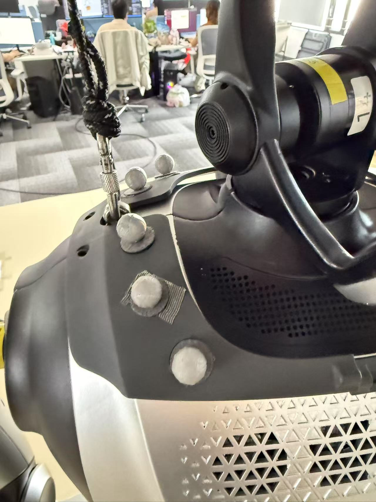
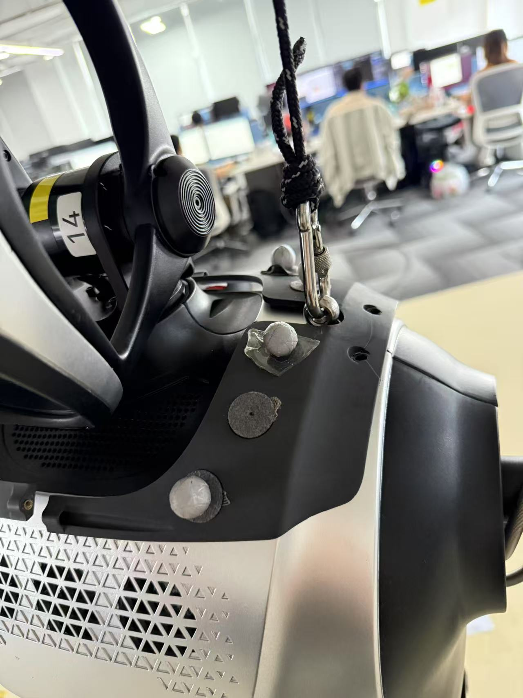
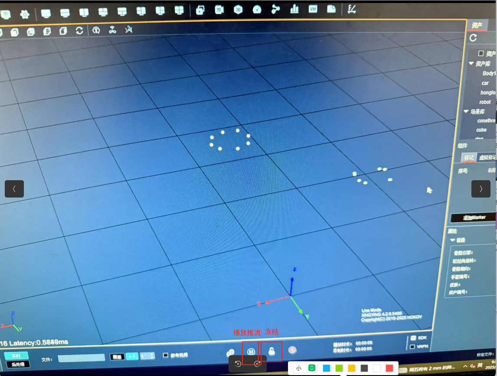
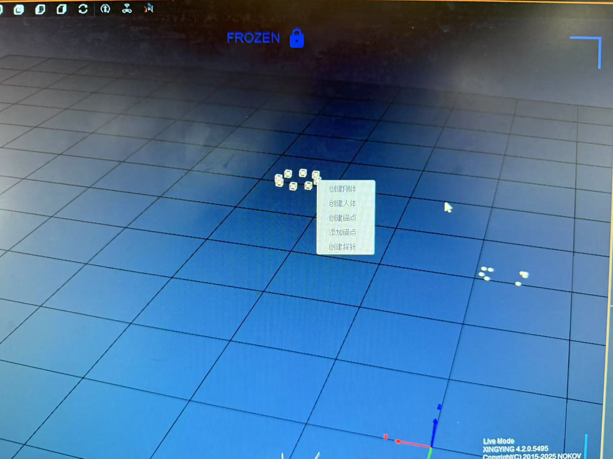
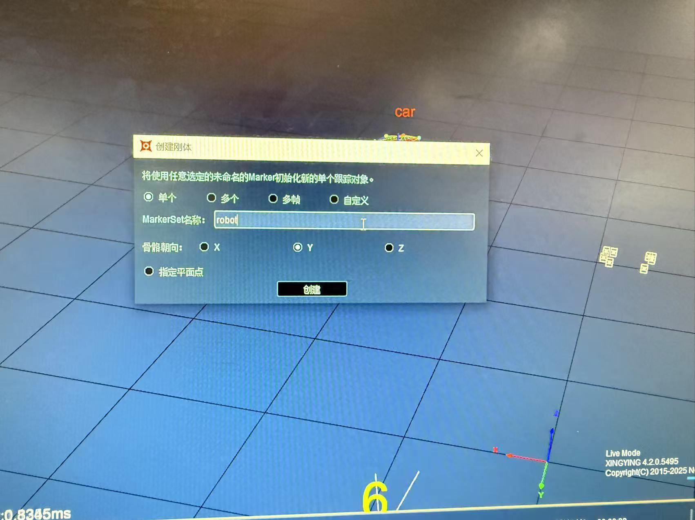
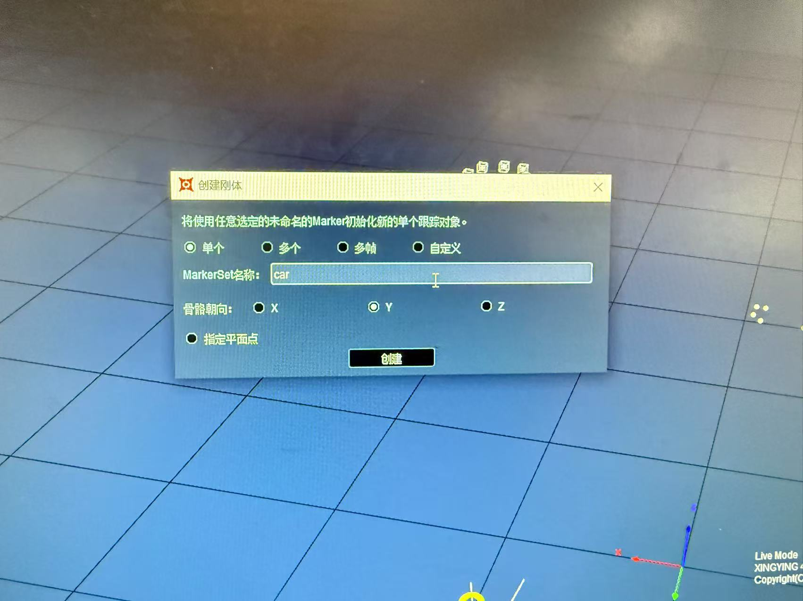
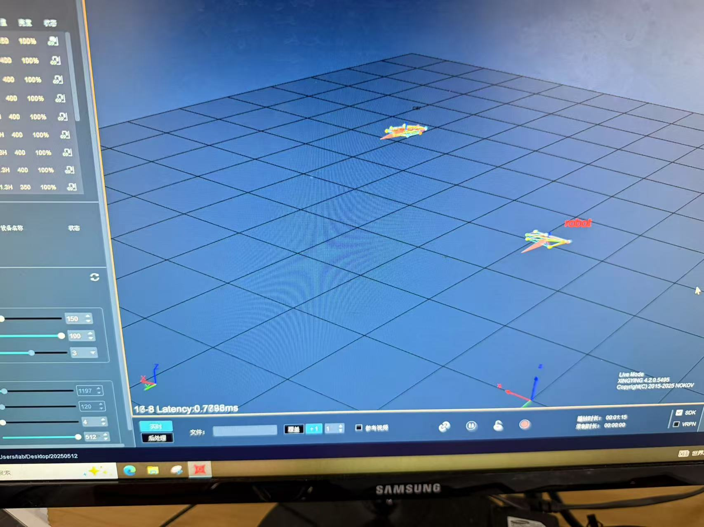
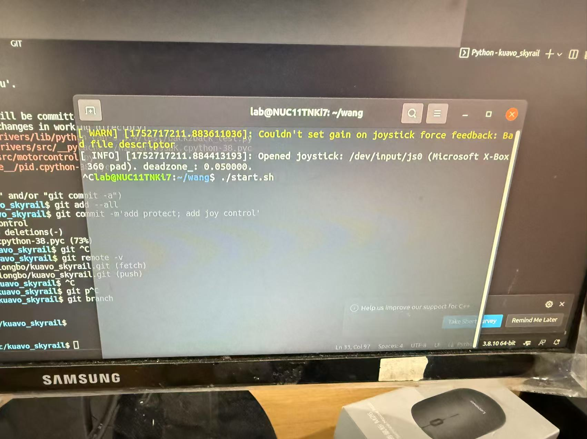
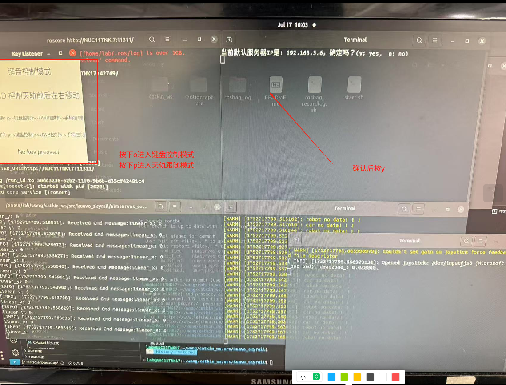
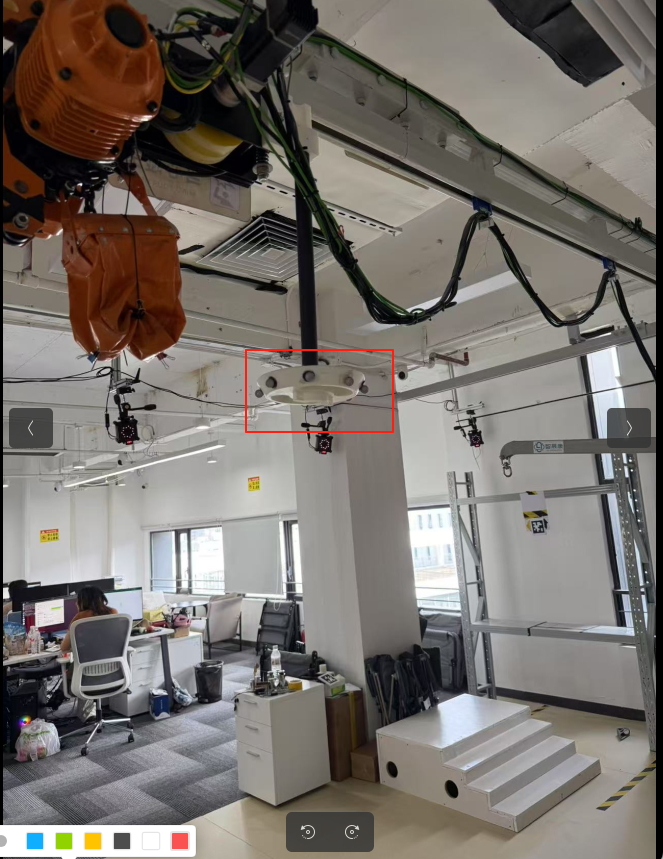

天轨跟随工程使用说明：

第一步：

安装机器人工装

第二步：

打开动捕软件

第三步：

    创建刚体（若右上角资产已有之前保存的刚体，先把原先的刚体删除）

删除完成后看到此刻动捕软件中出现的小球，冻结这一帧后按住shift圈住一圈小球创建刚体car（天轨）和robot

创建成功的效果：

第四步：

打开天轨急停，运行程序

在/wang目录下运行./start.sh，运行后会看到下面的界面：

在左上角窗口按下o进入键盘控制模式

按下p进入天轨跟随模式

进入天轨跟随模式后天轨便会跟随机器人移动

注意！！！开启天轨跟随模式后如若未把机器人吊在天轨上，请确保机器人位于天轨下，否则天轨会大幅度移动跟随到机器人的位置。并且在动捕边界区域，天轨可能由于无法捕捉到机器人刚体而不跟随机器人移动。

ps：

天轨的反光球已经安装过就在这里：

