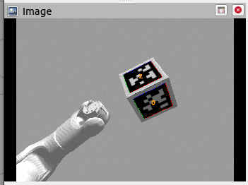
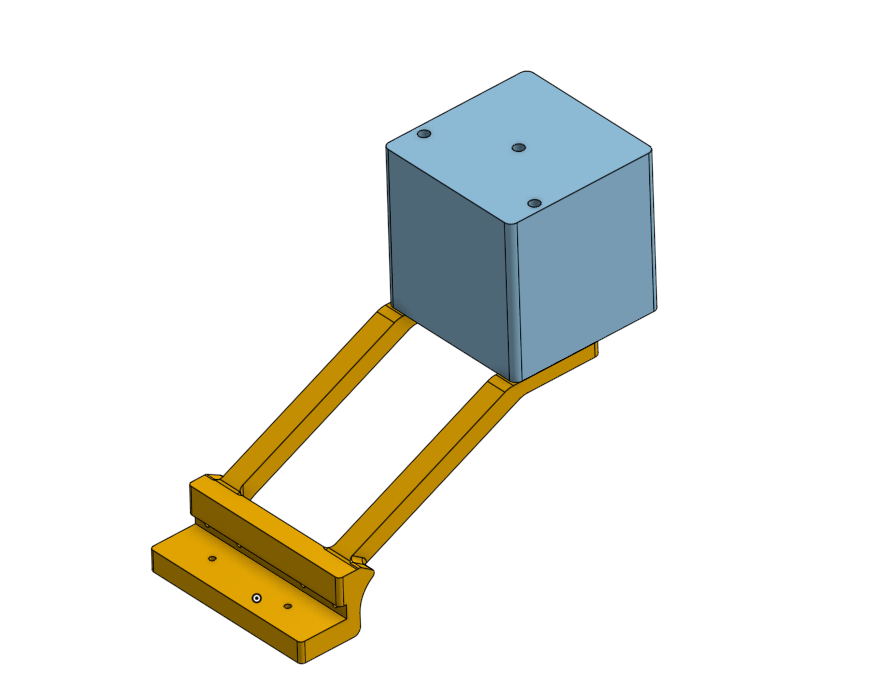
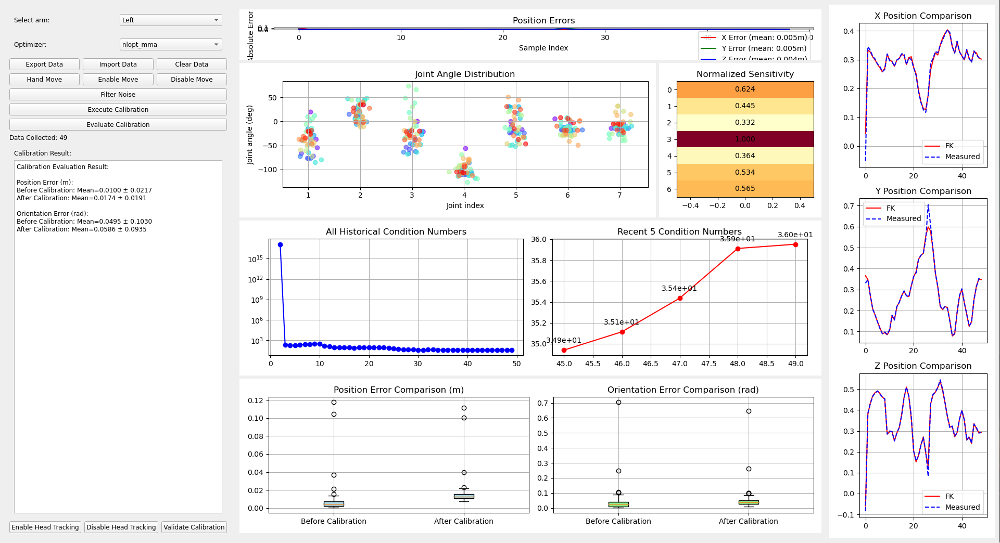
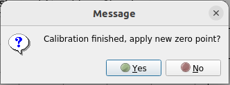

# 关节校准

## 1. 配置环境

### 1.1 依赖项

+ venv
+ pinocchio(需支持casadi)
+ casadi
+ nlopt

### 1.2 安装依赖项

#### Option 1: 使用docker容器（推荐）

+ 直接拉取构建好的用于标定的docker镜像

```bash
docker pull crpi-l8asmjgndsit37tg.cn-shenzhen.personal.cr.aliyuncs.com/matthew_njust/docker_hub:joint_cali_v0.2
docker tag crpi-l8asmjgndsit37tg.cn-shenzhen.personal.cr.aliyuncs.com/matthew_njust/docker_hub:joint_cali_v0.2 joint_cali:latest
```

+ 或者基于Dockerfile构建自己的docker镜像

```bash
docker build -t joint_cali -f Dockerfile .
```

#### Option 2: 安装venv以及需要的包

+ 安装venv以及相关依赖

```bash
sudo bash scripts/joint_cali/create_venv.sh
```

### 1.3 在机器人上安装标定正方体

+ 拆下灵巧手或末端夹爪
+ 安装标定正方体，确认安装方向是否正确
+ 二维码的尺寸，现在设计的是白色外框110mm，黑色tag码本身是88mm的，打印时要选择100%缩放，贴tag码时参考gazebo仿真里的方向顺序
  - 标定正方体所用的10个tag码的pdf文件路径在tag目录内，可自行打印（**打印时要选择100%缩放**），沿白色、灰色分界线剪下即可.如果自行打印，请参考下面的链接下载
  - [tag码下载连接](https://kuavo.lejurobot.com/manual/basic_usage/kuavo-ros-control/docs/5%E5%8A%9F%E8%83%BD%E6%A1%88%E4%BE%8B/%E9%80%9A%E7%94%A8%E6%A1%88%E4%BE%8B/%E4%BA%8C%E7%BB%B4%E7%A0%81%E6%A3%80%E6%B5%8B%E4%BD%BF%E7%94%A8%E6%A1%88%E4%BE%8B/)
  - `36h11`家族的tag码，种类千万不要选错

## 2. 使用方法

先进行头部校准，然后进行手臂关节校准.

### 2.0 启动机器人必须的launch文件

> 需要注意的是，关于`apriltag_ros`里面的tag码启动节点，可以在上位机启动或者下位机启动，笔者这里默认由上位机进行维护

#### 下位机启动

```bash
cd /home/lab/kuavo-ros-control
roslaunch scripts/joint_cali/launch/cali_gazebo_sim.launch # 仿真

# 实物，该launch参数不带cali和cali_arm，
# 请在使用前使用roslaunch humanoid_controllers load_kuavo_real.launch cali:=true cali_arm:=true 进行默认初始零点设置
roslaunch scripts/joint_cali/launch/cali_real.launch 
```

> 为了防止cali_real.launch的apriltag节点会和上位机启动，请确保cali_real.launch 不包含如下launch文件

```yaml
  <include file="$(find apriltag_ros)/launch/continuous_detection.launch">
    <arg name="camera_name" value="/camera/color"/>
    <arg name="image_topic" value="image_raw"/>
  </include>

```

#### 上位机启动

+ 上位机只需要启动相机节点/TF静态转换/Tag识别节点即可，launch需要修改为

```bash
cd ~/kuavo_ros_application/  
vim src/dynamic_biped/launch/sensor_apriltag_only_enable.launch
```

```plain
* sensor_apriltag_only_enable.launch
```

```yaml
<!-- sensor_apriltag_only_enable.launch -->
<launch>
    <!-- Launch realsense2_camera for head camera -->
    <include file="$(find realsense2_camera)/launch/rs_camera.launch" >
        <arg name="color_width"   value="640"/>
        <arg name="color_height"  value="480"/>
        <arg name="color_fps"     value="30"/>
        <arg name="depth_width"   value="848"/>
        <arg name="depth_height"  value="480"/>
        <arg name="depth_fps"     value="30"/>
        <arg name="enable_infra"        default="false"/>
        <arg name="enable_infra1"       default="false"/>
        <arg name="enable_infra2"       default="false"/>
        <arg name="enable_sync"   value="true"/>
        <arg name="align_depth"   value="true"/>
        <arg name="enable_pointcloud"   value="true"/>
    </include>
    <!-- tf2_ros 静态转换 发布urdf里面的head_camera 和 相机坐标系下的camera_link 进行对齐 -->
    <node pkg="tf2_ros" type="static_transform_publisher" name="camera_to_real_frame" args="0 0 0 0 0 0 camera camera_link" />
    <node pkg="tf2_ros" type="static_transform_publisher" name="base_link_to_torso" args="0 0 0 0 0 0 base_link torso" />
    <!-- 启动 apriltag_ros continuous_detection -->
    <include file="$(find apriltag_ros)/launch/continuous_detection.launch">
      <arg name="camera_name" value="/camera/color" />
      <arg name="image_topic" value="image_raw" />
    </include>
    <!-- 启动 ARControlNode -->
    <node pkg="ar_control" type="ar_control_node.py" name="ar_control_node" output="screen" respawn="true" respawn_delay="5" />
</launch>

```

+ 修改`/home/kuavo/kuavo_ros_application/src/ros_vision/detection_apriltag/apriltag_ros/config/tags.yaml`，将tag的size尺寸修改为和立方体tag码的尺寸一致

```bash
standalone_tags:
  [
    {id: 0, size: 0.088, name: 'tag_0'},
    {id: 1, size: 0.088, name: 'tag_1'},
    {id: 2, size: 0.088, name: 'tag_2'},
    {id: 3, size: 0.088, name: 'tag_3'},
    {id: 4, size: 0.088, name: 'tag_4'},
    {id: 5, size: 0.088, name: 'tag_5'},
    {id: 6, size: 0.088, name: 'tag_6'},
    {id: 7, size: 0.088, name: 'tag_7'},
    {id: 8, size: 0.088, name: 'tag_8'},
    {id: 9, size: 0.088, name: 'tag_9'},
  ]
```

> 修改完毕后，启动命令`roslaunch dynamic_biped sensor_apriltag_only_enable.launch`

+ 查看话题`/tag_detections_image(sensor_msgs/Image)` 看到有图像输出
  - 
+ 查看话题`/tag_detections(apriltag_ros/AprilTagDetectionArray)`看到有话题数据

> 上位机启动成功（实物）

### 2.1 头部校准
#### 使用标定工具（推荐）
- 打印标定工具: 3D打印标定工具，打印件STEP模型在`3d_print_asset`文件夹中，打印完成后将tag码贴在标定工具上，安装在机器人躯干上
- 
- 在机器人躯干上安装标定工具，使用两颗M3*18螺丝在机器人底部固定
- 按照上述步骤配置环境，启动机器人后，也启动头部NUC相机，然后运行
```bash
source devel/setup.bash
sudo chmod -R 777 /home/lab/.config/lejuconfig/
python3 ./scripts/joint_cali/head_cali.py --use_cali_tool
```
- 脚本会自动读取`scripts/joint_cali/config/head_cali_config.yaml`中的参数，默认id为0，tag_pose_in_base为[0.305, 0, 0.2]，如果标定工具的参数发生了变化，请修改该文件。
- 脚本会计算得出头部关节校准参数，键入enter后，会自动更新关节校准参数到`~/.config/lejuconfig/arms_zero.yaml`文件中。
#### 不使用标定工具（不推荐）
+ 按照上述步骤配置环境，启动机器人后，也启动头部NUC相机，然后运行

```bash
source devel/setup.bash
python3 ./scripts/joint_cali/head_cali.py --tag_id 1 --target_pose 0 0 1.3
```

> 其中`--tag_id`为用于标定的AprilTag的ID，`--target_pose`为该AprilTag在机器人世界坐标系下的位置，单位为米，顺序为x,y,z，例如tag1在机器人世界坐标系下的位置为(0,0,1.3)，则输入`0 0 1.3`，事实上只有y,z有意义，x仅作占位，可任意输入。

+ 脚本会计算得出头部关节校准参数，键入enter后，会自动更新关节校准参数到`~/.config/lejuconfig/arms_zero.yaml`文件中。

### 2.2 手臂关节校准

> 注意：务必先进行头部校准，然后进行手臂关节校准。  
> 在使用优化算法时，请将默认的Optimizer的类型从`nlopt_mma`修改为`ipopt`, 小采样范围，使用ipopt，多次采样

+ 使用下面的命令连接机器人,以使用X11转发（当然，也可以用VNC连接机器人）：

```bash
ssh -XC lab@192.168.x.xx
```

+ 然后运行手臂关节校准脚本：

```bash
# 激活环境
source /home/lab/kuavo_venv/joint_cali/bin/activate
source devel/setup.bash
unset LD_LIBRARY_PATH
export LD_LIBRARY_PATH=/home/lab/kuavo_venv/joint_cali/lib:$LD_LIBRARY_PATH
export LD_LIBRARY_PATH=/opt/ros/noetic/lib:$LD_LIBRARY_PATH
python3 ./scripts/joint_cali/arm_cail_noui.py --real
```

+ 如果下载了docker镜像，则使用如下命令：

```bash
./scripts/joint_cali/arm_cali_in_docker.sh --real
```

> 其中`--real`表示使用真实机器人，如果是仿真，则不需要加该参数。

+ 接着，标定的UI会自动弹出，如下图所示：

+ 点击`Enable Move`按钮，然后点击`Enable Head Tracking`使能头部跟踪
+ 点击`Hand Move`按钮，移动手臂，大约35s后，手臂运动完毕;
+ 点击`Filter Noise`按钮以过滤噪声数据（只建议执行一次）
+ 点击`Execute Calibration`按钮，运行标定算法，运行完毕后会跳出弹窗，提醒是否将关节校准参数



+ 点击`Yes`按钮后，关节校准参数会被更新到`~/.config/lejuconfig/arms_zero.yaml`和`~/.config/lejuconfig/offset.csv`两个文件中。
+ 点击`Evaluate Calibration`按钮，会计算标定前后的位置和姿态误差，供参考。
+ 然后在`Select arm`选项卡中选择另一只手进行标定，方法同上。

