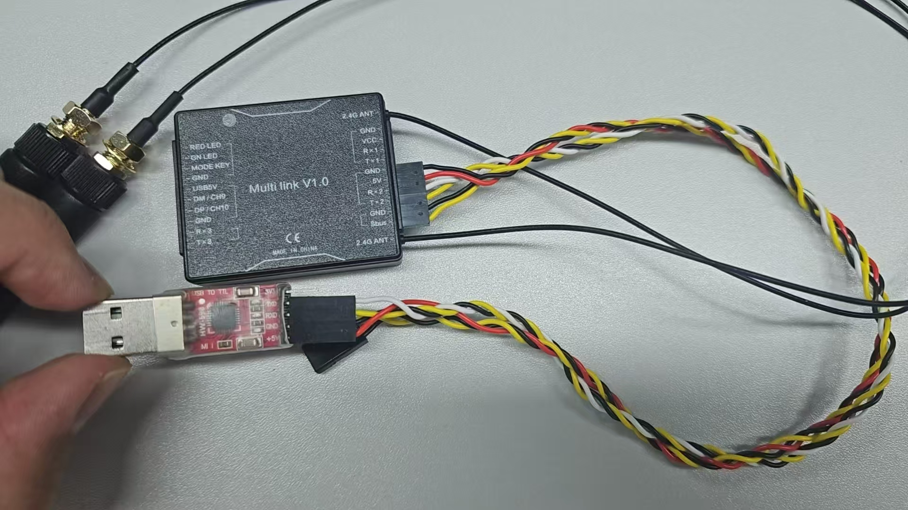
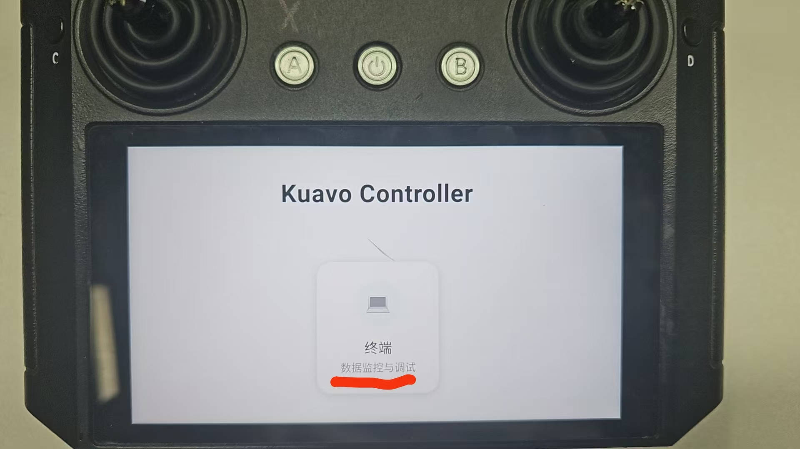
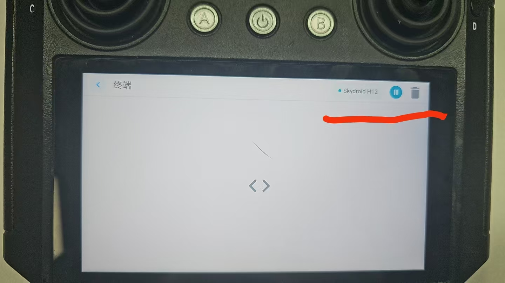
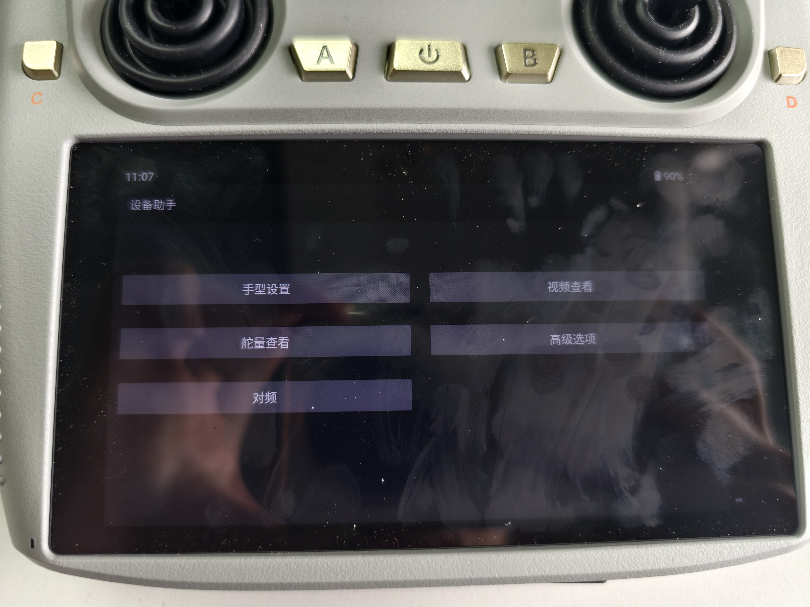
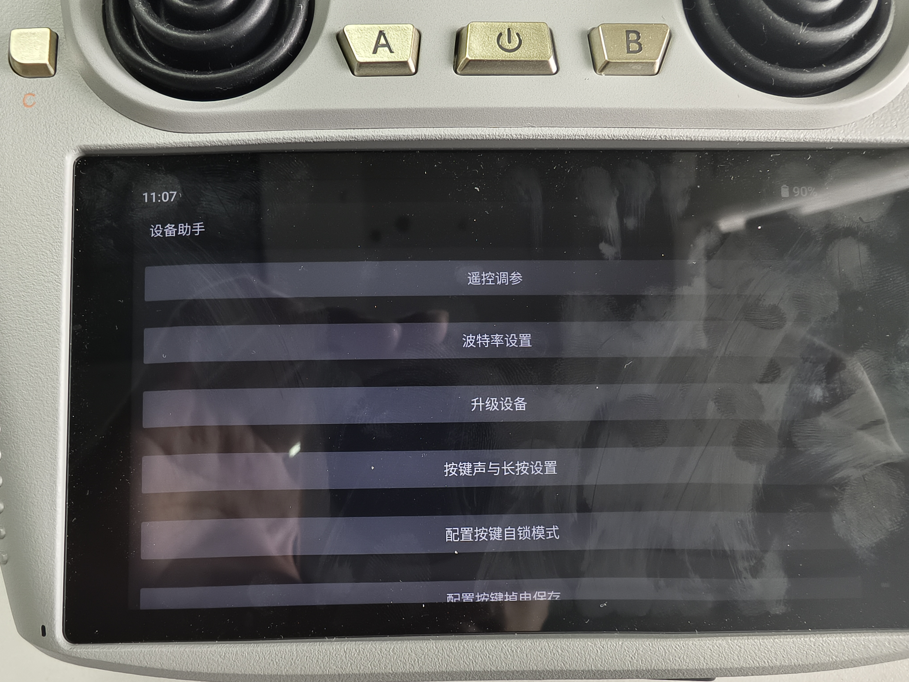
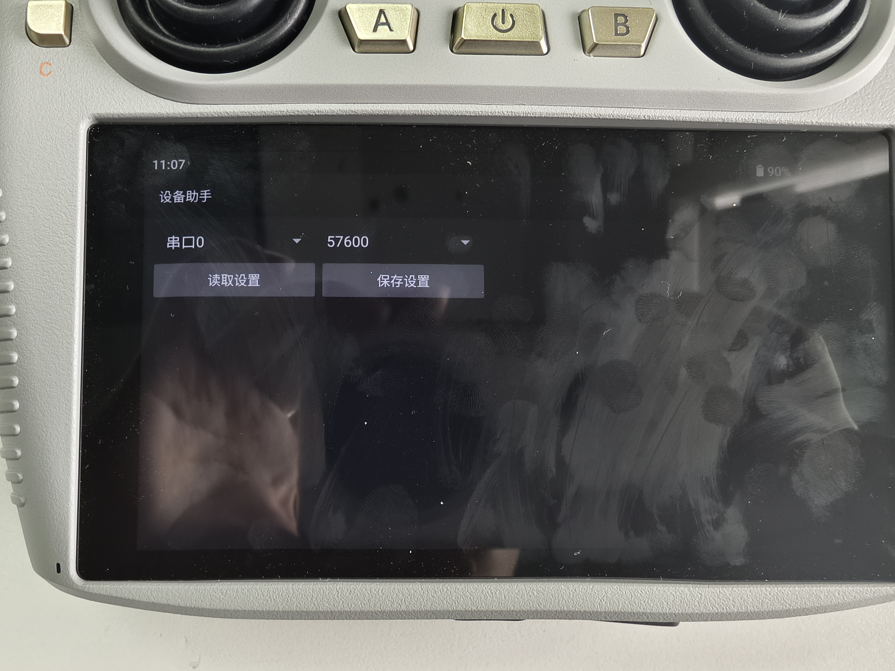

# H12日志串口功能使用说明

## 概述

H12日志串口功能允许用户通过遥控器查看机器人的实时日志输出。该功能通过 USB 转串口设备连接到 Multi link V1.0 模块，实现日志数据的无线传输。

## 硬件连接

### 所需硬件
- **Multi link V1.0模块**：2.4GHz无线通信模块
- **USB转串口转换器**：用于连接下位机和 Multi link 模块
- **连接线**：用于连接两个模块

### 硬件连接示意图



## 部署配置

### 特别注意
- 如果机器人有改装，即 sbus 和 log 的接口都连接，选择第一种方法：自动部署脚本。
- 如果机器人没有接线，选择第二种方法：手动加载串口规则。
  - 需要使用两个 H12，原本的 H12 用于启动机器人，外接的 H12 才能查看 log。
  - 第二个 H12 的接收机不可以连接 sbus 针脚，接好线后连到机器人的下位机。
  - 如果操作失误使用了方案一，需要拔掉第二个 H12 接收机，重新运行 H12 部署脚本，选择跳过 log 串口的规则，然后重启机器，再将第二个 H12 接收机连接到机器人上使用。

### 1. 自动部署脚本

使用 `deploy_autostart.sh` 脚本进行一键部署：

```bash
cd src/humanoid-control/h12pro_controller_node/scripts
./deploy_autostart.sh
```

#### 关键配置选项

**串口规则加载：**
- 脚本会询问是否加载遥控器 log 串口udev规则
- 选择'y'：自动加载H12_log_serial.rules规则
- 选择'n'：跳过规则加载


### 2. 手动加载串口规则

如果需要单独加载串口规则，可以使用：

```bash
cd src/humanoid-control/h12pro_controller_node/scripts
sudo ./load_h12_log_serial_rule.sh
```

#### 规则文件说明
udev规则文件 `H12_log_serial.rules` 配置：
- 设备识别：USB 厂商ID 10c4，产品ID ea60 （**后续如果更换串口，请联系开发人员修改**）
- 权限设置：组为 dialout，模式为 0777
- 符号链接：创建 `/dev/H12_log_channel` 设备文件
- 串口配置：波特率 57600，8数据位，无停止位，无奇偶校验


### 3. H12 遥控器 LOG 软件安装



#### 下载链接

https://kuavo.lejurobot.com/H12SerialLogApks/kuavo_h12_controller.apk

#### 安装方式
- 用数据线将 H12 遥控器连接到电脑
- 将下载的软件放到 H12 的文件夹
- 在 H12 遥控器的文件管理器找到并安装
- 打开软件，选择 `终端`
- 右上角有 `清除` 和 `暂停`



## G12 波特率设置
1. 进入设备助手，

2. 进入高级选项，

3. 进入波特率设置，设置波特率为 `57600`,

## WiFi 信息上报功能

### 功能说明

当机器人启动时，会自动通过日志串口以 1 秒的频率持续上报当前连接的 WiFi 信息，方便用户在遥控器上查看机器人的网络状态。

### 数据格式

上报数据为 JSON 格式：

```json
{
    "cmd": "rc/send_robot_info",
    "data": {
        "wifi_name": "<base64编码的WiFi名称>",
        "robot_ip": "192.168.1.100"
    }
}
```

### 字段说明

| 字段 | 类型 | 说明 |
|------|------|------|
| cmd | string | 命令标识，固定为 `rc/send_robot_info` |
| data.wifi_name | string | WiFi 名称，使用 **Base64 编码**（UTF-8） |
| data.robot_ip | string | 机器人 IP 地址 |
| data.wifi_password | string | WiFi 密码，使用 **Base64 编码**（UTF-8），需要 root 权限 |

### WiFi 名称解码

- 由于 WiFi 名称可能包含中文或特殊字符，为避免 JSON 解析问题，`wifi_name` 字段使用 Base64 编码,接收端请使用相应的方法进行解析。

### 注意事项

- WiFi 信息上报功能依赖于 `/dev/H12_log_channel` 设备文件存在
- 需要正确配置 udev 规则并连接硬件
- 上报频率为每秒 1 次
- 机器人停止时会自动停止上报