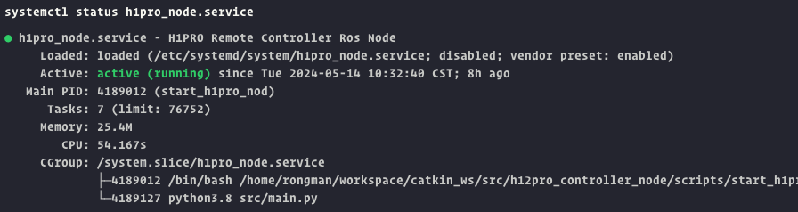
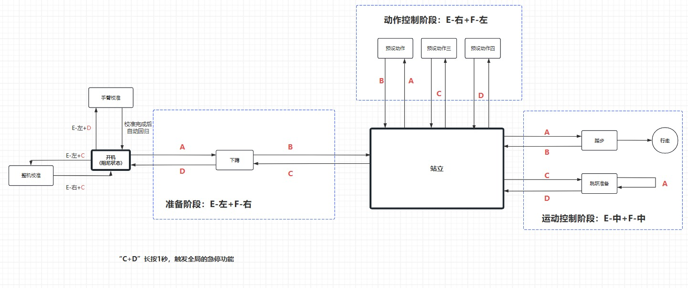

# H12Pro_Controller_Node

## 概述

本仓库包括以下内容：

- H12Pro 控制器的底层SDK，用于接收 H12Pro 控制器的数据。
- H12Pro 通道数据发布的 ROS 节点，用于将 H12Pro 控制器的数据发布指定的 ROS 话题。
- H12Pro 控制器的控制器节点，用于接收 H12Pro 的 ROS 话题的数据，解析通道数据到指定按键组合，触发对应的按键事件，调用 Kuavo 中的 ROS 服务，实现对 Kuavo 的控制。
- RobotState 模块， 用于定义维护机器人的状态， 定义状态切换的规则， 以及状态切换时的回调函数。
- 配置文件:
  - `robot_state.json` 用于定义机器人的状态, 状态切换的规则, 以及状态切换时的回调函数名称。
  - `h12pro_remote_controller.json` 用于定义 H12Pro 各通道对应的按键名称， 以及不同状态下按键组合对应的事件名称等。

## 使用方法

### 1. 获取代码

* 拉取 Kuavo ROS1 代码

```bash
cd ~
git clone https://www.lejuhub.com/highlydynamic/kuavo_ros1_workspace.git
```

* 获取 Kuavo 代码（如果没有）
  
```bash
cd ~/kuavo_ros1_workspace/src
git clone https://www.lejuhub.com/highlydynamic/kuavo_opensource.git
```

### 2. 绑定 H12PRO 接收器的设备文件

直接执行 `creat_remote_udev_rule.sh` 脚本即可

```shell
cd ~/kuavo_ros1_workspace/src/h12pro_controller_node/lib/kuavo_remote
sudo chmod +x creat_remote_udev_rule.sh
sudo ./creat_remote_udev_rule.sh
```

### 3. 编译代码

```bash
cd ~/kuavo_ros1_workspace
catkin_make
```

### 4. 建立软链接

由于程序需要访问 `~/.config/lejuconfig`, 但是程序在 `root` 用户下中的运行,因此 `~/.config/lejuconfig` 与普通用户的不一致，所以需要在 `root` 用户下与 `/home/lab/.config/lejuconfig` 建立软链接。

```bash
sudo rm -rf /root/.config/lejuconfig
sudo ln -s /home/lab/.config/lejuconfig /root/.config/lejuconfig
```

### 5. 运行程序

### 手动运行（Manual）

#### 5.1 运行 roscore

```bash
roscore
```

#### 5.2 运行 H12Pro 通道数据发布的 ROS 节点

检查 `kuavo_ros1_workspace` 工作空间路径， `cd ~/kuavo_ros1_workspace && pwd`， 将输出的路径设置为 `CATKIN_WS_PATH` 环境变量, 若 `catkin_ws` 空间不与文档所指定的路径相同，请自行设置环境变量为对应的路径。启动程序后，请尝试按下 H12Pro 控制器的按键或者摇杆，查看 ROS 话题 `/h12pro_channel` 是否有数据发布并且数据随之变化。

```bash
sudo su
export CATKIN_WS_PATH=/home/lab/kuavo_ros1_workspace
source $CATKIN_WS_PATH/devel/setup.bash
rosrun h12pro_controller_node h12pro_channel_publisher
```

#### 5.3 运行 H12Pro 控制器的控制器节点

设置 `CATKIN_WS_PATH` 环境变量。如果需要在真实的机器人中使用 H12Pro 控制器，请将启动程序时将 `--real` 参数传递（如下所示）， 若只在仿真环境，则不需要传递该参数。

```bash
sudo su
export CATKIN_WS_PATH=/home/lab/kuavo_ros1_workspace
source $CATKIN_WS_PATH/devel/setup.bash
cd $CATKIN_WS_PATH/src/h12pro_controller_node
python3 src/main.py --real
```

**请确保 `CATKIN_WS_PATH` 环境变量被设置正确, 否则程序将无法找到 `kuavo` 程序包。**

### 自动运行（Automatic）

#### 5.4 配置启动脚本

* 检查 catkin_ws 工作空间路径， `cd ~/kuavo_ros1_workspace && pwd`，将输出的路径复制到仓库目录中的启动脚本 `scripts/start_h12pro_channel_pub.sh` 和 `scripts/start_h12pro_node.sh` 中的 `CATKIN_WS_PATH` 环境变量。

* 检查仓库 `service` 目录中的 `h12pro_channel_pub.service` 与 `h12pro_node.service` 中的 `ExecStart` 是否与启动脚本的路径一致。

* 添加执行权限：

```bash
sudo chmod +x scripts/start_h12pro_channel_pub.sh
sudo chmod +x scripts/start_h12pro_node.sh
```

* 将 `services` 目录中的所有文件拷贝到 `/etc/systemd/system/` 目录下。

```bash
sudo cp ~/kuavo_ros1_workspace/src/h12pro_controller_node/services/* /etc/systemd/system/
```

* 刷新 systemd 服务

```bash
sudo systemctl daemon-reload
```

* 启动服务

```bash
sudo systemctl start roscore.service
sudo systemctl start h12pro_channel_pub.service
sudo systemctl start h12pro_node.service
```

* 停止服务

```bash
sudo systemctl stop roscore.service
sudo systemctl stop h12pro_channel_pub.service
sudo systemctl stop h12pro_node.service
```

* 设置开机自启

```bash
sudo systemctl enable roscore.service
sudo systemctl enable h12pro_channel_pub.service
sudo systemctl enable h12pro_node.service
```

* 取消开机自启

```bash
sudo systemctl disable roscore.service
sudo systemctl disable h12pro_channel_pub.service
sudo systemctl disable h12pro_node.service
```

* 查看服务状态

```bash
sudo systemctl status roscore.service
sudo systemctl status h12pro_channel_pub.service
sudo systemctl status h12pro_node.service
```

* 查看服务日志

```bash
sudo journalctl -u roscore.service -f
sudo journalctl -u h12pro_channel_pub.service -f
sudo journalctl -u h12pro_node.service -f
```

服务成功开启状态如图所示：

{:height="640px" width="480px"}

### 更新摇杆控制速度限制

在 `src/h12pro_node/h12pro_remote_controller.json` 中找到 `joystick_to_corresponding_axis` 字段，修改对应的摇杆通道对应的轴的速度限制，修改min和max值即可（min和max值要互为相反数），执行 `sudo systemctl restart h12pro_node.service` 重启服务即可生效。

```json
{
  "joystick_to_corresponding_axis": {
    "left_joystick_vertical": {
      "axis":"x",
      "range":{
        "min":-0.6,
        "max":0.6
      }
    },
    "left_joystick_horizontal": {
      "axis":"y",
      "range":{
        "min":-0.2,
        "max":0.2
      }
    },
    "right_joystick_vertical": {
      "axis":"w",
      "range":{
        "min":-0.8,
        "max":0.8
      }
    }
  }
}
```

## 遥控器功能说明

### 按键说明

{:height="640px" width="480px"}

### 功能示意

{:height="640px" width="480px"}

## 配置文件说明

### robot_state.json

`robot_state.json` 文件用于定义机器人的状态, 状态切换的规则, 以及状态切换时的回调函数名称。

* 在 `states` 字段中定义机器人的状态。
* 在 `transitions` 字段中定义状态切换的规则，包括触发条件，源状态，目标状态，以及状态切换时的回调函数名称（回调函数的实现在 `robot_state/before_callback.py` 中)。
* 更多配置项请查看 `robot_state.json` 文件。  

示例：
```json
{
  "states":[
      "initial",
      "calibrate",
      "squat",
      "stand",
      "jump",
      "walk"
  ],
  "transitions": [
    {
      "trigger": "calibrate",
      "source": "initial",
      "dest": "calibrate",
      "before": "calibrate_callback"
    },
    ...
  ]
}
```

### h12pro_remote_controller.json

* `channel_to_key_name` 字段用于定义 H12Pro 遥控器各通道对应的按键名称( `1` 号 通道对应的为右摇杆水平方向)
* `channel_to_key_state` 字段用于定义通道数据不同状态下按键组合对应的事件名称(`E` 通道数据为 `282` 时对应的按键为 `E_LEFT`， `1002` 时对应的按键为 `E_MIDDLE`， `1722` 时对应的按键为 `E_RIGHT`)
* `robot_state_transition_keycombination` 字段用于定义不同状态下对应的事件的按键组合(触发 `initial` 状态的 `start` 事件的按键组合为 `E_LEFT`, `F_RIGHT`, `A_PRESS`， 触发 `initial` 状态的 `calibrate` 事件的按键组合为 `E_LEFT`, `F_MIDDLE`, `C_PRESS`)
* `joystick_to_corresponding_axis` 字段用于定义摇杆通道对应控制机器人运动方向的轴，以及速度限制(`left_joystick_vertical` 通道对应的轴为 `x`， 速度限制为 `min: -0.6`, `max: 0.6`)
* 更多配置项请查看 `h12pro_remote_controller.json` 文件。

### Multi 模式常用按键

以下组合在 `KUAVO_CONTROL_SCHEME=multi` 下生效：

* `E_MIDDLE + F_MIDDLE + A_PRESS`: `walk`
* `E_MIDDLE + F_MIDDLE + B_PRESS`: `trot`
* `E_MIDDLE + F_MIDDLE + C_PRESS`: 在 `mpc` 和 `amp_controller` 之间切换
* `E_RIGHT + F_LEFT + C_LONG_PRESS`: 触发 `depth_loco_switch`
  它会在 `mpc` / `amp_controller` 和 `depth_loco_controller` 之间切换，用于走楼梯斜坡
* `E_RIGHT + F_LEFT + A_LONG_PRESS`: 切换到 `vmp_controller`

`depth_loco_switch` 是状态机里的事件名，不是控制器名；真正被切换的是 `depth_loco_controller`。
退出 `depth_loco_controller` 时，系统会优先恢复到进入前的控制器，如果没有记录则回到 `amp_controller`。

使用 `depth_loco_controller` 走楼梯斜坡时，系统必须已经正常发布 `/camera/depth/depth_history_array` 且能收到消息，且话题频率建议达到 50Hz，否则会直接拒绝切换，避免机器人异常动作。

示例：
```json
{
  "channel_to_key_name": {
    "1": {
      "name": "right_joystick_horizontal",
      "type": "joystick"
    },
    ...
  },
  "channel_to_key_state": {
    "E": {
      "282": "E_LEFT",
      "1002": "E_MIDDLE",
      "1722": "E_RIGHT"
    },
    ...
  },
  "robot_state_transition_keycombination": {
    "initial":{
      "start":["E_LEFT","F_RIGHT","A_PRESS"],
      "calibrate":["E_LEFT","F_MIDDLE","C_PRESS"]
    },
    ...
  },
  "joystick_to_corresponding_axis": {
    "left_joystick_vertical": {
      "axis":"x",
      "range":{
        "min":-0.6,
        "max":0.6
      }
    },
    ...
  }
}
```

## 控制 kuavo 机器人手臂

* 需要用户把已经录制好的 `poses.csv` 文件放到 `<kuavo_ws>/src/kuavo/src/biped_v2/config` 目录下, 例如 `ROBOT_VERSION=40`, 则放在 `src/kuavo/src/biped_v2/config/kuavo_v4.0` 目录下
* 目前支持记录4个动作，因此需要把 `poses.csv` 文件命名为 `arm_pose1.csv`, `arm_pose2.csv`, `arm_pose3.csv`, `arm_pose4.csv` 其中之一
* 动作阶段 `A` 键对应的动作为 `arm_pose1.csv`, `B` 键对应的动作为 `arm_pose2.csv`, `C` 键对应的动作为 `arm_pose3.csv`, `D` 键对应的动作为 `arm_pose4.csv`

## 控制 kuavo 机器人头部


* 开启服务sudo systemctl start ocs2_h12pro_monitor.service
* 然后机器人头部控制模式要早stance状态下进行，机器人进入站立状态后，使用组合键‘E_IDDLE,F_RIGHT,PRESS B’这时进入头部控制状态
* 此时移动机器人的右遥感上下左右即可操作机器人头部上下左右移动
