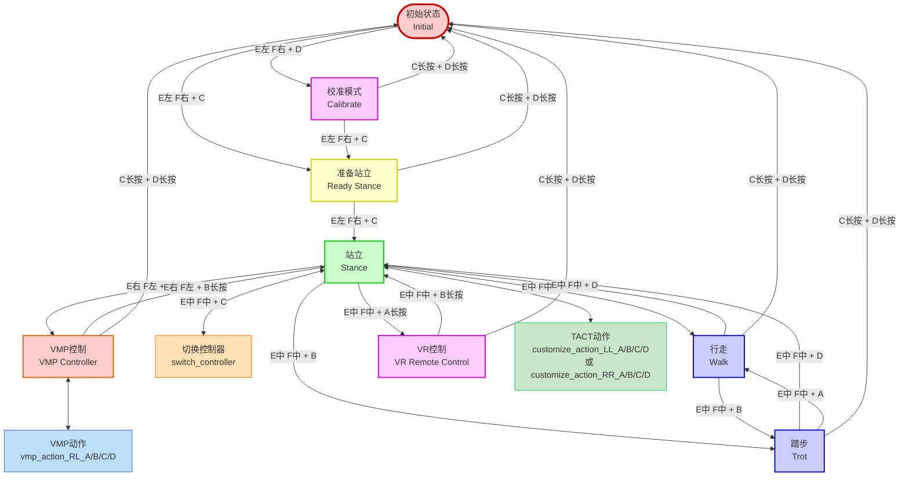
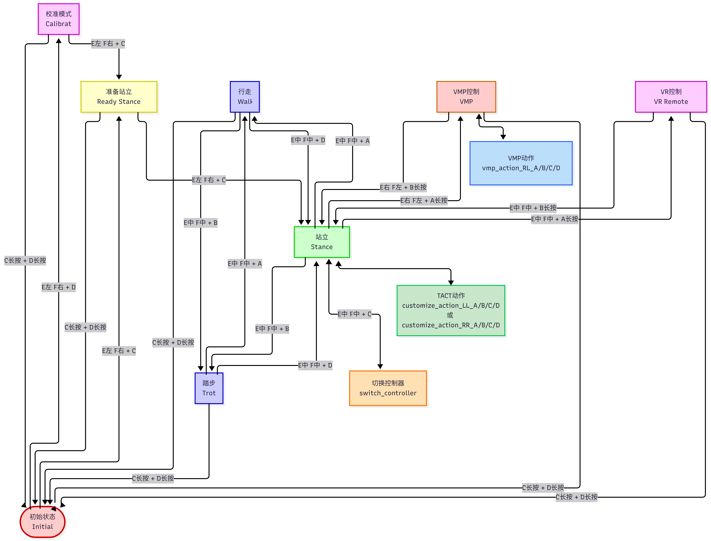

# 多控制器 H12 部署和操作说明

## 状态转换图

### Mermaid 图表

在支持 Mermaid 的 Markdown 查看器中可以看到交互式图表：



### 生成状态转换图

将上述代码传入 https://www.mermaidchart.com/ 中生成



---

## 快速参考表

### 急停（所有状态）

**按键**: `C长按 + D长按` → 初始状态

### 主要状态切换

| 操作                 | 按键  | 开关位置  | 从状态 → 到状态      |
| -------------------- | ----- | --------- | --------------------- |
| **启动机器人** | C     | E左 + F右 | Initial → Ready      |
| **校准模式**   | D     | E左 + F右 | Initial → Calibrate  |
| **站立**       | C     | E左 + F右 | Ready Stance→ Stance |
| **行走**       | A     | E中 + F中 | Stance → Walk        |
| **踏步**       | B     | E中 + F中 | Stance → Trot        |
| **切换控制器** | C     | E中 + F中 | Stance → Stance      |
| **进入VMP**    | A长按 | E右 + F左 | Stance → VMP         |
| **退出VMP**    | B长按 | E右 + F左 | VMP → Stance         |
| **进入VR**     | A长按 | E中 + F中 | Stance → VR          |
| **退出VR**     | B长按 | E中 + F中 | VR → Stance          |

### 运动状态切换

| 操作                 | 按键 | 开关位置  | 从状态 → 到状态 |
| -------------------- | ---- | --------- | ---------------- |
| **停止行走**   | D    | E中 + F中 | Walk → Stance   |
| **行走到踏步** | B    | E中 + F中 | Walk → Trot     |
| **停止踏步**   | D    | E中 + F中 | Trot → Stance   |
| **踏步到行走** | A    | E中 + F中 | Trot → Walk     |

---

## 部署自启动服务

### 执行部署脚本

```bash
cd <kuavo-ros-control>/src/humanoid-control/h12pro_controller_node/scripts
sudo su
./deploy_autostart.sh
```

### 选择控制方案

脚本会提示选择控制方案，输入 `3` 选择 multi 模式：

```
请选择控制方案 (1: ocs2, 2: rl, 3: multi):
3
已选择: multi
```

---

## 站立状态下的操作

### 自定义动作

- 操作方式
  - **E右 + F右 + A/B/C/D** → customize_action_RR_A/B/C/D
  - **E左 + F左 + A/B/C/D** → customize_action_LL_A/B/C/D
- 配置方式
  - 修改 [customize_config.json](./config/customize_config.json) 中 `customize_action_LL_X` 的 `arm_pose_name`

### VMP 动作（VMP 模式下）

- 操作方式
  - **E右 + F左 + A/B/C/D** → vmp_action_RL_A/B/C/D
- 配置方式
  - 修改 [customize_config.json](./config/customize_config.json) 中 `vmp_action_RL_X` 的 `action_name`
  - 可支持的 `action_name` 为，全套: `yc_126_spec`、正踢: `yc_01_front_kick`、侧踢: `yc_02_side_kick`、直拳: `yc_06_straight_punch`

### 摇杆控制

- **左摇杆**: 平移（左右）、前后（上下）
- **右摇杆**: 转向（左右）、高度（上下）

  - AMP 控制器暂不支持高度控制

---

## 重要提示

1. **控制器切换**: 在站立状态下按 `E中 F中 + C` 可循环切换控制器（MPC <--> AMP），切换之后会自动回到站立状态，两控制器共用一套状态机
2. **VMP 控制器限制**: 只能从 AMP 控制器进入，不能从 MPC 控制器进入。且仅有动作展示。
3. **急停**: 在任何状态下都可以使用 `C长按 + D长按` 紧急停止，MPC 控制器会缓慢下蹲再结束程序，AMP 和 VMP 控制器则立马结束程序，可切换到 MPC 再停止。
