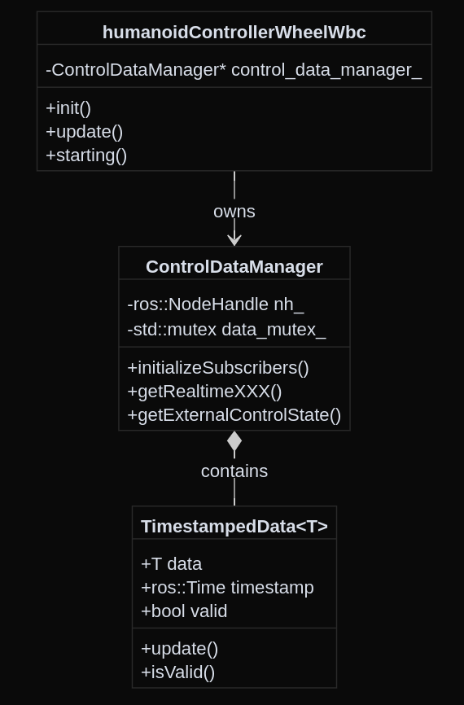
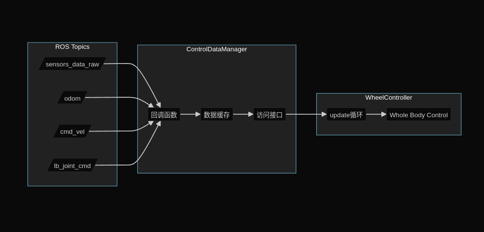

# ControlDataManager 设计文档

## 1. 概述

`ControlDataManager` 是一个数据管理类，负责管理 `humanoidControllerWheelWbc` 的所有外部数据交互。它采用单例模式，为控制器提供线程安全的数据访问接口。

主要功能：
- 管理ROS话题的订阅和数据缓存
- 提供线程安全的数据访问接口
- 处理数据时间戳和有效性检查
- 维护外部控制状态的默认值

## 2. 类关系



## 3. 接口分类

### 3.1 构造与初始化
```cpp
// 构造函数
explicit ControlDataManager(ros::NodeHandle& nh, bool is_real, int arm_num, int low_joint_num);

// 初始化所有订阅者
void initializeSubscribers();
```

### 3.2 实时数据接口（带时间戳校验）
```cpp
// 传感器数据（关节位置、速度、加速度、力矩，IMU数据等）
bool getRealtimeSensorData(SensorData& out) const;

// 里程计数据 [x, y, yaw, vx, vy, vyaw]
bool getRealtimeOdomData(vector6_t& out) const;

// 基座位姿 [x, y, z, qw, qx, qy, qz]
bool getRealtimeBaseLinkPose(vector_t& out) const;

// 速度命令（500ms超时）
bool getRealtimeCmdVel(geometry_msgs::Twist& out) const;

// VR相关数据
bool getRealtimeWaistYawLinkPose(vector_t& out) const;
bool getRealtimeVrTorsoPose(vector_t& out) const;
```

### 3.3 外部控制状态接口（直接返回）
```cpp
// 轮臂关节状态 [4个关节]
vector_t getLbWaistExternalControlState() const;

// 头部状态 [yaw, pitch]（带关节限位检查）
vector_t getHeadExternalControlState() const;

// 手臂轨迹（位置、速度、力矩）
ArmJointTrajectory getArmExternalControlState() const;

// VR控制模式
bool getWholeTorsoCtrl() const;
void resetVrTorsoPose();  // 重置VR躯干姿态为单位姿态

// 从当前状态更新手臂外部控制状态
void updateArmExternalControlState(
    const Eigen::VectorXd& current_pos,
    const Eigen::VectorXd& current_vel,
    const Eigen::VectorXd& current_tau
);
```

### 3.4 批量数据接口
```cpp
// 一次获取多个数据（减少锁开销）
struct ControlData {
    SensorData sensors;
    vector6_t odom;
    vector_t base_link_pose;
    geometry_msgs::Twist cmd_vel;
    bool valid;
};

ControlData getAllControlData() const;
```

### 3.5 状态查询接口
```cpp
// 检查所有必需数据是否就绪
bool isDataReady() const;
```

### 3.6 服务注册接口
```cpp
// 注册单个ROS服务（模板方法，支持任意服务类型）
template<typename ServiceT>
void registerService(
    const std::string& service_name,
    std::function<bool(typename ServiceT::Request&, typename ServiceT::Response&)> callback
);

// 使用示例：
control_data_manager_->registerService<kuavo_msgs::changeArmCtrlMode>(
    "/enable_wbc_arm_trajectory_control",
    [this](auto& req, auto& res) { return handleArmTraj(req, res); }
);
```

### 3.7 数据结构定义
```cpp
// 传感器数据结构
struct SensorData {
    ros::Time timeStamp_;
    vector_t jointPos_;      // 关节位置
    vector_t jointVel_;      // 关节速度
    vector_t jointAcc_;      // 关节加速度
    vector_t jointTorque_;   // 关节力矩
    vector3_t angularVel_;   // 角速度
    vector3_t linearAccel_;  // 线加速度
    Eigen::Quaternion<scalar_t> quat_;  // 姿态四元数
    matrix3_t orientationCovariance_;    // 姿态协方差
    matrix3_t angularVelCovariance_;     // 角速度协方差
    matrix3_t linearAccelCovariance_;    // 线加速度协方差
};

// 手臂关节轨迹数据结构
struct ArmJointTrajectory {
    Eigen::VectorXd pos;  // 位置
    Eigen::VectorXd vel;  // 速度
    Eigen::VectorXd tau;  // 力矩
};

// 带时间戳的数据容器
template<typename T>
struct TimestampedData {
    T data;
    ros::Time timestamp;
    bool valid = false;
    
    void update(const T& new_data);
    bool isValid(double timeout_sec = 1.0) const;
};
```

## 4. 数据流



## 5. 使用示例

### 基本使用
```cpp
// 在 humanoidControllerWheelWbc 中使用
void humanoidControllerWheelWbc::update() {
    // 1. 获取实时数据（带超时检查）
    SensorData sensors_data;
    if (!control_data_manager_->getRealtimeSensorData(sensors_data)) {
        return;  // 数据超时，退出更新
    }
    
    // 2. 获取外部控制状态（直接返回）
    vector_t lb_state = control_data_manager_->getLbWaistExternalControlState();
    vector_t head_state = control_data_manager_->getHeadExternalControlState();
    
    // 3. 更新控制...
}
```

## 6. 线程安全性

### 6.1 锁的分组设计
为了提高并发性能，将数据按照优先级和相关性分组，使用三把不同的互斥锁：

```cpp
class ControlDataManager {
private:
    // 1. 传感器数据（最高优先级）
    mutable std::mutex sensor_mutex_;
    TimestampedData<SensorData> sensor_data_;  // 关节位置、速度、IMU等关键数据

    // 2. 位置和速度命令（高优先级）
    mutable std::mutex motion_mutex_;
    TimestampedData<vector6_t> odom_data_;        // 里程计
    TimestampedData<vector_t> base_link_pose_;    // 基座位姿
    TimestampedData<geometry_msgs::Twist> cmd_vel_;  // 速度命令

    // 3. 外部控制状态（低优先级）
    mutable std::mutex external_state_mutex_;
    TimestampedData<vector_t> lb_waist_external_control_state_;
    TimestampedData<vector_t> head_external_control_state_;
    TimestampedData<vector_t> waist_yaw_link_pose_;
    TimestampedData<vector_t> vr_torso_pose_;
    TimestampedData<ArmJointTrajectory> arm_external_control_state_;
};
```

### 6.2 优化策略

1. **数据分组**
   - 传感器数据独立锁，保证最高优先级
   - 运动相关数据共用锁，保证一致性
   - 外部控制状态共用锁，互不影响关键数据

2. **最小化锁持有时间**
```cpp
void sensorsDataCallback(const kuavo_msgs::sensorsData::ConstPtr& msg) {
    // 1. 在锁外处理数据
    SensorData sensor_data;
    processSensorData(msg, sensor_data);
    
    // 2. 最后只锁定写入操作
    {
        std::lock_guard<std::mutex> lock(sensor_mutex_);
        sensor_data_.update(sensor_data);
    }
}
```

3. **批量获取优化**
```cpp
ControlData getAllControlData() const {
    ControlData data;
    bool sensor_valid = false;
    bool motion_valid = false;
    
    // 分别获取不同优先级的数据
    {
        std::lock_guard<std::mutex> lock(sensor_mutex_);
        data.sensors = sensor_data_.data;
        sensor_valid = sensor_data_.isValid();
    }
    
    {
        std::lock_guard<std::mutex> lock(motion_mutex_);
        data.odom = odom_data_.data;
        data.base_link_pose = base_link_pose_.data;
        data.cmd_vel = cmd_vel_.data;
        motion_valid = odom_data_.isValid() && base_link_pose_.isValid();
    }
    
    data.valid = sensor_valid && motion_valid;
    return data;
}
```

### 6.3 性能优势

1. **并发性能**
   - 不同类型的数据可以并行处理
   - 关键数据不会被低优先级操作阻塞
   - 减少锁竞争，提高吞吐量

2. **实时性保证**
   - 传感器数据独立锁保证最快响应
   - 运动数据共享锁保证一致性
   - 外部控制状态互不干扰

3. **死锁预防**
   - 明确的锁层次结构
   - 最小化锁持有时间
   - 避免在持有锁时调用外部函数
```