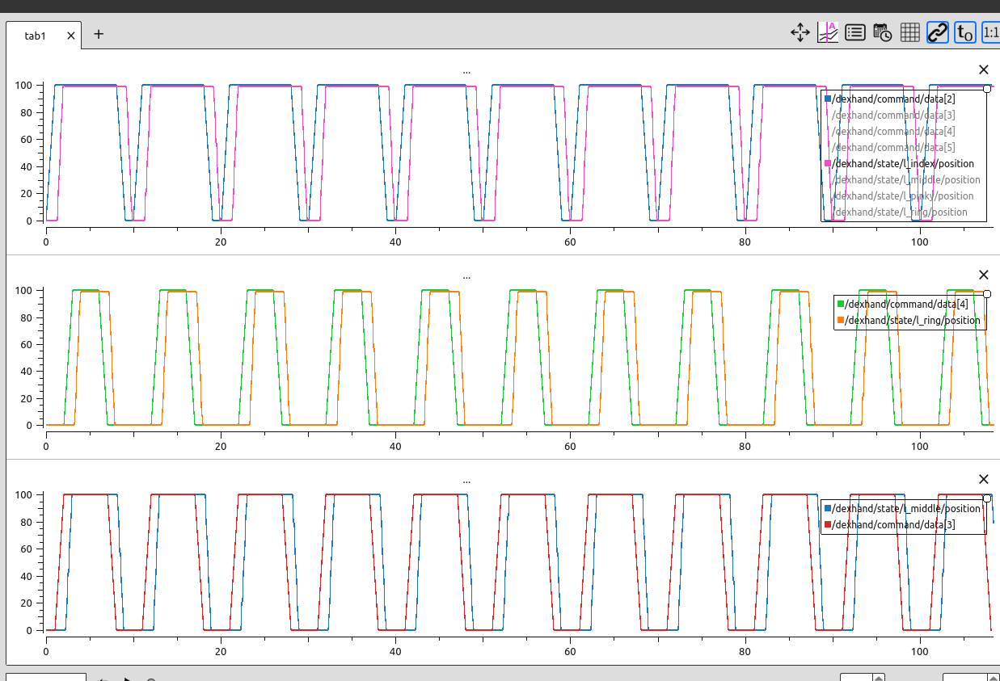
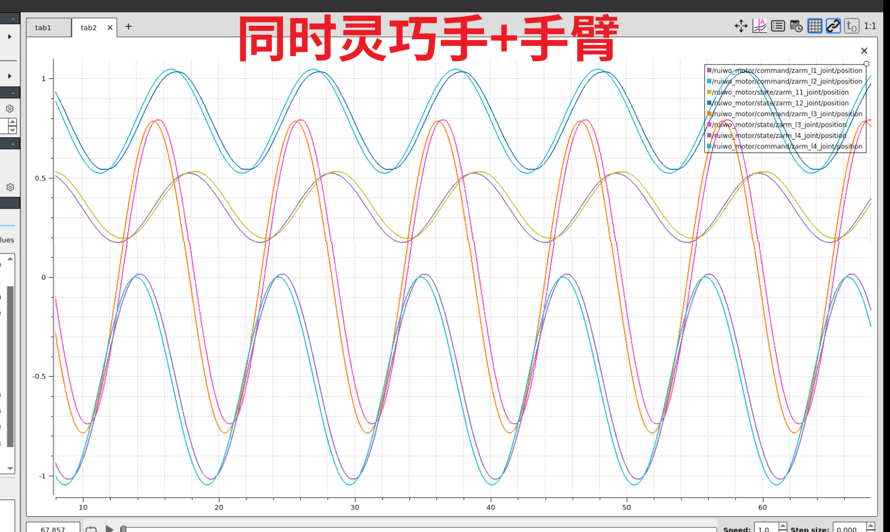
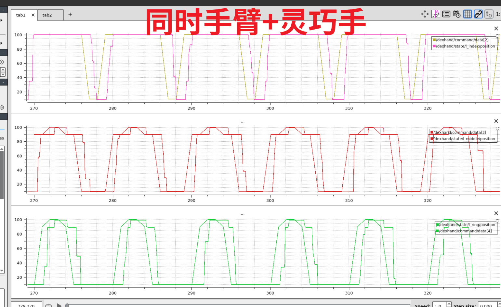

# 测试示例使用说明

`hardware_node/src/tests` 目录下的主要测试示例如下:

- **dexhand_ctrl_test** - 灵巧手控制器测试（由 `dexhand_controller_test.cc` 编译生成）
- **roban_arm_with_revo2_test** - roban 手臂和灵巧手接同CAN总线集成测试（由 `roban_arm_with_revo2_test.cc` 编译生成）
- **ruiwo_motor/** - 瑞沃电机控制器测试目录

## 编译

在运行测试程序之前，需要先编译 `hardware_node` 包：

```bash
catkin build hardware_node
```

## 1. 灵巧手控制器测试

### 功能介绍
该测试程序可用单独测试灵巧手,包括硬件层和ROS层：
- **Kuavo（Revo1）平台**：触觉版本和非触觉版本
- **Roban2（Revo2）平台**：非触觉手
- **两种运行模式**：ROS节点模式和独立运行模式

### 使用方法

#### 使用示例：
```bash
# 基于ROS控制触觉手
./devel/lib/hardware_node/dexhand_ctrl_test --touch --ros

# 基于ROS控制非触觉手
./devel/lib/hardware_node/dexhand_ctrl_test --normal --ros

# 控制Roban2二代手
./devel/lib/hardware_node/dexhand_ctrl_test --revo2 --ros

# 控制触觉手（独立模式）
./devel/lib/hardware_node/dexhand_ctrl_test --touch

# 控制非触觉手（独立模式）
./devel/lib/hardware_node/dexhand_ctrl_test --normal
```

#### 参数说明：
- `--touch`：Kuavo一代触觉手
- `--normal`：Kuavo一代非触觉手
- `--revo2`：Roban二代非触觉手
- `--ros`：启用ROS模式（可选）

#### 辅助测试脚本：
- **`scripts/dexhand_tracing_test.py`**：灵巧手波浪运动跟踪测试脚本

该脚本用于测试灵巧手的波浪运动跟踪控制，通过控制手指的渐进式位置变化来实现波浪运动效果。

**使用方法：**
1. 先启动灵巧手控制器测试节点：
   ```bash
   ./devel/lib/hardware_node/dexhand_ctrl_test --revo2 --ros
   ```

2. 然后运行此脚本：
   ```bash
   source devel/setup.bash
   python3 scripts/dexhand_tracing_test.py
   ```




## 2. Roban2 手臂+灵巧手 CAN 总线集成测试

### 功能介绍
该测试程序是Roban机械臂控制器与Revo2灵巧手共用同一CAN总线的集成测试节点，用于验证机械臂和灵巧手在同一个CAN总线上的通信和控制。


### 使用方法
```bash
# 启动节点（需要ROS环境）
roslaunch hardware_node roban_arm_with_revo2_test.launch

# 或者带校准参数启动
roslaunch hardware_node roban_arm_with_revo2_test.launch cali_arm:=true

# 运行机械臂跟踪测试
source devel/setup.bash
python3 scripts/roban_arm_tracing_test.py

# 运行灵巧手跟踪测试
source devel/setup.bash
python3 src/kuavo-ros-control-lejulib/hardware_node/src/tests/scripts/dexhand_tracing_test.py
```
| Roban2手臂 | Revo2灵巧手 |
|------------------|------------|
|  |  |

## 3. 瑞沃手臂电机控制器测试

### 功能介绍
该目录包含瑞沃电机控制器的相关测试文件和脚本。

#### 使用方法
```bash
# 测试 kuavo
roslaunch hardware_node ruiwo_motor_cxx_test.launch robot_type:=kuavo

# 运行跟踪
source devel/setup.bash
python3 src/kuavo-ros-control-lejulib/hardware_node/src/tests/scripts/kuavo_arm_tracing_test.py

# 测试 roban
roslaunch hardware_node ruiwo_motor_cxx_test.launch robot_type:=roban

# 运行跟踪
source devel/setup.bash
python3 src/kuavo-ros-control-lejulib/hardware_node/src/tests/scripts/roban_arm_tracing_test.py
```

详情参阅 [Ruiwo 电机控制跟踪测试指南](./docs/ruiwo_motor_guide.md)