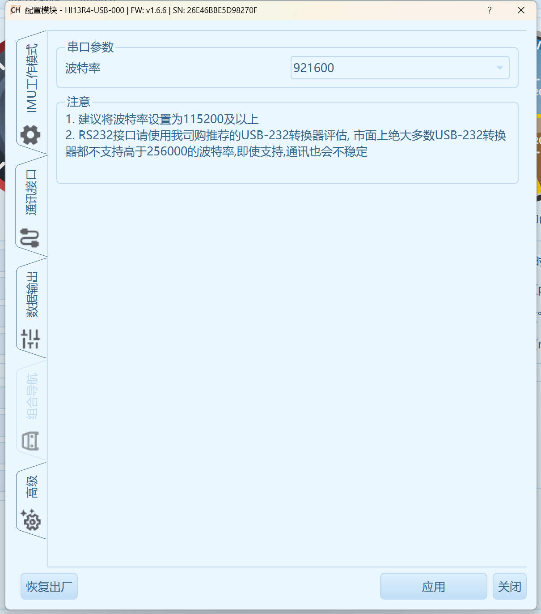
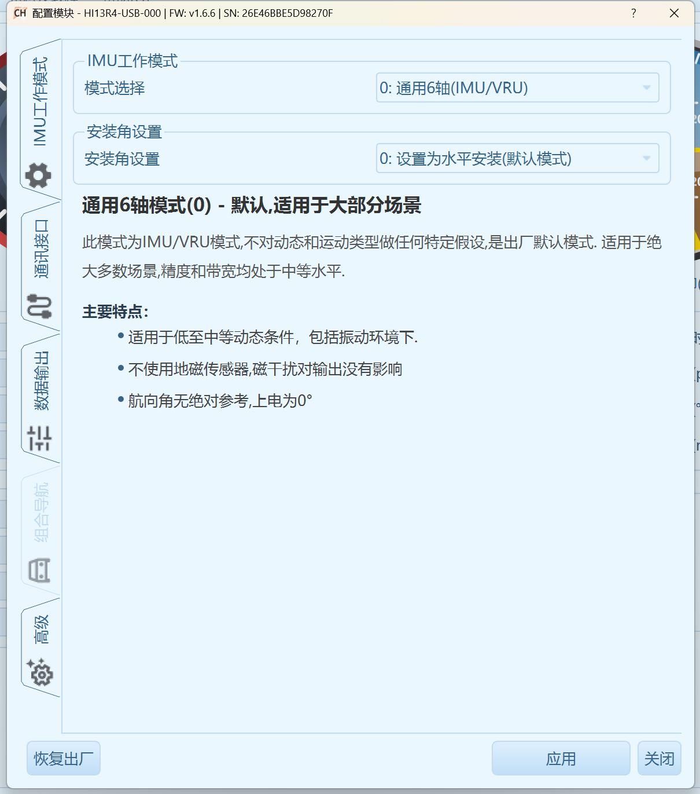
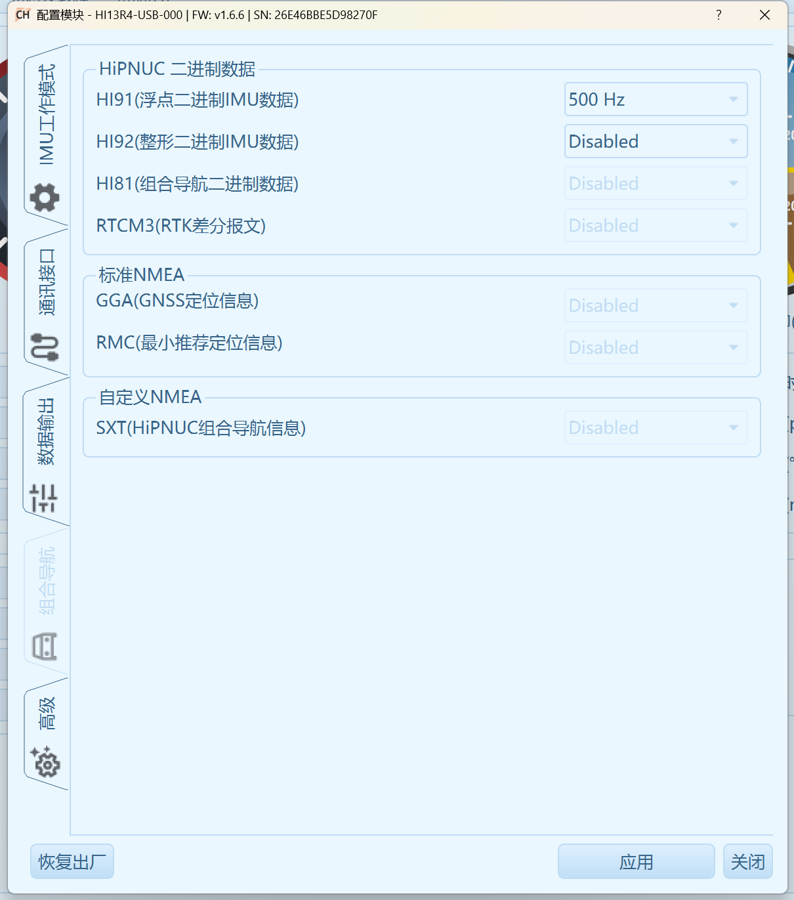
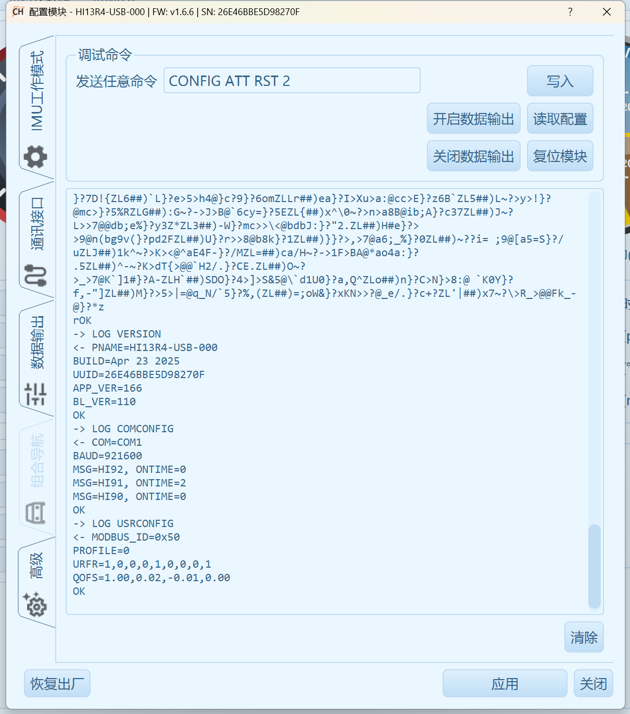

# Hipnuc IMU 使用说明

- [指令手册下载](http://download.hipnuc.com/products/common/cum/imu_cum_cn.pdf)
- [Windows上位机下载](https://download.hipnuc.com/internal/pc_host/CHCenter.7z)

## IMU配置
- 下载Windows上位机，安装
- IMU稳定安装在机器人底盘上
- 连接IMU，打开上位机，选择`连接-自动连接-扫描设备`，扫描到IMU后连接即可。打开`工具-配置模块(串口)`
- 配置`通讯接口`中波特率为`916000`,点击应用
  - 
- 配置`IMU工作模式`为`通用6轴`、`水平安装方式`，点击应用
  - 
- 配置`数据输出`中`HI91`为`500Hz`，点击应用
  - 

## 机器人nuc环境配置

##### udev规则配置
- 进入src/kuavo-ros-control-lejulib/hardware_node/lib/hipnuc_imu/scripts目录
- 执行
```bash
chmod +x hip_imu_serial_set.sh
./hip_imu_serial_set.sh
```
- 重启udev
```bash
sudo service udev restart
```
##### imu类型配置`hipnuc`

- 编辑`~/.config/lejuconfig/ImuType.ini`, 写入`hipnuc`

```bash
echo "hipnuc" >> ~/.config/lejuconfig/ImuType.ini
```

## **hipnuc-imu校准（重要！）**
> 校准分为两个部分，上位机上的校准和软件校准
##### 使用上位机校准
- 进入上位机，打开`工具-配置模块(串口)-高级`
- 使用外部传感器(如手机陀螺仪)贴在机器人底座上(注意不是imu上)，移动底座到完全水平的位置
- 在命令栏输入`CONFIG ATT RST 2`(更多命令参考上面的指令手册)
  - 
- 点击`写入`(不能按回车)
- 点击`应用`即可！

##### 软件校准功能
- 由于上位机校准无法完全校准好imu(存在较大的手工校准误差)，会差异0.x度的级别基本上已经校准不到更高精度了
- 这时候可以通过使用配置文件中的`~/.config/lejuconfig/hipimuEulerOffset.csv`的角度偏差来微调(当然也可以完全通过这个文件来校准好)
- `hipimuEulerOffset.csv`中存储的内容是`yaw,pitch,roll`的偏差
- 观察站立或者原地踏步时机器人往哪边偏,然后调整`hipimuEulerOffset.csv`中对应姿态往哪边倾斜
- 例如：
  - 机器人原地踏步时往左侧倒，则应该调整`hipimuEulerOffset.csv`中`roll`维度+0.2度的级别微调
  - 写入`0.0,0.0,-0.2`
  - 保存后重启程序即可
