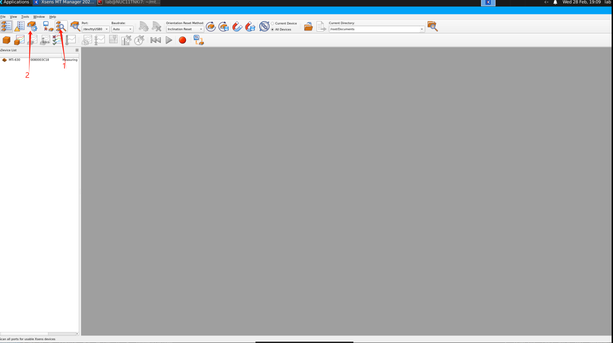
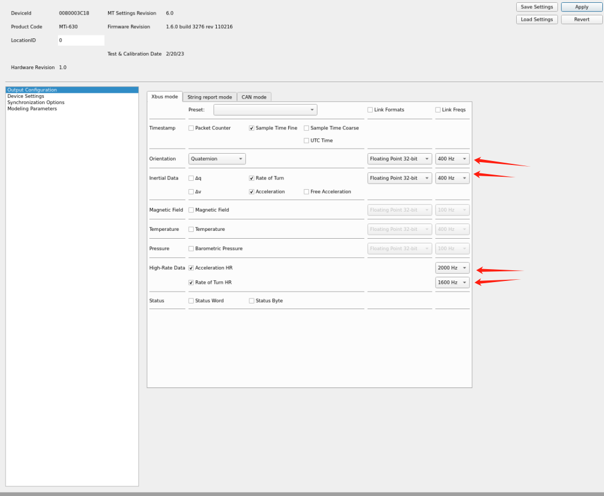
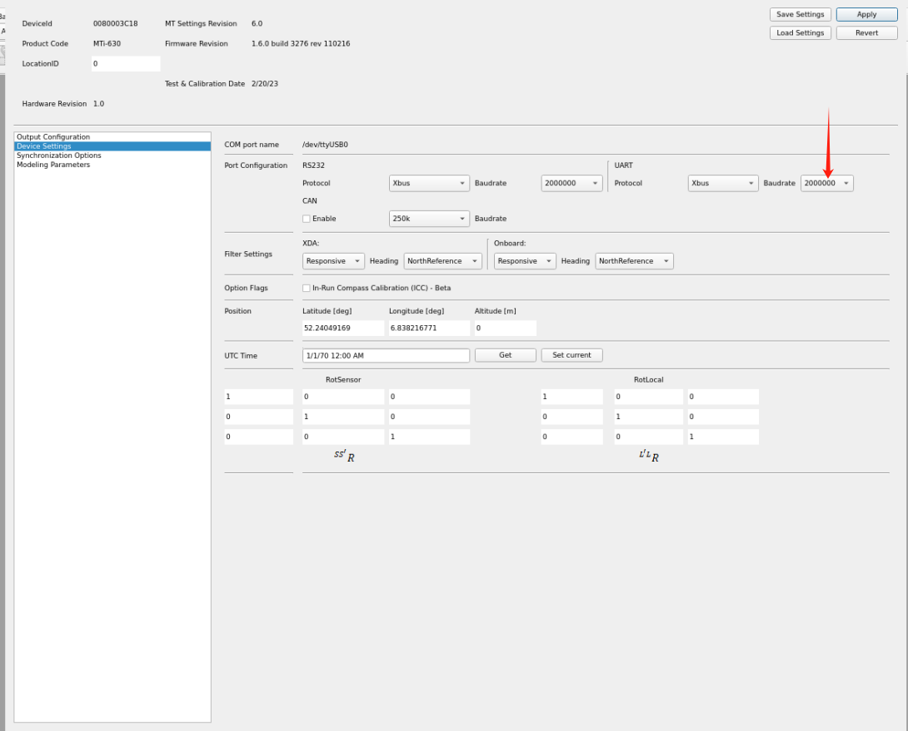

## xsens MTI 600 IMU 配置文档
- 到官网下载 mt manager软件：https://www.movella.com/support/software-documentation
- windows下使用 MT manager 2022软件进行配置 

- 我们的NUC镜像中也已经装了mtmanager，在`~/mtmanager/`目录, 需要root权限执行
  - `sudo ./mtmanager/linux-x64/bin/mtmanager`

### 配置MT Manager
- 打开MT Manager 软件，点击自动扫描
- 
- 进入设置页面，配置imu要上传的数据，如下图所示, 注意上传加速度为2000Hz，角速度为1600Hz，四元数为400Hz：
- 
- 配置波特率为2M
- 
- apply即可
- 可以使用kuavo仓库的imu_test程序进行测试，`sudo ./lib/xsens_ros_mti_driver/imu_test`
