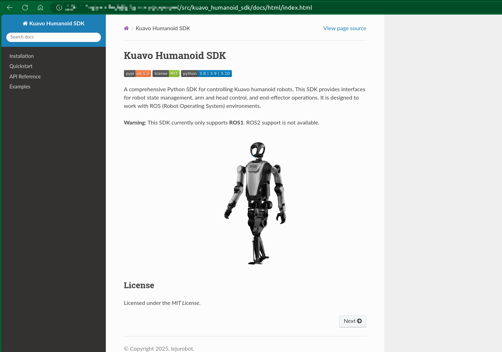

# Kuavo Humanoid SDK
[](https://pypi.org/project/kuavo-humanoid-sdk/)[](#)[](https://pypi.python.org/pypi/kuavo-humanoid-sdk)

一个全面的 Python SDK，用于控制 Kuavo 人形机器人。该 SDK 提供了机器人状态管理、手臂和头部控制以及末端执行器操作的接口。它设计用于与 ROS（机器人操作系统）环境一起工作。

**警告**：该 SDK 目前仅支持 **ROS1**。不支持 ROS2。

PyPI 项目地址: https://pypi.org/project/kuavo-humanoid-sdk/

## 安装
**提示：对于本 SDK 目前存在两个版本，正式发布版与beta内测版, 他们的区别是：**
- 正式发布版：稳定版，对应 [kuavo-ros-opensource](https://gitee.com/leju-robot/kuavo-ros-opensource/) 的 `master` 分支提供的功能，
- beta内测版：该版本较正式版会激进一些，同时也会提供更丰富的功能，对应 [kuavo-ros-opensource](https://gitee.com/leju-robot/kuavo-ros-opensource/) 的 `beta` 分支提供的功能。

**温馨提示：请务必明确您需要安装的版本，如果您的SDK版本与 `kuavo-ros-opensource` 未匹配，可能会出现某些功能不可用的错误。**

安装最新的 **正式版** Kuavo Humanoid SDK，可以使用 pip：
```bash
pip install kuavo-humanoid-sdk
```

可选功能依赖（按需安装）：
```bash
# 仅语音/ASR相关功能
pip install kuavo-humanoid-sdk[audio]

# 仅视觉/YOLO相关功能
pip install kuavo-humanoid-sdk[vision]

# 全量功能（包含音频 + 视觉依赖）
pip install kuavo-humanoid-sdk[full]
```

安装最新的 **beta版** Kuavo Humanoid SDK，可以使用 pip：
```bash
pip install --pre kuavo-humanoid-sdk

```
对于本地开发安装（可编辑模式），请使用：
```bash
cd src/kuavo_humanoid_sdk
chmod +x install.sh
./install.sh

# 如需安装可选功能依赖：
# ./install.sh --extras audio
# ./install.sh --extras vision
# ./install.sh --extras full
```

## 升级更新

在升级更新之前，您可以先执行以下命令来查看当前安装的版本：
```bash
pip show kuavo-humanoid-sdk
# Output:
Name: kuavo-humanoid-sdk
Version: 0.1.2
...
```
**提示：如果您的版本号中包含字母`b`，则表示该版本为测试版, 比如`Version: 0.1.2b113`**

**当前为正式版**，升级到最新正式版:
```bash
pip install --upgrade kuavo_humanoid_sdk
```
**当前为beta版**，升级到最新正式版:
```bash
pip install --upgrade --force-reinstall kuavo_humanoid_sdk
# 或者
pip uninstall kuavo_humanoid_sdk && pip install kuavo_humanoid_sdk
```
**当前为正式版/beta版**，升级到最新beta版:
```bash
pip install --upgrade --pre kuavo_humanoid_sdk
```

## 文档

有关详细的 SDK 文档和使用示例，请参阅 [sdk_description.md](sdk_description.md)。

此外我们还提供了两种格式的文档：
- HTML 格式：[docs/html](docs/html), **需要自己执行脚本生成**
- Markdown 格式：[docs/markdown](docs/markdown)

我们推荐您自己执行文档脚本生成文档到本地, 文档会输出到`docs/html`和`docs/markdown`文件夹:
```bash
catkin build kuavo_msgs ocs2_msgs
chmod +x ./gen_docs.sh
./gen_docs.sh
```

我们推荐您使用`html`查看文档更加方便，比如:


## 搬箱子案例

请参阅 html 或 markdown 文档中，**策略模块/搬箱子示例**章节内容，获取更多信息。

**测试**
```
python3 -m pytest test_grasp_box_strategy.py -v
```
测试用例主要验证抓取盒子案例的各个策略模块：
- `test_head_find_target_success_rotate_head`: 测试仅通过头部旋转成功找到目标
- `test_head_find_target_success_rotate_body`: 测试需要旋转身体后成功找到目标
- `test_head_find_target_timeout`: 测试搜索超时未找到目标的情况
- `test_head_find_target_invalid_id`: 测试目标ID无效的情况
- `test_walk_approach_target_success`: 测试成功接近目标
- `test_walk_approach_target_no_data`: 测试目标数据不存在的情况
- `test_walk_to_pose_success`: 测试成功移动到指定位姿
- `test_walk_to_pose_failure`: 测试移动到指定位姿失败的情况
- `test_arm_move_to_target_success`: 测试手臂成功移动到目标位置
- `test_arm_move_to_target_failure`: 测试手臂移动失败的情况
- `test_arm_transport_target_up_success`: 测试成功抬起箱子
- `test_arm_transport_target_up_failure`: 测试抬起箱子失败的情况
- `test_arm_transport_target_down_success`: 测试成功放下箱子
- `test_arm_transport_target_down_failure`: 测试放下箱子失败的情况
