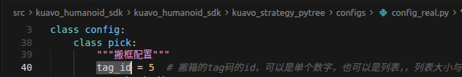
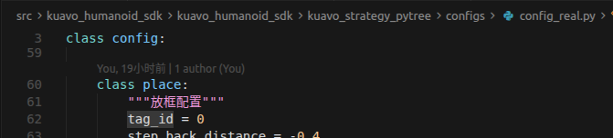

# PyTree搬箱 说明文档

本文档介绍基于 PyTrees 行为树的 Kuavo 人形机器人策略搬箱，包括环境部署和代码详细说明。

---

## 第一部分：环境部署

### (一) 代码仓库配置

**注意： 代码仓库配置只需要执行一次，后续修改参数后直接重新运行程序即可**

**上位机仓库配置**

- 一般用dev分支，若有问题，可使用分支：`cfl/dev/ros_application/kuavo5-grabBox`，该分支可用
```bash
git fetch
git checkout cfl/dev/ros_application/kuavo5-grabBox
```

**上位机代码编译**

- 上位机仓库代码修改
- 编译相关功能包：
```bash
cd kuavo_ros_application
git checkout dev
catkin build apriltag_ros 
catkin build kuavo_camera dynamic_biped kuavo_tf2_web_republisher ar_control
```

**下位机代码编译**

- 下载依赖环境，编程过程缺什么则安装对应依赖，以下只是示例
```bash
# 更新软件源
sudo apt-get update
# grab_box功能包相关依赖
sudo apt-get install ros-noetic-geographic-msgs -y
# humanoid_controller包编译依赖
sudo apt-get install libudev-dev -y
```

- 编译相关功能包：
```bash
cd ~/kuavo-ros-control
sudo su
catkin clean -y
catkin build humanoid_controllers gazebo_sim ar_control mobile_manipulator_controllers kuavo_msgs grab_box
source devel/setup.bash 
```

**下位机kuavo-humanoid-sdk安装**

```bash
cd src/kuavo_humanoid_sdk
chmod +x install.sh
./install.sh
cd ../../
```
	安装完sdk，通过终端指令查看版本：
	```bash
	pip show kuavo_humanoid_sdk | grep Version            
	```
	若版本为1.3及以上，则正确

**下位机py_trees安装**
```bash
pip install py_trees
```

### (二) 预设参数调整

⚠️⚠️⚠️ **注意： 调整参数后建议先在gazebo仿真中进行测试，确认效果无误后再在实物上运行**

- 用户使用时需将AprilTag ID和标签尺寸修改为与实际一致
- 1、本地电脑仿真
`vim /opt/ros/noetic/share/apriltag_ros/config/tags.yaml`打开文件，将tag尺寸修改为：
```
standalone_tags:
  [
    {id: 0, size: 0.088, name: 'tag_0'},
    {id: 1, size: 0.088, name: 'tag_1'},
    {id: 2, size: 0.088, name: 'tag_2'},
    {id: 3, size: 0.088, name: 'tag_3'},
    {id: 4, size: 0.088, name: 'tag_4'},
    {id: 5, size: 0.088, name: 'tag_5'},
    {id: 6, size: 0.088, name: 'tag_6'},
    {id: 7, size: 0.088, name: 'tag_7'},
    {id: 8, size: 0.088, name: 'tag_8'},
    {id: 9, size: 0.088, name: 'tag_9'}
  ]
```
- 2、实机运行
- 在kuavo_ros_application上位机仓库下修改`./src/ros_vision/detection_apriltag/apriltag_ros/config/tags.yaml`文件的tag尺寸，注意要与实际tag码的长度一致

**箱子与tag码相对位置设定**

- 粘贴在箱子上的 AprilTag 信息：AprilTag ID，标签尺寸(单位是米)和基于odom坐标系下的大致位姿
	```python
	修改配置文件config_sim.py/config_real.py文件的tag_id
	```

**箱子信息设定**

- 这里以示例中的箱子参数为例，用户使用时需根据实际情况填写，实机运行：需在配置文件`config_real.py`或`config_boxes_real.py`中`tag_id`参数填入箱码id，如修改config_real.py文件：
- 
- 

### (三) 仿真运行

**环境配置**

- 仿真使用时，需确认机器人版本 `ROBOT_VERSION=52`

**上位机运行**

- 需要自行配置上位机与自己电脑的主从机通信
- 若以自己电脑为ROS主机，需要先运行roscore，再在上位机执行如下操作


- 上位机：打开终端，运行
```bash
cd ~/kuavo_ros_application
source devel/setup.bash
roslaunch kuavo_tf2_web_republisher start_websocket_server.launch
```

**确保已阅读[(二) 预设参数调整](#二-预设参数调整)部分，并完成相应配置内容的检查**

- 下位机：打开终端一，启动gazebo场景
```bash
cd ~/kuavo-ros-control
source devel/setup.zsh
roslaunch humanoid_controllers load_kuavo_gazebo_manipulate.launch
```

- 下位机：打开终端二，启动ar_tag转换码操作
```bash
cd ~/kuavo-ros-control
source devel/setup.zsh
roslaunch ar_control robot_strategies.launch
```

- 下位机：打开终端三，运行搬箱子示例：

**注意**：搬箱子有两个案例case_new.py和case_boxes.py，两个案例都支持搬多层箱子，运行前请确认配置文件中已正确修改参数：

案例一："case_new.py"，机器人初始站立姿态面向搬运箱子位置:
- **仿真运行**：在该文件中第六行修改为： `from kuavo_humanoid_sdk.kuavo_strategy_pytree.configs.config_sim import config`
- **实机运行**：在该文件中第六行修改为： `from kuavo_humanoid_sdk.kuavo_strategy_pytree.configs.config_real import config`

```bash
cd ~/kuavo-ros-control
source devel/setup.zsh
python3 ./src/kuavo_humanoid_sdk/kuavo_humanoid_sdk/kuavo_strategy_pytree/pick_place_box/case_new.py
```
案例二："case_boxes.py"，机器人初始站立姿态面向放置箱子位置:
- **仿真运行**：在该文件中第七行修改为： `from kuavo_humanoid_sdk.kuavo_strategy_pytree.configs.config_boxes_sim import config`
- **实机运行**：在该文件中第七行修改为： `from kuavo_humanoid_sdk.kuavo_strategy_pytree.configs.config_boxes_real import config`
```bash
cd ~/kuavo-ros-control
source devel/setup.zsh
python3 ./src/kuavo_humanoid_sdk/kuavo_humanoid_sdk/kuavo_strategy_pytree/pick_place_box/case_boxes.py
```

### (四) 实物运行

**环境配置**

- 机器人会以站立时的位置作为其坐标系原点，若跑案例一（case_new.py程序）,机器人需面向要搬运的箱子，若跑案例二(case_boxes.py)，机器人面向要放置箱子的位置

**下位机运行**

⚠️⚠️⚠️ **确保已阅读[(二) 预设参数调整](#二-预设参数调整)部分，并完成相应配置内容的检查**

- 1.下位机打开终端一，让机器人站立
```bash
sudo su
source devel/setup.bash
roslaunch humanoid_controllers load_kuavo_real.launch with_mm_ik:=true
```

- 2.下位机打开终端二，启动Tag Tracker节点
```bash
sudo su
source devel/setup.bash
roslaunch ar_control robot_strategies.launch real:=true
```

**上位机运行**

- 3.上位机需要先修改 `~/kuavo_ros_application/src/ros_vision/detection_apriltag/apriltag_ros/config/tags.yaml` 文件，将 tag 的 size 尺寸修改为实际大小，比如 0.1 米，并将要识别的箱码id填入tags.yaml文件中，如下所示：
```yaml
standalone_tags:
    [
        {id: 0, size: 0.1, name: 'tag_0'},
        {id: 1, size: 0.1, name: 'tag_1'},
        {id: 2, size: 0.1, name: 'tag_2'},
        {id: 3, size: 0.1, name: 'tag_3'},
        {id: 4, size: 0.1, name: 'tag_4'},
        {id: 5, size: 0.1, name: 'tag_5'},
        {id: 6, size: 0.1, name: 'tag_6'},
        {id: 7, size: 0.1, name: 'tag_7'},
        {id: 8, size: 0.1, name: 'tag_8'},
        {id: 9, size: 0.1, name: 'tag_9'}
    ]
```

- 4.上位机打开终端，运行
```bash
cd ~/kuavo_ros_application
source devel/setup.bash

roslaunch dynamic_biped load_robot_head.launch use_orbbec:=true
```

- 5.上位机另启新终端，运行
```bash
cd ~/kuavo_ros_application
source devel/setup.bash
roslaunch kuavo_tf2_web_republisher start_websocket_server.launch
```

**下位机运行**

- 6.下位机打开终端三，运行搬箱子示例：

**注意**：搬箱子有两个案例case_new.py和case_boxes.py，两个案例都支持搬多层箱子，运行前请确认配置文件中已正确修改参数：
案例一："case_new.py"，机器人初始站立姿态面向搬运箱子位置:
- **仿真**：在文件第六行修改为： `from kuavo_humanoid_sdk.kuavo_strategy_pytree.configs.config_sim import config`
- **实机**：在文件第六行修改为： `from kuavo_humanoid_sdk.kuavo_strategy_pytree.configs.config_real import config`

```bash
cd ~/kuavo-ros-control
source devel/setup.zsh
python3 ./src/kuavo_humanoid_sdk/kuavo_humanoid_sdk/kuavo_strategy_pytree/pick_place_box/case_new.py
```
案例二："case_boxes.py"，机器人初始站立姿态面向放置箱子位置:
- **仿真**：在文件第六行修改为： `from kuavo_humanoid_sdk.kuavo_strategy_pytree.configs.config_boxes_sim import config`
- **实机**：在文件第六行修改为： `from kuavo_humanoid_sdk.kuavo_strategy_pytree.configs.config_boxes_real import config`
```bash
cd ~/kuavo-ros-control
source devel/setup.zsh
python3 ./src/kuavo_humanoid_sdk/kuavo_humanoid_sdk/kuavo_strategy_pytree/pick_place_box/case_boxes.py
```

**实物运行参数调整**

- 因为每台机的机况不同，箱子也可能不同，因此用户可能需要根据实际情况调整抓取或放置的参数，以下为两个调参示例

- 若箱子抓取点偏前(机器人的x正方向)、偏上(机器人的z正方向)、偏右(机器人的y正方向)
	- 调整文件`src/kuavo_humanoid_sdk/kuavo_humanoid_sdk/kuavo_strategy_pytree/configs/config_real.py`的参数分别如下：
	```python
	box_behind_tag = 0.17  # 箱子在tag后面的距离，单位米
    box_beneath_tag = 0.1  # 箱子在tag下方的距离，单位米
    box_left_tag = -0.0  # 箱子在tag左侧的距离，单位米
	```
---

## 第二部分：代码说明

本部分详细介绍 kuavo_strategy_pytree 模块的代码结构和实现细节。

### 1. case_new.py 行为树流程介绍

**整体流程概述**

`case_new.py` 实现了一个完整的搬箱子任务流程，使用 PyTrees 行为树框架协调机器人的感知、决策和执行。任务流程包括：

1. 寻找并识别箱子上的 AprilTag
2. 走到箱子位置并执行手臂预动作
3. 拿起箱子并后退
4. 拿箱子后转腰180度
5. 寻找放置点的 AprilTag
6. 走到放置点
7. 放置箱子
8. 手臂腰部复位并后退
9. 回到初始位置
10. 重复执行
```
行为树结构（2025.12.22）
注：⇉ Parallel表示并行， → Sequence表示顺序， δ Decorator表示装饰器
root (⇉)
├── PERCEP (感知节点，持续运行)
│
└── ACTION (→ Sequence) ─────────────────────────────────
    ├── 1. search_pick_tag (→) - 寻找箱子
    │   ├── search_pick_tag_GUESS (猜测位置)
    │   ├── search_pick_tag_WALK (行走)
    │   ├── ⇉ search_pick_tag_HEAD_AND_WAIT (头部搜索||等待识别)
    │   │   ├── search_pick_tag_HEAD
    │   │   └── search_pick_tag_CONDITION
    │   └── search_pick_tag_TAG2GOAL (转换导航目标)
    │
    ├── 2. walk_to_pick (⇉) - 走向箱子
    │   ├── walk_to_pick_WALk
    │   ├── δ walk_to_pick_TAG2GOAL (SuccessIsRunning)
    │   │   └── walk_to_pick_TAG2GOAL_
    │   └── → pre_pick_arm (手臂预动作)
    │       ├── walk_to_pick_ARM_GOAL
    │       └── walk_to_pick_ARM
    │
    ├── 3. pick_box (→) - 拿起箱子
    │   ├── pick_box_TAG2GOAL
    │   └── pick_box_ARM
    │
    ├── 4. walk_and_turn_waist (⇉) - 后退转腰180°
    │   ├── pick_box_SETWALKGOAL
    │   ├── pick_box_WALK
    │   └── turn_waist_180
    │
    ├── 5. search_place_tag (→) - 寻找放置点
    │   ├── search_place_tag_GUESS
    │   ├── search_place_tag_WALK
    │   ├── ⇉ search_place_tag_HEAD_AND_WAIT
    │   │   ├── search_place_tag_HEAD
    │   │   └── search_place_tag_CONDITION
    │   └── search_place_tag_TAG2GOAL
    │
    ├── 6. walk_to_place (⇉) - 走向放置点
    │   ├── walk_to_place_WALk
    │   └── δ walk_to_place_TAG2GOAL (SuccessIsRunning)
    │       └── walk_to_place_TAG2GOAL_
    │
    ├── 7. place_box (→) - 放置箱子
    │   ├── place_box_TAG2GOAL
    │   └── place_box_ARM
    │
    └── 8. walk_and_turn (⇉) - 复位后退
        ├── back_to_origin_ARM_RESET
        ├── place_box_SETWALKGOAL
        ├── place_box_WALK
        └── → turn_waist_after_trigger (触发后转腰)
            ├── wait_for_distance_trigger
            └── turn_waist_0
```

**行为树根节点结构**

行为树的根节点采用 **Parallel（并行）** 结构，包含两个并行执行的子节点：

- **ACTION (Sequence)**：顺序执行的动作序列，包含所有搬箱子步骤
- **PERCEP**：持续运行的感知节点，不断识别 AprilTag 并更新黑板

并行策略为 `SuccessOnOne`，即任一子节点成功就退出（实际上 PERCEP 始终返回 RUNNING，因此由 ACTION 的完成控制整体流程）。

最外层使用 `Repeat` 装饰器包裹，实现循环执行搬箱子任务。

**各步骤详细说明**

**步骤1：寻找箱子（search_pick_tag）**

- **执行策略**：`Sequence` 顺序执行（`memory=True`）
- **children**：
	- `search_pick_tag_GUESS`（NodeFuntion）：设置箱子 tag 的初始位置猜测，将猜测位置写入黑板作为导航目标
	- `search_pick_tag_WALK`（NodeWalk）：走到猜测位置附近
	- `search_pick_tag_HEAD_AND_WAIT`（Parallel，`SuccessOnOne` 策略）：头部搜索和等待识别并行执行
		- `search_pick_tag_HEAD`（NodeHead）：头部按预设的 yaw/pitch 角度列表进行扫描
		- `search_pick_tag_CONDITION`（NodeWaitForBlackboard）：等待黑板中出现识别到的 tag 数据
	- `search_pick_tag_TAG2GOAL`（NodeTagToNavGoal）：根据识别到的 tag 位置计算机器人应站立的目标位置

**步骤2：走到箱子位置并执行手臂预动作（walk_to_pick）**

- **执行策略**：`Parallel` 并行执行（`SuccessOnSelected`，以 `walk_to_pick_WALk` 完成为准）
- **children**：
	- `walk_to_pick_WALk`（NodeWalk）：行走到箱子操作位置
	- `walk_to_pick_TAG2GOAL`（NodeTagToNavGoal，装饰器 `SuccessIsRunning`）：持续更新行走目标（因为边走边识别，tag 位置会不断更新）
	- `pre_pick_arm`（Sequence）：手臂预动作子序列
		- `walk_to_pick_ARM_GOAL`（NodeDirectToArmGoal）：生成手臂预动作轨迹
		- `walk_to_pick_ARM`（NodeArm）：执行手臂预动作，将手臂移动到抓取准备位置

**步骤3：拿起箱子（pick_box）**

- **执行策略**：`Sequence` 顺序执行（`memory=True`）
- **children**：
	- `pick_box_TAG2GOAL`（NodeTagToArmGoal）：根据 tag 位置和配置的相对偏移生成抓取轨迹关键点，并生成完整的贝塞尔插值轨迹
	- `pick_box_ARM`（NodeArm）：执行手臂运动，完成抓取动作

**步骤4：后退并转腰180度（walk_and_turn_waist）**

- **执行策略**：`Parallel` 并行执行（`SuccessOnSelected`，以 `turn_waist_180` 完成为准）
- **children**：
	- `pick_box_SETWALKGOAL`（NodeFuntion）：设置后退目标（在 BASE 坐标系下向后平移）
	- `pick_box_WALK`（NodeWalk）：执行后退动作
	- `turn_waist_180`（NodeWaist）：转腰180度，使机器人面向放置方向

**步骤5：寻找放置点（search_place_tag）**

- **执行策略**：`Sequence` 顺序执行（`memory=True`）
- **children**：与步骤1类似，但目标是放置点的 tag
	- `search_place_tag_GUESS`：设置放置点 tag 的初始位置猜测
	- `search_place_tag_WALK`：走到猜测位置（倒退模式，`backward_mode=True`）
	- `search_place_tag_HEAD_AND_WAIT`（Parallel）：头部搜索和等待识别
	- `search_place_tag_TAG2GOAL`：计算放置点站立目标位置

**步骤6：走到放置点（walk_to_place）**

- **执行策略**：`Parallel` 并行执行（`SuccessOnSelected`，以 `walk_to_place_WALk` 完成为准）
- **children**：
	- `walk_to_place_WALk`（NodeWalk，倒退模式）：倒退到放置点操作位置
	- `walk_to_place_TAG2GOAL`（NodeTagToNavGoal，装饰器 `SuccessIsRunning`）：持续更新行走目标

**步骤7：放置箱子（place_box）**

- **执行策略**：`Sequence` 顺序执行（`memory=True`）
- **children**：
	- `place_box_TAG2GOAL`（NodeTagToArmGoal）：根据放置点 tag 位置生成放置轨迹
	- `place_box_ARM`（NodeArm）：执行手臂运动，完成放置动作

**步骤8：手臂腰部复位并后退（walk_and_turn）**

- **执行策略**：`Parallel` 并行执行（`SuccessOnSelected`，以 `place_box_WALK` 和 `turn_waist_after_trigger` 完成为准）
- **children**：
	- `back_to_origin_ARM_RESET1`（NodeFuntion）：调用手臂复位函数
	- `place_box_SETWALKGOAL`（NodeFuntion）：设置后退目标
	- `place_box_WALK`（NodeWalkWithDistanceMonitor）：带距离监控的行走节点，后退指定距离后在黑板设置触发标志
	- `turn_waist_after_trigger`（Sequence）：等待触发后转腰子序列
		- `wait_for_distance_trigger`（NodeWaitForBlackboard）：等待后退达到触发距离
		- `turn_waist_0`（NodeWaist）：转腰回到0度（正前方）

**步骤9-10：回到初始位置（back_to_origin）**

- **执行策略**：`Sequence` 顺序执行（`memory=True`）
- **children**：
	- `back_to_origin_SETGOAL`（NodeFuntion）：设置回到初始位置的目标（ODOM 坐标系下的原点）
	- `back_to_origin_WALK`（NodeWalk）：行走回到初始位置

**多轮搬箱实现机制**

程序支持多轮搬箱，每轮可以使用不同的 tag_id。实现机制如下：

1. **轮次管理**：使用 BlackBoard 存储当前轮次计数器 `current_round`，从 -1 开始，每轮 +1。

2. **动态 tag_id 选择**：在每轮开始时，`update_round_node` 节点会：
	- 读取当前轮次
	- 根据轮次从 `config.pick.tag_id` 列表中选择对应的 tag_id（使用取余数确保循环使用）
	- 更新所有相关节点的 `tag_id` 属性（`search_pick_tag_TAG2GOAL`、`search_pick_tag_HEAD`、`pick_box_TAG2GOAL` 等）
	- 更新 `PERCEP` 节点的 `tag_ids` 列表
	- 重新创建 `search_pick_tag_CONDITION` 节点（因为 `NodeWaitForBlackboard` 的 key 无法动态修改）

3. **节点权限管理**：相关节点（`NodeTagToNavGoal`、`NodeTagToArmGoal`、`NodeHead`、`NodePercep`）在 `initialise()` 方法中会自动为新 tag_id 注册 BlackBoard 访问权限，确保能正确读取和写入数据。

4. **循环执行**：使用 `Repeat` 装饰器包裹根节点，设置 `num_success=config.common.grab_box_num`，实现指定次数的循环执行。

**关键设计说明**

- **Parallel 并行策略**：
	- `SuccessOnOne`：任一子节点成功即退出，用于头部搜索和等待识别（任一完成即可）
	- `SuccessOnSelected`：指定子节点成功才退出，用于行走和其他并行动作的协调（以主要动作完成为准）

- **装饰器**：
	- `SuccessIsRunning`：将子节点的 SUCCESS 状态转为 RUNNING，用于持续更新目标（边走边识别场景）
	- `Repeat`：包裹根节点，实现循环执行

- **memory 参数**：
	- `Sequence(memory=True)`：记住执行进度，子节点完成后不会重新执行，确保流程按顺序推进
	- `Sequence(memory=False)`：每次都重新执行所有子节点

- **黑板机制**：
	- 使用 PyTrees 的 Blackboard 在节点间共享数据（tag 位姿、行走目标、手臂轨迹等）
	- 版本号机制确保数据更新的及时性

### 2. nodes.py 类和函数介绍

本节介绍各个行为树节点类的功能、初始化参数和主要方法。

#### NodeHead

**功能**：头部控制节点，用于扫描搜索 AprilTag

- **初始化参数**：
	- `name` (str)：节点名称
	- `head_api` (HeadAPI)：头部控制 API 实例
	- `head_search_yaws` (List[float])：头部搜索的偏航角度列表（度）
	- `head_search_pitchs` (List[float])：头部搜索的俯仰角度列表（度）
	- `tag_id` (int, optional)：需要检测的 AprilTag ID，用于检查是否识别到目标
	- `check_interval` (float)：转头后等待的时间（秒），给视觉识别时间

- **主要方法**：
	- `update()`：生成头部搜索轨迹（yaw/pitch 笛卡尔积），调用 `head_api.robot_sdk.control.control_head(yaw, pitch)` 控制头部转动，每次转头后等待 `check_interval` 秒。期间从黑板读取 `latest_tag_{tag_id}` 检查是否已识别到目标。

#### NodeTagToArmGoal

**功能**：将 AprilTag 坐标转换为手臂目标轨迹并写入黑板

- **初始化参数**：
	- `name` (str)：节点名称
	- `arm_api` (ArmAPI)：手臂控制 API 实例
	- `tag_id` (int)：目标 AprilTag ID
	- `left_arm_relative_keypoints` (List[Pose])：左臂相对于 tag 的关键点位姿列表
	- `right_arm_relative_keypoints` (List[Pose])：右臂相对于 tag 的关键点位姿列表

- **主要方法**：
	- `update()`：从黑板读取 `latest_tag_{tag_id}` 和 `latest_tag_{tag_id}_version`，检查tag版本是否更新。将关键点位姿从 TAG/BASE/ODOM 坐标系转换到世界坐标系，调用 `generate_full_bezier_trajectory(current_left_pose, current_right_pose, left_keypoints_list, right_keypoints_list)` 生成贝塞尔插值轨迹，得到 `left_bezier_trajectory` 和 `right_bezier_trajectory`，写入黑板的 `left_arm_eef_traj` 和 `right_arm_eef_traj`。

#### NodeDirectToArmGoal

**功能**：直接将目标位姿转换为手臂轨迹并写入黑板，支持 LocalFrame 和 WorldFrame

- **初始化参数**：
	- `name` (str)：节点名称
	- `arm_api` (ArmAPI)：手臂控制 API 实例
	- `left_arm_poses` (List[Pose])：左臂目标位姿列表
	- `right_arm_poses` (List[Pose])：右臂目标位姿列表
	- `frame` (str)：坐标系类型，`KuavoManipulationMpcFrame.LocalFrame` 或 `WorldFrame`

- **主要方法**：
	- `update()`：调用 `arm_api.get_eef_pose_world()` 获取当前手臂末端位姿 `left_eef_pose_world` 和 `right_eef_pose_world`。如果使用 `LocalFrame`，将位姿转换到 base 坐标系（x,y 用 BASE，z 用 ODOM 绝对高度）。调用 `generate_full_bezier_trajectory(current_left_pose, current_right_pose, left_keypoints_list, right_keypoints_list)` 生成 `left_traj` 和 `right_traj`，写入黑板的 `left_arm_eef_traj` 和 `right_arm_eef_traj`。

#### NodeTagToNavGoal

**功能**：将 AprilTag 坐标转换为导航目标并写入黑板

- **初始化参数**：
	- `name` (str)：节点名称
	- `tag_id` (int)：目标 AprilTag ID
	- `stand_in_tag_pos` (tuple)：相对于 tag 的站立位置（x, y, z），单位米
	- `stand_in_tag_euler` (tuple)：相对于 tag 的站立姿态（roll, pitch, yaw），欧拉角，单位弧度

- **主要方法**：
	- `update()`：从黑板读取 `latest_tag_{tag_id}` 和 `latest_tag_{tag_id}_version`，检查tag版本是否更新。使用 `Pose.from_euler(pos=stand_in_tag_pos, euler=stand_in_tag_euler)` 在 TAG 坐标系下构造站立位姿，调用 `transform_pose_from_tag_to_world(latest_tag, stand_pose_in_tag)` 转换到世界坐标系得到 `stand_pose_in_world`，写入黑板的 `walk_goal`，并设置 `is_walk_goal_new=True`。

#### NodeWaitForBlackboard

**功能**：等待黑板特定键的条件满足

- **初始化参数**：
	- `key` (str)：要等待的黑板键名
	- `name` (str, optional)：节点名称，默认为 `"WaitFor(key)"`
	- `timeout` (float, optional)：超时时间（秒），None 表示无限等待

- **主要方法**：
	- `update()`：调用 `getattr(self.bb, self.key)` 从黑板读取指定键的值，检查是否存在且不为 None。记录起始时间，检查是否超时。

#### NodeFuntion

**功能**：将普通 Python 函数快速包装成行为树节点

- **初始化参数**：
	- `fn` (callable)：要执行的函数
	- `name` (str, optional)：节点名称，默认为函数名

- **主要方法**：
	- `update()`：调用 `self.fn()` 执行传入的函数，根据函数返回值判断执行结果。

#### NodePercep

**功能**：感知节点，持续识别 AprilTag 并更新黑板，同时发布 ROS 消息

- **初始化参数**：
	- `name` (str)：节点名称
	- `robot_sdk` (RobotSDK)：机器人 SDK 实例，用于获取视觉数据
	- `tag_ids` (List[int])：需要识别的 AprilTag ID 列表

- **主要方法**：
	- `update()`：循环调用 `robot_sdk.vision.get_data_by_id_from_odom(tag_id)` 获取视觉数据。如果检测到tag，从返回数据中提取位姿信息创建 Tag 对象，写入黑板的 `latest_tag_{tag_id}`，同时将版本号 `latest_tag_{tag_id}_version` 递增。发布 `AprilTagDetectionArray` ROS消息到 `/detected_tags` 话题。

#### NodeWalk

**功能**：行走节点，支持速度控制（cmd_vel）和位置控制（cmd_pose_world）两种模式（目前需要后退行走只能用cmd_vel模式）

- **初始化参数**：
	- `name` (str)：节点名称
	- `torso_api` (TorsoAPI)：躯干控制 API 实例
	- `control_mode` (str)：控制模式，`"cmd_vel"`（速度控制）或 `"cmd_pose_world"`（位置控制）
	- `pos_threshold` (float)：位置到达阈值（米），默认 0.1
	- `backward_mode` (bool)：是否为倒退模式，默认 False

- **主要方法**：
	- `update()`：从黑板读取 `walk_goal` 和 `is_walk_goal_new`。如果目标更新（`is_walk_goal_new=True`），调用 `torso_api.update_walk_goal(target_pose, backward_mode)` 更新目标，设置 `is_walk_goal_new=False`。根据 `control_mode` 调用 `torso_api.walk_to_pose_by_vel()` 或 `torso_api.walk_to_pose_by_world()` 获得异步任务 `self.fut`，检查 `self.fut.done()` 判断行走是否完成。
	- `terminate()`：如果是 `cmd_vel` 模式，调用 `torso_api.stop_walk()` 发送零速度停止行走。清空黑板的 `walk_goal`，重置 `is_walk_goal_new=True`。

#### NodeArm

**功能**：手臂控制节点，执行手臂末端执行器轨迹运动

- **初始化参数**：
	- `name` (str)：节点名称
	- `arm_api` (ArmAPI)：手臂控制 API 实例
	- `control_base` (bool)：是否同时控制 base，默认 False
	- `total_time` (float)：轨迹总时间（秒），默认 2.0
	- `frame` (str)：坐标系类型（`LocalFrame` 或 `WorldFrame`）

- **主要方法**：
	- `update()`：从黑板读取 `left_arm_eef_traj` 和 `right_arm_eef_traj`，调用 `arm_api.move_eef_traj_kmpc(left_traj, right_traj, asynchronous=True, control_base, direct_to_wbc=True, total_time, frame)` 异步执行手臂运动，获得异步任务 `self.fut`，检查 `self.fut.done()` 判断运动是否完成。

#### NodeWaist

**功能**：腰部控制节点，控制机器人转腰到指定角度

- **初始化参数**：
	- `name` (str)：节点名称
	- `robot_sdk` (RobotSDK)：机器人 SDK 实例
	- `waist_pos` (float)：腰部目标角度（度）
	- `angle_threshold` (float)：角度误差阈值（度），默认 3.0
	- `waist_dof` (int)：腰部自由度，默认 1

- **主要方法**：
	- `update()`：如果首次调用，执行 `_execute_waist_control()`。如果已执行，调用 `robot_sdk.state.waist_joint_state(waist_dof)` 获取腰部状态，从中读取 `position[0]` 得到当前角度，计算与目标角度 `waist_pos` 的误差 `angle_error`，如果误差大于 `angle_threshold` 则继续调用 `robot_sdk.control.control_waist_pos([waist_pos])` 发送控制指令。
	- `_execute_waist_control()`：调用 `robot_sdk.control.control_waist_pos([self.waist_pos])` 发送腰部控制指令，设置 `control_executed=True`。

#### NodeWalkWithDistanceMonitor

**功能**：带距离监控的行走节点（继承自 NodeWalk）

- **初始化参数**：
	- `trigger_distance` (float)：触发标志的行走距离（米），默认 0.2
	- `**kwargs`：其他参数透传给父类 NodeWalk

- **主要方法**：
	- `update()`：记录起始位置 `self.start_position`（通过 `torso_api.robot_sdk.state.robot_position()[:2]`）。调用 `numpy.linalg.norm(current_position - start_position)` 计算已行走距离 `distance_traveled`。当 `distance_traveled >= trigger_distance` 且尚未触发时，在黑板设置 `walk_distance_trigger_reached=True`，设置 `distance_triggered=True` 防止重复触发。最后调用父类 `NodeWalk.update()` 继续行走逻辑。

### 3. api.py 类和函数介绍

本节简述各 API 类实现的功能。

**transform_pose_from_tag_to_world(tag, pose)**

工具函数

- **功能**：将 Tag 坐标系下的位姿转换到世界坐标系（ODOM）
- **参数**：
	- `tag` (Tag对象)：包含 tag 在世界坐标系中的位姿
	- `pose` (Pose对象)：需要转换的位姿，在 Tag 坐标系下表示
- **返回**：转换后的 Pose 对象，在 ODOM 坐标系下
- **实现**：创建 Transform3D 对象，使用 tag 的位姿作为变换，调用 `apply_to_pose()` 方法进行坐标变换

**HeadAPI**

头部控制 API，封装头部运动控制

- **`__init__(robot_sdk)`**：初始化，创建线程池（`ThreadPoolExecutor`，max_workers=2）用于异步执行
- **`move_head_traj(head_traj, asynchronous)`**：执行头部轨迹运动
	- **参数**：
		- `head_traj` (List[Tuple[float, float]])：头部目标点列表，格式为 `[(yaw, pitch), ...]`，单位弧度
		- `asynchronous` (bool)：是否异步执行，默认 False
	- **功能**：遍历轨迹点，依次调用 `robot_sdk.control.control_head(yaw, pitch)` 控制头部到达每个位置，每次移动后等待 0.5 秒让头部稳定
	- **返回**：如果异步执行返回 Future 对象，否则返回 None

**ArmAPI**

手臂控制 API，封装手臂末端执行器控制

- **`__init__(robot_sdk)`**：初始化，创建线程池（`ThreadPoolExecutor`，max_workers=2）
- **`move_eef_traj_kmpc(left_traj, right_traj, asynchronous, control_base, direct_to_wbc, total_time, frame)`**：通过 MPC 控制末端执行器轨迹
	- **功能**：
		1. 切换到外部控制模式（`set_external_control_arm_mode()`）
		2. 根据 `control_base` 设置 MPC 控制模式（`BaseArm` 表示同时控制底座和手臂，`ArmOnly` 表示只控制手臂）
		3. 根据 `direct_to_wbc` 设置控制流（`DirectToWbc` 表示直接到WBC，`ThroughFullBodyMpc` 表示经过全身MPC优化）
		4. 按时间插值发送轨迹点（`time_per_point = total_time / (num_points - 1)`）
		5. 运动结束后恢复默认模式
	- **返回**：如果异步执行返回 Future 对象，否则返回 None
- **`get_eef_pose_world()`**：获取双臂末端执行器在世界坐标系（ODOM）下的位姿
	- **功能**：调用 `robot_sdk.tools.get_link_pose()` 获取左右手末端执行器（`zarm_l7_end_effector` 和 `zarm_r7_end_effector`）的位姿
	- **返回**：`(left_pose, right_pose)` 元组，两个 Pose 对象
- **`get_current_transform(source_frame, target_frame)`**：获取两个坐标系之间的变换
	- **功能**：调用 `robot_sdk.tools.get_tf_transform()` 从 TF 树获取变换，封装为 Transform3D 对象
	- **返回**：Transform3D 对象

**TorsoAPI**

躯干控制 API，封装机器人行走控制

- **`__init__(robot_sdk)`**：初始化，创建线程池（`ThreadPoolExecutor`，max_workers=2）和线程锁（`threading.Lock`），维护当前目标 `_current_target`
- **`update_walk_goal(new_goal, backward_mode)`**：线程安全地更新行走目标
	- **功能**：使用锁保护（`with self._target_lock`），更新 `_current_target` 和 `_backward_mode` 成员变量
- **`walk_to_pose_by_vel(pos_threshold, kp_pos, kp_yaw, max_vel_x, max_vel_yaw, backward_mode, asynchronous)`**：通过速度控制行走到目标
	- **功能**：
		1. 循环从 `_current_target` 获取目标位姿
		2. 计算机器人与目标的位置和角度差异
		3. 使用 PD 控制生成速度指令（`vel = kp * error`）
		4. 支持多种控制策略：倒退模式（直接根据 base 坐标系下的位置给速度）、holonomic 控制（近距离使用全向移动）、转向控制（角度偏差大时只转不走）
		5. 检查是否到达目标（位置误差和角度误差都小于阈值），到达后停止
	- **返回**：如果异步执行返回 Future 对象，否则返回 None
- **`walk_to_pose_by_world(pos_threshold, timeout, asynchronous)`**：通过世界坐标位置控制行走
	- **功能**：循环调用 `robot_sdk.control.control_command_pose_world()` 发送目标位置指令（x, y, yaw），实时检查是否到达目标（位置误差 < pos_threshold 且角度误差 < 0.1 弧度）
	- **返回**：如果异步执行返回 Future 对象，否则返回 None
- **`stop_walk()`**：停止行走，连续发送 10 次零速度指令（`walk(0.0, 0.0, 0.0)`）确保机器人停止

### 4. config_sim.py 和 config_real.py 配置参数介绍

配置文件包含三个主要部分：通用配置（common）、拾取配置（pick）和放置配置（place）。仿真（sim）和实物（real）使用不同的配置文件，主要差异在于tag ID、位置参数和箱子尺寸等。

#### config.common - 通用配置参数

- `step_back_distance`：后退距离
- `enable_head_tracking`：是否启用头部跟踪
- `walk_yaw_threshold`：走路偏航角度到达阈值
- `walk_pos_threshold`：走路位置到达阈值
- `head_search_yaws`：头部搜索的偏航角度范围（左右转头角度列表）
- `head_search_pitchs`：头部搜索的俯仰角度范围（上下点头角度列表）
- `rotate_body`：是否允许身体旋转以寻找目标
- `arm_control_base`：手臂控制时是否同时控制底座
- `arm_pos_threshold`：手臂末端位置到达阈值
- `arm_angle_threshold`：手臂末端姿态角度到达阈值
- `enable_percep_when_walking`：是否在走路时启用感知（边走边看）
- `box_width`：箱子宽度（用于计算抓取位置）
- `box_mass`：箱子质量
- `walk_use_cmd_vel`：是否使用速度控制模式走路
- `enable_step_pause`：是否启用步骤间暂停（用于调试）
- `grab_box_num`：**搬箱次数**，程序会循环执行指定次数的搬箱任务，默认值为 5
- `enable_round_stop`：**每轮完成后是否暂停**，设置为 `True` 时，每完成一轮搬箱任务后会在终端暂停，等待用户按 Enter 键继续下一轮，用于调试和观察，默认值为 `True`

#### config.pick - 拾取箱子配置参数

- `tag_id`：**搬箱子时目标箱子上贴的 AprilTag 码 ID**
- `step_back_distance`：拾取后后退距离
- `tag_pos_world`：AprilTag 在世界坐标系中的初始位置猜测，用于引导机器人走到大致位置
- `tag_euler_world`：AprilTag 在世界坐标系中的初始姿态猜测
- `box_in_tag_pos`：箱子中心在 AprilTag 坐标系中的位置偏移
- `box_in_tag_euler`：箱子在 AprilTag 坐标系中的姿态
- `stand_in_tag_pos`：拾取时机器人站立位置相对于 AprilTag 的位置
- `stand_in_tag_euler`：拾取时机器人站立姿态相对于 AprilTag 的姿态
- `hand_pitch_degree`：手臂 pitch 角度
- `box_behind_tag`：箱子抓取点在 AprilTag 后面（x轴负方向）的距离
- `box_beneath_tag`：箱子抓取点在 AprilTag 下方（z轴负方向）的距离
- `box_left_tag`：箱子抓取点在 AprilTag 左侧（y轴正方向）的距离
- `waist_degree`：拿箱子后转腰角度（通常为-180度，转向放置方向）
- `arm_total_time`：拿箱子时手臂运动总时间

#### config.place - 放置箱子配置参数

- `tag_id`：**放箱子时目标放置点（货架）上贴的 AprilTag 码 ID**
- `step_back_distance`：放置后后退距离（正数向后，负数向前）
- `tag_pos_world`：放置点 AprilTag 在世界坐标系中的初始位置猜测
- `tag_euler_world`：放置点 AprilTag 在世界坐标系中的初始姿态猜测
- `stand_in_tag_pos`：放置时机器人站立位置相对于 AprilTag 的位置
- `stand_in_tag_euler`：放置时机器人站立姿态相对于 AprilTag 的姿态
- `box_behind_tag`：箱子放置点在 AprilTag 后面的距离
- `box_beneath_tag`：箱子放置点在 AprilTag 下方的距离（负数表示在上方，根据货架高度调整）
- `box_left_tag`：箱子放置点在 AprilTag 左侧的距离
- `waist_degree`：放箱子后转腰角度（通常为0度，恢复到正前方）
- `arm_total_time`：放箱子时手臂运动总时间

**多轮搬箱机制说明**

程序支持多轮搬箱功能，通过以下配置实现：

1. **搬箱次数配置**：在 `config.common.grab_box_num` 中设置搬箱次数，例如 `grab_box_num = 5` 表示执行 5 轮搬箱任务。

2. **动态 tag_id 配置**：在 `config.pick.tag_id` 中可以配置单个 tag_id 或 tag_id 列表：
	- **单个 tag_id**：`tag_id = 1`，所有轮次都使用同一个 tag_id
	- **tag_id 列表**：`tag_id = [1, 2, 1, 2, 1]`，每轮使用不同的 tag_id
		- 第 1 轮使用 `tag_id[0] = 1`
		- 第 2 轮使用 `tag_id[1] = 2`
		- 第 3 轮使用 `tag_id[2] = 1`
		- 以此类推

3. **循环使用机制**：如果 `tag_id` 列表长度小于 `grab_box_num`，系统会自动循环使用列表中的值。例如：
	- `tag_id = [1, 2]`，`grab_box_num = 10`
	- 实际使用顺序：`[1, 2, 1, 2, 1, 2, 1, 2, 1, 2]`

4. **动态更新机制**：程序在每轮开始时自动更新所有相关节点的 `tag_id`，确保每轮使用正确的 tag_id 进行识别和操作。

**注意**：仿真和实物使用不同的配置文件（config_sim.py 和 config_real.py），主要差异在于 tag ID、箱子尺寸、站立位置、抓取/放置点的相对位置等参数。用户需要根据实际环境调整这些参数。

### 5. 其他参数

**手臂回零速度和转腰速度参数**

手臂回零速度和转腰速度可以在 launch 文件中进行配置：

**文件位置**：`src/humanoid-control/humanoid_controllers/launch/load_kuavo_real.launch`

在该文件中可以找到以下参数：

```xml
<arg name="arm_move_spd"      default="2.4"/>
<arg name="waist_move_spd"      default="2.3"/>
```

**参数说明**：

- `arm_move_spd`：手臂回零时的运动速度，默认值为 2.4
- `waist_move_spd`：腰部转动的运动速度，默认值为 2.3

用户可以根据实际需求修改这些参数的 `default` 值来调整手臂和腰部的运动速度。修改后需要重新启动 launch 文件使参数生效。

---

