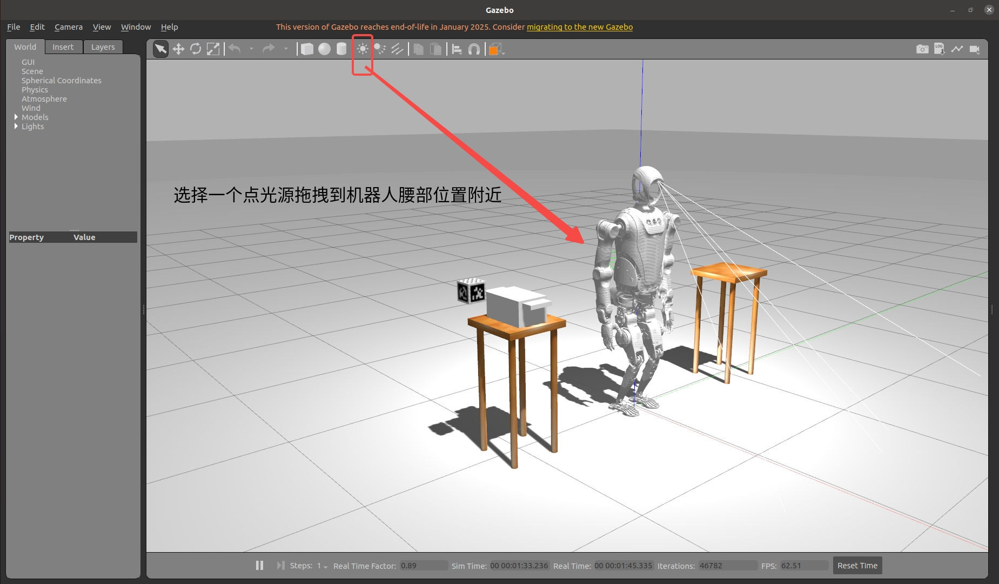

# Websocket SDK 示例说明文档

## 启动 Websocket 

### Websocket 服务器启动

### 安装 rosbridge_suite
```bash
sudo apt install ros-noetic-rosbridge-suite
```

#### 上位机启动
使用 Weboskcet SDK 需要在上位机先启动 Websocket 服务器：
```bash
cd kuavo_ros_application
catkin build kuavo_msgs ocs2_msgs
source devel/setup.bash
roslaunch rosbridge_server rosbridge_websocket.launch
```

#### 下位机启动
首先您需要先执行如下命令检查是否有`websocket_sdk_start_node`节点：
```bash
rosnode list|grep websocket_sdk_start_node
```

##### 仿真环境

您可以选择<手动启动改服务>:
```bash
source devel/setup.bash
roslaunch h12pro_controller_node kuavo_humanoid_sdk_ws_srv.launch
```

##### 实物

如果没有该节点，您可以选择<重新部署h12服务>:
```
cd <kuavo-ros-opensource>
cd <kuavo-ros-opensource>/src/humanoid-control/h12pro_controller_node/scripts
sudo su
./deploy_autostart.sh
```

或您可以选择<手动启动改服务>:
```bash
source devel/setup.bash
roslaunch h12pro_controller_node kuavo_humanoid_sdk_ws_srv.launch
```

### SDK 初始化

在使用SDK之前，需要先初始化 WebSocket 连接。初始化时需要指定以下参数：

```python
KuavoSDK.Init(
    websocket_mode=True,              # 启用 WebSocket 模式
    websocket_host='127.0.0.1'        # WebSocket 服务器IP地址
)
```

参数说明：
- `websocket_mode`: 是否启用WebSocket模式，必须设置为True
- `websocket_host`: WebSocket服务器地址，默认为'127.0.0.1'

## 原子技能 （atomic_skills）

### arm_ik_example.py

**演示如何使用正向运动学（FK）根据关节角度计算末端执行器位置，以及使用反向运动学（IK）计算实现所需末端执行器姿势所需的关节角度的示例。**

指定手末端位置和姿态，通过 `robot.arm_ik` 函数计算手臂在该位置时的各个关节角度

```python
front_left = [0.45, 0.28, 0.25]   # Left arm front position
front_right = [0.45, -0.20, 0.25]  # Right arm front position
r_front_orientation = [-0.41158, -0.503073, 0.577546, 0.493919]
l_front_orientation = [0.38, -0.45, -0.56, 0.57]
```

使用 `robot.control_arm_joint_trajectory` 函数将手从当前位置移动到指定的位置和状态。

使用函数 `robot_state.arm_joint_state().position` 获取机器人当前关节角度，调用 ` robot.arm_fk ` 计算该电机角度下手末端的位置。

---

### ctrl_head_example.py

**演示如何通过SDK控制机器人头部的俯仰（pitch）和偏航（yaw）角度，实现头部的上下和左右运动。**

通过循环改变 pitch 和 yaw 角度，调用 `robot.control_head`，让头部做周期性运动。适用于测试头部舵机和观察范围。


示例代码中展示了两种运动模式：

1. 头部上下点头运动：
   - 从0度开始，先向上抬到25度
   - 然后从25度向下转到-25度
   - 最后从-25度回到0度
   - 重复2个周期

2. 头部左右摇头运动：
   - 从0度开始，先向左转到60度
   - 然后从60度向右转到-60度  
   - 最后从-60度回到0度
   - 重复2个周期

每次运动都以较小的角度增量(2度)变化，并设置了0.1秒的时间间隔，以实现平滑的运动效果。

---

### ctrl_arm_example.py

**显示手臂轨迹控制和目标姿势控制的示例。**

包含关节角度插值运动、关节轨迹控制、末端执行器位姿控制等多种手臂操作方式，适合测试手臂的基本动作、轨迹跟踪和末端控制能力。

示例代码包含三个主要的控制函数：

1. control_arm_traj()：关节角度插值运动
   - 从初始位置q0开始，通过90步插值运动到目标位置q1
   - q1设置了右臂抬起50度的姿态
   - 每步之间间隔0.02秒，实现平滑过渡
   - 运动完成后恢复到初始位置
   - 最后重置手臂位置

2. control_arm_joint_trajectory()：关节轨迹控制
   - 定义了7个关键时间点的目标姿态
   - 机器人会自动完成关键帧之间的轨迹规划
   - 执行完毕后重置手臂位置

3. control_arm_end_effector_pose()：末端执行器位姿控制
   - 直接指定左右手末端在世界坐标系中的目标位置和姿态
   - 通过逆运动学自动计算所需的关节角度
   - 机器人自动规划轨迹到达目标位姿
   - 完成后重置手臂位置


---

### ctrl_arm_example_protected.py

**演示如何在启用手臂碰撞保护功能的情况下控制机器人手臂。**

该示例与 ctrl_arm_example.py 类似，但增加了碰撞检测和保护机制，适用于需要安全防护的操作场景。

**前置条件：**

- 启动手臂碰撞检测节点：
  ```bash
  roslaunch kuavo_arm_collision_check arm_collision_check.launch arm_collision_enable_arm_moving:=true
  ```
- 将手臂控制话题从 `/mm/two_arm_hand_pose_cmd` 改为 `/arm_collision/mm/two_arm_hand_pose_cmd`

**主要功能：**

1. 碰撞保护模式开关：
   - `robot.set_arm_collision_mode(True)`：开启手臂碰撞保护模式
   - `robot.set_arm_collision_mode(False)`：关闭手臂碰撞保护模式

2. 碰撞检测与处理：
   - `robot.is_arm_collision()`：检查是否发生碰撞
   - `robot.wait_arm_collision_complete()`：等待碰撞处理完成
   - `robot.release_arm_collision_mode()`：释放碰撞模式，恢复正常控制

3. 控制函数：
   - `control_arm_traj()`：关节角度插值运动，包含碰撞异常处理
   - `control_arm_joint_trajectory()`：关节轨迹控制，包含碰撞异常处理

**注意事项：**

- 开启碰撞保护前需确保已启动 `kuavo_arm_collision_check` 节点
- 发生碰撞时，机器人会自动尝试将手臂移动到安全位置

---

### lejuclaw_example.py

**演示如何控制LejuClaw夹持器末端执行器的示例，包括位置、速度和扭矩控制。**

支持整体开合、单侧控制、目标位置设定等多种操作，通过 `claw.open()`、`claw.close()`、`claw.control_left()`、`claw.control_right()`、`claw.control()` 等接口实现。

示例代码展示了以下主要功能：

1. 基本开合控制：
   - `claw.close()` 完全闭合夹爪
   - `claw.open()` 完全打开夹爪
   - 每个动作后使用 `wait_for_finish()` 等待动作完成

2. 单侧夹爪控制：
   - `claw.control_left([50])` 控制左侧夹爪到50度位置
   - `claw.control_right([80])` 控制右侧夹爪到80度位置
   - 可以分别精确控制左右两侧夹爪的位置

3. 双侧同步控制：
   - `claw.control([20, 100])` 同时控制左右夹爪到不同位置
   - 第一个参数控制左侧，第二个参数控制右侧
   - 位置范围为0-100度，0表示完全闭合，100表示完全打开

注意事项：
- 每次动作后建议调用 `wait_for_finish()` 等待完成，避免动作叠加
- 可以设置超时时间，如 `wait_for_finish(timeout=2.0)`
- 连续发送指令时要注意等待前一个动作完成，否则可能被丢弃


---

### observation_example.py

**演示如何获取机器人当前的观测信息，如手臂位置指令等。**

通过 `KuavoRobotObservation` 实时获取并打印手臂的目标位置指令，适合用于调试和监控机器人状态。

示例代码主要展示以下功能：

1. 获取手臂位置指令：
   - 通过 `robot_obs.arm_position_command` 获取当前手臂关节的目标位置
   - 每0.5秒打印一次位置信息
   - 可以通过Ctrl+C终止程序运行

---


### robot_info_example.py

**演示如何获取机器人本体的基本信息。**

包括机器人类型、版本、末端类型、关节名称、自由度等，通过 `KuavoRobotInfo` 获取并打印相关信息。

---

### audio_play.py

**演示如何通过SDK控制机器人播放音频文件和语音合成。**

支持播放指定音频文件、TTS语音合成、停止音乐等操作，通过 `KuavoRobotAudio` 的 `play_audio`、`text_to_speech`、`stop_music` 等接口实现。

---

### motion_example.py

**演示如何通过SDK控制机器人完成多种基础运动，包括站立、行走、转向、下蹲等。**

支持前进、后退、原地转向、下蹲等动作，并实时输出位姿信息，适合测试机器人底盘和步态控制能力。


示例代码主要展示以下功能：
1. 基础运动控制：
   - 站立：`stance()` 控制机器人站立 
   - 行走：`walk()` 控制机器人前进/后退
   - 原地转向：通过 `walk()` 的 angular_z 参数控制机器人原地转向
   - 下蹲：`squat()` 控制机器人下蹲动作

2. 运动参数设置：
   - 线速度：通过调整 `walk()` 函数的 `linear_x` 和 `linear_y` 参数控制前进/后退和左右移动速度
   - 角速度：通过调整 `walk()` 函数的 `angular_z` 参数控制转向速度

3. 运动状态监控：
   - 通过 `robot_state.odometry` 实时获取机器人位置和姿态信息
   - 支持等待动作完成后再执行下一个动作
   - 按下 Ctrl+C 随时终止运动

4. 运动示例：
   - 前进8秒，速度0.3m/s
   - 后退8秒，速度-0.3m/s
   - 原地左转8秒，角速度0.4rad/s
   - 原地右转8秒，角速度-0.4rad/s
   - 下蹲-0.1m并保持2秒
   - 返回原始高度并保持2秒
---

### cmd_pose_example.py

**演示如何控制机器人在世界坐标系和基座坐标系中的位姿。**

通过 `control_command_pose_world` 和 `control_command_pose` 函数分别控制机器人在世界坐标系和基座坐标系中的位置和姿态。示例中展示了：
1. 在世界坐标系中控制机器人前进1米并旋转90度
2. 在基座坐标系中控制机器人后退2米并旋转-90度

---

### dexhand_example.py

**演示如何控制灵巧手（Dexterous Hand）的基本动作和预设手势。**

支持单侧控制、双侧同步控制、预设手势调用等功能。示例代码展示了：
1. 单侧手指控制：
   - 左手指向"点赞"手势
   - 右手指向"666"手势
2. 预设手势调用：
   - 获取所有支持的手势名称
   - 调用预设手势（如"点赞"和"OK"手势）

---

### dexhand_state_example.py

**演示如何获取灵巧手的实时状态信息。**

通过 `get_state()`、`get_position()`、`get_velocity()`、`get_effort()` 等函数获取灵巧手的关节状态。示例代码展示了：
1. 获取关节名称和数量
2. 每1秒获取一次灵巧手的：
   - 关节位置
   - 关节速度
   - 关节力矩
3. 持续监控20秒

---

### motor_param_example.py

**演示如何获取和修改电机参数。**

通过 `get_motor_param()` 和 `change_motor_param()` 函数实现电机参数的读取和修改。示例代码展示了：
1. 获取当前电机参数
2. 修改指定电机的PID参数（Kp和Kd）
3. 再次获取参数以验证修改是否成功

---

### step_control_example.py

**演示如何通过步进方式控制机器人移动。**

使用 `step_by_step()` 函数实现机器人的精确步进控制。示例代码展示了：
1. 确保机器人在站立状态
2. 向前步进0.8米
3. 等待机器人回到站立状态
4. 再次步进0.2米并旋转90度

注意事项：
- 步进控制只能在站立模式下使用
- 每次步进后需要等待机器人回到站立状态
- 可以设置超时时间等待状态转换

---

### tools_robot_example.py

**演示如何使用机器人工具函数获取不同坐标系之间的变换关系。**

通过 `KuavoRobotTools` 类获取各种坐标系之间的变换矩阵。示例代码展示了：
1. 获取 odom 到 base_link 的变换：
   - 四元数表示的位置和姿态
   - 齐次变换矩阵
2. 获取 base_link 到 odom 的变换
3. 获取 camera_link 到 base_link 的变换

---

### vision_robot_example.py

**演示如何获取和处理机器人的视觉数据，特别是AprilTag标记的识别结果。**

通过 `KuavoRobotVision` 类获取相机识别到的AprilTag数据。示例代码展示了：
1. 获取不同坐标系下的AprilTag数据：
   - 相机坐标系
   - 基座坐标系
   - 里程计坐标系
2. 获取特定标记的详细信息：
   - 标记ID
   - 标记大小
   - 位置和姿态信息
3. 通过ID查询特定标记的数据

---

## 策略实例 （strategies）


### 搬箱子案例 （grasp_box_example.py）
**编译**：
```
catkin build humanoid_controllers kuavo_msgs gazebo_sim ar_control
```

**运行**：

⚠️ 在运行之前, 需要确认机器人版本`ROBOT_VERSION=45`，否则会机器人末端控制会有问题
```
# 启动gazebo场景
roslaunch humanoid_controllers load_kuavo_gazebo_manipulate.launch joystick_type:=bt2pro

# 启动ar_tag转换码操作和virtual操作
roslaunch ar_control robot_strategies.launch  

# 运行搬箱子案例
python3 grasp_box_example.py 
```

🚨 第一次启动gazebo场景前需要修改tag尺寸：

在`/opt/ros/noetic/share/apriltag_ros/config/tags.yaml`文件中将tag的size尺寸修改为和立方体tag码的尺寸一致（只需做一次）
```
standalone_tags:
    [
        {id: 0, size: 0.088, name: 'tag_0'},
        {id: 1, size: 0.088, name: 'tag_1'},
        {id: 2, size: 0.088, name: 'tag_2'},
        {id: 3, size: 0.088, name: 'tag_3'},
        {id: 4, size: 0.088, name: 'tag_4'},
        {id: 5, size: 0.088, name: 'tag_5'},
        {id: 6, size: 0.088, name: 'tag_6'},
        {id: 7, size: 0.088, name: 'tag_7'},
        {id: 8, size: 0.088, name: 'tag_8'},
        {id: 9, size: 0.088, name: 'tag_9'},
    ]
```
🚨 每次启动gazebo场景后需要手动打光：

需要在机器人腰部位置附近给个点光源，否则会找不到tag




**测试**
```
python3 -m pytest test_grasp_box_strategy.py -v
```
测试用例主要验证抓取盒子案例的各个策略模块：
- `test_head_find_target_success_rotate_head`: 测试仅通过头部旋转成功找到目标
- `test_head_find_target_success_rotate_body`: 测试需要旋转身体后成功找到目标
- `test_head_find_target_timeout`: 测试搜索超时未找到目标的情况
- `test_head_find_target_invalid_id`: 测试目标ID无效的情况
- `test_walk_approach_target_success`: 测试成功接近目标
- `test_walk_approach_target_no_data`: 测试目标数据不存在的情况
- `test_walk_to_pose_success`: 测试成功移动到指定位姿
- `test_walk_to_pose_failure`: 测试移动到指定位姿失败的情况
- `test_arm_move_to_target_success`: 测试手臂成功移动到目标位置
- `test_arm_move_to_target_failure`: 测试手臂移动失败的情况
- `test_arm_transport_target_up_success`: 测试成功抬起箱子
- `test_arm_transport_target_up_failure`: 测试抬起箱子失败的情况
- `test_arm_transport_target_down_success`: 测试成功放下箱子
- `test_arm_transport_target_down_failure`: 测试放下箱子失败的情况