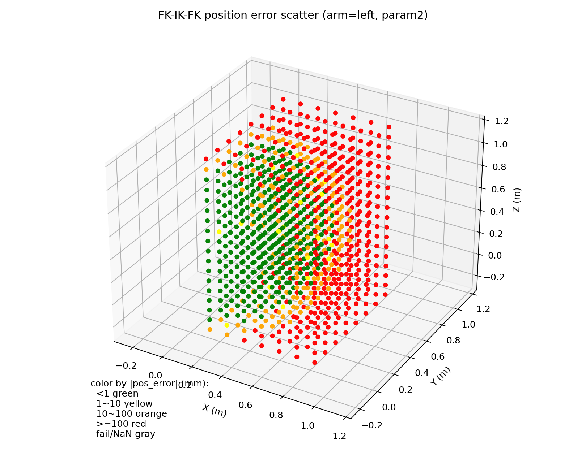

# Arm IK 说明文档

本文说明 `arms_ik_node` 对外接口、`HighlyDynamic::CoMIK`（`plantIK.cc`）的求解路径与 **`kuavo_msgs/ikSolveParam`** 调参方式，便于集成与排障。

---

## 1. 概述

- **节点职责**
  - `arms_ik_node`（`motion_capture_ik` 包内）负责双臂 IK 求解。
  - 内部加载 Drake `MultibodyPlant`，默认针对 `eef_left` / `eef_right` 末端进行逆运动学。

- **模型与帧来源**
  - 关键配置来自 `kuavo_assets/config/kuavo_v{robot_version}/kuavo.json`。
  - 常用字段包括：`end_frames_name_ik`、`shoulder_frame_names`、`NUM_ARM_JOINT`、`eef_z_offset`。
  - `model_path`、`control_hand_side` 等可通过 ROS 参数覆盖。

- **求解核心**
  - 核心入口是 `CoMIK::solve()`。
  - 底层使用 Drake `InverseKinematics` + SNOPT。
  - 约束/代价由 `IKParams`（对应 `ikSolveParam`）和 `constraint_mode` 共同决定。

---

## 2. 接口与求解路径

### 2.1 话题接口

| 话题名 | 说明 |
|--------|------|
| `/ik/two_arm_hand_pose_cmd` | 连续接收双臂目标位姿命令（`twoArmHandPoseCmd`），用于实时求解与跟踪。 |

### 2.2 服务一览

| 服务名 | 说明 |
|--------|------|
| `/ik/two_arm_hand_pose_cmd_srv` | 标准双臂 IK；请求 `twoArmHandPoseCmd`，响应含 `q_arm`、`q_torso`（若有）、`hand_poses`、`time_cost`（ms）等。 |
| `/ik/two_arm_hand_pose_cmd_srv_muli_refer` | 多组初值尝试并择优；**不经过**「粗容差 → 二分 refinement」流程。由于该流程会在多参考初值中选当前最优，参考解不保证跨次连续，**不建议用于笛卡尔路径连续控制**。 |
| `/ik/two_arm_hand_pose_cmd_free_srv` | 与标准 IK 类似的求解流程，请求/响应使用 `Free` 变体消息（如可变长度关节数组）。 |
| `/ik/fk_srv` | 正运动学：给定与节点自由度一致的 `q`，返回双手末端位姿。 |

### 2.3 求解流程差异（按入口）

| 入口 | 行为摘要 |
|------|----------|
| `/ik/two_arm_hand_pose_cmd`、`/ik/two_arm_hand_pose_cmd_srv`、`/ik/two_arm_hand_pose_cmd_free_srv` | 先以较粗的位置/姿态容差（约 **20 mm** 量级）求可行解，再以默认 `ik_param` 高精度求解；若失败则在粗细容差之间**二分**迭代，直到区间足够小。最终几何精度趋近于你在自定义参数里设置的 `pos_constraint_tol` / 姿态相关设置（未自定义则用节点内置默认）。 |
| `/ik/two_arm_hand_pose_cmd_srv_muli_refer` | 按顺序使用多种 `q` 初值（用户 q0、上一解、限位中点、伪逆种子、解析种子等），对每个初值调用**一次** `CoMIK::solve`；可选 early-exit 与候选打分选优。**无二分 refinement**；精度完全由当前 **`ik_param`（或内置默认）** 决定。 |

---

## 3. 参数设置

### 3.1 `twoArmHandPoseCmd` 参数说明

- **`hand_poses`**：`twoArmHandPose` → `left_pose` / `right_pose`，类型为 `armHandPose`。
  - **`pos_xyz`**：末端位置（米），世界系含义与上游约定一致（见 `frame` 字段说明）。
  - **`quat_xyzw`**：四元数 **(x, y, z, w)**。
  - **`elbow_pos_xyz`**：肘部世界系位置 hint；在 `plantIK.cc` 中当向量**非全零**时加入较弱位置代价；不需要时保持 **`(0,0,0)`**。
  - **`joint_angles`**：长度与单臂自由度一致（常见 7）；是否作为初值由 `joint_angles_as_q0` 决定。
- **`use_custom_ik_param`**：为 **true** 时，使用本消息中的 **`ik_param`**；否则使用节点内置默认 `IKParams`。
- **`joint_angles_as_q0`**：为 **true** 时，用 `hand_poses` 中的手臂关节角覆盖全身 `q` 中**手臂段**初值，躯干等其它关节初值仍来自节点内部状态。
- **`frame`**：坐标系语义由上游定义（消息注释：0 保持当前、1 基于 odom 的世界系等）；节点内主要按已解析的 `pos_xyz`/`quat_xyzw` 使用，细节以实际发布端为准。

#### 3.1.1 腰部 yaw 补偿

- 当 **`/mpc/mpcWaistDof` > 0** 时，节点订阅 **`/sensors_data_raw`** 读取腰关节角。
- **`transformPoseByWaistYaw`** 会在 **服务** `handleServiceRequest`、`free_handleServiceRequest`、`handleServiceRequest_multiple_refer` 中，对双手目标位姿及肘部位置做绕 Z 的补偿旋转。
- **话题循环 `run()`** 中当前实现**未**对命令做相同变换；若话题与服务混用，需注意坐标系是否一致。

### 3.2 `IK param` 参数说明

#### 3.2.1 默认值

与 `arms_ik_node` 构造函数中赋值一致：

| 参数 | 默认量级 |
|------|----------|
| `major_optimality_tol` / `major_feasibility_tol` / `minor_feasibility_tol` | **9e-3**（SNOPT） |
| `major_iterations_limit` | **50** |
| `pos_constraint_tol` | **9e-3** m（位置硬约束时为每轴容差 **±9 mm**，等价于以目标点为中心、边长 **18 mm** 的轴对齐包围盒约束） |
| `oritation_constraint_tol` | **19e-3**（硬约束时为姿态容差量级；软约束时在 Drake 中作代价权重/尺度相关量，不等同简单「度」） |
| `pos_cost_weight` | **10** |
| `constraint_mode` | **0** |

关于 `constraint_mode=0` 的实际语义：该值会先经过 `MapExternalConstraintModeToInternal` 映射，最终按 **3.2.2** 规则生效（默认对应“位软 + 姿硬”）。模式选择由 **`constraint_mode`** 直接决定；**不再**通过 `pos_cost_weight == 0` 判断是否使用位置硬约束。

参数在不同模式下的使用关系（按 `plantIK.cc` 当前实现）：

- **`pos_constraint_tol`**
  - 传统位姿模式：仅在**位置硬约束**（如 `constraint_mode=2/3`）时用于 `AddPositionConstraint` 边界。
  - 三点模式：仅在**三点混合**（`constraint_mode=6`）时用于 `P0` 的 `AddPositionConstraint` 边界；三点全软（`constraint_mode=4`）不使用该约束边界。
- **`oritation_constraint_tol`**
  - 传统位姿模式：姿态硬约束时作为 `AddOrientationConstraint` 容差；姿态软约束时作为 `AddOrientationCost` 参数。
  - 三点模式：不显式添加姿态项，因此该参数在三点分支中不直接参与。
- **`pos_cost_weight`**
  - 只在包含位置代价项时生效（`AddPositionCost`），包括：
    - 传统位姿模式的**位置软约束**（如 `constraint_mode=0/1`）；
    - 三点全软（`constraint_mode=4`）与三点混合（`constraint_mode=6`）中的代价点（混合模式下 `P1/P2`）；
    - 肘部位置代价（权重约为 `0.1 * pos_cost_weight`）。
  - 对位置硬约束本身（`AddPositionConstraint`）不生效。

#### 3.2.2 求解模式（`constraint_mode`）

- **类型**：`uint8`（`ikSolveParam.constraint_mode`）。
- **流程**：数值先经 **`MapExternalConstraintModeToInternal()`**（`plantIK.h`），再在 `plantIK.cc` 里解析；**各小节表格按「写入值 → 实际效果」列出**，不必自行心算 bit。
- **延伸阅读**：枚举名与几何细节见 **`motion_capture_ik/include/plantIK.h`**；`ikSolveParam.msg` 未写三点模式与映射，**以本文与源码为准**。

**选择原则（先看这个）**：
- **硬约束**：求解中必须满足该项，否则该次求解可能失败。
- **软约束（代价）**：求解器会尽量优化该项，但可为满足其它条件而妥协。
- 需要按任务优先级选模式：
  - 更看重位置期望：优先位置硬、姿态软（或混合）。
  - 更看重姿态期望：优先姿态硬、位置软。
  - 位置与姿态都必须严格满足：位置硬 + 姿态硬（成功率会下降很多）。

##### 3.2.2.1 传统位姿模式（写入 **0～3**，不含 `0x04`）

常规模式，左右手末端同时有位置 + 姿态项（满足 `plantIK.cc` 中 `nq` 与帧下标条件时）。`MapExternalConstraintModeToInternal`（`plantIK.h`）仅对低两位做 `0↔1` 互换：消息里字段默认常为 `0`，映射后按位软 + 姿硬生效；若要位软 + 姿软请显式写 `1`。具体约束类型按下表查阅。

| 写入值 | 十六进制 | 映射后内部值 | 位置 | 姿态 |
|--------|----------|----------------|------|------|
| **0** | `0x00` | `0x01` | 软（代价） | 硬（约束） |
| **1** | `0x01` | `0x00` | 软（代价） | 软（代价） |
| **2** | `0x02` | `0x02` | 硬（盒约束） | 软（代价） |
| **3** | `0x03` | `0x03` | 硬（盒约束） | 硬（约束） |

##### 3.2.2.2 三点位置模式（对外仅使用 **`4`** / **`6`**）

- **无显式姿态**约束/代价；用 **3 个点** 的位置项约束手的平移与朝向（间接）。
- **三个点**（eef 连体坐标系，由 `plantIK.cc` 定义）：

| 点 | 含义 | 坐标（eef 系） |
|----|------|----------------|
| **P0** | eef 原点 | `(0, 0, 0)` |
| **P1** | `zarm_*7_link` 原点在 eef 下的平移 | 由固定连杆算得 |
| **P2** | virtual thumb | **`(0.15, 0, 0)` m**（与 URDF `zarm_*7_virtual_thumb_joint_ee` 一致） |

- **子模式**（映射后由内部 **bit1** 决定）：

| 子模式 | 每只手的行为 |
|--------|----------------|
| **全软** | P0、P1、P2 均为 **`AddPositionCost`** |
| **混合** | **P0**：**`AddPositionConstraint`**（容差 `pos_constraint_tol`）；**P1、P2**：**`AddPositionCost`** |

**对外模式选择**（面向使用者，仅保留规范输入）：

| 写入值 | 十六进制 | 子模式 | 每只手行为 |
|--------|----------|--------|------------|
| **4** | `0x04` | **三点全软** | P0、P1、P2 均为 `AddPositionCost` |
| **6** | `0x06` | **三点混合** | P0 为 `AddPositionConstraint`；P1、P2 为 `AddPositionCost` |

**说明**：为了避免歧义，文档只约定并推荐使用 `4/6` 两个三点模式值；其它值不作为对外接口选项。

##### 3.2.2.3 快速选用

- **位姿都要贴目标、可接受偶发无解**：写 **`3`**（位硬 + 姿硬）。  
- **优先收敛、可松一侧**：试 **`0`**（映射后位软姿硬）或 **`2`**（位硬姿软）。  
- **主要靠几何点卡朝向、少用显式姿态**：三点模式；**全软**写 **`4`**；**P0 更贴位**写 **`6`**。

---

## 4. IK 求解空间示例（参数配置）

对应使用参数（位软 + 姿软）：

```python
IK_SOLVE_PARAM_2 = {
    'major_optimality_tol': 1e-3,
    'major_feasibility_tol': 1e-3,
    'minor_feasibility_tol': 3e-3,
    'major_iterations_limit': 200,
    'oritation_constraint_tol': 0.0000001,
    'pos_constraint_tol': 2e-3,
    'pos_cost_weight': 10,
    "constraint_mode": 1,
}
```

下图为 IK 求解空间示意图：



在 **Base 坐标系** 下，以下空间范围内基本可满足位置误差小于 **1 mm** 的需求（对应本节参数配置）：

- `x` 方向范围：`[0.10, 0.65]`
- `y` 方向范围：`[0.05, 0.90]` 和 `[-0.90, -0.05]`
- `z` 方向范围：`[-0.20, 1.05]`

---

## 5. IK 参数调参（`ikSolveParam`）

### 5.1 症状与建议

- **失败率高**：放宽 `pos_constraint_tol`、姿态相关容差；或略放宽 SNOPT 可行性容差、增大 `major_iterations_limit`；尝试更合适的 `constraint_mode`。
- **精度不足**：在成功率可接受下收紧 `pos_constraint_tol`；软位置时增大 `pos_cost_weight`；保证初值合理（`joint_angles_as_q0`）。
- **耗时高**：减小 `major_iterations_limit` 或略放松 SNOPT 容差。
- **肘部 hint 噪声大**：将 `elbow_pos_xyz` 置零关闭肘部代价，或降低 `pos_cost_weight` 以减弱肘部项（肘部代价系数与 `0.1 * pos_cost_weight` 相关）。

### 5.2 推荐调试顺序

1. 固定 `constraint_mode`，扫描 **`pos_constraint_tol` / `oritation_constraint_tol`**。  
2. 成功率稳定后调整 **`pos_cost_weight`**（软约束场景）。  
3. 最后微调 **SNOPT** 四项。  

### 5.3 参考 issue

  此网页中有一些IK模式的测试结果：

- [Issue #2262](https://www.lejuhub.com/highlydynamic/kuavodevlab/-/issues/2262)

---
