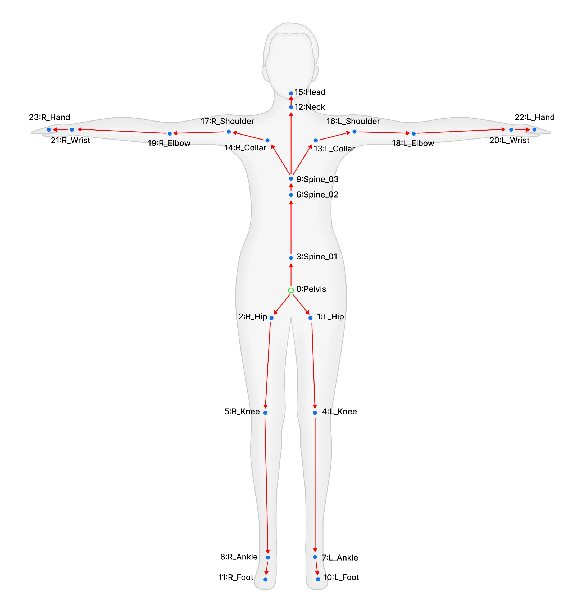
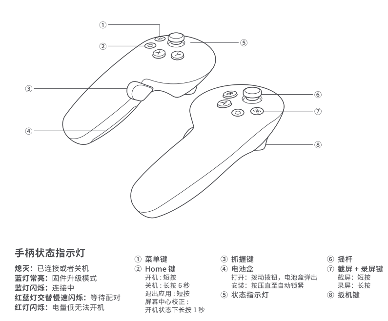

# Pico 全身遥操作


## 快速开始

### 机器人端机器人

先启动机器人:
- 可以选择关闭命令截断、关节保护等功能，这样做大幅度动作的时候不会触发保护而摔倒.
- 必须要打开`with_mm_ik`选项来启用运动学MPC功能，否则无法控制手臂.

```bash
# 在此之前确保已经编译完成
sudo su
cd kuavo-ros-opensource
source devel/setup.bash
# 需要加with_mm_ik选项
roslaunch humanoid_controllers load_kuavo_real.launch with_mm_ik:=true

# 也可以选择关闭命令截断、关节保护等功能，这样做大幅度动作的时候不会触发保护而摔倒.
roslaunch humanoid_controllers load_kuavo_real.launch with_mm_ik:=true cmd_truncation_enable:=false joint_protect_enable:=false
```

然后启动 Pico 服务节点:
```bash
sudo su
cd kuavo-ros-opensource
source devel/setup.bash
cd src/manipulation_nodes/pico-body-tracking-server
python3 scripts/pico_whole_body_teleop_example.py 
```

标准 launch 启动（推荐）：
```bash
roslaunch noitom_hi5_hand_udp_python launch_pico_teleop.launch
```

也可以使用一键 launch（仿真/实物 + PICO + 头控）：
```bash
# 仿真
roslaunch humanoid_controllers load_kuavo_with_pico_vr.launch sim_mode:=true

# 实物
roslaunch humanoid_controllers load_kuavo_with_pico_vr.launch sim_mode:=false with_mm_ik:=true
```

如需启用迁移后的 PICO 主动手头控（独立节点）：
```bash
sudo su
cd kuavo-ros-opensource
source devel/setup.bash
cd src/manipulation_nodes/pico-body-tracking-server
python3 scripts/pico_head_control_node.py _mode:=auto_track_active
```

说明：
- 该节点会发布 `/robot_head_motion_data`，并自动设置 `/pico/use_external_head_control=true`，避免与旧链路重复发布。
- 支持模式：`fixed`、`auto_track_active`、`fixed_main_hand`、`vr_follow`。
- 可通过话题 `/pico/head_control_mode`（`std_msgs/String`）在运行时切换模式。
- 头控服务接口：`/pico/set_head_control_mode`（`kuavo_msgs/SetHeadControlMode`）。

头部控制服务接口：
- 服务名：`/pico/set_head_control_mode`
- 服务类型：`kuavo_msgs/SetHeadControlMode`
- 请求字段：
  - `mode`：`fixed` / `auto_track_active` / `fixed_main_hand` / `vr_follow`
  - `fixed_hand`：仅 `fixed_main_hand` 时必填，`left` 或 `right`
- 响应字段：
  - `success`：是否成功
  - `message`：错误或成功信息
  - `current_mode`：当前生效模式

示例：
```bash
# 固定模式
rosservice call /pico/set_head_control_mode "{mode: 'fixed', fixed_hand: ''}"

# 自动跟踪主动手
rosservice call /pico/set_head_control_mode "{mode: 'auto_track_active', fixed_hand: ''}"

# 固定主手（左手）
rosservice call /pico/set_head_control_mode "{mode: 'fixed_main_hand', fixed_hand: 'left'}"

# VR随动
rosservice call /pico/set_head_control_mode "{mode: 'vr_follow', fixed_hand: ''}"
```

灵巧手迁移说明（PICO）：
- 已对齐“抓握 + 锁定/解锁”的控制链路，按键逻辑保持不变（`Y` 锁定/解锁）。
- 新增抓握配置项在 `config/pico_vr_config.yaml` 的 `dex_hand` 下：
  - `command_min` / `command_max`：抓握输出范围
  - `smoothing_alpha`：抓握平滑系数
  - `grip_deadzone`：抓握死区
  - `stable_unlock.enabled` / `stable_unlock.reengage_threshold`：解锁回切防突变阈值

### Pico App 端启动

打开2个体感追踪器，会闪蓝光，佩戴到左右脚踝处，注意裤子不要遮挡传感器，必要时可以卷起裤脚。

进入 Pico，点击任意左右手柄`HOME`按键，可以看到下方的菜单栏，在左下角**点击打开资源库**，找到并打开**LejuVRTeleopRobot**应用，找不到的话可以看看未知来源的分类。

进入 App，进行校准:
 - 选择全身追踪-->立即校准
 - 或者右上角的立即校准

校准成功，可以在视野前方出现一个由绿色方块组成的人形，可以随意运动看看人形的动作是否一致，如果不一致建议重新校准。

### 遥操作

在 App 左手方向，机器人服务器下拉列表找到对应的机器人，选择连接，点击遥操作即可开始遥操。

**初始时，遥操处于上锁状态，可以通过同时按下左手柄的上下扳机解锁。**

**目前初始化的遥操模式为仅下半身遥操，可以通过`RT+B`切换到全身遥操模式或`RT+B`切换到上半身遥操模式。**

更多按键切换功能请参阅后续章节。


## full-body-tracking-pose 说明


人体参考图：




full-body-tracking-pose 的骨骼节点说明：
```python
body_tracker_role = [    
    "Pelvis",
    "LEFT_HIP",
    "RIGHT_HIP",
    "SPINE1",
    "LEFT_KNEE",
    "RIGHT_KNEE",
    "SPINE2",
    "LEFT_ANKLE",
    "RIGHT_ANKLE",
    "SPINE3",
    "LEFT_FOOT",
    "RIGHT_FOOT",
    "NECK",
    "LEFT_COLLAR",
    "RIGHT_COLLAR",
    "HEAD",
    "LEFT_SHOULDER",
    "RIGHT_SHOULDER",
    "LEFT_ELBOW",
    "RIGHT_ELBOW",
    "LEFT_WRIST",
    "RIGHT_WRIST",
    "LEFT_HAND",
    "RIGHT_HAND",
]
```

手柄参考图：

  

## 手柄操作说明

### 按键定义对照表

| 缩写 | 英文全称 | 中文名称 | 按键类型 |
|------|----------|----------|----------|
| LT   | Left Trigger | 左扳机 | 扳机键 |
| RT   | Right Trigger | 右扳机 | 扳机键 |
| LG   | Left Gripper | 左抓握键 | 按键 |
| RG   | Right Gripper | 右抓握键 | 按键 |
| X    | X Button | X按钮 | 功能键 |
| Y    | Y Button | Y按钮 | 功能键 |
| A    | A Button | A按钮 | 功能键 |
| B    | B Button | B按钮 | 功能键 |

### 模式切换功能
以下按键组合用于在不同的遥操模式之间切换：

| 按键组合 | 功能描述 | 操作说明 | 备注 |
|----------|----------|----------|------|
| **RT+X** | 全身遥操模式 | 按右扳机 + 点按X键 | 切换到全身遥操作模式 |
| **RT+B** | 上半身遥操模式 | 按右扳机 + 点按B键 | 切换到上半身遥操作模式 |
| **RT+A** | 下半身遥操模式 | 按右扳机 + 点按A键 | 切换到下半身遥操作模式 |
| **RT+Y** | 躯干模式切换 | 按右扳机 + 点按Y键 | 切换躯干控制模式 |

#### 遥操模式说明
- **WholeBody全身遥操模式**: 同时控制机器人的上半身和下半身动作
- **UpperBody上半身遥操模式**: 仅控制机器人的上半身动作，下半身保持稳定
- **LowerBody下半身遥操模式**: 仅控制机器人的下半身动作，上半身保持默认姿态
- **躯干模式**: 启用或禁用躯干控制功能， 仅在上半身遥操模式下有效，机器人会自动根据手末端的位置调整躯干高低, **控制躯干时无法使用左右摇杆控制行走+旋转**

### 模式一：基础控制模式

#### 摇杆控制

**注意：控制躯干时无法使用左右摇杆控制行走+旋转**

- **左摇杆**：前进后退 + 左右横移
  - 前后速度：-0.4 ~ 0.4 m/s
  - 横移速度：-0.2 ~ 0.2 m/s
- **右摇杆**：仅控制旋转
  - 旋转范围：-0.4 ~ 0.4 rad/s
  - 前后推动：无响应

#### 按键功能表

| 按键组合 | 功能描述 | 操作说明 | 备注 |
|----------|----------|----------|------|
| **LT+LG** | 解锁手臂规划 | 按住左扳机 +按住左抓握 | 可替换为 LT+RT |
| **RT+RG** | 锁定手臂规划 | 按右扳机 + 按住右抓握 | 可替换为 LG+RG |
| **LG/RG** | 末端抓握控制 | 单独按下对应抓握键 | 左/右手独立控制 |
| **B** | 开始踏步 | 单独按下B键 | 进入踏步模式 |
| **A** | 启动/站立 | 单独按下A键 | 首次按下调用`/humanoid_controller/real_initial_start`，后续按下切换到`stance` |
| **Y** | 抓握状态锁定 | 点按Y键切换 | 锁定/解锁抓握状态 |
| **X+Y** | 紧急停止机器人 | 同时点按X和Y键 | 连续发布`/stop_robot` |
| **X** | 录制控制 | 点按X键 | 开始/停止录制(此功能暂不支持) |
| **LT+A** | 末端力控制 | 按左扳机 + 点按A键 | 施加/释放末端力 |
| **LT+Y** | 手臂复位/外部控制模式 | 按左扳机 + 点按Y键 | 恢复到默认位置/手臂切换到外部控制模式 |
| **LT+X** | 开始/停止增量控制模式 | 按左扳机 + 点按X键 | 只有在界面上切换到增量控制模式时才生效 |
| **X_LONG** | 左拇指张开切换 | 长按X键 | 切换左拇指张开/恢复 |
| **A_LONG** | 右拇指张开切换 | 长按A键 | 切换右拇指张开/恢复 |
| **LT+RT+A_LONG** | 机器人解锁 | 按住左右上板机然后同时长按A键 | 解锁机器人控制 |


### 模式二：全身遥操作模式

#### 摇杆控制
- **左摇杆**：暂不响应（预留扩展）
- **右摇杆**：暂不响应（预留扩展）

#### 按键功能表

| 按键组合 | 功能描述 | 操作说明 | 备注 |
|----------|----------|----------|------|
| **LT+LG** | 开始全身规划 | 按左扳机 + 按左抓握 | 可替换为 LT+RT |
| **RT+RG** | 停止全身规划 | 按右扳机 + 按右抓握 | 可替换为 LG+RG |
| **LG/RG** | 末端抓握控制 | 单独按下对应抓握键 | 左/右手独立控制 |
| **LT+A** | 末端力控制 | 按左扳机 + 点按A键 | 施加/释放末端力 |
| **A** | 启动/站立 | 单独按下A键 | 首次按下调用`/humanoid_controller/real_initial_start`，后续按下切换到`stance` |
| **B** | 回归站立姿势 | 单独按下B键 | 会先踏步调整，然后回到OCS2站立姿态 |
| **Y** | 抓握状态锁定 | 点按Y键切换 | 锁定/解锁抓握状态 |
| **X+Y** | 紧急停止机器人 | 同时点按X和Y键 | 连续发布`/stop_robot` |
| **X** | 录制控制 | 点按X键 | 开始/停止录制(此功能暂不支持) |
| **LT+Y** | 手臂复位/外部控制模式 | 按左扳机 + 点按Y键 | 恢复到默认位置/手臂切换到外部控制模式 |
| **LT+X** | 开始/停止增量控制模式 | 按左扳机 + 点按X键 | 只有在界面上切换到增量控制模式时才生效 |
| **X_LONG** | 左拇指张开切换 | 长按X键 | 切换左拇指张开/恢复 |
| **A_LONG** | 右拇指张开切换 | 长按A键 | 切换右拇指张开/恢复 |
| **LT+RT+A_LONG** | 机器人解锁 | 按住左右上板机然后同时长按A键 | 解锁机器人控制 |

## 机器人延迟诊断功能

**注意: 进行延迟诊断功能时会自动上锁遥操，结束后需要您手动通过组合键重新解锁，才能继续遥操!**

**注意: 进行延迟诊断功能时会自动上锁遥操，结束后需要您手动通过组合键重新解锁，才能继续遥操!**

**注意: 进行延迟诊断功能时会自动上锁遥操，结束后需要您手动通过组合键重新解锁，才能继续遥操!**

本功能用于诊断机器人执行延迟情况（非网络延迟），一定程度上可反应当前遥操的效果情况，您可以在 VR App 中点击按钮开启对应的功能。

在延迟诊断过程中，无法使用遥操功能，结束后需要您手动通过手臂组合键重新解锁，才能遥操!

## 录制播放功能

### 录制功能
使用 `robot_pico_recorder.py` 脚本可以录制机器人控制数据，支持录制以下话题：
- `/ik/two_arm_hand_pose_cmd` - 双臂手部位姿命令
- `/mm/two_arm_hand_pose_cmd` - 移动操作手部位姿命令  
- `/humanoid_mpc_foot_pose_world_target_trajectories` - 人形机器人足部轨迹

### 录制其他话题

如果需要录制额外的话题，在 `pico-body-tracking-server/config/extra_bag_topics.json` 配置需要额外保存的话题

```json
[
  "/sensors_data_raw"
] 
```

#### 录制命令
```bash
# 录制控制数据到指定bag文件
python3 robot_pico_recorder.py record <bag文件名>

# 示例：录制到 my_control_session.bag
python3 robot_pico_recorder.py record my_control_session.bag
```

### 播放功能
播放录制的控制数据，自动调用必要的控制服务：
- `/change_arm_ctrl_mode` - 切换手臂控制模式
- `/mobile_manipulator_mpc_control` - 启用移动操作MPC控制
- `/enable_mm_wbc_arm_trajectory_control` - 启用手臂轨迹控制

#### 播放命令
```bash
# 播放录制的bag文件
python3 robot_pico_recorder.py play <bag文件名>

# 示例：播放 my_control_session.bag
python3 robot_pico_recorder.py play my_control_session.bag
```

### 使用场景
- **动作录制**: 录制复杂的机器人操作序列
- **动作回放**: 重复执行录制的操作
- **教学演示**: 录制标准操作流程用于教学
- **调试分析**: 录制问题场景用于后续分析

### 注意事项
- 录制时确保网络连接稳定
- 播放前检查机器人状态和安全
- 录制的bag文件包含时间戳信息
- Ctrl+C中断录制/播放

## 三模式切换语义与当前策略

当前节点包含 3 条独立的模式切换通道，语义如下：

- `change_arm_ctrl_mode` (`/change_arm_ctrl_mode`)：手臂控制源/模式（如自动摆臂、外部控制）
- `change_mobile_ctrl_mode` (`/mobile_manipulator_mpc_control`)：移动操作器/MPC 模式（如 ArmOnly/BaseOnly/BaseArm）
- `change_mm_wbc_arm_ctrl_mode` (`/enable_mm_wbc_arm_trajectory_control`)：MM WBC 手臂轨迹控制开关

当前 `pico.py` 对 `mobile` 默认采用 **service-call** 策略，服务类型与人形控制器对齐为 `kuavo_msgs/changeTorsoCtrlMode`：

- 调用 `/mobile_manipulator_mpc_control` 服务
- 同步发布 `/pico/mobile_ctrl_mode_change`

`arm` 与 `mm_wbc` 仍保持服务调用方式。

## 统一到 changeTorsoCtrlMode 的改造范围（评审结论）

为避免历史脚本类型不一致，建议统一到 `kuavo_msgs/changeTorsoCtrlMode`，并联动评审以下模块：

- `src/manipulation_nodes/pico-body-tracking-server/scripts/core/ros/pico.py`
- `src/manipulation_nodes/motion_capture_ik/scripts/quest3_node.py`
- `src/manipulation_nodes/motion_capture_ik/scripts/quest3_node_incremental.py`
- 与 `/mobile_manipulator_mpc_control` 交互的调用脚本与回放脚本

## 回归检查清单

1. 启动后确认日志包含：
   - `Mode semantics: ...`
   - `Mobile control mode strategy: service-call`
2. 执行外部控制切换，确认：
   - `arm` 与 `mm_wbc` 模式切换日志正常
   - 不再出现 `/mobile_manipulator_mpc_control ... md5sum mismatch`
3. 确认话题发布正常：
   - `rostopic echo /pico/mobile_ctrl_mode_change`
4. 确认手臂末端遥操链路不受影响：
   - `/ik/two_arm_hand_pose_cmd` 或 `/mm/two_arm_hand_pose_cmd` 持续更新


## 接口文档

详情见 docs/api_docs.md, [文档链接](./docs/api_docs.md)

