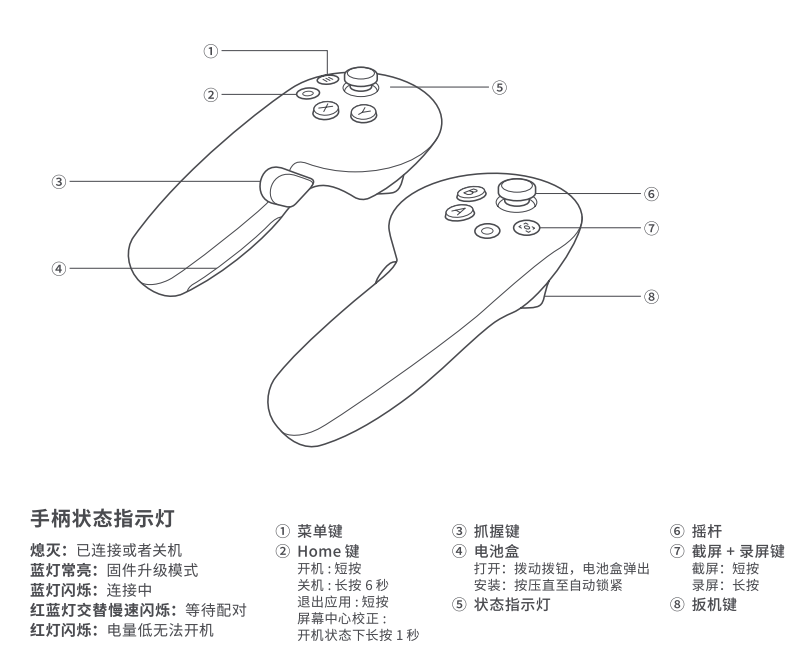

# 数据格式约定文档

## Protobuf 数据结构

本系统采用 Protocol Buffers 作为主要的数据序列化格式，定义在以下 proto 文件中：
- `body_tracking_extended.proto`: 主要的VR数据结构
- `hand_wrench_srv.proto`: 物品质量与力相关服务
- `delayed_diagnosis.proto`: 延迟诊断相关数据

### 主要消息类型

#### VRData
主要的数据容器，包含所有类型的VR和机器人数据：

| 字段 | 类型 | 描述 |
|------|------|------|
| header | Header | 消息头，包含时间戳和ID |
| full_body | FullBodyData | 全身骨骼数据（可选） |
| upper_body | UpperBodyData | 上半身骨骼数据（可选） |
| controller | ControllerData | 手柄数据（可选） |
| robot_data | RobotData | 机器人数据（可选） |
| vr_command | VrCommandData | VR命令数据（可选） |
| delayed_diagnosis_command | DelayDiagnosticCommand | 延迟诊断命令（可选） |

## PICO VR 下发的数据格式

PICO VR 中的应用会下发包含在 VRData 消息中的以下几种数据类型：

### 1. 全身骨骼数据 (FullBodyData)
包含完整的身体骨骼追踪信息，每个关节的位置和旋转数据。

**数据结构变化：**
- **原有版本**：24个关节数据
- **当前版本**：25个数据（24个关节 + 1个脚部状态）

**数据组织：**
- **Index 0-23**：标准身体关节的位置和旋转数据
- **Index 24**：脚部状态编码（特殊用途）

#### 脚部状态编码说明 (Index 24)

Index 24 的 Pose 数据被特殊用作脚部接地状态编码，而非传统的关节位置数据：

| 字段 | 用途 | 值范围 | 描述 |
|------|------|--------|------|
| pos_x | 左脚状态 | 0.0 或 1.0 | 1.0 = 接地，0.0 = 抬起 |
| pos_y | 右脚状态 | 0.0 或 1.0 | 1.0 = 接地，0.0 = 抬起 |
| pos_z | 保留字段 | 0.0 | 未使用，固定为 0.0 |
| rot_qx | 保留字段 | 0.0 | 未使用，固定为 0.0 |
| rot_qy | 保留字段 | 0.0 | 未使用，固定为 0.0 |
| rot_qz | 保留字段 | 0.0 | 未使用，固定为 0.0 |
| rot_qw | 保留字段 | 0.0 | 未使用，固定为 0.0 |

**使用示例：**
- 双脚着地：`pos_x = 1.0, pos_y = 1.0`
- 左脚抬起，右脚着地：`pos_x = 0.0, pos_y = 1.0`
- 右脚抬起，左脚着地：`pos_x = 1.0, pos_y = 0.0`
- 双脚抬起（跳跃）：`pos_x = 0.0, pos_y = 0.0`

### 2. 上半身骨骼数据 (UpperBodyData)  
仅包含上半身骨骼追踪信息，适用于桌面VR应用场景。

### 3. 手柄数据 (ControllerData)
包含左右手柄的按键状态、摇杆位置、扳机值等信息：

| 字段 | 类型 | 描述 |
|------|------|------|
| primary_button | bool | 主按钮状态 |
| secondary_button | bool | 副按钮状态 |
| grip_button | bool | 握把按钮状态 |
| trigger_button | bool | 扳机按钮状态 |
| grip_value | double | 握把值 (0.0 到 1.0) |
| trigger_value | double | 扳机值 (0.0 到 1.0) |
| thumbstick | repeated double | 摇杆位置 [x, y] |

### 4. VR命令数据 (VrCommandData)
包含VR端发出的控制命令：
- 物品质量与力配置请求
- 控制模式切换命令

### 5. 延迟诊断命令 (DelayDiagnosticCommand)
用于启动或停止延迟诊断功能：

| 字段 | 类型 | 描述 |
|------|------|------|
| run | bool | true=启动, false=停止/取消 |

## 机器人端上传数据格式

机器人端通过 RobotData 消息上传以下信息：

### 1. 物品质量与力响应 (ItemMassForceResponse)
响应VR端的物品质量力配置请求：

| 字段 | 类型 | 描述 |
|------|------|------|
| operation | ItemMassForceOperation | 操作类型 (GET/SET) |
| status | OperationStatus | 操作状态 (SUCCESS/ERROR/TIMEOUT/INVALID_REQUEST) |
| description | string | 操作描述 |
| item_mass_forces | repeated ItemMassForce | 物品质量力配置列表 |

### 2. 电机电流数据 (motor_cur)
机器人各关节电机的当前电流值数组。

### 3. 末端执行器电流 (eef_cur)  
末端执行器（如手爪）的电流值数组。

### 4. 控制模式 (ControlMode)
当前机器人的控制模式字符串。

### 5. 延迟诊断结果 (DelayedDiagnosisResult)
延迟诊断功能的执行结果：

| 字段 | 类型 | 描述 |
|------|------|------|
| status | Status | 状态 (NOT_STARTED/IN_PROGRESS/SUCCESS/FAILED/FORCE_KILLED) |
| message | string | 状态描述信息 |
| progress | double | 执行进度 (0.0 到 1.0) |
| result | Result | 诊断结果（可选） |

#### 诊断结果 (Result)
包含系统辨识的最终结果：

| 字段 | 类型 | 描述 |
|------|------|------|
| bias_calib | double | 偏置校准值 |
| time_delay_calib | double | 时间延迟校准值 (秒) |
| bandwidth | double | 带宽 (-3dB) Hz |
| mean_coherence | double | 平均相干性 |

## 详细的 Protobuf 数据结构

### Pose 消息
骨骼关节的位置和旋转数据结构，也用于特殊状态编码：

| 字段 | 类型 | 标准用途 | 特殊用途（Index 24） |
|------|------|----------|---------------------|
| pos_x | double | X轴位置坐标 | 左脚状态 (0.0=抬起, 1.0=接地) |
| pos_y | double | Y轴位置坐标 | 右脚状态 (0.0=抬起, 1.0=接地) |
| pos_z | double | Z轴位置坐标 | 保留字段 (固定为 0.0) |
| rot_qx | double | 四元数旋转X分量 | 保留字段 (固定为 0.0) |
| rot_qy | double | 四元数旋转Y分量 | 保留字段 (固定为 0.0) |
| rot_qz | double | 四元数旋转Z分量 | 保留字段 (固定为 0.0) |
| rot_qw | double | 四元数旋转W分量 | 保留字段 (固定为 0.0) |

**注意：** 
- **Index 0-23**: 使用标准用途，表示关节的3D位置和四元数旋转
- **Index 24**: 使用特殊用途，仅 pos_x 和 pos_y 字段有效，用于脚部接地状态编码

### ItemMassForce 消息
物品质量与力配置数据：

| 字段 | 类型 | 描述 |
|------|------|------|
| case_name | string | 配置名称 |
| description | string | 配置描述 |
| item_mass | double | 物品质量 (kg) |
| lforce_x | double | X轴力 (N) |
| lforce_y | double | Y轴力 (N) |
| lforce_z | double | Z轴力 (N) |

### Header 消息
所有消息的通用头部：

| 字段 | 类型 | 描述 |
|------|------|------|
| timestamp | google.protobuf.Timestamp | 消息时间戳 |
| id | int64 | 消息唯一标识符 |

## 服务接口

### 物品质量与力服务
基于 `hand_wrench_srv.proto` 定义的服务接口：

#### 请求 (ItemMassForceRequest)
| 字段 | 类型 | 描述 |
|------|------|------|
| operation | ItemMassForceOperation | GET=获取配置, SET=设置配置 |
| data | ItemMassForce | 当operation为SET时的配置数据（可选） |

#### 响应 (ItemMassForceResponse)  
| 字段 | 类型 | 描述 |
|------|------|------|
| operation | ItemMassForceOperation | 操作类型回显 |
| status | OperationStatus | 操作状态 |
| description | string | 操作描述信息 |
| item_mass_forces | repeated ItemMassForce | GET操作返回的配置列表 |

### 延迟诊断功能
基于 `delayed_diagnosis.proto` 定义的诊断功能：

#### 诊断状态枚举
- `NOT_STARTED`: 未开始
- `IN_PROGRESS`: 进行中  
- `SUCCESS`: 成功
- `FAILED`: 失败
- `FORCE_KILLED`: 强制停止

## ROS 数据格式

### Topics

#### PICO 手柄数据

话题名称: `/pico/joy`

话题描述: 发布 PICO 左右手柄数据

数据类型: `kuavo_msgs/JoySticks`

| 字段 | 类型 | 描述 |
|------|------|------|
| left_x | float32 | 左手柄摇杆X轴位置 |
| left_y | float32 | 左手柄摇杆Y轴位置 |
| left_trigger | float32 | 左手柄扳机值 (0.0 到 1.0) |
| left_grip | float32 | 左手柄握把值 (0.0 到 1.0) |
| left_first_button_pressed | bool | 左手柄主按钮按下状态 (X按键) |
| left_second_button_pressed | bool | 左手柄副按钮按下状态 (Y按键) |
| left_first_button_touched | bool | pico不支持这个参数 |
| left_second_button_touched | bool | pico不支持这个参数 |
| right_x | float32 | 右手柄摇杆X轴位置 |
| right_y | float32 | 右手柄摇杆Y轴位置 |
| right_trigger | float32 | 右手柄扳机值 (0.0 到 1.0) |
| right_grip | float32 | 右手柄握把值 (0.0 到 1.0) |
| right_first_button_pressed | bool | 右手柄主按钮按下状态 (A按键) |
| right_second_button_pressed | bool | 右手柄副按钮按下状态 (B按键) |
| right_first_button_touched | bool | pico不支持这个参数 |
| right_second_button_touched | bool | pico不支持这个参数 |

#### VR 数据主题

话题名称: `/pico/vr_data`

话题描述: 发布基于 Protobuf 格式的完整 VR 数据

数据类型: 基于 `VRData` Protobuf 消息序列化的二进制数据

#### 机器人状态主题

话题名称: `/robot/status`

话题描述: 发布机器人当前状态和传感器数据

数据类型: 基于 `RobotData` Protobuf 消息序列化的二进制数据

### Services

#### 物品质量与力配置服务

服务名称: `/robot/item_mass_force_config`

服务描述: 获取或设置物品质量与力参数配置

请求类型: `ItemMassForceRequest` (Protobuf)
响应类型: `ItemMassForceResponse` (Protobuf)

#### 延迟诊断服务

服务名称: `/robot/delayed_diagnosis`

服务描述: 启动或停止延迟诊断功能，获取诊断结果

请求类型: `DelayDiagnosticCommand` (Protobuf)
响应类型: `DelayedDiagnosisResult` (Protobuf)

## 使用说明

### 数据流向
1. **VR -> 机器人**: PICO VR 通过 WebSocket 发送 VRData 消息
2. **机器人 -> VR**: 机器人通过 WebSocket 发送 RobotData 响应
3. **内部处理**: ROS节点将 Protobuf 数据转换为 ROS 消息格式

### 集成步骤
1. 使用提供的 `.proto` 文件生成对应语言的代码
2. 建立 WebSocket 连接进行数据传输
3. 根据消息类型解析对应的数据结构
4. 通过 ROS 接口访问转换后的数据

