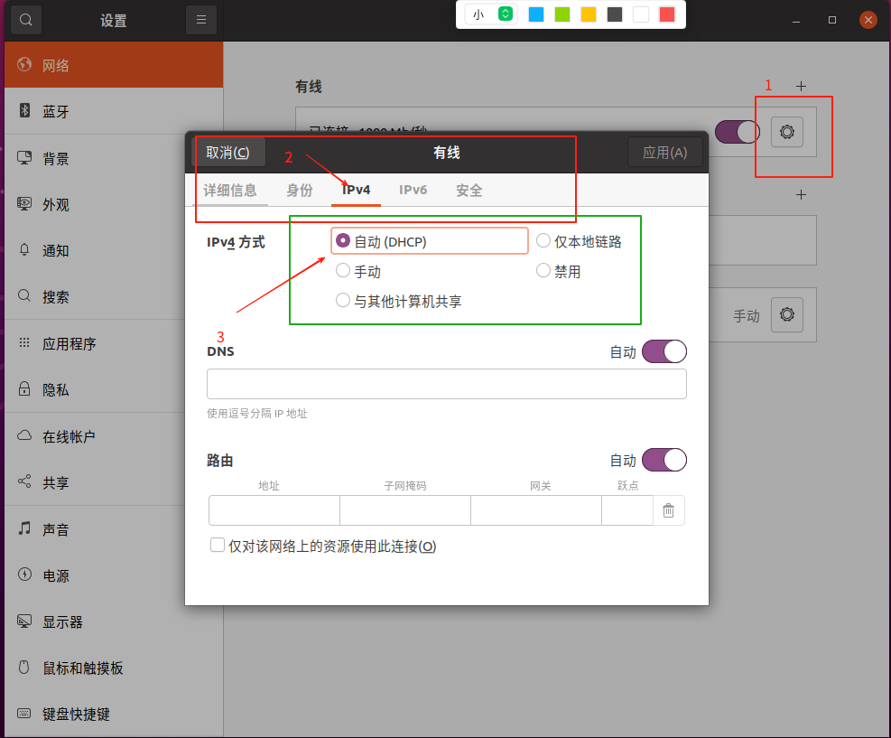

# 取消上位机静态IP设置

## 概述
本文档介绍如何使用`cancle_static_ip.sh`脚本取消上位机(头部NUC)的DHCP服务和静态IP设置，使其能够从下位机获取IP地址。由于上位机固定 IP 的方法多样且不确定，脚本可能无法做到完全修改，修改完成后请确保 IP 静态设置已取消，

## 操作步骤

### 1. 准备工作
确保您已经获取了`cancle_static_ip.sh`脚本，并且具有执行权限。
```bash
    chmod +x cancle_static_ip.sh
```

### 2. 执行脚本
在上位机(头部NUC)终端中执行以下命令：
```bash
    ./cancle_static_ip.sh
```
### 3. 执行完毕后重启上位机：
```bash
    sudo reboot
```
### 4. 如果脚本执行完毕依然被分配了固定的 IP，请联系技术支持操作！
## 特殊情况
### 手动分配固定 IP
- 有些上位机是通过设置固定 IP，这种固定方式无法通过脚本更改，需要连接显示器进行操作
