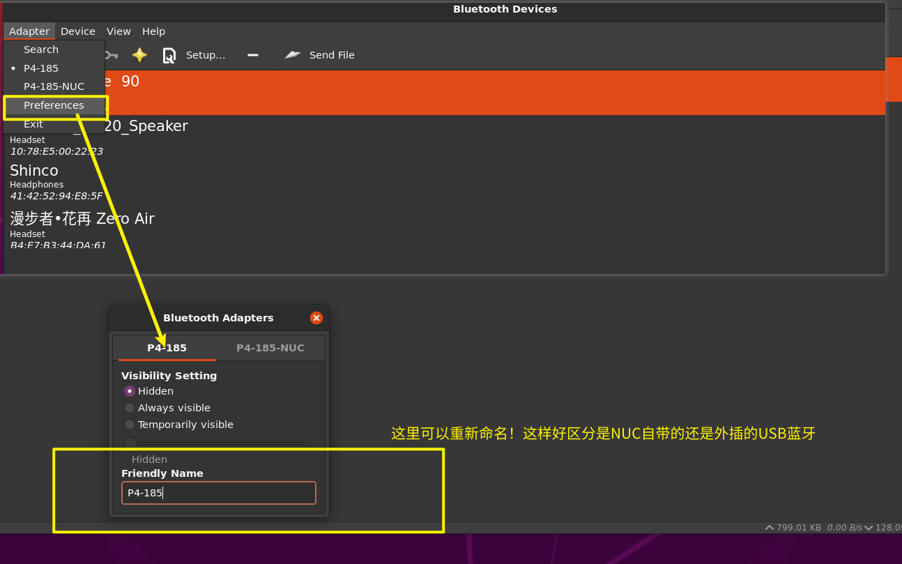
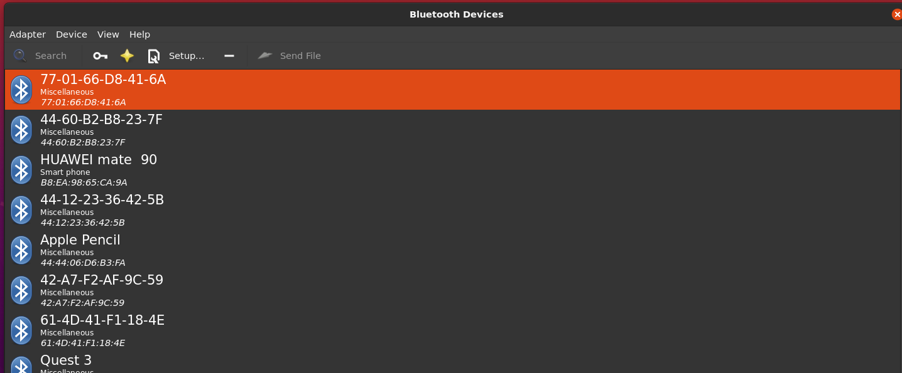

# 蓝牙设备连接使用指南

## 🖥️ 图形界面连接

### 使用 Blueman 蓝牙管理器

#### 1. 启动 Blueman
- 通过VNC或者显示器图形界面启动
- 打开应用程序菜单 → 系统工具 → Blueman Manager

#### 2. 如何重命名适配器



#### 3. 如何扫描设备



#### 4. 如何连接设备
1. 在设备列表中找到目标设备
2. 右键点击设备
3. 选择"连接"
4. 等待连接状态变为"已连接"

#### 5. 如何信任设备
1. 在设备列表中找到已配对的设备
2. 右键点击设备
3. 选择"信任"或"Trust"
4. 设备将自动连接，无需重新配对

### 注意事项
- 测试发现 Blueman 有时点击会崩溃，如果崩溃那么重新启动即可
- 如果连接遇到这样的问题，可以重试，还不行，那就换命令行连接
    
  - 这样问题也有可能需要`pulseaudio -k`，然后再`pulseaudio --start` 
## 💻 命令行连接

⚠️ **重要提醒**：如果使用SSH连接进行蓝牙操作，当SSH断开时蓝牙设备连接也会断开！
⚠️ **重要提醒**：如果使用SSH连接进行蓝牙操作，当SSH断开时蓝牙设备连接也会断开！
⚠️ **重要提醒**：如果使用SSH连接进行蓝牙操作，当SSH断开时蓝牙设备连接也会断开！

**更多的命令行建议直接问AI，以下举例一些命令!**

### 基础命令
```bash
bluetoothctl

# 1. 列出控制器
[bluetooth]# list
Controller 80:C8:AC:00:02:AC P4-185-NUC [default]
Controller 64:79:F0:22:7D:DC P4-185 

# 2. 选择控制器
[bluetooth]# select 64:79:F0:22:7D:DC

# 3. 扫描设备
[bluetooth]# scan on

# 4.查看已发现的设备
[bluetooth]# devices
Device 30:BB:7D:C1:9A:C4 一加 Ace 竞速版
Device 6F:1B:D5:A1:B5:B8 6F-1B-D5-A1-B5-B8
Device 60:FF:9E:4A:CF:01 60-FF-9E-4A-CF-01
Device 5F:31:7E:D0:00:A9 5F-31-7E-D0-00-A9
....

# 5. 配对连接设备
[bluetooth]# connect 41:42:52:94:E8:5F
Attempting to connect to 41:42:52:94:E8:5F
Failed to connect: org.bluez.Error.Failed
[CHG] Device 41:42:52:94:E8:5F Connected: yes
# 连接成功后会变成`Shinco`设备名称
[Shinco]# 

# 6. 信任设备
[Shinco]# trust

# 7. 查看信息
[Shinco]# info
```

## 🔄 SSH断开后保持连接

### nohup 方式
```bash
nohup bash -c "while true; do echo 'connect AA:BB:CC:DD:EE:FF' | bluetoothctl; sleep 10; done" > bt.log 2>&1 &
```

### tmux 方式
```bash
tmux new -s bluetooth
# 在会话中运行连接命令
# Ctrl+B, D 分离会话
```

## 已知问题

蓝牙音响设备和USB外接设备同时存在时，系统会使用USB外接设备，而不是蓝牙音响设备！