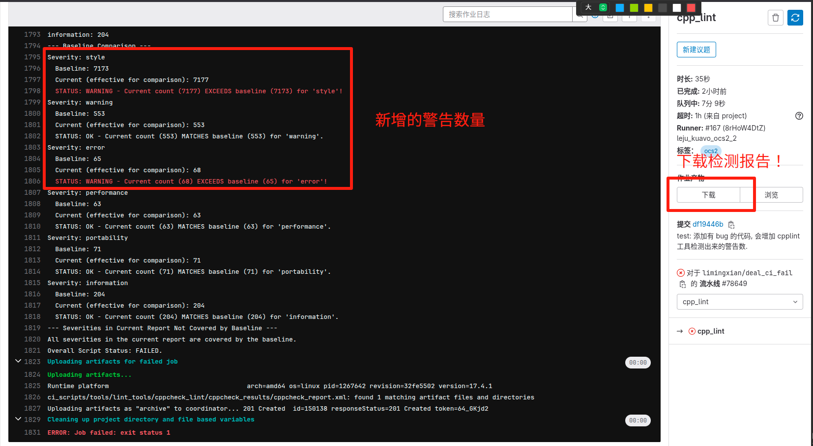
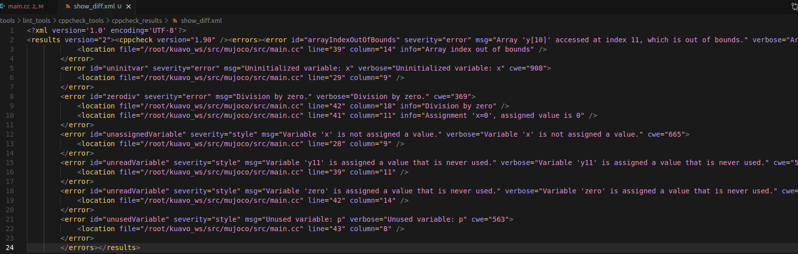
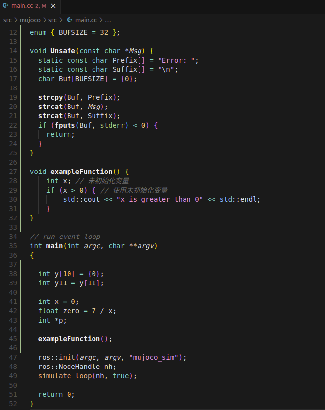

# CppCheck 工具使用

## 工具介绍

静态代码检查工具，集成在 CI 中，使用 `sudo apt install cppcheck` 安装。

## 教程演示

[CI失败自检流程](https://www.lejuhub.com/highlydynamic/kuavodevlab/-/issues/1106#note_1210204)

## CI 失败

将代码 push 到远程仓库时，流水线中会进行 `cpp_lint` 的检查。当检测到当前代码的警告数多于 `ci_scripts/tools/lint_tools/cppcheck_lint/baseline.txt` 中的基准值时，流水线失败。



## 自检

**1. 获取当前仓库的 `CppCheck` 检测报告：**
  
- **检测报告**在流水线中下载。
- 将其放在 `tools/lint_tools/cppcheck_tools` 路径下。
  

**2. 获取本次提交新增的警告：**

- 运行 `report_diff.py` 传入的参数：第一个为 `cppcheck_report.xml` 的路径，第二个为 `cppcheck_report_baseline.xml` 的路径（与 `baseline.txt` 的中基准值对应）。
  
- **新增警告的报告**生成在当前路径 `cppcheck_results` 文件夹下的 `show_diff.xml`.
  

```
cd tools/lint_tools/cppcheck_tools
python3 report_diff.py cppcheck_report.xml cppcheck_report_baseline.xml
```



上图检测到的是在 `src/mujoco/src/main.cc` 中添加不合规范的代码（仅测试）导致的。



## 检测报告字段说明

`error`:

- `id` : 代表了 Cppcheck 检测到的一个独立的错误、警告或风格问题。
  
- `severity` : 指示了此错误的严重性级别。style 意味着这通常是一个代码风格问题，可能不会导致程序崩溃，但可能降低代码质量或可读性。其他常见的严重性包括 error (致命错误), warning (潜在问题), performance (性能建议), portability (可移植性问题), information (一般信息) 等。
  
- `msg` : 错误的描述。
  
- `verbose` : 关于错误的更详细、更具描述性的信息。
  
- `cwe` : 与 `id` 对应。
  

`location` :

- `file` : 错误发生的文件路径。
  
- `line` : 错误发生在指定文件的行号。
  
- `column` : 错误发生在指定文件的列号。


## 本地分支对比与新脚本说明（新增）

### 新增/改进点概览

- 新增脚本：`tools/lint_tools/cppcheck_tools/run_local_cppcheck_diff.sh`
  - 输入两个分支（baseline 与 develop），在干净目录中分别执行 Cppcheck，并生成差异报告。
  - 默认先校验远端分支是否存在并 `fetch` 更新；若本地没有该分支引用，则在 `/tmp` 进行临时浅克隆（不污染当前仓库）。
  - 若目标分支与当前分支相同：从当前分支 HEAD 新建 worktree（只包含已提交内容，不带未跟踪/未提交的改动），保证对比环境干净可复现。

### 运行方式

- 对比两个分支：

```
tools/lint_tools/cppcheck_tools/run_local_cppcheck_diff.sh base_line_branch develop_branch
```

- 产出物（统一在当前仓库）：
  - `tools/lint_tools/cppcheck_tools/cppcheck_results/cppcheck_<branch>.xml`
  - `tools/lint_tools/cppcheck_tools/cppcheck_results/cppcheck_diff_<develop>_vs_<baseline>.txt`

### 常见问题与建议

- 认证失败/需要输入账号密码：
  - 推荐配置 SSH key 并将远端切换为 SSH URL；或使用 HTTPS + PAT，并启用 `credential.helper`（如 `store`）。
  - 非交互模式会禁止弹窗，若无可用凭据将直接失败。

- 