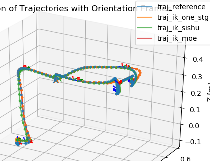

## 注意！！

本库针对ROBOT_VERSION=46 的机器人

且只能算l7_link的ik（不能算l7_end_effector的）

## 文件架构
ik_library.py 里面包含了解析解IK和数值解IK

fk_library.py 里面包含了正运动学计算工具

## 使用方法
在安装了pydrake的环境下，

```commandline
cd ik_library
python3 example/read_datasets_and_save_traj.py
```

即可运行不同ik跟随一段轨迹的比较脚本。
出来图片如下：

